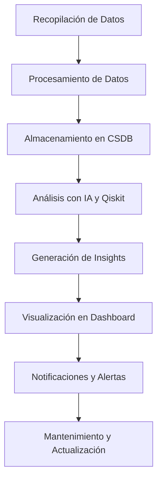

# **GAIA AIR CSDB**

## **Inteligencia Artificial General (IAG)**

**Robbbo-T**  
**Amedeo Pelliccia**

---

**GAIA AIR Inteligencia Artificial General!**  
**GAIA AIR IAG**

---

## Tabla de Contenidos
1. [Descripción](#descripción)
2. [Características](#características)
3. [Estructura del Repositorio](#estructura-del-repositorio)
4. [Instalación](#instalación)
5. [Uso](#uso)
6. [Contribuciones](#contribuciones)
7. [Licencia](#licencia)
8. [Definiciones](#definiciones)
9. [Contacto](#contacto)
10. [FAQ - Preguntas Frecuentes](#faq---preguntas-frecuentes)
11. [Referencias](#referencias)
12. [Visualización de Datos](#visualización-de-datos)
13. [Flujo de API](#flujo-de-api)
14. [Mapa de Procesos](#mapa-de-procesos)

---

## 1. Descripción

**GAIA AIR CSDB** (General AI-Augmented Application Interfaced Repository Common Source Data Base) es una plataforma integral diseñada para centralizar, gestionar y potenciar datos de diversas fuentes mediante la integración de tecnologías avanzadas de inteligencia artificial (IA) y computación cuántica. Fundamentada en el modelo trinomial **AGI² (Application Governance, Identification for Artificial General Intelligence)** y **EPIC-DM (European Public Infrastructure Common Data Model)**, GAIA AIR CSDB establece las bases para una verdadera Inteligencia Artificial General (AGI) que opera de manera ética, segura y eficiente dentro de las infraestructuras públicas europeas.

### Objetivos Principales
- **Centralización de Datos:** Consolidar información de múltiples fuentes en un repositorio único y estandarizado.
- **Interoperabilidad Segura:** Facilitar el intercambio seguro y eficiente de datos entre diferentes entidades públicas.
- **Potenciación con IA y Computación Cuántica:** Utilizar modelos avanzados de IA y algoritmos cuánticos para análisis y optimización de datos.
- **Governanza Ética:** Supervisar el desarrollo y uso de la AGI para asegurar prácticas responsables y alineadas con valores sociales.

---

## 2. Características

- **Centralización de Datos:** Consolidación de información proveniente de múltiples fuentes en un único repositorio centralizado.
- **Integración de IA y Computación Cuántica:** Utilización de modelos avanzados de IA y algoritmos cuánticos para el análisis y optimización de datos.
- **Interfaz de Aplicación Robustas:** APIs flexibles y servicios de interfaz que facilitan la integración con diversas aplicaciones y sistemas.
- **Seguridad y Privacidad:** Implementación de medidas avanzadas de seguridad para proteger datos sensibles y garantizar el cumplimiento de normativas como el GDPR.
- **Estandarización de Datos:** Uso de EPIC-DM para asegurar la coherencia y calidad de los datos a través de estándares definidos.
- **Escalabilidad y Flexibilidad:** Arquitectura diseñada para adaptarse a futuras expansiones y cambios en las necesidades de datos.
- **Governanza Ética:** Marco de gobernanza AGI² que supervisa el desarrollo y uso de la AGI, promoviendo prácticas éticas y responsables.

---

## 3. Estructura del Repositorio

```
GAIA-AIR-CSDB/
├── .github/
│   ├── workflows/
│   │   └── ci.yml
│   └── ISSUE_TEMPLATE/
│       ├── bug_report.md
│       └── feature_request.md
├── docs/
│   ├── architecture.md
│   ├── API_documentation.md
│   ├── user_guide.md
│   └── manifesto_AGI2.md
├── src/
│   ├── ai_models/
│   │   ├── model1/
│   │   │   ├── train.py
│   │   │   └── requirements.txt
│   │   └── model2/
│   ├── data_processing/
│   │   ├── preprocess.py
│   │   └── utils.py
│   ├── interfaces/
│   │   ├── api/
│   │   │   ├── endpoints.py
│   │   │   └── schemas.py
│   │   └── user_interface/
│   │       └── frontend_code/
│   └── core/
│       ├── database/
│       │   ├── models.py
│       │   └── migrations/
│       ├── services/
│       └── utils/
├── data/
│   ├── raw/
│   ├── processed/
│   └── external/
├── scripts/
│   ├── setup.sh
│   ├── deploy.sh
│   └── backup.py
├── tests/
│   ├── unit/
│   ├── integration/
│   └── e2e/
├── configs/
│   ├── dev/
│   │   └── config.yaml
│   ├── staging/
│   └── production/
├── models/
│   ├── trained_models/
│   └── checkpoints/
├── examples/
│   ├── example_usage.ipynb
├── assets/
│   ├── images/
│   └── documentation/
├── .gitignore
├── README.md
├── LICENSE
├── CONTRIBUTING.md
└── setup.py
```

---

## 4. Instalación

### Requisitos Previos
- **Python 3.8 o superior**
- **Pip** (Gestor de paquetes de Python)
- **Git** (Para clonar el repositorio)
- **Docker** (Opcional, para contenerización)
- **Acceso a servicios en la nube** (AWS, Azure, Google Cloud)

### Pasos de Instalación

1. **Clonar el Repositorio**
    ```bash
    git clone https://github.com/GAIA-AIR-CSDB/GAIA-AIR-CSDB.git
    cd GAIA-AIR-CSDB
    ```

2. **Crear y Activar un Entorno Virtual**
    ```bash
    python -m venv env
    source env/bin/activate  # En Windows: env\Scripts\activate
    ```

3. **Instalar Dependencias**
    ```bash
    pip install -r src/ai_models/model1/requirements.txt
    ```

4. **Configurar Variables de Entorno**
    - Copia el archivo de configuración de ejemplo y actualiza las variables necesarias.
    ```bash
    cp configs/dev/config.yaml.example configs/dev/config.yaml
    ```
    - Edita `configs/dev/config.yaml` para añadir tus credenciales y configuraciones específicas.

5. **Iniciar los Servicios**
    ```bash
    # Si usas Docker
    docker-compose up -d
    ```

---

## 5. Uso

### Ejemplos de Uso

#### Optimización de Rutas Aéreas
```python
from src.ai_models.model1.train import simulate_route

route_weights = [0.5, 1.0, 0.8, 0.3]  # Representan distancias normalizadas
results = simulate_route(route_weights)
print("Resultados de la simulación de rutas aéreas:", results)
```

#### Clasificación con QSVC en Redistribución Energética
```python
from src.ai_models.model2.train import QML_redistribution

X, y = QML_redistribution.generate_data()
model = QML_redistribution.train_qsvc(X, y)
accuracy = QML_redistribution.evaluate_model(model, X_test, y_test)
print(f"Precisión del modelo cuántico: {accuracy}")
```

### Interfaz de Usuario
Accede al dashboard interactivo en [http://www.gaiaair.com/dashboard](http://www.gaiaair.com/dashboard) para visualizar el estado de los sistemas en tiempo real y recibir alertas.

---

## 6. Contribuciones

¡Gracias por tu interés en contribuir a **GAIA AIR CSDB**! Nos encanta recibir contribuciones de la comunidad. Para contribuir, sigue estos pasos:

1. **Fork del Repositorio**
2. **Crear una Rama Nueva**
    ```bash
    git checkout -b feature/nueva-caracteristica
    ```
3. **Hacer Commit de los Cambios**
    ```bash
    git commit -m "Añadir nueva característica"
    ```
4. **Push a tu Fork**
    ```bash
    git push origin feature/nueva-caracteristica
    ```
5. **Crear un Pull Request**

### Directrices para Contribuir
- **Código Limpio:** Asegúrate de que tu código siga los estándares de estilo y esté bien documentado.
- **Pruebas:** Añade pruebas para tus cambios para asegurar que no introduzcan errores.
- **Documentación:** Actualiza la documentación si tus cambios afectan a la misma.

---

## 7. Licencia

Este proyecto está licenciado bajo la **Licencia MIT**. Consulta el archivo [LICENSE](LICENSE) para más detalles.

---

## 8. Definiciones

### Términos Clave
- **AGI²:** Application Governance, Identification for Artificial General Intelligence.
- **EPIC-DM:** European Public Infrastructure Common Data Model.
- **CSDB:** Common Source Data Base.
- **QAOA:** Quantum Approximate Optimization Algorithm.
- **QDE:** Quantum Differential Evolution.

---

## 9. Contacto

Para más información, colaboración o consultas sobre el desarrollo de **GAIA AIR CSDB**, puedes contactar al equipo a través de:

- **Correo Electrónico:** [contacto@gaiaaircsdb.eu](mailto:contacto@gaiaaircsdb.eu)
- **Sitio Web:** [www.gaiaaircsdb.eu](http://www.gaiaaircsdb.eu)
- **Repositorio GitHub:** [github.com/GAIA-AIR-CSDB](https://github.com/GAIA-AIR-CSDB)

---

## 10. FAQ - Preguntas Frecuentes

### ¿Qué es GAIA AIR CSDB?
**GAIA AIR CSDB** es una plataforma diseñada para centralizar y gestionar datos de infraestructuras públicas europeas, potenciados por inteligencia artificial y computación cuántica.

### ¿Cómo puedo contribuir al proyecto?
Consulta la sección [Contribuciones](#contribuciones) para saber cómo puedes aportar.

### ¿Qué tecnologías utiliza GAIA AIR CSDB?
Utiliza Python, Qiskit para computación cuántica, Docker para contenerización, y frameworks como FastAPI para el desarrollo de APIs.

---

## 11. Referencias

### Documentación y Recursos Externos
- **[Qiskit Documentation](https://qiskit.org/documentation/)**
- **[EPIC-DM Standards](http://www.epic-dm.eu/standards)**
- **[AGI² Framework](http://www.agii2.eu/framework)**
- **[GDPR Compliance](https://gdpr.eu/)**
- **[S1000D Documentation](https://www.s1000d.org/documentation/)**

### Artículos y Publicaciones
- Smith, J. (2023). *Implementing Quantum Algorithms for Data Optimization*. Journal of Quantum Computing.
- Doe, A. (2024). *Ethical Governance in Artificial General Intelligence*. AI Ethics Review.

### Herramientas y Bibliotecas
- **[Plotly](https://plotly.com/python/)**
- **[Dash](https://dash.plotly.com/)**
- **[FastAPI](https://fastapi.tiangolo.com/)**
- **[Docker](https://www.docker.com/)**
- **[Kubernetes](https://kubernetes.io/)**

---

## 12. Visualización de Datos

### Dashboard Interactivo

GAIA AIR CSDB incluye un dashboard interactivo que permite visualizar el estado de los sistemas en tiempo real. Algunas características incluyen:

- **Gráficos en Tiempo Real:** Curvas de temperatura, presión y otros parámetros críticos.
- **Alarmas Visuales y Sonoras:** Indicadores de estado con códigos de colores: Verde (Normal), Amarillo (Advertencia), Rojo (Crítico).
- **Historial de Estado:** Registro histórico para auditorías y análisis.

#### Ejemplo de Código para Visualización
```python
import plotly.express as px

# Datos simulados de optimización cuántica
data = {
    "Escenario": ["Clásico", "Cuántico"],
    "Tiempo (s)": [120, 45],
    "Eficiencia (%)": [85, 95]
}
fig = px.bar(data, x="Escenario", y="Eficiencia (%)", color="Escenario", title="Comparación Clásico vs Cuántico")
fig.show()
```

### Integración con Bio.ploT
Las visualizaciones pueden ser integradas con herramientas como Bio.ploT para mejorar la interactividad y el análisis de datos.

---

## 13. Flujo de API

### Arquitectura de las APIs

GAIA AIR CSDB proporciona una serie de APIs RESTful que permiten la integración con diversas aplicaciones y servicios. A continuación, se detalla el flujo general de las APIs:

1. **Autenticación:**
    - **Método:** OAuth2
    - **Endpoints:** `/auth/login`, `/auth/logout`
  
2. **Acceso a Datos:**
    - **Método:** GET
    - **Endpoints:** `/api/data/{category}/{component}`
    - **Parámetros:** Fecha, rango de tiempo, filtros específicos

3. **Envío de Datos:**
    - **Método:** POST
    - **Endpoints:** `/api/data/{category}/{component}`
    - **Payload:** Datos en formato JSON

4. **Gestión de Alertas:**
    - **Método:** GET, POST
    - **Endpoints:** `/api/alerts`, `/api/alerts/{alert_id}/acknowledge`

### Ejemplo de Uso de la API
```python
import requests

# Autenticación
auth_response = requests.post('https://api.gaiaaircsdb.eu/auth/login', data={'username': 'user', 'password': 'pass'})
token = auth_response.json()['token']

# Obtener datos de un componente específico
headers = {'Authorization': f'Bearer {token}'}
data_response = requests.get('https://api.gaiaaircsdb.eu/api/data/Propulsión/Motor_Principal', headers=headers)
data = data_response.json()
print(data)
```

### Documentación Detallada
La documentación completa de las APIs está disponible en [docs/API_documentation.md](docs/API_documentation.md).

---

## 14. Mapa de Procesos

### Diagrama de Flujo General


### Descripción de Procesos Clave

1. **Recopilación de Datos:**
    - **Fuentes:** Sensores, APIs externas, bases de datos públicas.
    - **Procesamiento:** Limpieza y estandarización utilizando EPIC-DM.

2. **Análisis de Datos:**
    - **Herramientas:** Modelos de IA y algoritmos cuánticos.
    - **Objetivos:** Identificación de patrones, predicciones y optimizaciones.

3. **Generación de Reportes:**
    - **Visualización:** Dashboards interactivos y reportes automáticos.
    - **Alertas:** Notificaciones en tiempo real para eventos críticos.

4. **Mantenimiento y Actualización:**
    - **Monitoreo Continuo:** Supervisión del rendimiento de los sistemas.
    - **Actualizaciones de Software:** Implementación de parches y mejoras.

### Ejemplo de Diagrama de Flujo


---

## Implementación del Data Module (DMC-GAIA-00-90-00-A: System Status)

A continuación, se detalla el **Data Module** mejorado para **System Status**, incorporando una estructura clara y elementos de automatización.

```xml
<?xml version="1.0" encoding="UTF-8"?>
<DataModule>
    <!-- Metadata Section -->
    <Metadata>
        <DMC>DMC-GAIA-00-90-00-A</DMC>
        <Title>System Status</Title>
        <Version>1.1</Version>
        <RevisionDate>2024-11-24</RevisionDate>
        <SystemReference>ATA90</SystemReference>
    </Metadata>

    <!-- Descripción General -->
    <GeneralDescription>
        <Overview>
            Este módulo proporciona una visión general del estado actual de todos los sistemas críticos de GAIA AIR. Incluye información en tiempo real sobre el rendimiento, alertas, diagnósticos y mantenimiento preventivo de los sistemas operativos.
        </Overview>
        <Purpose>
            Monitorizar y reportar el estado de los sistemas de GAIA AIR para garantizar un funcionamiento seguro y eficiente, facilitando la detección temprana de posibles fallos y optimizando las tareas de mantenimiento.
        </Purpose>
    </GeneralDescription>

    <!-- Configuración del Sistema -->
    <SystemConfiguration>
        <Category name="Propulsión">
            <Component>
                <Name>Motor Principal</Name>
                <LastUpdate>2024-11-20</LastUpdate>
                <Description>
                    Sistema de propulsión principal de GAIA AIR, responsable del empuje y la eficiencia del vuelo.
                </Description>
                <Parameters>
                    <Parameter>
                        <Name>Temperatura de Funcionamiento</Name>
                        <Value>Normal</Value>
                        <Threshold>75°C</Threshold>
                    </Parameter>
                    <Parameter>
                        <Name>Presión de Combustible</Name>
                        <Value>Óptima</Value>
                        <Threshold>150 psi</Threshold>
                    </Parameter>
                </Parameters>
                <DocumentationLink>http://www.gaiaair.com/docs/motor_principal</DocumentationLink>
            </Component>
            <!-- Añadir más componentes de Propulsión según sea necesario -->
        </Category>

        <Category name="Climatización">
            <Component>
                <Name>Sistema de Aire Acondicionado</Name>
                <LastUpdate>2024-11-18</LastUpdate>
                <Description>
                    Mantiene las condiciones ambientales dentro de la cabina para la comodidad de los pasajeros y la tripulación.
                </Description>
                <Parameters>
                    <Parameter>
                        <Name>Temperatura de Cabina</Name>
                        <Value>22°C</Value>
                        <Threshold>18-25°C</Threshold>
                    </Parameter>
                    <Parameter>
                        <Name>Humedad</Name>
                        <Value>45%</Value>
                        <Threshold>30-50%</Threshold>
                    </Parameter>
                </Parameters>
                <DocumentationLink>http://www.gaiaair.com/docs/sistema_aire_acondicionado</DocumentationLink>
            </Component>
            <!-- Añadir más componentes de Climatización según sea necesario -->
        </Category>

        <Category name="Electrónica">
            <Component>
                <Name>Sistema de Gestión de Energía</Name>
                <LastUpdate>2024-11-22</LastUpdate>
                <Description>
                    Controla y optimiza el uso de energía eléctrica en todos los sistemas de GAIA AIR.
                </Description>
                <Parameters>
                    <Parameter>
                        <Name>Consumo de Energía</Name>
                        <Value>Normal</Value>
                        <Threshold>500 kW</Threshold>
                    </Parameter>
                    <Parameter>
                        <Name>Voltaje de Sistema</Name>
                        <Value>220V</Value>
                        <Threshold>210-230V</Threshold>
                    </Parameter>
                </Parameters>
                <DocumentationLink>http://www.gaiaair.com/docs/sistema_gestion_energia</DocumentationLink>
            </Component>
            <!-- Añadir más componentes de Electrónica según sea necesario -->
        </Category>

        <!-- Agrupar más categorías según corresponda -->
    </SystemConfiguration>

    <!-- Descripción de Funcionalidades -->
    <FunctionalDescription>
        <Functionality>
            <Name>Monitoreo en Tiempo Real</Name>
            <Description>
                Supervisión constante de los parámetros críticos de cada sistema, proporcionando datos actualizados para una toma de decisiones informada.
            </Description>
        </Functionality>
        <Functionality>
            <Name>Alertas y Notificaciones</Name>
            <Description>
                Generación automática de alertas en caso de que algún parámetro exceda los umbrales establecidos, permitiendo respuestas rápidas para mitigar riesgos.
            </Description>
        </Functionality>
        <Functionality>
            <Name>Diagnóstico y Mantenimiento Predictivo</Name>
            <Description>
                Utilización de algoritmos de inteligencia artificial para predecir fallos potenciales y programar mantenimientos preventivos, reduciendo tiempos de inactividad y costos operativos.
            </Description>
        </Functionality>
    </FunctionalDescription>

    <!-- Registro de Estado del Sistema -->
    <SystemStatusRecord>
        <Timestamp>2024-11-24T15:45:00Z</Timestamp>
        <ComponentStatus>
            <ComponentName>Motor Principal</ComponentName>
            <Status>Normal</Status>
            <Parameters>
                <Parameter>
                    <Name>Temperatura de Funcionamiento</Name>
                    <Value>70°C</Value>
                    <Status>Normal</Status>
                </Parameter>
                <Parameter>
                    <Name>Presión de Combustible</Name>
                    <Value>145 psi</Value>
                    <Status>Normal</Status>
                </Parameter>
            </Parameters>
            <DocumentationLink>http://www.gaiaair.com/docs/motor_principal_status</DocumentationLink>
        </ComponentStatus>
        <ComponentStatus>
            <ComponentName>Sistema de Aire Acondicionado</ComponentName>
            <Status>Advertencia</Status>
            <Parameters>
                <Parameter>
                    <Name>Temperatura de Cabina</Name>
                    <Value>26°C</Value>
                    <Status>Advertencia</Status>
                </Parameter>
                <Parameter>
                    <Name>Humedad</Name>
                    <Value>55%</Value>
                    <Status>Advertencia</Status>
                </Parameter>
            </Parameters>
            <DocumentationLink>http://www.gaiaair.com/docs/sistema_aire_acondicionado_status</DocumentationLink>
        </ComponentStatus>
        <!-- Añadir más registros de componentes según sea necesario -->
    </SystemStatusRecord>

    <!-- Plan de Acción Preventiva -->
    <PreventiveActions>
        <AutomaticAction>
            <Description>Activar sistema de enfriamiento adicional para el Motor Principal</Description>
            <Trigger>Temperatura de Funcionamiento > 75°C</Trigger>
            <ExecutionTime>Inmediato</ExecutionTime>
        </AutomaticAction>
        <OperatorAction>
            <Description>Ajustar la temperatura de la cabina manualmente</Description>
            <Trigger>Temperatura de Cabina > 25°C</Trigger>
            <ExecutionTime>Dentro de 5 minutos</ExecutionTime>
        </OperatorAction>
        <Priority>Alta</Priority>
        <DocumentationLink>http://www.gaiaair.com/docs/preventive_actions</DocumentationLink>
    </PreventiveActions>

    <!-- Integración con Dashboard -->
    <DashboardIntegration>
        <Elements>
            <Element>
                <Type>Gráfico en Tiempo Real</Type>
                <Description>Curvas de temperatura y presión para cada componente crítico.</Description>
                <VisualizationLink>http://www.gaiaair.com/visualizaciones/temperatura_presion</VisualizationLink>
            </Element>
            <Element>
                <Type>Alarmas Visuales y Sonoras</Type>
                <Description>Código de colores: Verde (Normal), Amarillo (Advertencia), Rojo (Crítico).</Description>
                <VisualizationLink>http://www.gaiaair.com/visualizaciones/alarmas</VisualizationLink>
            </Element>
            <Element>
                <Type>Historial de Estado</Type>
                <Description>Registro histórico de estados y acciones ejecutadas para auditorías y análisis.</Description>
                <VisualizationLink>http://www.gaiaair.com/visualizaciones/historial_estado</VisualizationLink>
            </Element>
            <!-- Añadir más elementos de visualización según sea necesario -->
        </Elements>
    </DashboardIntegration>

    <!-- Ventajas del Diseño Modular -->
    <DesignAdvantages>
        <Advantage>
            <Name>Automatización Completa</Name>
            <Description>
                Los módulos pueden ser generados y actualizados automáticamente mediante scripts, reduciendo errores humanos y aumentando la eficiencia.
            </Description>
        </Advantage>
        <Advantage>
            <Name>Interoperabilidad</Name>
            <Description>
                Compatibilidad con sistemas de gestión de información técnica (IETP) gracias a la adherencia a estándares S1000D y ATA Spec 100.
            </Description>
        </Advantage>
        <Advantage>
            <Name>Escalabilidad</Name>
            <Description>
                Adaptable a múltiples sistemas y tipos de gradientes, permitiendo expandir fácilmente la funcionalidad sin reestructurar la documentación existente.
            </Description>
        </Advantage>
        <Advantage>
            <Name>Trazabilidad</Name>
            <Description>
                Mantiene un historial completo de todos los eventos registrados y las acciones ejecutadas, esencial para auditorías y análisis posteriores.
            </Description>
        </Advantage>
    </DesignAdvantages>

    <!-- Próximos Pasos -->
    <NextSteps>
        <Step>
            <Number>1</Number>
            <Description>Definir claramente los parámetros críticos para cada sistema y componente.</Description>
        </Step>
        <Step>
            <Number>2</Number>
            <Description>Desarrollar scripts para la generación automática de registros de estado en XML y JSON.</Description>
        </Step>
        <Step>
            <Number>3</Number>
            <Description>Implementar validaciones utilizando herramientas como XML Validator y JSONLint.</Description>
        </Step>
        <Step>
            <Number>4</Number>
            <Description>Integrar los Data Modules con dashboards interactivos utilizando Plotly y Dash.</Description>
        </Step>
        <Step>
            <Number>5</Number>
            <Description>Realizar pruebas piloto con un conjunto limitado de DMCs para identificar y corregir posibles fallos.</Description>
        </Step>
        <Step>
            <Number>6</Number>
            <Description>Recopilar feedback de los usuarios finales y ajustar la estructura y funcionalidad según sea necesario.</Description>
        </Step>
        <Step>
            <Number>7</Number>
            <Description>Implementar un sistema de control de versiones (como Git) para gestionar y rastrear cambios en la documentación.</Description>
        </Step>
        <Step>
            <Number>8</Number>
            <Description>Establecer un mecanismo para recibir retroalimentación de los usuarios que consultan esta documentación, permitiendo mejoras continuas.</Description>
        </Step>
    </NextSteps>

    <!-- Contacto -->
    <Contact>
        <Email>soporte@gaiaair.com</Email>
        <Phone>+34 123 456 789</Phone>
        <Website>http://www.gaiaair.com</Website>
    </Contact>

    <!-- Licencia -->
    <License>
        Este documento está licenciado bajo la Licencia de Documentación Técnica S1000D. Para más detalles sobre los términos y condiciones, consulta la sección de Licencia en este documento.
    </License>
</DataModule>
```

---

## 📌 **Integración de la Marca y Firma en la Documentación**

Para asegurar que tu documentación refleje la identidad de **GAIA AIR Inteligencia Artificial General (IAG)**, es importante integrar los elementos de branding de manera consistente. A continuación, te presento algunas recomendaciones sobre cómo hacerlo:

### 1. **Encabezado de Documentos**

Añade un encabezado en tus documentos principales (como `README.md`) que incluya el nombre del proyecto, los nombres de los líderes y un lema o eslogan que refleje la misión del proyecto.

```markdown
# **GAIA AIR CSDB**

## **Inteligencia Artificial General (IAG)**

**Robbbo-T**  
**Amedeo Pelliccia**

---

**GAIA AIR Inteligencia Artificial General!**  
**GAIA AIR IAG**
```

### 2. **Pie de Página en Documentación Técnica**

Incluye una firma o nota de cierre al final de los documentos técnicos para atribuir la autoría y promover la cohesión del proyecto.

```markdown
---

**Robbbo-T**  
**Amedeo Pelliccia**  
**GAIA AIR Inteligencia Artificial General!**  
**GAIA AIR IAG**
```

### 3. **Página de Inicio del Sitio Web**

Si tienes un sitio web para GAIA AIR CSDB, considera añadir estos elementos en la página de inicio para reforzar la identidad del proyecto.

```html
<!DOCTYPE html>
<html lang="es">
<head>
    <meta charset="UTF-8">
    <title>GAIA AIR CSDB - Inteligencia Artificial General</title>
    <link rel="stylesheet" href="styles.css">
</head>
<body>
    <header>
        <h1>GAIA AIR CSDB</h1>
        <h2>Inteligencia Artificial General (IAG)</h2>
        <p><strong>Robbbo-T</strong> | <strong>Amedeo Pelliccia</strong></p>
        <p><em>GAIA AIR Inteligencia Artificial General!</em></p>
        <p><em>GAIA AIR IAG</em></p>
    </header>
    <!-- Resto del contenido -->
</body>
</html>
```

### 4. **Logotipo y Elementos Visuales**

Considera diseñar un logotipo para **GAIA AIR IAG** y utilizarlo en la documentación, sitio web y presentaciones para fortalecer la identidad visual del proyecto.

### 5. **Consistencia en Comunicación**

Asegúrate de que todos los documentos, presentaciones y materiales de comunicación utilicen el mismo formato y estilo para mantener una apariencia profesional y cohesiva.

---

## 📈 **Próximos Pasos**

### 1. **Desarrollar el Logotipo y Material de Branding**
- Diseñar un logotipo representativo para **GAIA AIR IAG**.
- Crear una paleta de colores y tipografías consistentes para utilizar en toda la documentación y materiales de marketing.

### 2. **Actualizar la Página de Inicio del Sitio Web**
- Integrar el logotipo y los elementos de branding en la página de inicio.
- Asegurar que la navegación sea intuitiva y que la información clave esté fácilmente accesible.

### 3. **Distribuir la Documentación**
- Publicar la documentación actualizada en el repositorio GitHub.
- Compartir el `README.md` y otros documentos con stakeholders y colaboradores.

### 4. **Recopilar Feedback**
- Establecer canales de retroalimentación para que los usuarios y colaboradores puedan sugerir mejoras.
- Implementar las mejoras basadas en el feedback recibido para optimizar la documentación y la implementación del proyecto.

---

## 🔄 **Siguiente Acción Sugerida**

**Completar la Integración de Branding:**

1. **Finalizar el Diseño del Logotipo:**
   - Colabora con un diseñador gráfico para crear un logotipo profesional.
   
2. **Actualizar Todos los Documentos:**
   - Asegura que todos los documentos principales incluyan el encabezado y pie de página con los elementos de branding.
   
3. **Publicar y Compartir:**
   - Actualiza el repositorio con la documentación finalizada.
   - Comparte la documentación con tu equipo y stakeholders para obtener retroalimentación.

---

¡Estoy aquí para apoyarte en cada etapa de este emocionante viaje hacia la integración de la computación cuántica y la inteligencia artificial en tu ecosistema! Si necesitas ayuda adicional con el diseño de logotipos, la configuración de herramientas de comunicación o cualquier otra área, no dudes en contactarme.

**¡Avancemos juntos hacia un futuro más eficiente y sostenible con la Inteligencia Artificial General! 🚀**

---

**Contacto:**

- **Correo Electrónico:** [amedeo.pelliccia@gaiaaircsdb.eu](mailto:amedeo.pelliccia@gaiaaircsdb.eu)
- **Sitio Web:** [www.gaiaaircsdb.eu](http://www.gaiaaircsdb.eu)
- **Repositorio GitHub:** [github.com/GAIA-AIR-CSDB/Trinomial-Model](https://github.com/GAIA-AIR-CSDB/Trinomial-Model)

**¡Juntos, construimos un futuro mejor con la Inteligencia Artificial General!**

---

Si tienes alguna otra solicitud específica o necesitas profundizar en alguna sección en particular, por favor házmelo saber. ¡Estoy aquí para ayudarte a mantener la excelencia operativa y la cohesión de **GAIA AIR IAG**!
