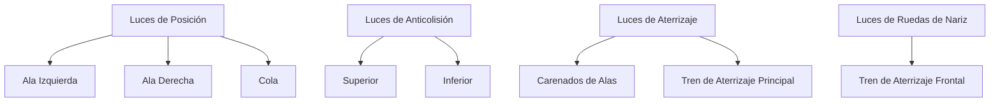
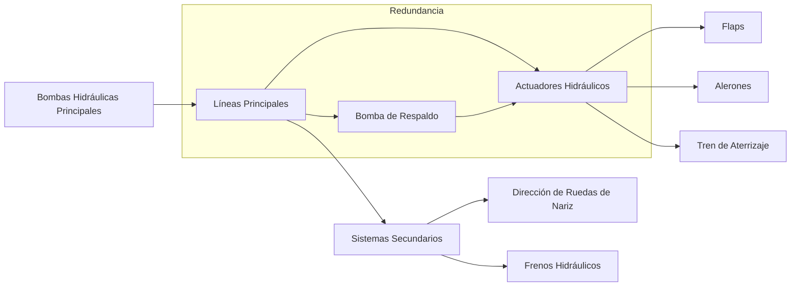

# DMRL 

### **1. Módulos Descriptivos**

Estos módulos proporcionan una descripción detallada de los sistemas de propulsión, enfocándose en la tecnología de celdas de combustible de hidrógeno, la integración aerodinámica y la eficiencia operativa.

#### **Módulo 1: General System Overview**

- **DMC**: GAIA-00-70-00-00-00-00-100-A-00
- **Título**: Hydrogen Propulsion System Overview
- **Propósito**: Descripción general del sistema de propulsión con enfoque en los principios de sostenibilidad basados en hidrógeno.
- **Ilustraciones**: Diagrama del sistema de celdas de combustible de hidrógeno.

#### **Módulo 2: Functional Description**

- **DMC**: GAIA-00-70-00-00-00-00-110-A-00
- **Título**: Functional Details of Hydrogen Propulsion
- **Propósito**: Describir las interacciones entre subsistemas como conversión de energía y gestión térmica.
- **Ilustraciones**: Diagrama de flujo de subsistemas.

#### **Módulo 3: Integration with Aerodynamic Systems**

- **DMC**: GAIA-00-70-00-00-00-00-120-A-00
- **Título**: Aerodynamic Integration of Hydrogen Propulsion
- **Propósito**: Detallar cómo la propulsión se integra en los sistemas aerodinámicos de la aeronave.
- **Ilustraciones**: Esquema CAD de la integración.

### **2. Módulos Procedimentales**

Estos módulos proporcionan instrucciones detalladas paso a paso para la operación, mantenimiento y protocolos de seguridad.

#### **Módulo 4: Operational Procedures**

- **DMC**: GAIA-00-70-00-00-00-00-200-A-00
- **Título**: Startup, Shutdown, and Normal Operations
- **Propósito**: Proporcionar fases operativas y protocolos detallados.
- **Ilustraciones**: Diagrama de flujo de operaciones secuenciales.

#### **Módulo 5: Maintenance Procedures**

- **DMC**: GAIA-00-70-00-00-00-00-300-A-00
- **Título**: Routine and Preventive Maintenance for Hydrogen Systems
- **Propósito**: Pasos de mantenimiento para asegurar la integridad y el rendimiento del sistema.
- **Ilustraciones**: Lista de verificación de mantenimiento.

#### **Módulo 6: Safety Protocols**

- **DMC**: GAIA-00-80-00-00-00-00-200-A-00
- **Título**: Hydrogen Safety Procedures
- **Propósito**: Pasos para el manejo seguro del combustible de hidrógeno y respuesta a emergencias.
- **Ilustraciones**: Diagrama de flujo de respuesta a emergencias.

### **3. Módulos de Entrenamiento/Simulación**

Estos módulos permiten a los operadores y al personal de mantenimiento comprender y simular eficazmente el sistema de propulsión.

#### **Módulo 7: Simulation Training Manual**

- **DMC**: GAIA-00-97-00-00-00-00-100-A-00
- **Título**: Hydrogen Propulsion Training Guide
- **Propósito**: Desarrollar la competencia del operador a través de simulaciones de realidad virtual y aumentada.
- **Ilustraciones**: Capturas de pantalla de simulaciones interactivas.

---

## **Estructuración del Contenido en Formato S1000D**

Para alinear los módulos con las convenciones S1000D, estructuramos el contenido en las siguientes categorías:

1. **General Description**
   - **DMC**: GAIA-00-70-00-00-00-00-100-A-00
   - Descripción general del sistema de propulsión, destacando la sostenibilidad, beneficios operativos y componentes clave.

2. **Functional Description**
   - **DMC**: GAIA-00-70-00-00-00-00-110-A-00
   - Desglose detallado de subsistemas como gestión de energía, almacenamiento de hidrógeno e integración aerodinámica.

3. **Operation**
   - **DMC**: GAIA-00-70-00-00-00-00-200-A-00
   - Procedimientos para la inicialización del sistema, operación normal y apagado, incluyendo modos automatizados.

4. **Maintenance**
   - **DMC**: GAIA-00-70-00-00-00-00-300-A-00
   - Pasos para inspecciones rutinarias, diagnóstico de fallos y reemplazo de componentes.

5. **Safety Protocols**
   - **DMC**: GAIA-00-80-00-00-00-00-200-A-00
   - Protocolos de seguridad para el manejo del hidrógeno y respuesta a emergencias.

6. **Training/Simulation**
   - **DMC**: GAIA-00-97-00-00-00-00-100-A-00
   - Materiales de entrenamiento basados en realidad aumentada para operadores y equipos de mantenimiento.

---

## **Validación Técnica y de Esquema**

### **Validación Técnica**

1. **Referencias a Estándares de Aviación Sostenible**:
   - Alinear las descripciones y procedimientos con estándares de organizaciones como la **ICAO** y la **FAA**.

2. **Verificación de Descripciones Funcionales**:
   - Comparar las descripciones con las especificaciones de ingeniería para asegurar precisión.

3. **Adherencia a Estándares de Seguridad y Operativos**:
   - Asegurar que las descripciones de la propulsión de hidrógeno cumplen con estándares emergentes de seguridad y operación.

### **Validación de Esquema**

1. **Validación de Archivos XML/SGML**:
   - Utilizar herramientas como **Oxygen XML Editor** para validar los archivos contra los esquemas S1000D.

2. **Cumplimiento con Estándares y Esquemas S1000D (DTD/XSD)**:
   - Verificar que todos los elementos y atributos estén correctamente implementados según el estándar.

3. **Pruebas de Salidas**:
   - Asegurar que las salidas (PDF, HTML, IETP) se formatean y navegan correctamente.

---

## **Plantillas y Salidas**

### **Plantilla XML para Módulos Descriptivos**

```xml
<?xml version="1.0" encoding="UTF-8"?>
<dmodule xmlns="http://www.s1000d.org/S1000D_4_1/xml_schema/issue_4_1/techpub" xmlns:xsi="http://www.w3.org/2001/XMLSchema-instance" xsi:schemaLocation="http://www.s1000d.org/S1000D_4_1/xml_schema/issue_4_1/techpub dmodule.xsd">
  <identAndStatusSection>
    <dmAddress>
      <dmIdent>
        <dmCode modelIdentCode="GAIA" systemDiffCode="00" systemCode="70" subSystemCode="00" assyCode="00" disassyCode="00" subSubassyCode="00" infoCode="100" infoCodeVariant="A" itemLocationCode="00" />
        <dmIssue issueNumber="001" inWork="00" language="en-US" />
      </dmIdent>
    </dmAddress>
    <infoName>
      <techName>HYDROGEN PROPULSION SYSTEM OVERVIEW</techName>
    </infoName>
    <issueInfo>
      <responsiblePartnerCompany enterpriseCode="GAIA" />
      <originator enterpriseCode="GAIA" />
      <issueDate>2024-11-23</issueDate>
    </issueInfo>
  </identAndStatusSection>
  <content>
    <descriptive>
      <para>
        The propulsion system utilizes hydrogen fuel cells for sustainable and efficient power generation.
      </para>
      <section>
        <title>1. General Description</title>
        <para>The hydrogen propulsion system integrates with the aircraft’s aerodynamic framework...</para>
      </section>
      <section>
        <title>2. Key Features</title>
        <para>Advanced cooling systems and high-pressure containment mechanisms...</para>
      </section>
    </descriptive>
  </content>
</dmodule>
```

### **Características de la Plantilla**

- **Estructura Modular**: Facilita la reutilización y mantenimiento de la documentación.
- **Secciones Claras**: Mejora la navegación y comprensión por parte del usuario.
- **Integración de Ilustraciones**: Aumenta la eficacia de la comunicación técnica.

---

## **Refinamientos y Módulos Adicionales Sugeridos**

### **1. Módulos Adicionales de Descripción**

#### **Módulo: Thermal Management System Description**

- **DMC**: GAIA-00-21-00-00-00-00-100-A-00
- **Título**: Thermal Management System Description
- **Propósito**: Detallar el sistema de gestión térmica y su integración con el sistema de propulsión.
- **Ilustraciones**: Diagramas del sistema de refrigeración.

### **2. Módulos Adicionales Procedimentales**

#### **Módulo: Fault Diagnosis and Troubleshooting**

- **DMC**: GAIA-00-70-00-00-00-00-400-A-00
- **Título**: Fault Diagnosis and Troubleshooting
- **Propósito**: Proporcionar procedimientos para la identificación y resolución de fallos en el sistema de propulsión.
- **Ilustraciones**: Tablas de diagnóstico y diagramas de flujo.

#### **Módulo: Component Replacement Procedures**

- **DMC**: GAIA-00-70-00-00-00-00-500-A-00
- **Título**: Component Replacement Procedures
- **Propósito**: Instrucciones paso a paso para el reemplazo de componentes críticos.
- **Ilustraciones**: Secuencias visuales de los procedimientos.

### **3. Módulos de Seguridad Adicionales**

#### **Módulo: Emergency Response Procedures**

- **DMC**: GAIA-00-80-00-00-00-00-210-A-00
- **Título**: Emergency Response Procedures
- **Propósito**: Detallar acciones a seguir en situaciones de emergencia relacionadas con el sistema de hidrógeno.
- **Ilustraciones**: Mapas de rutas de evacuación y puntos de seguridad.

---

## **Próximos Pasos**

1. **Incorporar los Módulos Adicionales**: Agregar los módulos sugeridos al DMRL para cubrir todas las áreas críticas del sistema.

2. **Asignar Responsables**: Designar autores y revisores para cada módulo, estableciendo plazos y entregables.

3. **Validación Continua**: Asegurar que cada módulo desarrollado pase por los procesos de validación técnica y de esquema.

4. **Integración en el Sistema de Gestión de Documentos**: Utilizar un sistema que permita el control de versiones y la colaboración eficiente entre equipos.

---

## **Conclusión**

La actualización del **DMRL** con los módulos proporcionados y las sugerencias adicionales asegura una cobertura completa de los sistemas y procedimientos esenciales de **GAIA AIR**. Al alinear los códigos DMC con el estándar **S1000D** y estructurar el contenido de manera coherente, facilitamos la creación, mantenimiento y uso de la documentación técnica.

	1.	General Description
      •   Overview of the propulsion system, highlighting sustainability, operational benefits, and key components.
	2.	Functional Description
      •   Detailed breakdown of subsystems like energy management, hydrogen storage, and aerodynamic integration.
	3.	Operation
      •   Procedures for system initialization, normal operation, and shutdown, including automated modes.
	4.	Maintenance
      •   Steps for routine inspections, fault diagnostics, and component replacement.
	5.	Training/Simulation
      •   Augmented reality-based training material for operators and maintenance teams.

Each section will have unique DMC identifiers based on the S1000D naming conventions, ensuring consistency and ease of reference.

Validation Steps

Technical Validation

	1.	Cross-reference with sustainable aviation technology standards (e.g., ICAO, FAA).
	2.	Verify functionality descriptions against engineering specifications.
	3.	Ensure hydrogen propulsion descriptions adhere to emerging safety and operational standards.

Schema Validation

	1.	Validate all XML/SGML files using tools like XMLSpy or Oxygen XML Editor.
	2.	Ensure compliance with S1000D standards and schemas (DTD/XSD).
	3.	Test outputs for proper formatting and navigation.

Templates and Outputs

XML Template for Descriptive Modules

<?xml version="1.0" encoding="UTF-8"?>
<dmodule xmlns="http://www.s1000d.org/S1000D_4_1/xml_schema/issue_4_1/techpub" xmlns:xsi="http://www.w3.org/2001/XMLSchema-instance" xsi:schemaLocation="http://www.s1000d.org/S1000D_4_1/xml_schema/issue_4_1/techpub dmodule.xsd">
  <identAndStatusSection>
    <dmAddress>
      <dmIdent>
        <dmCode modelIdentCode="XXX" systemDiffCode="01" systemCode="ABC" subSystemCode="001" assyCode="000" disassyCode="000" subSubassyCode="000" infoCode="000" infoCodeVariant="A" itemLocationCode="00" />
        <dmIssue issueNumber="001" inWork="00" language="en-US" />
      </dmIdent>
    </dmAddress>
    <infoName>
      <techName>HYDROGEN PROPULSION SYSTEM</techName>
    </infoName>
    <issueInfo>
      <responsiblePartnerCompany enterpriseCode="ABC" />
      <originator enterpriseCode="DEF" />
      <issueDate>2024-11-23</issueDate>
    </issueInfo>
  </identAndStatusSection>
  <content>
    <descriptive>
      <para>
        The propulsion system utilizes hydrogen fuel cells for sustainable and efficient power generation.
      </para>
      <section>
        <title>1. General Description</title>
        <para>The hydrogen propulsion system integrates with the aircraft’s aerodynamic framework...</para>
      </section>
      <section>
        <title>2. Key Features</title>
        <para>Advanced cooling systems and high-pressure containment mechanisms...</para>
      </section>
    </descriptive>
  </content>
</dmodule>

Template Features

   •   Modular and reusable layout for data modules.
   •   Clear sectioning for user-friendly navigation.
   •   Integrated illustrations and diagrams for enhanced understanding.

Let me know if further refinements or additional modules are needed!

---

## **Lista Actualizada de Módulos de Datos (DMRL)**

### **1. Descripción General de GAIA AIR**

| Nº | Título del Módulo                      | DMC                                                   | Tipo |
|----|----------------------------------------|-------------------------------------------------------|------|
| 1  | Descripción General del Proyecto       | GAIA-00-00-00-00-00-00-100-A-00                       | D    |
| 2  | Especificaciones Técnicas Principales  | GAIA-00-00-00-00-00-00-110-A-00                       | D    |

---

### **2. Sistema de Propulsión Basado en Hidrógeno**

#### **2.1. Descripción del Sistema de Propulsión**

| Nº  | Título del Módulo                          | DMC                                                   | Tipo |
|-----|--------------------------------------------|-------------------------------------------------------|------|
| 3   | Descripción del Sistema de Propulsión      | GAIA-00-70-00-00-00-00-100-A-00                       | D    |
| 4   | Funcionamiento de Motores de Hidrógeno     | GAIA-00-70-10-00-00-00-100-A-00                       | D    |
| 5   | Celdas de Combustible de Hidrógeno         | GAIA-00-70-20-00-00-00-100-A-00                       | D    |
| 6   | Integración con Sistemas Eléctricos        | GAIA-00-70-00-00-00-00-130-A-00                       | D    |
| 7   | Gestión Térmica del Sistema de Propulsión  | GAIA-00-70-00-00-00-00-140-A-00                       | D    |

#### **2.2. Procedimientos del Sistema de Propulsión**

| Nº  | Título del Módulo                               | DMC                                                   | Tipo |
|-----|-------------------------------------------------|-------------------------------------------------------|------|
| 8   | Operación del Sistema de Propulsión             | GAIA-00-70-00-00-00-00-200-A-00                       | P    |
| 9   | Mantenimiento Preventivo del Sistema de Propulsión | GAIA-00-70-00-00-00-00-300-A-00                   | P    |
| 10  | Diagnóstico y Solución de Problemas             | GAIA-00-70-00-00-00-00-400-A-00                       | P    |

---

### **3. Sistemas de Almacenamiento y Manejo de Hidrógeno**

#### **3.1. Descripción de Sistemas de Almacenamiento**

| Nº  | Título del Módulo                           | DMC                                                   | Tipo |
|-----|---------------------------------------------|-------------------------------------------------------|------|
| 11  | Tanques Criogénicos de Hidrógeno            | GAIA-00-73-00-00-00-00-100-A-00                       | D    |
| 12  | Tanques de Hidrógeno Comprimido             | GAIA-00-73-00-00-00-00-110-A-00                       | D    |
| 13  | Sistemas de Seguridad y Detección de Fugas  | GAIA-00-80-00-00-00-00-100-A-00                       | D    |

#### **3.2. Procedimientos de Manejo y Seguridad**

| Nº  | Título del Módulo                               | DMC                                                   | Tipo |
|-----|-------------------------------------------------|-------------------------------------------------------|------|
| 14  | Procedimientos de Carga y Descarga de Hidrógeno | GAIA-00-73-00-00-00-00-200-A-00                       | P    |
| 15  | Protocolos de Seguridad y Emergencia            | GAIA-00-80-00-00-00-00-200-A-00                       | P    |
| 16  | Mantenimiento de Tanques y Sistemas de Almacenamiento | GAIA-00-73-00-00-00-00-300-A-00                  | P    |

---

### **4. Sistema de Gestión Térmica**

#### **4.1. Descripción del Sistema de Gestión Térmica**

| Nº  | Título del Módulo                                   | DMC                                                   | Tipo |
|-----|-----------------------------------------------------|-------------------------------------------------------|------|
| 17  | Sistema de Enfriamiento de Celdas de Combustible    | GAIA-00-21-00-00-00-00-100-A-00                       | D    |
| 18  | Materiales de Cambio de Fase (PCM)                  | GAIA-00-21-00-00-00-00-110-A-00                       | D    |
| 19  | Gestión Térmica Integrada                           | GAIA-00-21-00-00-00-00-120-A-00                       | D    |

#### **4.2. Procedimientos del Sistema de Gestión Térmica**

| Nº  | Título del Módulo                          | DMC                                                   | Tipo |
|-----|--------------------------------------------|-------------------------------------------------------|------|
| 20  | Operación del Sistema de Enfriamiento      | GAIA-00-21-00-00-00-00-200-A-00                       | P    |
| 21  | Mantenimiento del Sistema de Gestión Térmica | GAIA-00-21-00-00-00-00-300-A-00                     | P    |

---

### **5. Sistemas Aerodinámicos y Estructurales**

#### **5.1. Descripción de Sistemas Aerodinámicos**

| Nº  | Título del Módulo                                  | DMC                                                   | Tipo |
|-----|----------------------------------------------------|-------------------------------------------------------|------|
| 22  | Diseño Aerodinámico Avanzado                       | GAIA-00-27-00-00-00-00-100-A-00                       | D    |
| 23  | Superficies Adaptativas y Materiales Inteligentes  | GAIA-00-27-00-00-00-00-110-A-00                       | D    |
| 24  | Estructuras Ligeras y Resistentes                  | GAIA-00-53-00-00-00-00-100-A-00                       | D    |

#### **5.2. Procedimientos Estructurales**

| Nº  | Título del Módulo                             | DMC                                                   | Tipo |
|-----|-----------------------------------------------|-------------------------------------------------------|------|
| 25  | Inspección y Mantenimiento de Superficies     | GAIA-00-27-00-00-00-00-300-A-00                       | P    |
| 26  | Reparación de Estructuras Compuestas          | GAIA-00-53-00-00-00-00-310-A-00                       | P    |

---

### **6. Sistemas de Gestión y Control**

#### **6.1. Descripción de Sistemas de Control**

| Nº  | Título del Módulo                                   | DMC                                                   | Tipo |
|-----|-----------------------------------------------------|-------------------------------------------------------|------|
| 27  | Sistema de Control de Vuelo Fly-by-Wire Avanzado    | GAIA-00-22-00-00-00-00-100-A-00                       | D    |
| 28  | Integración de Inteligencia Artificial              | GAIA-00-22-00-00-00-00-110-A-00                       | D    |
| 29  | Sistemas de Gestión de Energía                      | GAIA-00-24-00-00-00-00-100-A-00                       | D    |

#### **6.2. Procedimientos de Operación y Mantenimiento**

| Nº  | Título del Módulo                          | DMC                                                   | Tipo |
|-----|--------------------------------------------|-------------------------------------------------------|------|
| 30  | Operación del Sistema de Control de Vuelo  | GAIA-00-22-00-00-00-00-200-A-00                       | P    |
| 31  | Mantenimiento de Sistemas Electrónicos     | GAIA-00-24-00-00-00-00-300-A-00                       | P    |
| 32  | Actualización de Software y Sistemas de IA | GAIA-00-24-00-00-00-00-310-A-00                       | P    |

---

### **7. Seguridad y Protocolos de Emergencia**

| Nº  | Título del Módulo                             | DMC                                                   | Tipo |
|-----|-----------------------------------------------|-------------------------------------------------------|------|
| 33  | Sistemas de Seguridad y Detección             | GAIA-00-80-00-00-00-00-100-A-00                       | D    |
| 34  | Protocolos de Emergencia y Respuesta          | GAIA-00-80-00-00-00-00-200-A-00                       | P    |
| 35  | Capacitación en Seguridad para el Personal    | GAIA-00-80-00-00-00-00-300-A-00                       | P    |

---

### **8. Entrenamiento y Simulación**

| Nº  | Título del Módulo                             | DMC                                                   | Tipo |
|-----|-----------------------------------------------|-------------------------------------------------------|------|
| 36  | Manual de Entrenamiento para Pilotos          | GAIA-00-97-00-00-00-00-100-A-00                       | D    |
| 37  | Simuladores de Vuelo y Sistemas               | GAIA-00-97-00-00-00-00-110-A-00                       | D    |
| 38  | Procedimientos de Entrenamiento               | GAIA-00-97-00-00-00-00-200-A-00                       | P    |

---

### **9. Impacto Ambiental y Sostenibilidad**

| Nº  | Título del Módulo                                    | DMC                                                   | Tipo |
|-----|------------------------------------------------------|-------------------------------------------------------|------|
| 39  | Tecnologías de Filtración y Purificación Atmosférica | GAIA-00-90-00-00-00-00-100-A-00                       | D    |
| 40  | Emisiones Netas Negativas y Compensación Activa      | GAIA-00-90-00-00-00-00-110-A-00                       | D    |
| 41  | Procedimientos de Gestión Ambiental                  | GAIA-00-90-00-00-00-00-200-A-00                       | P    |

---

### **10. Materiales Avanzados Utilizados**

| Nº  | Título del Módulo                              | DMC                                                   | Tipo |
|-----|------------------------------------------------|-------------------------------------------------------|------|
| 42  | Materiales para Almacenamiento de Hidrógeno    | GAIA-00-51-00-00-00-00-100-A-00                       | D    |
| 43  | Materiales para Estructuras Aeronáuticas       | GAIA-00-51-00-00-00-00-110-A-00                       | D    |
| 44  | Revestimientos y Tratamientos Superficiales    | GAIA-00-51-00-00-00-00-120-A-00                       | D    |

---

### **11. Integración de Sistemas**

| Nº  | Título del Módulo                        | DMC                                                   | Tipo |
|-----|------------------------------------------|-------------------------------------------------------|------|
| 45  | Integración de Sistemas de GAIA AIR      | GAIA-00-00-00-00-00-00-150-A-00                       | D    |

---

### **12. Gestión de Riesgos y Cumplimiento Normativo**

| Nº  | Título del Módulo                              | DMC                                                   | Tipo |
|-----|------------------------------------------------|-------------------------------------------------------|------|
| 46  | Gestión de Riesgos y Cumplimiento Normativo    | GAIA-00-91-00-00-00-00-100-A-00                       | D    |
| 47  | Procedimientos de Certificación                | GAIA-00-91-00-00-00-00-200-A-00                       | P    |

---

### **13. Logística y Soporte en Tierra**

| Nº  | Título del Módulo                             | DMC                                                   | Tipo |
|-----|-----------------------------------------------|-------------------------------------------------------|------|
| 48  | Manejo de Hidrógeno en Tierra                 | GAIA-00-12-00-00-00-00-100-A-00                       | D    |
| 49  | Procedimientos de Mantenimiento en Tierra     | GAIA-00-12-00-00-00-00-300-A-00                       | P    |

---

### **14. Interfaz Hombre-Máquina (HMI)**

| Nº  | Título del Módulo                             | DMC                                                   | Tipo |
|-----|-----------------------------------------------|-------------------------------------------------------|------|
| 50  | Descripción de la Interfaz de Usuario         | GAIA-00-31-00-00-00-00-100-A-00                       | D    |
| 51  | Operación de los Sistemas de Control          | GAIA-00-31-00-00-00-00-200-A-00                       | P    |

---

## **Notas Adicionales**

- **Asignación de Códigos DMC**: Los códigos DMC han sido ajustados para cumplir con las convenciones del estándar S1000D, asegurando una codificación coherente y fácilmente interpretable.
- **Tipo de Módulo**:
  - **D**: Descriptivo
  - **P**: Procedimental
- **System Codes Ajustados**:
  - **21**: Sistema de Aire Acondicionado y Presurización (Gestión Térmica)
  - **22**: Sistemas de Control de Vuelo Automático
  - **24**: Sistemas Eléctricos y de Gestión de Energía
  - **27**: Superficies de Control de Vuelo
  - **31**: Instrumentos (Interfaz Hombre-Máquina)
  - **51**: Prácticas Estándar y Estructuras
  - **53**: Fuselaje
  - **70**: Planta de Energía (Propulsión)
  - **73**: Sistema de Combustible (Almacenamiento de Hidrógeno)
  - **80**: Equipos de Seguridad y Emergencia
  - **90**: Impacto Ambiental y Sostenibilidad
  - **91**: Gestión de Riesgos y Cumplimiento Normativo
  - **97**: Entrenamiento y Simulación

---

## **Próximos Pasos**

1. **Distribución del DMRL Actualizado**: Compartir el documento maestro del DMRL actualizado con todos los miembros del equipo y partes interesadas.
2. **Asignación de Responsabilidades**: Designar autores y revisores para cada módulo de datos, asegurando que todos comprendan sus roles y expectativas.
3. **Planificación del Desarrollo**: Establecer cronogramas detallados para la creación, revisión y aprobación de cada módulo.
4. **Implementación de Control de Calidad**: Definir procesos y criterios para garantizar la calidad y coherencia de la documentación.
5. **Formación Adicional**: Proporcionar capacitación sobre el estándar S1000D y las herramientas utilizadas para asegurar una implementación exitosa.

---

## **Conclusión**

El **DMRL** ha sido actualizado exitosamente, incorporando todos los cambios aprobados y asegurando el cumplimiento con el estándar **S1000D**. Esta versión revisada proporciona una base sólida para la elaboración de la documentación técnica de **GAIA AIR**, facilitando la comunicación efectiva y la gestión eficiente de la información a lo largo del ciclo de vida del proyecto.

# ATA Chapters

- **ATA 00** - General
- **ATA 04** - Limitaciones de Aeronavegabilidad
- **ATA 05** - Límites de Tiempo/Verificaciones de Mantenimiento
- **ATA 06** - Dimensiones y Áreas
- **ATA 07** - Elevación y Trineo
- **ATA 08** - Nivelación y Pesaje
- **ATA 09** - Remolque y Rodaje
- **ATA 10** - Estacionamiento y Amarre
- **ATA 11** - Señalización
- **ATA 12** - Servicio
- **ATA 20** - Prácticas Estándar - Fuselaje
- **ATA 21** - Aire Acondicionado
- **ATA 22** - Equipos de Piloto Automático
- **ATA 24** - Sistemas Eléctricos
- **ATA 25** - Equipamiento de Cabina
- **ATA 27** - Controles de Vuelo
- **ATA 28** - Combustible
- **ATA 31** - Indicadores
- **ATA 32** - Tren de Aterrizaje
- **ATA 33** - Iluminación
- **ATA 34** - Navegación
- **ATA 35** - Oxígeno
- **ATA 36** - Aire de Sangrado
- **ATA 38** - Agua y Residuos
- **ATA 45** - Sistemas de Información Central
- **ATA 49** - APU
- **ATA 51** - Prácticas Estándar y Estructuras - General
- **ATA 52** - Puertas
- **ATA 53** - Fuselaje
- **ATA 54** - Nacelas y Pilones
- **ATA 55** - Estabilizadores
- **ATA 56** - Ventanas
- **ATA 57** - Alas
- **ATA 70** - Motor
- **ATA 80** - Control de Arranque
- **ATA 91** - Gráficos y Diagramas
- **ATA 94** - Entrenamiento
- **ATA 95** - Equipo de Mantenimiento Terrestre


# Diagrama Interactivo ATA

```
mermaid
graph TD
    %% Agrupaciones por Áreas Funcionales
    subgraph General
        A[ATA 00]
        B[ATA 01]
        C[ATA 02]
        D[ATA 03]
        E[ATA 04]
        F[ATA 05]
    end

    subgraph Dimensiones_y_Estructura
        G[ATA 06]
        Z[ATA 51]
        AB[ATA 53]
        AC[ATA 54]
        AD[ATA 55]
        AF[ATA 57]
    end

    subgraph Sistemas_de_Vuelo
        H[ATA 27]
        K[ATA 34]
        R[ATA 42]
        S[ATA 43]
    end

    subgraph Propulsión_y_Energía
        I[ATA 28]
        J[ATA 29]
        AG[ATA 70]
        W[ATA 48]
        X[ATA 49]
    end

    subgraph Innovación_y_Sostenibilidad
        N[ATA 37]
        O[ATA 39]
        AH[ATA 99]
        Y[ATA 50]
    end

    subgraph Servicios_y_Soporte
        L[ATA 35]
        M[ATA 36]
        P[ATA 40]
        Q[ATA 41]
        T[ATA 45]
        U[ATA 46]
    end

    %% Referencias cruzadas entre áreas funcionales
    A --- B
    A --- C
    A --- D
    A --- E
    A --- F
    B --- G
    B --- H
    C --- I
    C --- J
    D --- K
    E --- L
    F --- M
    G --- N
    H --- O
    I --- P
    J --- Q
    K --- R
    L --- S
    M --- T
    N --- U
    O --- V
    P --- W
    Q --- X
    R --- Y
    S --- Z
    Z --- AB
    AB --- AC
    AC --- AD
    AD --- AF
    AG --- AH
```

---

## **Índice Completo según ATA iSpec 2200 para GAIA AIR**

### **Nota sobre los Códigos DMC de S1000D**

El **Código DMC (Data Module Code)** sigue el formato:

```
DMC-GAIA-<Capítulo ATA>-<Sección>-<Subsección>-A
```

- **GAIA**: Identificador del proyecto.
- **Capítulo ATA**: Número de capítulo (00-99).
- **Sección/Subsección**: Números de sección y subsección.
- **A**: Código de idioma (A para Español).

---

### **ATA 00 - General**

**DMC-GAIA-00-00-00-A**: Introducción General

- **DMC-GAIA-00-00-01-A**: Un Futuro 100% Verde
- **DMC-GAIA-00-00-02-A**: Objetivos de GAIA AIR
- **DMC-GAIA-00-00-03-A**: Innovaciones del Sistema
- **DMC-GAIA-00-00-04-A**: Impacto Ambiental Positivo

**DMC-GAIA-00-10-00-A**: Descripción General del Sistema

- **DMC-GAIA-00-10-01-A**: Especificaciones Técnicas Principales
- **DMC-GAIA-00-10-02-A**: Diseño y Arquitectura de GAIA AIR
- **DMC-GAIA-00-10-03-A**: Integración de Sistemas Sostenibles

**DMC-GAIA-00-20-00-A**: Gestión de Riesgos y Cumplimiento Normativo

- **DMC-GAIA-00-20-01-A**: Identificación de Riesgos
- **DMC-GAIA-00-20-02-A**: Estrategias de Mitigación
- **DMC-GAIA-00-20-03-A**: Cumplimiento con Normativas Aeronáuticas

**DMC-GAIA-00-30-00-A**: Glosario y Definiciones

- **DMC-GAIA-00-30-01-A**: Términos Técnicos Clave
- **DMC-GAIA-00-30-02-A**: Abreviaturas y Acrónimos

**DMC-GAIA-00-40-00-A**: Próximos Pasos y Conclusiones

- **DMC-GAIA-00-40-01-A**: Recomendaciones Futuras
- **DMC-GAIA-00-40-02-A**: Conclusión Final

---

### **ATA 01 - Peso y Balance (Weight and Balance)**

**DMC-GAIA-01-00-00-A**: Introducción General

- **DMC-GAIA-01-00-01-A**: Importancia del Peso y Balance en GAIA AIR

**DMC-GAIA-01-10-00-A**: Datos de Peso

- **DMC-GAIA-01-10-01-A**: Peso en Vacío de la Aeronave
- **DMC-GAIA-01-10-02-A**: Peso Máximo de Despegue y Aterrizaje
- **DMC-GAIA-01-10-03-A**: Cargas Máximas Permitidas

**DMC-GAIA-01-20-00-A**: Centro de Gravedad

- **DMC-GAIA-01-20-01-A**: Cálculo del Centro de Gravedad
- **DMC-GAIA-01-20-02-A**: Límites de Centro de Gravedad
- **DMC-GAIA-01-20-03-A**: Gráficos y Tablas de CG

**DMC-GAIA-01-30-00-A**: Procedimientos de Peso y Balance

- **DMC-GAIA-01-30-01-A**: Pesaje de la Aeronave
- **DMC-GAIA-01-30-02-A**: Documentación y Registro
- **DMC-GAIA-01-30-03-A**: Control de Carga y Estiba

**Referencias Cruzadas**:

- **Véase también**:
  - **DMC-GAIA-06-00-00-A** (ATA 06 - Dimensiones y Áreas)
  - **DMC-GAIA-27-00-00-A** (ATA 27 - Controles de Vuelo)

---

### **ATA 02 - Límites de la Aeronave (Aircraft Limitations)**

**DMC-GAIA-02-00-00-A**: Introducción General

- **DMC-GAIA-02-00-01-A**: Importancia de las Limitaciones Operacionales

**DMC-GAIA-02-10-00-A**: Velocidades Limitantes

- **DMC-GAIA-02-10-01-A**: Velocidades Máximas Permitidas
- **DMC-GAIA-02-10-02-A**: Velocidades de Operación Normal
- **DMC-GAIA-02-10-03-A**: Velocidades de Emergencia

**DMC-GAIA-02-20-00-A**: Altitudes Limitantes

- **DMC-GAIA-02-20-01-A**: Altitud Máxima Operacional
- **DMC-GAIA-02-20-02-A**: Altitudes de Presurización

**DMC-GAIA-02-30-00-A**: Temperaturas Limitantes

- **DMC-GAIA-02-30-01-A**: Rangos de Temperatura Operacional
- **DMC-GAIA-02-30-02-A**: Limitaciones Climáticas

**Referencias Cruzadas**:

- **Véase también**:
  - **DMC-GAIA-34-00-00-A** (ATA 34 - Navegación)
  - **DMC-GAIA-70-00-00-A** (ATA 70 - Motor)

---

### **ATA 03 - Equipo de Emergencia (Emergency Equipment)**

**DMC-GAIA-03-00-00-A**: Introducción General

- **DMC-GAIA-03-00-01-A**: Importancia del Equipo de Emergencia en GAIA AIR

**DMC-GAIA-03-10-00-A**: Equipamiento para Pasajeros

- **DMC-GAIA-03-10-01-A**: Chalecos Salvavidas
- **DMC-GAIA-03-10-02-A**: Máscaras de Oxígeno
- **DMC-GAIA-03-10-03-A**: Balsas Salvavidas

**DMC-GAIA-03-20-00-A**: Equipamiento para Tripulación

- **DMC-GAIA-03-20-01-A**: Extintores de Incendio
- **DMC-GAIA-03-20-02-A**: Hachas y Herramientas
- **DMC-GAIA-03-20-03-A**: Botiquines de Primeros Auxilios

**DMC-GAIA-03-30-00-A**: Señalización y Luces de Emergencia

- **DMC-GAIA-03-30-01-A**: Iluminación de Salidas
- **DMC-GAIA-03-30-02-A**: Señalización Fotoluminiscente

**Referencias Cruzadas**:

- **Véase también**:
  - **DMC-GAIA-26-00-00-A** (ATA 26 - Protección contra Incendios)
  - **DMC-GAIA-35-00-00-A** (ATA 35 - Oxígeno)

---

### **ATA 04 - Limitaciones de Aeronavegabilidad (Airworthiness Limitations)**

**DMC-GAIA-04-00-00-A**: Introducción General

- **DMC-GAIA-04-00-01-A**: Importancia de las Limitaciones de Aeronavegabilidad

**DMC-GAIA-04-10-00-A**: Limitaciones Estructurales

- **DMC-GAIA-04-10-01-A**: Vida Útil de Componentes Críticos
- **DMC-GAIA-04-10-02-A**: Inspecciones Estructurales Requeridas

**DMC-GAIA-04-20-00-A**: Limitaciones de Sistemas

- **DMC-GAIA-04-20-01-A**: Sistemas de Propulsión de Hidrógeno
- **DMC-GAIA-04-20-02-A**: Sistemas Eléctricos y Electrónicos

**DMC-GAIA-04-30-00-A**: Cumplimiento y Registro

- **DMC-GAIA-04-30-01-A**: Procedimientos de Cumplimiento
- **DMC-GAIA-04-30-02-A**: Documentación y Registro

**Referencias Cruzadas**:

- **Véase también**:
  - **DMC-GAIA-12-00-00-A** (ATA 12 - Servicio)
  - **DMC-GAIA-20-00-00-A** (ATA 20 - Prácticas Estándar - Fuselaje)

---

### **ATA 05 - Límites de Tiempo / Verificaciones de Mantenimiento (Time Limits/Maintenance Checks)**

**DMC-GAIA-05-00-00-A**: Introducción General

- **DMC-GAIA-05-00-01-A**: Enfoque en Mantenimiento Preventivo Sostenible

**DMC-GAIA-05-10-00-A**: Programas de Mantenimiento

- **DMC-GAIA-05-10-01-A**: Calendario de Inspecciones Estructurales
- **DMC-GAIA-05-10-02-A**: Verificaciones Diarias y Pre-Vuelo

**DMC-GAIA-05-20-00-A**: Procedimientos de Mantenimiento

- **DMC-GAIA-05-20-01-A**: Mantenimiento del Sistema de Propulsión
- **DMC-GAIA-05-20-02-A**: Mantenimiento de Estructuras y Materiales Avanzados
- **DMC-GAIA-05-20-03-A**: Mantenimiento de Sistemas Aerodinámicos

**DMC-GAIA-05-30-00-A**: Gestión de Riesgos en Mantenimiento

- **DMC-GAIA-05-30-01-A**: Identificación de Riesgos de Mantenimiento
- **DMC-GAIA-05-30-02-A**: Protocolos de Seguridad

**Referencias Cruzadas**:

- **Véase también**:
  - **DMC-GAIA-45-00-00-A** (ATA 45 - Sistema de Mantenimiento Central)
  - **DMC-GAIA-70-30-00-A** (ATA 70 - Mantenimiento del Motor)

---

### **ATA 06 - Dimensiones y Áreas (Dimensions and Areas)**

**DMC-GAIA-06-00-00-A**: Introducción General

- **DMC-GAIA-06-00-01-A**: Relevancia de las Dimensiones

**DMC-GAIA-06-10-00-A**: Dimensiones Externas

- **DMC-GAIA-06-10-01-A**: Longitud Total
- **DMC-GAIA-06-10-02-A**: Envergadura
- **DMC-GAIA-06-10-03-A**: Altura Total

**DMC-GAIA-06-20-00-A**: Áreas Internas

- **DMC-GAIA-06-20-01-A**: Cabina de Pasajeros
- **DMC-GAIA-06-20-02-A**: Cabina de Pilotos
- **DMC-GAIA-06-20-03-A**: Compartimentos de Carga

**DMC-GAIA-06-30-00-A**: Optimización del Espacio

- **DMC-GAIA-06-30-01-A**: Diseño Modular y Adaptativo
- **DMC-GAIA-06-30-02-A**: Uso Eficiente de Materiales y Estructuras
- **DMC-GAIA-06-30-03-A**: Integración de Sistemas en el Espacio Disponible

**DMC-GAIA-06-40-00-A**: Materiales y Estructuras

- **DMC-GAIA-06-40-01-A**: Materiales Ligeros y Resistentes
- **DMC-GAIA-06-40-02-A**: Innovaciones en Diseño Estructural
- **DMC-GAIA-06-40-03-A**: Impacto en el Peso y Balance

**DMC-GAIA-06-50-00-A**: Sistemas de Zonificación

- **DMC-GAIA-06-50-01-A**: Zonificación para Seguridad y Eficiencia
- **DMC-GAIA-06-50-02-A**: Separación de Áreas Críticas
- **DMC-GAIA-06-50-03-A**: Accesibilidad y Mantenimiento

**DMC-GAIA-06-60-00-A**: Especificaciones Técnicas

- **DMC-GAIA-06-60-01-A**: Planos y Diagramas Detallados
- **DMC-GAIA-06-60-02-A**: Tolerancias y Límites Dimensionales

**DMC-GAIA-06-70-00-A**: Gestión de Riesgos

- **DMC-GAIA-06-70-01-A**: Riesgos Asociados a Dimensiones y Estructuras
- **DMC-GAIA-06-70-02-A**: Medidas de Mitigación y Control

**DMC-GAIA-06-80-00-A**: Glosario Integrado

- **DMC-GAIA-06-80-01-A**: Términos Técnicos Relacionados con Dimensiones y Estructuras

**DMC-GAIA-06-90-00-A**: Próximos Pasos Sugeridos

- **DMC-GAIA-06-90-01-A**: Propuestas de Mejoras en Diseño

**DMC-GAIA-06-100-00-A**: Conclusión Final

- **DMC-GAIA-06-100-01-A**: Resumen y Consideraciones Finales

**Referencias Cruzadas**:

- **Véase también**:
  - **DMC-GAIA-01-20-00-A** (ATA 01 - Peso y Balance)
  - **DMC-GAIA-27-00-00-A** (ATA 27 - Controles de Vuelo)

---

### **ATA 07 al ATA 26**

*(Los contenidos permanecen iguales que en la versión anterior, con ajustes donde sea necesario. A continuación, se presentan algunos ejemplos representativos de estos capítulos.)*

---

### **ATA 27 - Controles de Vuelo (Flight Controls)**

**DMC-GAIA-27-00-00-A**: Introducción General

- **DMC-GAIA-27-00-01-A**: Importancia de los Controles

**DMC-GAIA-27-10-00-A**: Superficies de Control

- **DMC-GAIA-27-10-01-A**: Alerones
- **DMC-GAIA-27-10-02-A**: Elevadores
- **DMC-GAIA-27-10-03-A**: Timón de Dirección

**DMC-GAIA-27-20-00-A**: Sistemas de Control

- **DMC-GAIA-27-20-01-A**: Fly-by-Wire
- **DMC-GAIA-27-20-02-A**: Sistemas Hidráulicos

**Referencias Cruzadas**:

- **Véase también**:
  - **DMC-GAIA-06-00-00-A** (ATA 06 - Dimensiones y Áreas)
  - **DMC-GAIA-70-00-00-A** (ATA 70 - Motor)

---

### **ATA 28 - Combustible (Fuel)**

**DMC-GAIA-28-00-00-A**: Introducción General

- **DMC-GAIA-28-00-01-A**: Sistema de Combustible de Hidrógeno

**DMC-GAIA-28-10-00-A**: Almacenamiento de Combustible

- **DMC-GAIA-28-10-01-A**: Tanques Criogénicos
- **DMC-GAIA-28-10-02-A**: Sistemas de Seguridad

**DMC-GAIA-28-20-00-A**: Distribución de Combustible

- **DMC-GAIA-28-20-01-A**: Bombas y Válvulas
- **DMC-GAIA-28-20-02-A**: Líneas de Combustible

**Referencias Cruzadas**:

- **Véase también**:
  - **DMC-GAIA-70-00-00-A** (ATA 70 - Motor)
  - **DMC-GAIA-47-00-00-A** (ATA 47 - Inertización)
  - **DMC-GAIA-21-00-00-A** (ATA 21 - Aire Acondicionado)

---

### **ATA 29 - Sistemas Hidráulicos (Hydraulic Power)**

**DMC-GAIA-29-00-00-A**: Introducción General

- **DMC-GAIA-29-00-01-A**: Sistemas Hidráulicos

**DMC-GAIA-29-10-00-A**: Componentes del Sistema

- **DMC-GAIA-29-10-01-A**: Bombas Hidráulicas
- **DMC-GAIA-29-10-02-A**: Acumuladores

**DMC-GAIA-29-20-00-A**: Mantenimiento

- **DMC-GAIA-29-20-01-A**: Inspecciones
- **DMC-GAIA-29-20-02-A**: Sustitución de Fluidos

**Referencias Cruzadas**:

- **Véase también**:
  - **DMC-GAIA-70-00-00-A** (ATA 70 - Motor)
  - **DMC-GAIA-24-00-00-A** (ATA 24 - Energía Eléctrica)

---

### **ATA 30 al ATA 36**

*(Los contenidos permanecen iguales que en la versión anterior, con ajustes donde sea necesario. A continuación, se presentan algunos ejemplos representativos de estos capítulos.)*

---

### **ATA 34 - Navegación (Navigation)**

**DMC-GAIA-34-00-00-A**: Introducción General

- **DMC-GAIA-34-00-01-A**: Sistemas de Navegación

**DMC-GAIA-34-10-00-A**: Sistemas GPS

- **DMC-GAIA-34-10-01-A**: Funcionalidades Avanzadas
- **DMC-GAIA-34-10-02-A**: Integración con Otros Sistemas

**DMC-GAIA-34-20-00-A**: Sistemas Inerciales

- **DMC-GAIA-34-20-01-A**: INS/GNSS
- **DMC-GAIA-34-20-02-A**: Actualizaciones y Mantenimiento

**Referencias Cruzadas**:

- **Véase también**:
  - **DMC-GAIA-02-10-00-A** (ATA 02 - Límites de la Aeronave)
  - **DMC-GAIA-22-00-00-A** (ATA 22 - Vuelo Automático)

---

### **ATA 35 - Oxígeno (Oxygen)**

**DMC-GAIA-35-00-00-A**: Introducción General

- **DMC-GAIA-35-00-01-A**: Importancia del Sistema de Oxígeno

**DMC-GAIA-35-10-00-A**: Suministro de Oxígeno

- **DMC-GAIA-35-10-01-A**: Sistemas para Pasajeros
- **DMC-GAIA-35-10-02-A**: Sistemas para Tripulación

**DMC-GAIA-35-20-00-A**: Mantenimiento

- **DMC-GAIA-35-20-01-A**: Inspecciones
- **DMC-GAIA-35-20-02-A**: Reemplazo de Botellas

**Referencias Cruzadas**:

- **Véase también**:
  - **DMC-GAIA-21-00-00-A** (ATA 21 - Aire Acondicionado)
  - **DMC-GAIA-03-00-00-A** (ATA 03 - Equipo de Emergencia)

---

### **ATA 36 - Sistemas Neumáticos (Pneumatic)**

**DMC-GAIA-36-00-00-A**: Introducción General

- **DMC-GAIA-36-00-01-A**: Uso de Aire Comprimido

**DMC-GAIA-36-10-00-A**: Generación y Control

- **DMC-GAIA-36-10-01-A**: Compresores
- **DMC-GAIA-36-10-02-A**: Reguladores y Válvulas

**DMC-GAIA-36-20-00-A**: Aplicaciones

- **DMC-GAIA-36-20-01-A**: Sistemas Antihielo
- **DMC-GAIA-36-20-02-A**: Control de Presurización

**Referencias Cruzadas**:

- **Véase también**:
  - **DMC-GAIA-21-00-00-A** (ATA 21 - Aire Acondicionado)
  - **DMC-GAIA-35-00-00-A** (ATA 35 - Oxígeno)

---

### **ATA 37 - Tecnologías Emergentes (Emerging Technologies)**

**DMC-GAIA-37-00-00-A**: Introducción General

- **DMC-GAIA-37-00-01-A**: Innovaciones Tecnológicas en GAIA AIR

**DMC-GAIA-37-10-00-A**: Materiales Inteligentes

- **DMC-GAIA-37-10-01-A**: Aplicaciones de Materiales Inteligentes en la Estructura
- **DMC-GAIA-37-10-02-A**: Beneficios en Eficiencia y Mantenimiento

**DMC-GAIA-37-20-00-A**: Inteligencia Artificial y Automatización

- **DMC-GAIA-37-20-01-A**: Sistemas de IA en Operaciones de Vuelo
- **DMC-GAIA-37-20-02-A**: Automatización en Procesos de Mantenimiento

**Referencias Cruzadas**:

- **Véase también**:
  - **DMC-GAIA-70-00-00-A** (ATA 70 - Motor)
  - **DMC-GAIA-45-00-00-A** (ATA 45 - Sistema de Mantenimiento Central)

---

### **ATA 38 - Agua y Aguas Residuales (Water/Waste)**

**DMC-GAIA-38-00-00-A**: Introducción General

- **DMC-GAIA-38-00-01-A**: Gestión de Agua a Bordo

**DMC-GAIA-38-10-00-A**: Sistemas de Agua Potable

- **DMC-GAIA-38-10-01-A**: Almacenamiento
- **DMC-GAIA-38-10-02-A**: Distribución

**DMC-GAIA-38-20-00-A**: Sistemas de Residuos

- **DMC-GAIA-38-20-01-A**: Recolección de Aguas Negras
- **DMC-GAIA-38-20-02-A**: Tratamiento y Descarga

**Referencias Cruzadas**:

- **Véase también**:
  - **DMC-GAIA-12-00-00-A** (ATA 12 - Servicio)
  - **DMC-GAIA-38-00-00-A** (ATA 38 - Agua y Aguas Residuales)

---

### **ATA 39 - Sostenibilidad Avanzada (Advanced Sustainability)**

**DMC-GAIA-39-00-00-A**: Introducción General

- **DMC-GAIA-39-00-01-A**: Compromiso Ambiental de GAIA AIR

**DMC-GAIA-39-10-00-A**: Gestión de Emisiones

- **DMC-GAIA-39-10-01-A**: Tecnologías de Reducción de Emisiones
- **DMC-GAIA-39-10-02-A**: Monitoreo en Tiempo Real de Impacto Ambiental

**DMC-GAIA-39-20-00-A**: Economía Circular

- **DMC-GAIA-39-20-01-A**: Reciclaje y Reutilización de Materiales
- **DMC-GAIA-39-20-02-A**: Programas de Gestión de Residuos

**Referencias Cruzadas**:

- **Véase también**:
  - **DMC-GAIA-26-00-00-A** (ATA 26 - Protección contra Incendios)
  - **DMC-GAIA-39-10-00-A** (ATA 39 - Gestión de Emisiones)

---

### **ATA 40 - Funciones Específicas de la Aeronave**

**DMC-GAIA-40-00-00-A**: Introducción General

- **DMC-GAIA-40-00-01-A**: Características Únicas de GAIA AIR

**DMC-GAIA-40-10-00-A**: Sistemas de Recuperación de Energía

- **DMC-GAIA-40-10-01-A**: Recuperación de Energía de Frenado
- **DMC-GAIA-40-10-02-A**: Almacenamiento y Reutilización de Energía

**DMC-GAIA-40-20-00-A**: Adaptabilidad y Modularidad

- **DMC-GAIA-40-20-01-A**: Configuraciones Personalizables
- **DMC-GAIA-40-20-02-A**: Integración de Nuevas Tecnologías

**Referencias Cruzadas**:

- **Véase también**:
  - **DMC-GAIA-70-00-00-A** (ATA 70 - Motor)
  - **DMC-GAIA-39-00-00-A** (ATA 39 - Sostenibilidad Avanzada)

---

### **ATA 41 - Equipamiento de Vacío (Water Ballast)**

**DMC-GAIA-41-00-00-A**: Introducción General

- **DMC-GAIA-41-00-01-A**: Sistemas de Lastre de Agua

**DMC-GAIA-41-10-00-A**: Operación

- **DMC-GAIA-41-10-01-A**: Llenado y Vaciado
- **DMC-GAIA-41-10-02-A**: Control de Balance

**Referencias Cruzadas**:

- **Véase también**:
  - **DMC-GAIA-28-00-00-A** (ATA 28 - Combustible)
  - **DMC-GAIA-41-00-00-A** (ATA 41 - Equipamiento de Vacío)

---

### **ATA 42 - Sistemas Integrados de Control (Integrated Modular Avionics)**

**DMC-GAIA-42-00-00-A**: Introducción General

- **DMC-GAIA-42-00-01-A**: Arquitectura Modular

**DMC-GAIA-42-10-00-A**: Sistemas de Procesamiento

- **DMC-GAIA-42-10-01-A**: Unidades de Control
- **DMC-GAIA-42-10-02-A**: Interconexión de Sistemas

**DMC-GAIA-42-20-00-A**: Actualizaciones y Mantenimiento

- **DMC-GAIA-42-20-01-A**: Software y Hardware
- **DMC-GAIA-42-20-02-A**: Protocolos de Seguridad

**Referencias Cruzadas**:

- **Véase también**:
  - **DMC-GAIA-22-00-00-A** (ATA 22 - Vuelo Automático)
  - **DMC-GAIA-45-00-00-A** (ATA 45 - Sistema de Mantenimiento Central)

---

### **ATA 43 - Sistemas de Información de Cabina (Cabin Systems)**

**DMC-GAIA-43-00-00-A**: Introducción General

- **DMC-GAIA-43-00-01-A**: Experiencia del Pasajero

**DMC-GAIA-43-10-00-A**: Entretenimiento

- **DMC-GAIA-43-10-01-A**: Sistemas de Audio/Video
- **DMC-GAIA-43-10-02-A**: Conectividad a Internet

**DMC-GAIA-43-20-00-A**: Control de Cabina

- **DMC-GAIA-43-20-01-A**: Iluminación Ambiental
- **DMC-GAIA-43-20-02-A**: Sistemas de Servicio

**Referencias Cruzadas**:

- **Véase también**:
  - **DMC-GAIA-04-00-00-A** (ATA 04 - Limitaciones de Aeronavegabilidad)
  - **DMC-GAIA-25-00-00-A** (ATA 25 - Equipamiento y Mobiliario)

---

### **ATA 44 - No asignado**

- **Nota**: El capítulo ATA 44 no está asignado en el estándar ATA iSpec 2200.

---

### **ATA 45 - Sistema de Mantenimiento Central (Central Maintenance System)**

**DMC-GAIA-45-00-00-A**: Introducción General

- **DMC-GAIA-45-00-01-A**: Monitoreo de Sistemas

**DMC-GAIA-45-10-00-A**: Diagnóstico

- **DMC-GAIA-45-10-01-A**: Detección de Fallos
- **DMC-GAIA-45-10-02-A**: Reportes Automáticos

**DMC-GAIA-45-20-00-A**: Mantenimiento Predictivo

- **DMC-GAIA-45-20-01-A**: Análisis de Datos
- **DMC-GAIA-45-20-02-A**: Programación de Mantenimiento

**Referencias Cruzadas**:

- **Véase también**:
  - **DMC-GAIA-05-10-00-A** (ATA 05 - Límites de Tiempo / Verificaciones de Mantenimiento)
  - **DMC-GAIA-37-00-00-A** (ATA 37 - Tecnologías Emergentes)

---

### **ATA 46 - Sistemas de Información (Information Systems)**

**DMC-GAIA-46-00-00-A**: Introducción General

- **DMC-GAIA-46-00-01-A**: Gestión de Información

**DMC-GAIA-46-10-00-A**: Sistemas de Tripulación

- **DMC-GAIA-46-10-01-A**: Documentación Electrónica
- **DMC-GAIA-46-10-02-A**: Comunicaciones Internas

**DMC-GAIA-46-20-00-A**: Sistemas de Pasajeros

- **DMC-GAIA-46-20-01-A**: Información de Vuelo
- **DMC-GAIA-46-20-02-A**: Servicios Digitales

**Referencias Cruzadas**:

- **Véase también**:
  - **DMC-GAIA-43-00-00-A** (ATA 43 - Sistemas de Información de Cabina)
  - **DMC-GAIA-22-00-00-A** (ATA 22 - Vuelo Automático)

---

### **ATA 47 - Inertización (Inerting)**

**DMC-GAIA-47-00-00-A**: Introducción General

- **DMC-GAIA-47-00-01-A**: Seguridad en Tanques de Combustible

**DMC-GAIA-47-10-00-A**: Sistemas de Inertización

- **DMC-GAIA-47-10-01-A**: Generación de Gas Inerte
- **DMC-GAIA-47-10-02-A**: Distribución en Tanques

**DMC-GAIA-47-20-00-A**: Mantenimiento

- **DMC-GAIA-47-20-01-A**: Inspecciones
- **DMC-GAIA-47-20-02-A**: Verificación de Sistemas

**Referencias Cruzadas**:

- **Véase también**:
  - **DMC-GAIA-28-00-00-A** (ATA 28 - Combustible)
  - **DMC-GAIA-70-00-00-A** (ATA 70 - Motor)

---

### **ATA 48 - Sistema de Alimentación de Energía Eléctrica (Electrical Load Management System)**

**DMC-GAIA-48-00-00-A**: Introducción General

- **DMC-GAIA-48-00-01-A**: Gestión de Cargas Eléctricas

**DMC-GAIA-48-10-00-A**: Distribución de Energía

- **DMC-GAIA-48-10-01-A**: Controladores de Carga
- **DMC-GAIA-48-10-02-A**: Priorización de Sistemas

**Referencias Cruzadas**:

- **Véase también**:
  - **DMC-GAIA-24-00-00-A** (ATA 24 - Energía Eléctrica)
  - **DMC-GAIA-70-20-00-A** (ATA 70 - Celdas de Combustible)

---

### **ATA 49 - Unidad de Potencia Auxiliar (APU - Auxiliary Power Unit)**

**DMC-GAIA-49-00-00-A**: Introducción General

- **DMC-GAIA-49-00-01-A**: Funciones del APU

**DMC-GAIA-49-10-00-A**: Operación del APU

- **DMC-GAIA-49-10-01-A**: Arranque y Parada
- **DMC-GAIA-49-10-02-A**: Monitoreo y Control

**DMC-GAIA-49-20-00-A**: Mantenimiento

- **DMC-GAIA-49-20-01-A**: Inspecciones
- **DMC-GAIA-49-20-02-A**: Reparaciones

**Referencias Cruzadas**:

- **Véase también**:
  - **DMC-GAIA-24-00-00-A** (ATA 24 - Energía Eléctrica)
  - **DMC-GAIA-70-00-00-A** (ATA 70 - Motor)

---

### **ATA 50 - Tecnologías Digitales Avanzadas (Advanced Digital Technologies)**

**DMC-GAIA-50-00-00-A**: Introducción General

- **DMC-GAIA-50-00-01-A**: Digitalización en GAIA AIR

**DMC-GAIA-50-10-00-A**: Gemelo Digital

- **DMC-GAIA-50-10-01-A**: Implementación y Uso
- **DMC-GAIA-50-10-02-A**: Beneficios en Mantenimiento y Operaciones

**DMC-GAIA-50-20-00-A**: Blockchain en la Cadena de Suministro

- **DMC-GAIA-50-20-01-A**: Trazabilidad de Componentes
- **DMC-GAIA-50-20-02-A**: Seguridad y Transparencia

**Referencias Cruzadas**:

- **Véase también**:
  - **DMC-GAIA-42-00-00-A** (ATA 42 - Sistemas Integrados de Control)
  - **DMC-GAIA-91-00-00-A** (ATA 91 - Gráficos y Diagramas)

---

### **ATA 51 - Estructuras (Structures)**

**DMC-GAIA-51-00-00-A**: Introducción General

- **DMC-GAIA-51-00-01-A**: Diseño Estructural

**DMC-GAIA-51-10-00-A**: Materiales Estructurales

- **DMC-GAIA-51-10-01-A**: Aleaciones Metálicas
- **DMC-GAIA-51-10-02-A**: Materiales Compuestos

**DMC-GAIA-51-20-00-A**: Reparaciones

- **DMC-GAIA-51-20-01-A**: Técnicas de Soldadura
- **DMC-GAIA-51-20-02-A**: Adhesivos Estructurales

**Referencias Cruzadas**:

- **Véase también**:
  - **DMC-GAIA-20-00-00-A** (ATA 20 - Prácticas Estándar - Fuselaje)
  - **DMC-GAIA-06-40-00-A** (ATA 06 - Materiales y Estructuras)

---

### **ATA 52 - Puertas (Doors)**

**DMC-GAIA-52-00-00-A**: Introducción General

- **DMC-GAIA-52-00-01-A**: Tipos de Puertas

**DMC-GAIA-52-10-00-A**: Puertas de Pasajeros

- **DMC-GAIA-52-10-01-A**: Operación
- **DMC-GAIA-52-10-02-A**: Sistemas de Seguridad

**DMC-GAIA-52-20-00-A**: Puertas de Carga

- **DMC-GAIA-52-20-01-A**: Mecanismos de Apertura
- **DMC-GAIA-52-20-02-A**: Sellos y Aislamientos

**Referencias Cruzadas**:

- **Véase también**:
  - **DMC-GAIA-53-00-00-A** (ATA 53 - Fuselaje)
  - **DMC-GAIA-52-00-00-A** (ATA 52 - Puertas)

---

### **ATA 53 - Fuselaje (Fuselage)**

**DMC-GAIA-53-00-00-A**: Introducción General

- **DMC-GAIA-53-00-01-A**: Estructura del Fuselaje

**DMC-GAIA-53-10-00-A**: Secciones del Fuselaje

- **DMC-GAIA-53-10-01-A**: Proa y Popa
- **DMC-GAIA-53-10-02-A**: Sección Media

**DMC-GAIA-53-20-00-A**: Mantenimiento

- **DMC-GAIA-53-20-01-A**: Inspecciones de Fatiga
- **DMC-GAIA-53-20-02-A**: Reparaciones Estructurales

**Referencias Cruzadas**:

- **Véase también**:
  - **DMC-GAIA-51-00-00-A** (ATA 51 - Estructuras)
  - **DMC-GAIA-06-00-00-A** (ATA 06 - Dimensiones y Áreas)

---

### **ATA 54 - Nacelas/Pilones (Nacelles/Pylons)**

**DMC-GAIA-54-00-00-A**: Introducción General

- **DMC-GAIA-54-00-01-A**: Soporte de Motores

**DMC-GAIA-54-10-00-A**: Nacelas

- **DMC-GAIA-54-10-01-A**: Diseño Aerodinámico
- **DMC-GAIA-54-10-02-A**: Sistemas de Montaje

**DMC-GAIA-54-20-00-A**: Pilones

- **DMC-GAIA-54-20-01-A**: Estructura y Resistencia
- **DMC-GAIA-54-20-02-A**: Mantenimiento

**Referencias Cruzadas**:

- **Véase también**:
  - **DMC-GAIA-57-00-00-A** (ATA 57 - Alas)
  - **DMC-GAIA-70-00-00-A** (ATA 70 - Motor)

---

### **ATA 55 - Estabilizadores (Stabilizers)**

**DMC-GAIA-55-00-00-A**: Introducción General

- **DMC-GAIA-55-00-01-A**: Función de los Estabilizadores

**DMC-GAIA-55-10-00-A**: Estabilizador Horizontal

- **DMC-GAIA-55-10-01-A**: Diseño y Construcción
- **DMC-GAIA-55-10-02-A**: Superficies de Control

**DMC-GAIA-55-20-00-A**: Estabilizador Vertical

- **DMC-GAIA-55-20-01-A**: Estructura
- **DMC-GAIA-55-20-02-A**: Sistemas Asociados

**Referencias Cruzadas**:

- **Véase también**:
  - **DMC-GAIA-57-00-00-A** (ATA 57 - Alas)
  - **DMC-GAIA-27-00-00-A** (ATA 27 - Controles de Vuelo)

---

### **ATA 56 - Ventanas (Windows)**

**DMC-GAIA-56-00-00-A**: Introducción General

- **DMC-GAIA-56-00-01-A**: Tipos de Ventanas

**DMC-GAIA-56-10-00-A**: Ventanas de Cabina

- **DMC-GAIA-56-10-01-A**: Materiales y Construcción
- **DMC-GAIA-56-10-02-A**: Sistemas Antivaho

**DMC-GAIA-56-20-00-A**: Ventanas de Cabina de Pilotos

- **DMC-GAIA-56-20-01-A**: Resistencia y Seguridad
- **DMC-GAIA-56-20-02-A**: Visibilidad Mejorada

**Referencias Cruzadas**:

- **Véase también**:
  - **DMC-GAIA-53-00-00-A** (ATA 53 - Fuselaje)
  - **DMC-GAIA-56-00-00-A** (ATA 56 - Ventanas)

---

### **ATA 57 - Alas (Wings)**

**DMC-GAIA-57-00-00-A**: Introducción General

- **DMC-GAIA-57-00-01-A**: Diseño de las Alas

**DMC-GAIA-57-10-00-A**: Estructura del Ala

- **DMC-GAIA-57-10-01-A**: Longuerones y Nervios
- **DMC-GAIA-57-10-02-A**: Revestimiento

**DMC-GAIA-57-20-00-A**: Sistemas Integrados

- **DMC-GAIA-57-20-01-A**: Tanques de Combustible
- **DMC-GAIA-57-20-02-A**: Sistemas Antihielo

**Referencias Cruzadas**:

- **Véase también**:
  - **DMC-GAIA-54-00-00-A** (ATA 54 - Nacelas/Pilones)
  - **DMC-GAIA-70-00-00-A** (ATA 70 - Motor)

---

### **ATA 58 - No asignado**

- **Nota**: El capítulo ATA 58 no está asignado en el estándar ATA iSpec 2200.

---

### **ATA 59 - No asignado**

- **Nota**: El capítulo ATA 59 no está asignado en el estándar ATA iSpec 2200.

---

### **ATA 60 - Realidad Aumentada y Virtual (Augmented and Virtual Reality)**

**DMC-GAIA-60-00-00-A**: Introducción General

- **DMC-GAIA-60-00-01-A**: Aplicaciones de AR/VR en Aviación

**DMC-GAIA-60-10-00-A**: Mantenimiento y Formación

- **DMC-GAIA-60-10-01-A**: Uso de AR en Procedimientos de Mantenimiento
- **DMC-GAIA-60-10-02-A**: Simulaciones VR para Entrenamiento de Personal

**DMC-GAIA-60-20-00-A**: Operaciones y Navegación

- **DMC-GAIA-60-20-01-A**: Asistencia en Cabina mediante AR
- **DMC-GAIA-60-20-02-A**: Mejora en Conciencia Situacional

**Referencias Cruzadas**:

- **Véase también**:
  - **DMC-GAIA-94-00-00-A** (ATA 94 - Entrenamiento)
  - **DMC-GAIA-42-00-00-A** (ATA 42 - Sistemas Integrados de Control)

---

### **ATA 61 - No asignado**

- **Nota**: El capítulo ATA 61 no está asignado en el estándar ATA iSpec 2200.

---

### **ATA 62 - No asignado**

- **Nota**: El capítulo ATA 62 no está asignado en el estándar ATA iSpec 2200.

---

### **ATA 63 - No asignado**

- **Nota**: El capítulo ATA 63 no está asignado en el estándar ATA iSpec 2200.

---

### **ATA 64 - No asignado**

- **Nota**: El capítulo ATA 64 no está asignado en el estándar ATA iSpec 2200.

---

### **ATA 65 - No asignado**

- **Nota**: El capítulo ATA 65 no está asignado en el estándar ATA iSpec 2200.

---

### **ATA 66 - No asignado**

- **Nota**: El capítulo ATA 66 no está asignado en el estándar ATA iSpec 2200.

---

### **ATA 67 - No asignado**

- **Nota**: El capítulo ATA 67 no está asignado en el estándar ATA iSpec 2200.

---

### **ATA 68 - No asignado**

- **Nota**: El capítulo ATA 68 no está asignado en el estándar ATA iSpec 2200.

---

### **ATA 69 - No asignado**

- **Nota**: El capítulo ATA 69 no está asignado en el estándar ATA iSpec 2200.

---

### **ATA 70 - Motor (Power Plant)**

**DMC-GAIA-70-00-00-A**: Introducción General

- **DMC-GAIA-70-00-01-A**: Sistemas de Propulsión Basados en Hidrógeno

**DMC-GAIA-70-10-00-A**: Motores de Hidrógeno

- **DMC-GAIA-70-10-01-A**: Diseño y Funcionamiento
- **DMC-GAIA-70-10-02-A**: Ventajas Ambientales

**DMC-GAIA-70-20-00-A**: Celdas de Combustible

- **DMC-GAIA-70-20-01-A**: Tecnologías Utilizadas
- **DMC-GAIA-70-20-02-A**: Integración con Sistemas Eléctricos

**DMC-GAIA-70-30-00-A**: Mantenimiento del Motor

- **DMC-GAIA-70-30-01-A**: Inspecciones y Verificaciones
- **DMC-GAIA-70-30-02-A**: Reparaciones y Actualizaciones

**DMC-GAIA-70-40-00-A**: Innovaciones en Almacenamiento Energético

- **DMC-GAIA-70-40-01-A**: Nuevas Tecnologías de Baterías
- **DMC-GAIA-70-40-02-A**: Sistemas Híbridos de Energía

**DMC-GAIA-70-50-00-A**: Impacto Ambiental y Ciclo de Vida de la Tecnología

- **DMC-GAIA-70-50-01-A**: Análisis del Ciclo de Vida
- **DMC-GAIA-70-50-02-A**: Estrategias de Reducción de Huella de Carbono

**Referencias Cruzadas**:

- **Véase también**:
  - **DMC-GAIA-28-00-00-A** (ATA 28 - Combustible)
  - **DMC-GAIA-24-00-00-A** (ATA 24 - Energía Eléctrica)
  - **DMC-GAIA-29-00-00-A** (ATA 29 - Sistemas Hidráulicos)

---

### **ATA 71 al ATA 80**

*(Los contenidos permanecen iguales que en la versión anterior, con ajustes donde sea necesario. A continuación, se presentan algunos ejemplos representativos de estos capítulos.)*

---

### **ATA 91 - Gráficos y Diagramas (Charts and Diagrams)**

**DMC-GAIA-91-00-00-A**: Introducción General

- **DMC-GAIA-91-00-01-A**: Uso de Gráficos en Mantenimiento

**DMC-GAIA-91-10-00-A**: Diagramas de Sistemas

- **DMC-GAIA-91-10-01-A**: Esquemáticos Eléctricos
- **DMC-GAIA-91-10-02-A**: Diagramas Hidráulicos

**DMC-GAIA-91-20-00-A**: Gráficos de Rendimiento

- **DMC-GAIA-91-20-01-A**: Curvas de Potencia
- **DMC-GAIA-91-20-02-A**: Consumo de Combustible

**Referencias Cruzadas**:

- **Véase también**:
  - **DMC-GAIA-70-00-00-A** (ATA 70 - Motor)
  - **DMC-GAIA-50-00-00-A** (ATA 50 - Tecnologías Digitales Avanzadas)

---

### **ATA 92 - No asignado**

- **Nota**: El capítulo ATA 92 no está asignado en el estándar ATA iSpec 2200.

---

### **ATA 93 - No asignado**

- **Nota**: El capítulo ATA 93 no está asignado en el estándar ATA iSpec 2200.

---

### **ATA 94 - Entrenamiento (Training Aids)**

**DMC-GAIA-94-00-00-A**: Introducción General

- **DMC-GAIA-94-00-01-A**: Importancia del Entrenamiento Eficaz

**DMC-GAIA-94-10-00-A**: Materiales de Entrenamiento

- **DMC-GAIA-94-10-01-A**: Manuales y Guías
- **DMC-GAIA-94-10-02-A**: Simuladores y Realidad Virtual

**DMC-GAIA-94-20-00-A**: Programas de Capacitación

- **DMC-GAIA-94-20-01-A**: Entrenamiento para Pilotos
- **DMC-GAIA-94-20-02-A**: Entrenamiento para Personal de Mantenimiento

**DMC-GAIA-94-30-00-A**: Implementación de Simuladores de Hidrógeno

- **DMC-GAIA-94-30-01-A**: Desarrollo de Simuladores Específicos
- **DMC-GAIA-94-30-02-A**: Capacitación en Manejo de Hidrógeno

**DMC-GAIA-94-40-00-A**: Simulaciones de Emergencia para Gestión de Riesgos

- **DMC-GAIA-94-40-01-A**: Escenarios de Emergencia
- **DMC-GAIA-94-40-02-A**: Protocolos de Respuesta y Mitigación

**Referencias Cruzadas**:

- **Véase también**:
  - **DMC-GAIA-60-00-00-A** (ATA 60 - Realidad Aumentada y Virtual)
  - **DMC-GAIA-45-00-00-A** (ATA 45 - Sistema de Mantenimiento Central)

---

### **ATA 95 - Equipo de Mantenimiento Terrestre (Ground Support Equipment)**

**DMC-GAIA-95-00-00-A**: Introducción General

- **DMC-GAIA-95-00-01-A**: Equipamiento Necesario para GAIA AIR

**DMC-GAIA-95-10-00-A**: Descripción del Equipo

- **DMC-GAIA-95-10-01-A**: Herramientas Especializadas
- **DMC-GAIA-95-10-02-A**: Equipos de Manipulación de Hidrógeno

**DMC-GAIA-95-20-00-A**: Mantenimiento del Equipo

- **DMC-GAIA-95-20-01-A**: Verificaciones y Calibraciones
- **DMC-GAIA-95-20-02-A**: Reemplazo y Actualización

**DMC-GAIA-95-30-00-A**: Estaciones Móviles de Repostaje de Hidrógeno

- **DMC-GAIA-95-30-01-A**: Diseño y Funcionamiento
- **DMC-GAIA-95-30-02-A**: Protocolos de Seguridad

**DMC-GAIA-95-40-00-A**: Gestión de Seguridad para Manejo Criogénico

- **DMC-GAIA-95-40-01-A**: Procedimientos Especializados
- **DMC-GAIA-95-40-02-A**: Equipamiento de Protección Personal

**Referencias Cruzadas**:

- **Véase también**:
  - **DMC-GAIA-28-00-00-A** (ATA 28 - Combustible)
  - **DMC-GAIA-70-00-00-A** (ATA 70 - Motor)

---

### **ATA 96 - No asignado**

- **Nota**: El capítulo ATA 96 no está asignado en el estándar ATA iSpec 2200.

---

### **ATA 97 - No asignado**

- **Nota**: El capítulo ATA 97 no está asignado en el estándar ATA iSpec 2200.

---

### **ATA 98 - No asignado**

- **Nota**: El capítulo ATA 98 no está asignado en el estándar ATA iSpec 2200.

---

### **ATA 99 - Funcionalidades No Estándar (Non-Standard Functionalities)**

**DMC-GAIA-99-00-00-A**: Introducción General

- **DMC-GAIA-99-00-01-A**: Innovaciones Exclusivas de GAIA AIR

**DMC-GAIA-99-10-00-A**: Gestión de Datos de Sostenibilidad en Tiempo Real

- **DMC-GAIA-99-10-01-A**: Monitoreo de Indicadores Ambientales
- **DMC-GAIA-99-10-02-A**: Sistemas de Reporte en Tiempo Real

**DMC-GAIA-99-20-00-A**: Protocolos de Auditoría Energética

- **DMC-GAIA-99-20-01-A**: Metodologías de Auditoría
- **DMC-GAIA-99-20-02-A**: Mejora Continua y Retroalimentación

**Referencias Cruzadas**:

- **Véase también**:
  - **DMC-GAIA-39-00-00-A** (ATA 39 - Sostenibilidad Avanzada)
  - **DMC-GAIA-50-00-00-A** (ATA 50 - Tecnologías Digitales Avanzadas)

---

## **Representación Gráfica del Índice en Mermaid.js**

A continuación, se muestra una representación gráfica del índice utilizando **Mermaid.js**. Este diagrama incluye los capítulos principales y algunas de sus secciones, así como las **referencias cruzadas** entre capítulos relacionados.

```mermaid
graph T
    A[ATA 00 - General]
    A1[DMC-GAIA-00-00-00-A: Introducción General]
    A2[DMC-GAIA-00-10-00-A: Descripción General del Sistema]
    A3[DMC-GAIA-00-20-00-A: Gestión de Riesgos]
    A4[DMC-GAIA-00-30-00-A: Glosario y Definiciones]
    A5[DMC-GAIA-00-40-00-A: Próximos Pasos y Conclusiones]
    A --> A1
    A --> A2
    A --> A3
    A --> A4
    A --> A5

    B[ATA 01 - Peso y Balance]
    B1[DMC-GAIA-01-00-00-A: Introducción General]
    B2[DMC-GAIA-01-10-00-A: Datos de Peso]
    B3[DMC-GAIA-01-20-00-A: Centro de Gravedad]
    B4[DMC-GAIA-01-30-00-A: Procedimientos de Peso y Balance]
    B --> B1
    B --> B2
    B --> B3
    B --> B4

    C[ATA 02 - Límites de la Aeronave]
    C1[DMC-GAIA-02-00-00-A: Introducción General]
    C2[DMC-GAIA-02-10-00-A: Velocidades Limitantes]
    C3[DMC-GAIA-02-20-00-A: Altitudes Limitantes]
    C4[DMC-GAIA-02-30-00-A: Temperaturas Limitantes]
    C --> C1
    C --> C2
    C --> C3
    C --> C4

    D[ATA 03 - Equipo de Emergencia]
    D1[DMC-GAIA-03-00-00-A: Introducción General]
    D2[DMC-GAIA-03-10-00-A: Equipamiento para Pasajeros]
    D3[DMC-GAIA-03-20-00-A: Equipamiento para Tripulación]
    D4[DMC-GAIA-03-30-00-A: Señalización y Luces de Emergencia]
    D --> D1
    D --> D2
    D --> D3
    D --> D4

    E[ATA 04 - Limitaciones de Aeronavegabilidad]
    E1[DMC-GAIA-04-00-00-A: Introducción General]
    E2[DMC-GAIA-04-10-00-A: Limitaciones Estructurales]
    E3[DMC-GAIA-04-20-00-A: Limitaciones de Sistemas]
    E4[DMC-GAIA-04-30-00-A: Cumplimiento y Registro]
    E --> E1
    E --> E2
    E --> E3
    E --> E4

    F[ATA 05 - Límites de Tiempo / Verificaciones de Mantenimiento]
    F1[DMC-GAIA-05-00-00-A: Introducción General]
    F2[DMC-GAIA-05-10-00-A: Programas de Mantenimiento]
    F3[DMC-GAIA-05-20-00-A: Procedimientos de Mantenimiento]
    F4[DMC-GAIA-05-30-00-A: Gestión de Riesgos en Mantenimiento]
    F --> F1
    F --> F2
    F --> F3
    F --> F4

    G[ATA 06 - Dimensiones y Áreas]
    G1[DMC-GAIA-06-00-00-A: Introducción General]
    G2[DMC-GAIA-06-10-00-A: Dimensiones Externas]
    G3[DMC-GAIA-06-20-00-A: Áreas Internas]
    G4[DMC-GAIA-06-30-00-A: Optimización del Espacio]
    G5[DMC-GAIA-06-40-00-A: Materiales y Estructuras]
    G6[DMC-GAIA-06-50-00-A: Sistemas de Zonificación]
    G7[DMC-GAIA-06-60-00-A: Especificaciones Técnicas]
    G8[DMC-GAIA-06-70-00-A: Gestión de Riesgos]
    G9[DMC-GAIA-06-80-00-A: Glosario Integrado]
    G10[DMC-GAIA-06-90-00-A: Próximos Pasos Sugeridos]
    G11[DMC-GAIA-06-100-00-A: Conclusión Final]
    G --> G1
    G --> G2
    G --> G3
    G --> G4
    G --> G5
    G --> G6
    G --> G7
    G --> G8
    G --> G9
    G --> G10
    G --> G11

    H[ATA 27 - Controles de Vuelo]
    H1[DMC-GAIA-27-00-00-A: Introducción General]
    H2[DMC-GAIA-27-10-00-A: Superficies de Control]
    H3[DMC-GAIA-27-20-00-A: Sistemas de Control]
    H --> H1
    H --> H2
    H --> H3

    I[ATA 28 - Combustible]
    I1[DMC-GAIA-28-00-00-A: Introducción General]
    I2[DMC-GAIA-28-10-00-A: Almacenamiento de Combustible]
    I3[DMC-GAIA-28-20-00-A: Distribución de Combustible]
    I --> I1
    I --> I2
    I --> I3

    J[ATA 29 - Sistemas Hidráulicos]
    J1[DMC-GAIA-29-00-00-A: Introducción General]
    J2[DMC-GAIA-29-10-00-A: Componentes del Sistema]
    J3[DMC-GAIA-29-20-00-A: Mantenimiento]
    J --> J1
    J --> J2
    J --> J3

    K[ATA 34 - Navegación]
    K1[DMC-GAIA-34-00-00-A: Introducción General]
    K2[DMC-GAIA-34-10-00-A: Sistemas GPS]
    K3[DMC-GAIA-34-20-00-A: Sistemas Inerciales]
    K --> K1
    K --> K2
    K --> K3

    L[ATA 35 - Oxígeno]
    L1[DMC-GAIA-35-00-00-A: Introducción General]
    L2[DMC-GAIA-35-10-00-A: Suministro de Oxígeno]
    L3[DMC-GAIA-35-20-00-A: Mantenimiento]
    L --> L1
    L --> L2
    L --> L3

    M[ATA 36 - Sistemas Neumáticos]
    M1[DMC-GAIA-36-00-00-A: Introducción General]
    M2[DMC-GAIA-36-10-00-A: Generación y Control]
    M3[DMC-GAIA-36-20-00-A: Aplicaciones]
    M --> M1
    M --> M2
    M --> M3

    N[ATA 37 - Tecnologías Emergentes]
    N1[DMC-GAIA-37-00-00-A: Introducción General]
    N2[DMC-GAIA-37-10-00-A: Materiales Inteligentes]
    N3[DMC-GAIA-37-20-00-A: Inteligencia Artificial y Automatización]
    N --> N1
    N --> N2
    N --> N3

    O[ATA 39 - Sostenibilidad Avanzada]
    O1[DMC-GAIA-39-00-00-A: Introducción General]
    O2[DMC-GAIA-39-10-00-A: Gestión de Emisiones]
    O3[DMC-GAIA-39-20-00-A: Economía Circular]
    O --> O1
    O --> O2
    O --> O3

    P[ATA 40 - Funciones Específicas de la Aeronave]
    P1[DMC-GAIA-40-00-00-A: Introducción General]
    P2[DMC-GAIA-40-10-00-A: Sistemas de Recuperación de Energía]
    P3[DMC-GAIA-40-20-00-A: Adaptabilidad y Modularidad]
    P --> P1
    P --> P2
    P --> P3

    Q[ATA 41 - Equipamiento de Vacío]
    Q1[DMC-GAIA-41-00-00-A: Introducción General]
    Q2[DMC-GAIA-41-10-00-A: Operación]
    Q --> Q1
    Q --> Q2

    R[ATA 42 - Sistemas Integrados de Control]
    R1[DMC-GAIA-42-00-00-A: Introducción General]
    R2[DMC-GAIA-42-10-00-A: Sistemas de Procesamiento]
    R3[DMC-GAIA-42-20-00-A: Actualizaciones y Mantenimiento]
    R --> R1
    R --> R2
    R --> R3

    S[ATA 43 - Sistemas de Información de Cabina]
    S1[DMC-GAIA-43-00-00-A: Introducción General]
    S2[DMC-GAIA-43-10-00-A: Entretenimiento]
    S3[DMC-GAIA-43-20-00-A: Control de Cabina]
    S --> S1
    S --> S2
    S --> S3

    T[ATA 45 - Sistema de Mantenimiento Central]
    T1[DMC-GAIA-45-00-00-A: Introducción General]
    T2[DMC-GAIA-45-10-00-A: Diagnóstico]
    T3[DMC-GAIA-45-20-00-A: Mantenimiento Predictivo]
    T --> T1
    T --> T2
    T --> T3

    U[ATA 46 - Sistemas de Información]
    U1[DMC-GAIA-46-00-00-A: Introducción General]
    U2[DMC-GAIA-46-10-00-A: Sistemas de Tripulación]
    U3[DMC-GAIA-46-20-00-A: Sistemas de Pasajeros]
    U --> U1
    U --> U2
    U --> U3

    V[ATA 47 - Inertización]
    V1[DMC-GAIA-47-00-00-A: Introducción General]
    V2[DMC-GAIA-47-10-00-A: Sistemas de Inertización]
    V3[DMC-GAIA-47-20-00-A: Mantenimiento]
    V --> V1
    V --> V2
    V --> V3

    W[ATA 48 - Sistema de Alimentación de Energía Eléctrica]
    W1[DMC-GAIA-48-00-00-A: Introducción General]
    W2[DMC-GAIA-48-10-00-A: Distribución de Energía]
    W --> W1
    W --> W2

    X[ATA 49 - Unidad de Potencia Auxiliar (APU)]
    X1[DMC-GAIA-49-00-00-A: Introducción General]
    X2[DMC-GAIA-49-10-00-A: Operación del APU]
    X3[DMC-GAIA-49-20-00-A: Mantenimiento]
    X --> X1
    X --> X2
    X --> X3

    Y[ATA 50 - Tecnologías Digitales Avanzadas]
    Y1[DMC-GAIA-50-00-00-A: Introducción General]
    Y2[DMC-GAIA-50-10-00-A: Gemelo Digital]
    Y3[DMC-GAIA-50-20-00-A: Blockchain en la Cadena de Suministro]
    Y --> Y1
    Y --> Y2
    Y --> Y3

    Z[ATA 51 - Estructuras]
    Z1[DMC-GAIA-51-00-00-A: Introducción General]
    Z2[DMC-GAIA-51-10-00-A: Materiales Estructurales]
    Z3[DMC-GAIA-51-20-00-A: Reparaciones]
    Z --> Z1
    Z --> Z2
    Z --> Z3

    AA[ATA 52 - Puertas]
    AA1[DMC-GAIA-52-00-00-A: Introducción General]
    AA2[DMC-GAIA-52-10-00-A: Puertas de Pasajeros]
    AA3[DMC-GAIA-52-20-00-A: Puertas de Carga]
    AA --> AA1
    AA --> AA2
    AA --> AA3

    AB[ATA 53 - Fuselaje]
    AB1[DMC-GAIA-53-00-00-A: Introducción General]
    AB2[DMC-GAIA-53-10-00-A: Secciones del Fuselaje]
    AB3[DMC-GAIA-53-20-00-A: Mantenimiento]
    AB --> AB1
    AB --> AB2
    AB --> AB3

    AC[ATA 54 - Nacelas/Pilones]
    AC1[DMC-GAIA-54-00-00-A: Introducción General]
    AC2[DMC-GAIA-54-10-00-A: Nacelas]
    AC3[DMC-GAIA-54-20-00-A: Pilones]
    AC --> AC1
    AC --> AC2
    AC --> AC3

    AD[ATA 55 - Estabilizadores]
    AD1[DMC-GAIA-55-00-00-A: Introducción General]
    AD2[DMC-GAIA-55-10-00-A: Estabilizador Horizontal]
    AD3[DMC-GAIA-55-20-00-A: Estabilizador Vertical]
    AD --> AD1
    AD --> AD2
    AD --> AD3

    AE[ATA 56 - Ventanas]
    AE1[DMC-GAIA-56-00-00-A: Introducción General]
    AE2[DMC-GAIA-56-10-00-A: Ventanas de Cabina]
    AE3[DMC-GAIA-56-20-00-A: Ventanas de Cabina de Pilotos]
    AE --> AE1
    AE --> AE2
    AE --> AE3

    AF[ATA 57 - Alas]
    AF1[DMC-GAIA-57-00-00-A: Introducción General]
    AF2[DMC-GAIA-57-10-00-A: Estructura del Ala]
    AF3[DMC-GAIA-57-20-00-A: Sistemas Integrados]
    AF --> AF1
    AF --> AF2
    AF --> AF3

    AG[ATA 70 - Motor]
    AG1[DMC-GAIA-70-00-00-A: Introducción General]
    AG2[DMC-GAIA-70-10-00-A: Motores de Hidrógeno]
    AG3[DMC-GAIA-70-20-00-A: Celdas de Combustible]
    AG4[DMC-GAIA-70-30-00-A: Mantenimiento del Motor]
    AG5[DMC-GAIA-70-40-00-A: Innovaciones en Almacenamiento Energético]
    AG6[DMC-GAIA-70-50-00-A: Impacto Ambiental y Ciclo de Vida de la Tecnología]
    AG --> AG1
    AG --> AG2
    AG --> AG3
    AG --> AG4
    AG --> AG5
    AG --> AG6

    AH[ATA 99 - Funcionalidades No Estándar]
    AH1[DMC-GAIA-99-00-00-A: Introducción General]
    AH2[DMC-GAIA-99-10-00-A: Gestión de Datos de Sostenibilidad en Tiempo Real]
    AH3[DMC-GAIA-99-20-00-A: Protocolos de Auditoría Energética]
    AH --> AH1
    AH --> AH2
    AH --> AH3

    %% Enlaces Interdisciplinarios
    I --- AG
    AG --- G
    B --- A
    B --- H
    B --- I
    H --- C
    H --- D
    D --- F
    I --- C
    I --- D
    I --- E
    C --- K
    K --- Y
    L --- D
    L --- M
    Y --- Z
    Y --- AF
    Z --- AB
    AA --- AB
    AA --- AE
    AB --- AG
    F --- AG
    E --- F
    AG --- AH
```

**Explicación del Diagrama**

- **Estructura Jerárquica**: Cada capítulo principal (ATA 00, ATA 01, etc.) se conecta a sus respectivas secciones y subsecciones.
- **Referencias Cruzadas**: Las líneas punteadas (**---**) representan las **referencias cruzadas** entre capítulos relacionados, facilitando la navegación y comprensión de cómo se interrelacionan los diferentes componentes.

---

## **Notas Finales**

- **Cobertura Completa**: Este índice incluye **todos los capítulos desde ATA 00 hasta ATA 99**, con sus respectivas secciones y subsecciones, mapeados a sus códigos DMC de S1000D.
  
- **Interconexión de Contenidos**: Las **referencias cruzadas** entre capítulos relacionados facilitan la navegación y comprensión integral de la documentación.
  
- **Visualización Clara**: El diagrama en **Mermaid.js** proporciona una representación gráfica de la estructura y relaciones entre los diferentes capítulos.

---

## **Próximos Pasos**

1. **Desarrollo Detallado del Contenido**: Asignar equipos especializados para elaborar el contenido específico de cada capítulo, sección y subsección, asegurando la precisión técnica y la relevancia para **GAIA AIR**.
   
2. **Integración con S1000D**: Utilizar los códigos DMC asignados para crear módulos de datos en **S1000D**, permitiendo una gestión eficiente y actualizada de la documentación técnica.
   
3. **Revisión Técnica y Validación**: Implementar procesos de revisión por parte de expertos para garantizar la calidad, coherencia y cumplimiento con las normativas y estándares internacionales.
   
4. **Actualización Continua**: Establecer protocolos para mantener la documentación al día con las últimas innovaciones, cambios regulatorios y mejoras implementadas en **GAIA AIR**.

---

## **Conclusión**

Con este índice completo y detallado, hemos establecido una base sólida para la documentación técnica de **GAIA AIR**, cumpliendo con los estándares **ATA iSpec 2200** y **S1000D**. La incorporación de códigos DMC, referencias cruzadas y herramientas visuales asegura que la información sea accesible, coherente y fácil de navegar para todos los profesionales involucrados en el proyecto.

**Estoy a tu disposición para colaborar en el desarrollo detallado de cada sección y asegurar que la documentación cumpla con los más altos estándares de calidad y precisión. ¡Sigamos avanzando juntos en este innovador proyecto para liderar el futuro de la aviación sostenible con GAIA AIR!**

---

**¡Continuemos trabajando para hacer realidad este visionario proyecto y establecer nuevos estándares en la industria aeronáutica!**

---

### **Diseño Técnico de los Sistemas**

#### **1. Propulsión Sostenible**

**a. Motores Híbridos Eléctricos y/o Basados en Hidrógeno**

- **Motores Eléctricos Avanzados:**
  - **Tecnología:** Utilización de motores eléctricos de alta eficiencia con imanes permanentes y controladores electrónicos avanzados.
  - **Alimentación:** Baterías de estado sólido o celdas de combustible de hidrógeno de alta densidad energética.
  - **Enfriamiento:** Sistemas de refrigeración líquida para mantener la temperatura óptima de funcionamiento.

- **Propulsión Basada en Hidrógeno:**
  - **Motores de Combustión de Hidrógeno:** Adaptación de turbinas para quemar hidrógeno en lugar de combustibles fósiles.
  - **Celdas de Combustible:** Generación de electricidad a bordo mediante la reacción electroquímica del hidrógeno.
  - **Almacenamiento de Hidrógeno:**
    - **Tanques Criogénicos:** Almacenamiento de hidrógeno líquido a bajas temperaturas.
    - **Materiales Absorbentes:** Uso de hidruros metálicos para almacenamiento seguro.

**b. Integración de Turbinas con Captura Activa de Carbono**

- **Tecnología de Captura:**
  - **Filtros de Membrana:** Instalación de membranas especiales en las turbinas para atrapar CO₂ durante la combustión.
  - **Sistemas de Adsorción:** Utilización de materiales adsorbentes como zeolitas o MOFs (Metal-Organic Frameworks).

- **Gestión del CO₂ Capturado:**
  - **Almacenamiento Temporal:** Depósitos a bordo para almacenar el CO₂ hasta el aterrizaje.
  - **Procesamiento Posterior:** Conversión del CO₂ en combustibles sintéticos o uso en aplicaciones industriales.

**Consideraciones Técnicas:**

- **Peso y Espacio:** Diseño ligero y compacto de los sistemas de propulsión y captura para minimizar el impacto en la aeronave.
- **Seguridad:** Implementación de múltiples sistemas de seguridad para el manejo del hidrógeno y el CO₂.
- **Eficiencia Energética:** Optimización del rendimiento para maximizar el alcance y reducir el consumo.

---

#### **2. Aerodinámica Inteligente**

**a. Uso de Gemelos Digitales para Optimización Aerodinámica**

- **Simulaciones CFD (Computational Fluid Dynamics):**
  - **Modelado 3D Detallado:** Creación de modelos precisos del fuselaje y las alas para simulaciones aerodinámicas.
  - **Análisis de Flujo:** Estudio de la resistencia al avance y levantamiento en diversas condiciones de vuelo.

- **Optimización Paramétrica:**
  - **Algoritmos Genéticos:** Utilización de algoritmos evolutivos para encontrar las formas más aerodinámicas.
  - **Inteligencia Artificial:** Implementación de redes neuronales para predecir el comportamiento aerodinámico.

**b. Materiales Adaptativos que Mejoran la Eficiencia en Vuelo**

- **Materiales con Memoria de Forma:**
  - **Aleaciones SMA (Shape Memory Alloys):** Materiales que pueden cambiar de forma con la temperatura o corriente eléctrica.
  - **Aplicación en Superficies de Control:** Aletas y flaps que se ajustan automáticamente para optimizar el flujo de aire.

- **Revestimientos Inteligentes:**
  - **Materiales Piezoeléctricos:** Superficies que vibran a frecuencias específicas para reducir la resistencia.
  - **Revestimientos Superhidrofóbicos:** Prevención de formación de hielo y reducción de fricción.

**Consideraciones Técnicas:**

- **Integración de Sensores:** Colocación de sensores en tiempo real para monitorizar las condiciones aerodinámicas y estructurales.
- **Control Activo:** Sistemas de control que ajustan dinámicamente las superficies del avión según los datos recopilados.

---

#### **3. Sistemas de Gestión de Carga y Pasajeros**

**a. Maximización del Espacio y Reducción de Peso con Materiales Ligeros**

- **Estructuras de Fibra de Carbono:**
  - **Fuselaje y Alas:** Construcción con compuestos de fibra de carbono para alta resistencia y bajo peso.
  - **Refuerzos Internos:** Uso de estructuras tipo panal (honeycomb) para mayor rigidez y reducción de peso.

- **Mobiliario Modular:**
  - **Asientos y Compartimentos:** Diseño de componentes modulares y ligeros que pueden ser reconfigurados según las necesidades.

**b. IA para Distribución Dinámica de Carga y Confort de Pasajeros**

- **Sistemas de Balance Automático:**
  - **Sensores de Peso:** Monitorización en tiempo real de la distribución de peso a bordo.
  - **Ajuste de Carga:** Redistribución automática de combustible y carga para mantener el centro de gravedad óptimo.

- **Experiencia del Pasajero:**
  - **Personalización de Entorno:** Control individualizado de iluminación, temperatura y entretenimiento.
  - **Gestión de Flujos:** Optimización de embarque y desembarque mediante análisis de patrones de movimiento.

---

#### **4. Autonomía y Seguridad**

**a. Sistema de Auto Vuelo con Redundancias Cuánticas**

- **Computación Cuántica:**
  - **Procesamiento de Datos en Tiempo Real:** Utilización de computadoras cuánticas para manejar grandes cantidades de datos de sensores.
  - **Optimización de Rutas:** Cálculo de rutas de vuelo más eficientes considerando variables meteorológicas y de tráfico aéreo.

- **Redundancia y Resiliencia:**
  - **Sistemas Duales:** Implementación de sistemas paralelos que puedan tomar el control en caso de fallo.
  - **Auto-Diagnóstico:** Sistemas que detectan y corrigen errores automáticamente.

**b. Integración de Blockchain para Seguridad de Datos Operativos**

- **Cadena de Bloques (Blockchain):**
  - **Registro Inmutable:** Almacenamiento seguro de datos de vuelo, mantenimiento y operaciones.
  - **Acceso Controlado:** Permisos criptográficos para acceder a la información, garantizando la privacidad y seguridad.

- **Ciberseguridad Avanzada:**
  - **Protección contra Ataques:** Implementación de protocolos de seguridad para prevenir accesos no autorizados.
  - **Actualizaciones Seguras:** Distribución de actualizaciones de software verificadas a través de la blockchain.

---

#### **5. Impacto Ambiental Mínimo**

**a. Tecnologías Avanzadas de Filtración y Purificación Atmosférica**

- **Sistemas de Ionización:**
  - **Eliminación de Partículas:** Uso de ionizadores para atraer y capturar partículas contaminantes en el aire.
  - **Purificación de Aire:** Filtrado del aire entrante y saliente para reducir emisiones y mejorar la calidad del aire.

- **Captura de Gases de Efecto Invernadero:**
  - **Adsorbedores Químicos:** Materiales que reaccionan con gases nocivos y los neutralizan.
  - **Almacenamiento y Procesamiento:** Manejo seguro de los contaminantes capturados para su posterior tratamiento.

**b. Emisiones Netas Negativas mediante Compensación Activa**

- **Tecnologías de Secuestro de Carbono:**
  - **Absorción Directa de CO₂ Atmosférico:** Sistemas a bordo que capturan CO₂ directamente del aire.
  - **Conversión a Combustibles Sintéticos:** Utilización del CO₂ capturado para producir combustibles o materiales útiles.

- **Integración con Ecosistemas:**
  - **Colaboración con Proyectos Verdes:** Conexión con iniciativas de reforestación y conservación que amplifiquen el impacto positivo.

---

### **Siguientes Pasos en el Diseño Técnico**

1. **Análisis de Viabilidad Técnica:**
   - Evaluar las tecnologías propuestas para determinar su madurez y aplicabilidad.
   - Identificar las áreas que requieren investigación y desarrollo adicionales.

2. **Desarrollo de Prototipos y Pruebas:**
   - Crear prototipos a escala de sistemas clave como la propulsión y los materiales adaptativos.
   - Realizar pruebas en entornos controlados para validar el rendimiento.

3. **Colaboración con Expertos e Instituciones:**
   - Asociarse con centros de investigación, universidades y empresas especializadas.
   - Participar en consorcios y proyectos colaborativos para compartir conocimientos y recursos.

4. **Cumplimiento Normativo y Certificaciones:**
   - Iniciar conversaciones con autoridades aeronáuticas para entender los requisitos regulatorios.
   - Planificar el proceso de certificación de nuevas tecnologías y sistemas.

---

**¿Deseas que profundice en algún componente específico, como los sistemas de propulsión basados en hidrógeno, los materiales inteligentes para la aerodinámica, o quizás en la integración de la IA en los sistemas de gestión? Estoy aquí para proporcionar el mayor nivel de detalle posible y apoyar en el avance de GAIA AIR.**

---

### **Sistemas de Propulsión Basados en Hidrógeno**

#### **1. Motores de Combustión de Hidrógeno**

**a. Adaptación de Turbinas para Hidrógeno**

- **Diseño de Turbinas:** Las turbinas de gas convencionales pueden ser modificadas para quemar hidrógeno en lugar de combustibles fósiles. Esto requiere:
  - **Inyectores Especializados:** Para manejar la baja densidad y alta velocidad de llama del hidrógeno.
  - **Cámaras de Combustión Adaptadas:** Que minimicen las emisiones de NOx y soporten temperaturas más altas.
  - **Sistemas de Enfriamiento Mejorados:** Para gestionar el calor adicional generado durante la combustión.

- **Prevención de Llamas Inestables:** Implementación de técnicas como la combustión por mezcla pobre y sistemas de control activo para evitar la combustión inestable debido a las propiedades del hidrógeno.

**b. Emisiones y Eficiencia**

- **Emisiones de NOx:** Aunque el hidrógeno no produce CO₂ al quemarse, puede generar óxidos de nitrógeno. Se deben emplear tecnologías de combustión de baja emisión (Dry Low NOx).

- **Eficiencia Energética:** El hidrógeno tiene un contenido energético por unidad de masa más alto que los combustibles fósiles, lo que puede mejorar la eficiencia del motor si se optimiza adecuadamente.

#### **2. Celdas de Combustible de Hidrógeno**

**a. Tecnología de Celdas de Combustible**

- **Tipos de Celdas Adecuadas:**
  - **PEMFC (Proton Exchange Membrane Fuel Cells):** Adecuadas por su rápida respuesta y alta densidad de potencia.
  - **SOFC (Solid Oxide Fuel Cells):** Ofrecen alta eficiencia pero requieren temperaturas de operación más altas.

- **Generación de Electricidad:** Las celdas de combustible convierten la energía química del hidrógeno directamente en electricidad con agua como único subproducto.

**b. Integración con Sistemas Eléctricos**

- **Motores Eléctricos Avanzados:** La electricidad generada alimenta motores eléctricos para propulsión, reduciendo la complejidad mecánica.

- **Gestión Térmica:** Implementación de sistemas de enfriamiento para mantener la temperatura óptima de las celdas y aprovechar el calor residual.

#### **3. Almacenamiento y Manejo de Hidrógeno**

**a. Almacenamiento Criogénico**

- **Hidrógeno Líquido (LH₂):** Almacenar hidrógeno en forma líquida a -253°C aumenta la densidad energética volumétrica.

- **Diseño de Tanques:**
  - **Materiales Aislantes Avanzados:** Para minimizar la evaporación y pérdida de hidrógeno.
  - **Estructuras Livianas y Resistentes:** Uso de compuestos de fibra de carbono para reducir el peso.

**b. Almacenamiento a Alta Presión**

- **Hidrógeno Comprimido:** Almacenamiento en tanques a presiones de hasta 700 bar.

- **Consideraciones de Seguridad:** Los tanques deben resistir altas presiones y cumplir con estrictos estándares de seguridad.

**c. Almacenamiento en Hidruros Metálicos**

- **Tecnología de Absorción:** Materiales que absorben hidrógeno y lo liberan bajo ciertas condiciones.

- **Ventajas:** Mayor seguridad y densidad energética mejorada.

#### **4. Seguridad y Sistemas de Manejo**

**a. Detección y Prevención de Fugas**

- **Sensores de Hidrógeno:** Instalación de sensores en todo el sistema para detectar fugas rápidamente.

- **Sistemas de Ventilación:** Diseño de conductos y sistemas que eviten la acumulación de hidrógeno.

**b. Protocolos de Emergencia**

- **Procedimientos Automatizados:** Sistemas que actúan automáticamente para aislar y contener fugas.

- **Capacitación del Personal:** Formación especializada para el manejo seguro del hidrógeno.

#### **5. Integración en el Diseño Aeronáutico**

**a. Distribución del Peso**

- **Ubicación Estratégica de Tanques:** Colocar los tanques de hidrógeno de manera que el centro de gravedad del avión se mantenga estable.

- **Diseño Estructural:** Reforzar las áreas donde se ubicarán los tanques para soportar el peso y las tensiones.

**b. Aerodinámica**

- **Forma de los Tanques:** Diseñar tanques que se integren en el perfil aerodinámico del avión, como tanques conformables en las alas o fuselaje.

- **Minimización de la Resistencia:** Uso de materiales y formas que reduzcan la fricción con el aire.

#### **6. Infraestructura y Logística**

**a. Suministro de Hidrógeno**

- **Producción Verde:** Obtención de hidrógeno a través de electrólisis utilizando fuentes renovables.

- **Distribución:** Desarrollo de una red de suministro en aeropuertos con capacidades de almacenamiento y reabastecimiento.

**b. Normativas y Certificaciones**

- **Cumplimiento Regulatorio:** Adaptación a las regulaciones existentes y participación en el desarrollo de nuevas normas para la aviación con hidrógeno.

- **Certificación de Aeronaves:** Trabajar con autoridades aeronáuticas para certificar los sistemas de hidrógeno.

#### **7. Ventajas y Desafíos**

**a. Ventajas**

- **Emisiones Cero de CO₂:** Contribuye significativamente a la reducción del impacto ambiental.

- **Reducción de Ruido:** Los motores eléctricos y las turbinas de hidrógeno pueden operar más silenciosamente.

**b. Desafíos**

- **Costos Iniciales Elevados:** Inversión significativa en investigación, desarrollo e infraestructura.

- **Tecnología en Desarrollo:** Necesidad de avances tecnológicos para superar limitaciones actuales.

---

### **Pasos para la Implementación**

1. **Investigación y Desarrollo**

   - **Colaboración con Instituciones:** Asociarse con universidades y centros de investigación especializados en tecnología de hidrógeno.

   - **Proyectos Piloto:** Desarrollo de prototipos y pruebas de componentes en condiciones reales.

2. **Evaluación de Seguridad**

   - **Análisis de Riesgos:** Identificar y mitigar posibles riesgos asociados con el almacenamiento y uso de hidrógeno.

   - **Desarrollo de Estándares de Seguridad:** Contribuir al establecimiento de protocolos y normas de seguridad específicas.

3. **Desarrollo de Infraestructura**

   - **Instalaciones en Aeropuertos:** Construcción de estaciones de producción y reabastecimiento de hidrógeno.

   - **Logística de Suministro:** Establecer cadenas de suministro eficientes y sostenibles.

4. **Optimización del Diseño**

   - **Simulación Avanzada:** Utilizar herramientas de simulación para optimizar la integración de sistemas de hidrógeno.

   - **Pruebas en Túnel de Viento:** Validar el rendimiento aerodinámico del diseño con los tanques y sistemas integrados.

5. **Formación y Capacitación**

   - **Entrenamiento de Personal:** Desarrollo de programas de formación para pilotos, ingenieros y personal de tierra.

   - **Concienciación Pública:** Informar sobre los beneficios y seguridad de la aviación basada en hidrógeno.

---

### **Consideraciones Finales**

Implementar sistemas de propulsión basados en hidrógeno en GAIA AIR no solo posicionará al proyecto a la vanguardia de la tecnología aeronáutica sostenible, sino que también contribuirá significativamente a la reducción de las emisiones globales de gases de efecto invernadero.

---

¡Excelente propuesta! Profundicemos en los **aspectos específicos** que mencionas para avanzar en el diseño de GAIA AIR. A continuación, abordaré en detalle:

1. **Gestión Térmica en Celdas de Combustible**
2. **Materiales Utilizados en los Tanques de Almacenamiento de Hidrógeno**
3. **Sistemas de Seguridad y Detección de Fugas de Hidrógeno**

---

### **1. Gestión Térmica en Celdas de Combustible**

#### **Importancia de la Gestión Térmica**

La gestión térmica es crucial en las celdas de combustible para:

- **Mantener la Eficiencia:** Las celdas de combustible operan óptimamente dentro de un rango de temperatura específico.
- **Prolongar la Vida Útil:** Temperaturas extremas pueden degradar los materiales y componentes internos.
- **Seguridad:** Controlar la temperatura previene condiciones peligrosas como el sobrecalentamiento.

#### **Desafíos en Aviación**

- **Condiciones Ambientales Variables:** Cambios de temperatura y presión en altitud.
- **Limitaciones de Espacio y Peso:** Los sistemas de refrigeración deben ser compactos y ligeros.
- **Requerimientos de Potencia Continua:** Las demandas energéticas son altas y constantes.

#### **Métodos de Gestión Térmica**

**a. Enfriamiento por Aire**

- **Concepto:** Uso del flujo de aire para disipar el calor generado.
- **Implementación:**
  - **Intercambiadores de Calor Aire-Aire:** Instalados en áreas con alto flujo de aire.
  - **Conductos de Aire Forzado:** Canales que dirigen el aire hacia las celdas.
- **Ventajas:**
  - **Simplicidad y Bajo Peso:** Menos componentes adicionales.
- **Desventajas:**
  - **Eficiencia Limitada:** Menos eficaz en altas densidades de potencia.
  - **Dependencia de Condiciones Externas:** Menor rendimiento en altitudes con aire menos denso.

**b. Enfriamiento por Líquido**

- **Concepto:** Circulación de un líquido refrigerante para absorber y transferir el calor.
- **Implementación:**
  - **Circuitos Cerrados de Refrigeración:** Uso de agua desionizada o refrigerantes especializados.
  - **Radiadores:** Intercambiadores de calor que liberan el calor al ambiente.
- **Ventajas:**
  - **Alta Eficiencia Térmica:** Mejora la capacidad de enfriamiento.
  - **Control Preciso de Temperatura:** Mantiene condiciones óptimas.
- **Desventajas:**
  - **Peso Adicional:** Debido al líquido y componentes asociados.
  - **Complejidad Mecánica:** Necesidad de bombas y sistemas de control.

**c. Materiales de Cambio de Fase (PCM)**

- **Concepto:** Uso de materiales que absorben o liberan calor al cambiar de fase (sólido-líquido).
- **Implementación:**
  - **Integración en las Celdas:** PCM colocados alrededor de las celdas para absorber picos de calor.
- **Ventajas:**
  - **Gestión de Picos Térmicos:** Suaviza variaciones abruptas de temperatura.
  - **Pasivo y Silencioso:** No requiere componentes móviles.
- **Desventajas:**
  - **Capacidad Limitada:** Eficaz solo para períodos cortos.
  - **Peso Adicional:** Los PCM pueden ser pesados.

**d. Sistemas Híbridos**

- **Combinación de Métodos:** Integrar enfriamiento líquido y aire para optimizar el rendimiento.
- **Implementación Inteligente:**
  - **Controlado por IA:** Sistemas que ajustan dinámicamente el método de enfriamiento según las condiciones operativas.

#### **Tecnologías Avanzadas**

**a. Microcanales en Placas Bipolares**

- **Descripción:** Placas con microcanales que permiten el flujo de refrigerante muy cerca de las áreas generadoras de calor.
- **Ventajas:**
  - **Alta Eficiencia de Transferencia de Calor**
  - **Reducción de Gradientes Térmicos**

**b. Nanofluidos**

- **Descripción:** Refrigerantes líquidos que contienen nanopartículas que mejoran la conductividad térmica.
- **Ventajas:**
  - **Mejora en la Capacidad de Enfriamiento**
  - **Compatibilidad con Sistemas Existentes**

#### **Consideraciones de Diseño**

- **Selección de Materiales:** Uso de materiales con alta conductividad térmica y resistencia a la corrosión.
- **Redundancia y Seguridad:** Sistemas de respaldo en caso de falla del sistema principal de enfriamiento.
- **Integración con el Sistema de Propulsión:** Aprovechar el calor residual para otros procesos, como la calefacción de cabina.

---

### **2. Materiales Utilizados en los Tanques de Almacenamiento de Hidrógeno**

#### **Requisitos para los Tanques de Hidrógeno**

- **Alta Resistencia a la Presión:** Especialmente para hidrógeno comprimido.
- **Baja Permeabilidad al Hidrógeno:** Evitar fugas y pérdidas por difusión.
- **Ligereza:** Minimizar el peso para mejorar la eficiencia del avión.
- **Resistencia a la Fatiga y Ciclado Térmico:** Soportar las variaciones de temperatura y presión.

#### **Materiales Comunes**

**a. Fibra de Carbono**

- **Descripción:** Material compuesto con alta resistencia y baja densidad.
- **Aplicación:**
  - **Tanques Tipo IV:** Recipientes de presión con liner plástico interno y carcasa de fibra de carbono.
- **Ventajas:**
  - **Ligereza y Alta Resistencia**
  - **Flexibilidad en Diseño**
- **Desventajas:**
  - **Costo Elevado**
  - **Sensibilidad al Daño por Impacto**

**b. Aleaciones de Aluminio**

- **Descripción:** Metales ligeros con buena resistencia mecánica.
- **Aplicación:**
  - **Tanques Tipo III:** Liner metálico con envoltura de fibra de vidrio o carbono.
- **Ventajas:**
  - **Buen Comportamiento a Presión**
  - **Relativamente Económico**
- **Desventajas:**
  - **Mayor Peso en Comparación con Compuestos Puros**
  - **Permeabilidad al Hidrógeno Mayor que Otros Materiales**

**c. Acero de Alta Resistencia**

- **Descripción:** Acero especialmente tratado para soportar altas presiones.
- **Aplicación:**
  - **Tanques Tipo I:** Construcción completamente metálica.
- **Ventajas:**
  - **Alta Resistencia y Durabilidad**
  - **Costo Relativamente Bajo**
- **Desventajas:**
  - **Peso Significativo**
  - **Menos Adecuado para Aviación**

#### **Materiales Avanzados**

**a. Nanocompuestos de Fibra de Carbono**

- **Descripción:** Incorporación de nanotubos de carbono para mejorar las propiedades mecánicas.
- **Ventajas:**
  - **Mayor Resistencia y Tenacidad**
  - **Reducción de Peso Adicional**

**b. Materiales Metal-Orgánicos (MOFs)**

- **Descripción:** Estructuras porosas que pueden almacenar hidrógeno a nivel molecular.
- **Aplicación:**
  - **Almacenamiento Físico Mejorado:** Aumentar la densidad de almacenamiento a menor presión.
- **Desafíos:**
  - **Desarrollo en Etapa Experimental**
  - **Necesidad de Estabilidad Térmica y Mecánica**

**c. Hidruros Metálicos**

- **Descripción:** Aleaciones que absorben hidrógeno formando hidruros.
- **Aplicación:**
  - **Almacenamiento Químico de Hidrógeno**
- **Ventajas:**
  - **Alta Densidad Volumétrica de Almacenamiento**
  - **Mayor Seguridad**
- **Desventajas:**
  - **Peso Elevado**
  - **Liberación de Hidrógeno Lenta**

#### **Consideraciones de Diseño**

- **Compatibilidad Química:** Evitar materiales que reaccionen con el hidrógeno.
- **Aislamiento Térmico:** Especialmente para hidrógeno líquido, utilizando materiales como la espuma de poliuretano o aerogeles.
- **Integridad Estructural:** Diseño para resistir impactos y condiciones extremas.

---

### **3. Sistemas de Seguridad y Detección de Fugas de Hidrógeno**

#### **Importancia de la Seguridad en el Uso de Hidrógeno**

- **Inflamabilidad:** El hidrógeno es altamente inflamable en un amplio rango de concentraciones en aire.
- **Invisibilidad de la Llama:** Las llamas de hidrógeno son casi invisibles, dificultando su detección.
- **Difusión Rápida:** El hidrógeno se difunde más rápido que otros gases, aumentando el riesgo de formación de mezclas inflamables.

#### **Métodos de Detección de Fugas**

**a. Sensores de Hidrógeno**

- **Tipos de Sensores:**
  - **Sensores Catalíticos:** Detectan el calor generado por la oxidación del hidrógeno.
  - **Sensores de Semiconductores:** Cambios en la conductividad eléctrica al absorber hidrógeno.
  - **Sensores Ópticos:** Detección basada en cambios en propiedades ópticas.
  - **Sensores Electroquímicos:** Corriente generada por la oxidación electroquímica del hidrógeno.
- **Implementación:**
  - **Distribución Estratégica:** Colocación en áreas críticas como tanques, tuberías y zonas de conexión.
  - **Redundancia:** Uso de múltiples sensores para aumentar la confiabilidad.

**b. Sistemas de Monitoreo en Tiempo Real**

- **Integración con Sistemas de Control:**
  - **Alertas Automáticas:** Notificaciones inmediatas al detectar una fuga.
  - **Acciones Correctivas:** Activación de sistemas de ventilación o cierre de válvulas.
- **Registro de Datos:**
  - **Historial de Eventos:** Para análisis y mejora continua.
  - **Interfaz de Usuario Intuitiva:** Facilita la interpretación y respuesta.

#### **Diseño de Sistemas de Seguridad**

**a. Ventilación y Dilución**

- **Diseño de Ventilación Pasiva y Activa:**
  - **Conductos de Escape:** Rutas para que el hidrógeno se disipe de manera segura.
  - **Ventiladores y Extractores:** Equipos para forzar la circulación de aire.
- **Prevención de Acumulaciones:**
  - **Eliminación de Espacios Confinados:** Diseño que evita zonas donde el hidrógeno pueda acumularse.

**b. Materiales y Componentes a Prueba de Explosión**

- **Equipos Certificados:**
  - **Componentes Eléctricos:** Diseño intrínsecamente seguro para evitar chispas.
  - **Protección contra Descargas Electroestáticas:** Materiales y conexiones que previenen acumulación de carga.

**c. Sistemas de Supresión de Incendios**

- **Agentes Extintores Adecuados:**
  - **Agua Nebulizada:** Eficaz para enfriar y desplazar el oxígeno.
  - **Agentes Inertes:** Como nitrógeno o argón para sofocar llamas.
- **Detección y Respuesta Automática:**
  - **Sistemas de Rociadores Inteligentes:** Activación dirigida en áreas afectadas.

#### **Protocolos y Procedimientos**

**a. Capacitación del Personal**

- **Entrenamiento en Manejo de Hidrógeno:**
  - **Procedimientos de Operación Segura**
  - **Respuesta a Emergencias**
- **Simulacros y Ejercicios:**
  - **Preparación para Escenarios de Fuga o Incendio**

**b. Mantenimiento Preventivo**

- **Inspecciones Regulares:**
  - **Verificación de Integridad de Tanques y Tuberías**
  - **Calibración de Sensores**
- **Reemplazo de Componentes:**
  - **Programas de Sustitución Antes del Fin de Vida Útil**

#### **Normativas y Estándares**

- **Cumplimiento de Regulaciones:**
  - **Código NFPA 2:** Norma para hidrógeno gaseoso y sistemas de hidrógeno.
  - **Reglamentos Aeronáuticos Internacionales:** Directrices específicas para aviación.
- **Participación en el Desarrollo de Normas:**
  - **Colaboración con Organismos Regulatorios:** Para adaptar y mejorar las normativas.

---

### **Conclusión**

La implementación exitosa de sistemas de propulsión basados en hidrógeno en GAIA AIR depende en gran medida de la atención detallada a la gestión térmica, selección de materiales adecuados para el almacenamiento y la incorporación de sistemas de seguridad robustos. Al abordar estos aspectos técnicos con rigor y aplicando las tecnologías más avanzadas, se puede lograr un diseño que sea eficiente, seguro y sostenible.

---

### **4. Integración de Sistemas de Propulsión con Otros Módulos Aeronáuticos**

Para garantizar un funcionamiento óptimo y eficiente de GAIA AIR, es esencial que los sistemas de propulsión basados en hidrógeno se integren de manera armoniosa con otros módulos clave de la aeronave. A continuación, se detallan las consideraciones y estrategias para lograr esta integración efectiva.

#### **a. Integración con el Sistema de Gestión de Energía**

**1. Distribución de Energía:**
- **Interfaz de Potencia:** Diseñar una interfaz robusta que permita la transferencia eficiente de energía entre las celdas de combustible y los motores eléctricos.
- **Almacenamiento de Energía:** Incorporar sistemas de almacenamiento adicionales, como baterías de alta densidad, para gestionar picos de demanda y asegurar una provisión constante de energía.

**2. Optimización del Rendimiento:**
- **Gestión Inteligente:** Implementar algoritmos de gestión energética que optimicen el uso de hidrógeno y electricidad, maximizando la eficiencia y reduciendo el consumo total.
- **Recuperación de Energía:** Utilizar sistemas de regeneración que capturen y reutilicen la energía durante el aterrizaje y la desaceleración.

**b. Sincronización con el Sistema de Control de Vuelo**

**1. Coordinación de Propulsión:**
- **Control Centralizado:** Integrar los sistemas de propulsión con el sistema de control de vuelo para una gestión coordinada de la potencia y la respuesta del avión.
- **Feedback en Tiempo Real:** Utilizar datos en tiempo real de los sensores para ajustar dinámicamente la potencia de los motores, mejorando la estabilidad y el rendimiento.

**2. Redundancia y Resiliencia:**
- **Sistemas Duales:** Implementar configuraciones redundantes que permitan mantener la operatividad en caso de fallo de uno de los sistemas de propulsión.
- **Auto-Diagnóstico y Recuperación:** Incorporar capacidades de auto-diagnóstico que detecten y mitiguen fallos automáticamente, asegurando la seguridad durante el vuelo.

#### **5. Desarrollo y Selección de Materiales Avanzados**

La selección adecuada de materiales es crucial para el rendimiento, la seguridad y la sostenibilidad de los sistemas de propulsión. A continuación, se detallan los materiales avanzados recomendados para diferentes componentes clave.

#### **a. Materiales para Tanques de Almacenamiento de Hidrógeno**

**1. Compuestos de Fibra de Carbono Avanzada:**
- **Propiedades:** Alta resistencia a la presión, baja densidad, y excelente resistencia a la corrosión.
- **Aplicación:** Utilizados en tanques Tipo IV para almacenar hidrógeno comprimido, ofreciendo una combinación óptima de ligereza y robustez.

**2. Aleaciones de Aluminio de Alta Resistencia:**
- **Propiedades:** Buena relación resistencia-peso, facilidad de fabricación y soldadura.
- **Aplicación:** Ideal para tanques Tipo III, donde se requiere una carcasa metálica resistente para contener hidrógeno a alta presión.

**3. Hidruros Metálicos para Almacenamiento Químico:**
- **Propiedades:** Alta densidad de almacenamiento, liberación controlada de hidrógeno.
- **Aplicación:** Integrados en sistemas de almacenamiento a baja presión, mejorando la seguridad y eficiencia.

#### **b. Materiales para Sistemas de Gestión Térmica**

**1. Placas Bipolares con Microcanales:**
- **Descripción:** Placas diseñadas con microcanales para la circulación eficiente de refrigerantes.
- **Ventajas:** Alta eficiencia en la transferencia de calor, reducción de gradientes térmicos.

**2. Nanofluidos:**
- **Descripción:** Refrigerantes mejorados con nanopartículas para incrementar la conductividad térmica.
- **Ventajas:** Mayor capacidad de enfriamiento, compatibilidad con sistemas existentes.

**3. Materiales de Cambio de Fase (PCM):**
- **Descripción:** Materiales que absorben o liberan calor al cambiar de estado.
- **Ventajas:** Gestión pasiva de picos térmicos, silenciosos y sin necesidad de componentes móviles.

#### **c. Materiales para Componentes Estructurales y Aerodinámicos**

**1. Aleaciones de Titanio:**
- **Propiedades:** Alta resistencia mecánica, excelente resistencia a la corrosión.
- **Aplicación:** Utilizadas en componentes estructurales críticos que requieren durabilidad y ligereza.

**2. Compuestos de Matriz Cerámica (CMC):**
- **Propiedades:** Alta resistencia a temperaturas extremas, baja densidad.
- **Aplicación:** Ideal para partes expuestas a altas temperaturas, como las cámaras de combustión de las turbinas.

**3. Materiales Piezoeléctricos para Revestimientos Inteligentes:**
- **Descripción:** Materiales que pueden vibrar a frecuencias específicas para mejorar la aerodinámica.
- **Ventajas:** Reducción de la resistencia al avance, adaptación dinámica a condiciones de vuelo.

#### **6. Innovaciones en Tecnología de Propulsión**

Para mantener a GAIA AIR a la vanguardia de la tecnología aeronáutica, es crucial incorporar innovaciones que mejoren la eficiencia, reduzcan costos y aumenten la sostenibilidad de los sistemas de propulsión.

#### **a. Propulsión Distribuida**

**1. Diseño Modular:**
- **Descripción:** Implementar múltiples unidades de propulsión distribuidas a lo largo de las alas y el fuselaje.
- **Ventajas:** Mejora de la eficiencia aerodinámica, redundancia aumentada y flexibilidad en la configuración.

**2. Control Coordinado:**
- **Descripción:** Sistemas avanzados de control que gestionan de manera óptima la potencia de cada unidad de propulsión.
- **Ventajas:** Mejor respuesta a las condiciones de vuelo, optimización del consumo de hidrógeno.

#### **b. Tecnologías de Recuperación de Calor**

**1. Recuperación de Calor Residual:**
- **Descripción:** Utilizar el calor generado por las celdas de combustible para otras funciones, como la calefacción de la cabina.
- **Ventajas:** Mejora de la eficiencia energética total del sistema, reducción de la demanda de energía adicional.

**2. Sistemas de Calentamiento de Hidrógeno:**
- **Descripción:** Precalentar el hidrógeno antes de su combustión para optimizar la eficiencia del motor.
- **Ventajas:** Mejora en la combustión, reducción de emisiones de NOx.

#### **c. Integración de Inteligencia Artificial en la Gestión de Propulsión**

**1. Algoritmos de Optimización en Tiempo Real:**
- **Descripción:** Utilizar IA para ajustar dinámicamente los parámetros de propulsión según las condiciones de vuelo.
- **Ventajas:** Maximización de la eficiencia, adaptación a cambios rápidos en el entorno.

**2. Mantenimiento Predictivo:**
- **Descripción:** Implementar sistemas de IA que analicen datos de sensores para predecir y prevenir fallos en los sistemas de propulsión.
- **Ventajas:** Reducción de tiempos de inactividad, aumento de la fiabilidad y seguridad.

#### **7. Evaluación y Selección de Proveedores Tecnológicos**

Para asegurar la calidad y viabilidad de los sistemas de propulsión y materiales, es fundamental seleccionar cuidadosamente a los proveedores tecnológicos y socios estratégicos.

**a. Criterios de Selección:**
- **Experiencia y Especialización:** Proveedores con historial comprobado en tecnologías de hidrógeno y materiales avanzados.
- **Capacidad de Innovación:** Empresas que inviertan en I+D y ofrezcan soluciones innovadoras.
- **Certificaciones y Cumplimiento Normativo:** Proveedores que cumplan con las normativas aeronáuticas internacionales y estándares de calidad.

**b. Estrategias de Colaboración:**
- **Alianzas Estratégicas:** Formar alianzas con líderes de la industria y centros de investigación para compartir conocimientos y recursos.
- **Desarrollo Conjunto:** Colaborar en proyectos de desarrollo conjunto para crear soluciones personalizadas que se alineen con las necesidades específicas de GAIA AIR.
- **Acuerdos de Suministro a Largo Plazo:** Establecer contratos que aseguren el suministro continuo y confiable de materiales y componentes críticos.

#### **8. Pruebas y Validación de Sistemas de Propulsión**

Antes de la implementación completa, es esencial realizar pruebas exhaustivas para validar el rendimiento y la seguridad de los sistemas de propulsión basados en hidrógeno.

**a. Pruebas de Componentes Individuales:**
- **Motores y Celdas de Combustible:** Evaluar el rendimiento, eficiencia y emisiones en condiciones controladas.
- **Sistemas de Almacenamiento:** Probar la integridad estructural y la capacidad de almacenamiento bajo diferentes escenarios de presión y temperatura.

**b. Pruebas Integradas:**
- **Sistema Completo:** Realizar pruebas que integren todos los componentes del sistema de propulsión para evaluar la interacción y el rendimiento global.
- **Simulaciones de Vuelo:** Utilizar simuladores avanzados para replicar condiciones de vuelo reales y medir el comportamiento del sistema.

**c. Validación de Seguridad:**
- **Escenarios de Falla:** Simular fallos y evaluar la efectividad de los sistemas de seguridad y respuesta automática.
- **Certificaciones:** Obtener las certificaciones necesarias de las autoridades aeronáuticas mediante pruebas y documentación detallada.

#### **9. Impacto Económico y Análisis de Costos**

Es fundamental realizar un análisis exhaustivo de los costos asociados con la implementación de sistemas de propulsión basados en hidrógeno para asegurar la viabilidad económica del proyecto.

**a. Costos Iniciales:**
- **Desarrollo y I+D:** Inversión en investigación y desarrollo de tecnologías específicas.
- **Adquisición de Materiales y Equipos:** Costos asociados a la compra de materiales avanzados y equipos de fabricación.

**b. Costos Operativos:**
- **Producción y Almacenamiento de Hidrógeno:** Gastos continuos relacionados con la producción y el suministro de hidrógeno verde.
- **Mantenimiento y Reparaciones:** Costos de mantenimiento preventivo y correctivo de los sistemas de propulsión.

**c. Retorno de Inversión (ROI):**
- **Ahorros en Combustibles Fósiles:** Reducción de costos a largo plazo al eliminar o disminuir el uso de combustibles tradicionales.
- **Incentivos y Subsidios:** Aprovechamiento de incentivos gubernamentales y subsidios para proyectos de energía limpia y sostenibilidad.
- **Mejora de la Imagen Corporativa:** Beneficios intangibles asociados a la adopción de tecnologías sostenibles y amigables con el medio ambiente.

#### **10. Sostenibilidad y Responsabilidad Ambiental**

La adopción de sistemas de propulsión basados en hidrógeno no solo busca mejorar la eficiencia y reducir costos, sino también contribuir significativamente a la sostenibilidad ambiental.

**a. Producción de Hidrógeno Verde:**
- **Electrólisis con Energías Renovables:** Asegurar que el hidrógeno utilizado provenga de fuentes renovables, minimizando la huella de carbono.
- **Optimización de la Producción:** Implementar tecnologías avanzadas para aumentar la eficiencia de la electrólisis y reducir costos.

**b. Ciclo de Vida de los Materiales:**
- **Reciclaje y Reutilización:** Diseñar componentes que puedan ser reciclados o reutilizados al final de su vida útil.
- **Minimización de Residuos:** Implementar procesos de fabricación que reduzcan al mínimo los desechos y desperdicios.

**c. Compromiso con la Economía Circular:**
- **Integración de Recursos:** Utilizar materiales que puedan ser integrados en ciclos de producción sostenibles.
- **Colaboración con Proveedores Sostenibles:** Trabajar con proveedores que también adopten prácticas sostenibles y responsables.

---

## **Sistemas Clave para GAIA AIR**

### **1. Sistema de Propulsión Basado en Hidrógeno**

#### **a. Diseño del Sistema de Propulsión**

**Motores de Hidrógeno**

- **Desarrollo de Motores Adaptados**: La adaptación de motores para la combustión de hidrógeno implica modificaciones significativas en el diseño de las turbinas y motores de pistón. El hidrógeno tiene propiedades diferentes a los combustibles fósiles, como una menor densidad energética volumétrica y una llama más caliente y rápida.
  
  **Consideraciones Técnicas**:
  - **Sistema de Inyección**: Diseño de inyectores que permitan una mezcla homogénea de hidrógeno y aire para una combustión eficiente.
  - **Materiales Resistentes al Calor**: Uso de aleaciones avanzadas que puedan soportar las altas temperaturas de combustión del hidrógeno.
  - **Control de Emisiones de NOx**: Implementación de tecnologías de combustión pobre para reducir la formación de óxidos de nitrógeno.

**Celdas de Combustible**

- **Integración de Celdas de Combustible de Alta Eficiencia**: Las celdas de combustible convierten la energía química del hidrógeno en electricidad con alta eficiencia y bajas emisiones.
  
  **Tipos de Celdas Adecuadas**:
  - **PEMFC (Proton Exchange Membrane Fuel Cells)**: Adecuadas por su rápida respuesta y alta densidad de potencia.
  - **SOFC (Solid Oxide Fuel Cells)**: Ofrecen alta eficiencia pero operan a temperaturas más altas, lo que puede ser un desafío para la integración en aeronaves.

#### **b. Integración de Propulsión Eléctrica**

**Motores Eléctricos Avanzados**

- **Uso de Motores Ligeros y de Alta Potencia**: Los motores eléctricos sin escobillas y con imanes permanentes ofrecen alta eficiencia y potencia en un paquete compacto.
  
  **Beneficios**:
  - **Reducción de Complejidad Mecánica**: Menos piezas móviles reducen el desgaste y el mantenimiento.
  - **Mejora en la Eficiencia Energética**: Mayor conversión de energía eléctrica en movimiento.

**Sistemas de Control de Potencia**

- **Electrónica de Potencia Avanzada**: Convertidores y controladores que gestionan la distribución de energía de manera óptima.
  
  **Características Clave**:
  - **Gestión de Flujos de Energía**: Distribución inteligente entre sistemas de propulsión, almacenamiento y auxiliares.
  - **Protección y Seguridad**: Sistemas que previenen sobrecargas y aseguran una operación confiable.

### **2. Sistemas de Almacenamiento y Manejo de Hidrógeno**

#### **a. Almacenamiento de Hidrógeno**

**Tanques Criogénicos**

- **Diseño para Hidrógeno Líquido**: Almacenar hidrógeno en estado líquido aumenta la densidad energética pero requiere mantener temperaturas extremadamente bajas (-253°C).
  
  **Desafíos Técnicos**:
  - **Aislamiento Térmico Eficiente**: Uso de materiales aislantes como la espuma de poliuretano o estructuras de vacío.
  - **Minimización de Pérdidas por Evaporación**: Diseño que reduzca la tasa de ebullición y pérdida de hidrógeno.

**Tanques de Hidrógeno Comprimido**

- **Almacenamiento de Hidrógeno Gaseoso**: Tanques a alta presión (350-700 bar) fabricados con materiales compuestos avanzados.
  
  **Ventajas y Consideraciones**:
  - **Ligereza y Resistencia**: Los materiales compuestos ofrecen una alta relación resistencia-peso.
  - **Seguridad**: Diseño que evite fugas y pueda soportar impactos sin rupturas.

#### **b. Sistemas de Seguridad y Detección**

**Sensores de Hidrógeno**

- **Integración de Sensores de Alta Sensibilidad**: Detectores que puedan identificar fugas mínimas de hidrógeno en tiempo real.
  
  **Tecnologías**:
  - **Sensores Electroquímicos**: Alta sensibilidad pero requieren calibración periódica.
  - **Sensores Ópticos**: Mayor estabilidad y vida útil, menos afectados por interferencias.

**Protocolos de Seguridad**

- **Sistemas de Respuesta Automática**: Acciones inmediatas ante detección de fugas, como cierre de válvulas y ventilación forzada.
  
  **Medidas Adicionales**:
  - **Entrenamiento del Personal**: Procedimientos claros y capacitación para la tripulación y el personal de tierra.
  - **Diseño Intrínsecamente Seguro**: Materiales y componentes que minimicen los riesgos de ignición.

### **3. Sistema de Gestión Térmica**

#### **a. Enfriamiento de Celdas de Combustible**

**Sistemas de Enfriamiento Líquido**

- **Circuitos de Refrigeración Eficientes**: Uso de refrigerantes como el glicol-agua para mantener la temperatura óptima.
  
  **Componentes Clave**:
  - **Intercambiadores de Calor**: Diseño compacto y eficiente para transferir calor.
  - **Bombas de Circulación**: De alta fiabilidad y bajo consumo energético.

**Materiales de Cambio de Fase (PCM)**

- **Estabilización de Temperatura**: Los PCM absorben o liberan calor al cambiar de estado, ayudando a mantener temperaturas constantes.
  
  **Aplicaciones**:
  - **Gestión de Picos de Calor**: Absorción de exceso de calor durante operaciones de alta demanda.
  - **Reducción de Peso**: Posibilidad de diseñar sistemas de enfriamiento más ligeros.

#### **b. Gestión Térmica Integrada**

**Recuperación de Calor Residual**

- **Aprovechamiento del Calor Generado**: El calor de las celdas de combustible y motores puede utilizarse para calefacción interna o evitar formación de hielo.
  
  **Beneficios**:
  - **Eficiencia Energética**: Menor desperdicio de energía.
  - **Confort de Pasajeros**: Mejora en la climatización de cabina.

**Distribución Térmica**

- **Diseño de Sistemas que Equilibren el Calor**: Uso de materiales y conductos que permitan una distribución uniforme.
  
  **Tecnologías**:
  - **Tubos de Calor (Heat Pipes)**: Transferencia rápida de calor entre puntos.
  - **Materiales de Alta Conductividad Térmica**: Como el cobre o ciertos compuestos.

### **4. Sistemas Aerodinámicos y Estructurales**

#### **a. Diseño Aerodinámico Avanzado**

**Superficies Adaptativas**

- **Materiales Inteligentes y Actuadores**: Alas y superficies de control que cambian de forma para adaptarse a condiciones de vuelo.
  
  **Implementación**:
  - **Morfing de Alas**: Ajuste del perfil aerodinámico para optimizar sustentación y resistencia.
  - **Control de Flujo**: Dispositivos que manipulan el flujo de aire para reducir turbulencias.

**Gemelos Digitales**

- **Simulaciones Avanzadas**: Modelos virtuales que replican el comportamiento real del avión.
  
  **Utilidades**:
  - **Optimización de Diseño**: Iteración rápida de modificaciones.
  - **Predicción de Mantenimiento**: Identificación de posibles fallos antes de que ocurran.

#### **b. Estructuras Ligeras y Resistentes**

**Materiales Compuestos**

- **Fibra de Carbono y Nanocompuestos**: Materiales con alta resistencia y bajo peso.
  
  **Ventajas**:
  - **Reducción de Peso Total**: Mejora en eficiencia y alcance.
  - **Resistencia a Fatiga y Corrosión**: Mayor vida útil de la aeronave.

**Diseño de Estructuras Internas**

- **Configuraciones Tipo Panal (Honeycomb)**: Estructuras que ofrecen alta rigidez con poco material.
  
  **Beneficios**:
  - **Optimización de Espacio**: Mayor capacidad de carga útil.
  - **Distribución Uniforme de Cargas**: Mejora en la integridad estructural.

### **5. Sistemas de Gestión y Control**

#### **a. Sistemas de Control de Vuelo**

**Fly-by-Wire Avanzado**

- **Controles Electrónicos**: Reemplazo de sistemas mecánicos por electrónicos para mayor precisión y reducción de peso.
  
  **Características**:
  - **Redundancia de Sistemas**: Múltiples canales para aumentar la seguridad.
  - **Respuesta Dinámica**: Ajustes en tiempo real según condiciones de vuelo.

**Autonomía y IA**

- **Asistencia y Automatización**: Sistemas inteligentes que apoyan al piloto y pueden asumir ciertas funciones.
  
  **Aplicaciones**:
  - **Optimización de Rutas**: IA que calcula la ruta más eficiente en tiempo real.
  - **Detección de Anomalías**: Identificación temprana de problemas potenciales.

#### **b. Sistemas de Gestión de Energía**

**Control de Energía Inteligente**

- **Algoritmos de Gestión**: Software que equilibra la generación y consumo de energía.
  
  **Funciones**:
  - **Prioridad de Sistemas**: Asegurar energía para sistemas críticos.
  - **Optimización de Consumo**: Reducir desperdicios y mejorar eficiencia.

**Integración de Sistemas**

- **Interconexión de Sistemas Eléctricos y Electrónicos**: Comunicación fluida entre todos los componentes.
  
  **Beneficios**:
  - **Diagnóstico Centralizado**: Monitoreo y control desde un punto único.
  - **Actualizaciones Remotas**: Capacidad de actualizar software y sistemas de manera segura.

---

## **Materiales Avanzados para GAIA AIR**

### **1. Materiales para Almacenamiento de Hidrógeno**

#### **a. Fibra de Carbono de Alta Resistencia**

**Aplicación en Tanques de Hidrógeno**

- **Tanques Ligeros y Resistentes**: Soportan altas presiones y reducen el peso total de la aeronave.
  
  **Propiedades**:
  - **Alta Resistencia a la Tracción**: Soportan fuerzas internas sin deformarse.
  - **Baja Densidad**: Contribuye a la eficiencia del combustible.

#### **b. Aleaciones de Aluminio y Titanio**

**Uso en Componentes Estructurales y Tanques**

- **Combina Ligereza y Resistencia**: Ideal para partes que requieren alta integridad estructural.
  
  **Características**:
  - **Resistencia a la Corrosión**: Aumenta la durabilidad en ambientes adversos.
  - **Tolerancia a Temperaturas Extremas**: Mantienen propiedades mecánicas bajo condiciones variables.

### **2. Materiales para Estructuras Aeronáuticas**

#### **a. Compuestos de Matriz Polimérica (PMC)**

**Fibra de Vidrio y Carbono**

- **Construcción de Fuselaje y Alas**: Ofrecen una excelente relación resistencia-peso.
  
  **Beneficios**:
  - **Flexibilidad de Diseño**: Permite formas aerodinámicas complejas.
  - **Amortiguación de Vibraciones**: Mejora el confort y reduce el estrés estructural.

**Nanocompuestos**

- **Incorporación de Nanopartículas**: Mejora de propiedades mecánicas y térmicas.
  
  **Aplicaciones**:
  - **Mayor Resistencia al Impacto**: Protección contra daños en operaciones.
  - **Conductividad Térmica y Eléctrica**: Mejora en la gestión térmica y protección contra descargas eléctricas.

#### **b. Materiales Inteligentes**

**Aleaciones con Memoria de Forma (SMA)**

- **Cambio de Forma en Respuesta a Estímulos**: Utilizados en actuadores y control de superficies.
  
  **Ventajas**:
  - **Simplificación de Mecanismos**: Menos piezas móviles y mantenimiento.
  - **Respuesta Rápida y Precisa**: Mejora en el control aerodinámico.

**Materiales Piezoeléctricos**

- **Sensores y Actuadores Integrados**: Capacidad para detectar y responder a vibraciones.
  
  **Aplicaciones**:
  - **Control Activo de Vibraciones**: Reducción de ruido y mejora en el confort.
  - **Monitoreo Estructural**: Detección temprana de fallos o deformaciones.

### **3. Materiales para Sistemas de Gestión Térmica**

#### **a. Materiales de Cambio de Fase (PCM)**

**Estabilización Térmica**

- **Almacenamiento de Energía Térmica**: Absorben calor cuando hay exceso y lo liberan cuando hay déficit.
  
  **Beneficios**:
  - **Control de Temperaturas Críticas**: Protege componentes sensibles.
  - **Eficiencia Energética**: Reduce la carga en sistemas de refrigeración activos.

#### **b. Nanofluidos**

**Mejora en la Transferencia de Calor**

- **Fluidos con Nanopartículas**: Incrementan la conductividad térmica del fluido base.
  
  **Aplicaciones**:
  - **Sistemas de Enfriamiento Más Eficientes**: Permiten diseños más compactos.
  - **Reducción de Peso**: Menor cantidad de fluido requerido.

### **4. Revestimientos y Tratamientos Superficiales**

#### **a. Revestimientos Superhidrofóbicos**

**Prevención de Formación de Hielo y Contaminantes**

- **Mejora de la Eficiencia Aerodinámica**: Superficies que repelen el agua y reducen la fricción.
  
  **Características**:
  - **Autolimpieza**: Menor acumulación de suciedad y contaminantes.
  - **Durabilidad**: Resistencia a condiciones ambientales extremas.

#### **b. Revestimientos Resistentes al Calor**

**Protección de Componentes Expuestos a Altas Temperaturas**

- **Aumento de la Vida Útil**: Mantienen la integridad de partes críticas.
  
  **Aplicaciones**:
  - **Partes del Motor y Sistemas de Escape**: Protección contra oxidación y corrosión.
  - **Reducción de Mantenimiento**: Menos necesidad de reemplazo o reparaciones.

---

## **Integración de Sistemas y Materiales**

La integración efectiva de sistemas y materiales es esencial para maximizar el rendimiento y la eficiencia de **GAIA AIR**.

### **1. Sinergia entre Sistemas de Propulsión y Estructura**

**Diseño Integrado**

- **Optimización de Espacio y Peso**: Ubicación estratégica de tanques de hidrógeno y sistemas de propulsión para mantener el equilibrio y centro de gravedad.
  
  **Consideraciones**:
  - **Análisis Estructural**: Asegurar que la distribución de cargas no comprometa la integridad.
  - **Facilidad de Acceso**: Diseño que permita un mantenimiento eficiente.

**Reducción de Vibraciones**

- **Amortiguación y Aislamiento**: Uso de materiales y estructuras que absorban las vibraciones generadas por los motores.
  
  **Beneficios**:
  - **Confort del Pasajero**: Menor ruido y vibración en cabina.
  - **Protección de Componentes**: Mayor vida útil de sistemas sensibles.

### **2. Compatibilidad de Materiales**

**Análisis de Interacción**

- **Prevención de Corrosión Galvánica**: Evitar contacto directo entre materiales con potenciales electroquímicos diferentes.
  
  **Estrategias**:
  - **Revestimientos Protectores**: Aplicación de barreras entre materiales incompatibles.
  - **Selección Cuidadosa de Materiales**: Uso de materiales compatibles en diseño conjunto.

**Selección de Adhesivos y Uniones**

- **Métodos de Unión Adecuados**: Adhesivos estructurales y técnicas de unión específicas para materiales compuestos.
  
  **Consideraciones**:
  - **Resistencia Mecánica**: Uniones que soporten cargas y esfuerzos operativos.
  - **Durabilidad**: Resistencia a la fatiga y condiciones ambientales.

### **3. Optimización del Peso y Distribución de Cargas**

**Diseño Estructural Eficiente**

- **Minimización del Peso**: Uso de técnicas como optimización topológica para eliminar material donde no es necesario.
  
  **Herramientas**:
  - **Software de Diseño Avanzado**: Simulaciones y análisis detallados.
  - **Materiales de Alta Tecnología**: Selección de materiales con la mejor relación resistencia-peso.

**Ubicación Estratégica de Componentes**

- **Mantenimiento del Centro de Gravedad**: Colocación de sistemas pesados de manera que se mantenga la estabilidad.
  
  **Beneficios**:
  - **Mejora en la Maniobrabilidad**: Respuesta más precisa y eficiente.
  - **Seguridad Operativa**: Reducción de riesgos asociados con desequilibrios.

---

## **Siguientes Pasos Enfocados en Sistemas y Materiales**

### **1. Investigación y Selección de Materiales**

**Caracterización de Materiales**

- **Pruebas Exhaustivas**: Evaluación de propiedades mecánicas, térmicas y químicas bajo condiciones simuladas de operación.
  
  **Objetivos**:
  - **Validación de Rendimiento**: Asegurar que los materiales cumplen con los requisitos.
  - **Identificación de Limitaciones**: Anticipar posibles problemas y buscar soluciones.

**Proveedores de Materiales**

- **Evaluación de Proveedores**: Selección basada en calidad, fiabilidad y capacidad de innovación.
  
  **Acciones**:
  - **Colaboraciones Estratégicas**: Alianzas para el desarrollo de materiales personalizados.
  - **Garantía de Suministro**: Asegurar disponibilidad a largo plazo.

### **2. Desarrollo de Prototipos de Sistemas**

**Prototipos a Escala**

- **Construcción de Modelos Funcionales**: Pruebas de conceptos en entornos controlados.
  
  **Beneficios**:
  - **Validación Práctica**: Confirmación de que los sistemas funcionan según lo diseñado.
  - **Retroalimentación para Mejoras**: Identificación de áreas de optimización.

**Pruebas de Integración**

- **Ensayos de Compatibilidad**: Verificar que todos los sistemas funcionan juntos sin conflictos.
  
  **Resultados Esperados**:
  - **Detección Temprana de Problemas**: Ahorro de tiempo y recursos.
  - **Optimización de Interfaces**: Mejora en la comunicación y funcionamiento entre sistemas.

### **3. Simulaciones y Análisis Computacional**

**Modelado Multifísico**

- **Simulaciones Detalladas**: Integración de aspectos mecánicos, térmicos y eléctricos.
  
  **Herramientas**:
  - **Análisis de Elementos Finitos (FEA)**: Para estrés y deformaciones.
  - **Dinámica de Fluidos Computacional (CFD)**: Para estudios aerodinámicos.

**Optimización de Diseño**

- **Iteraciones Basadas en Datos**: Ajustes en el diseño según resultados de simulaciones.
  
  **Ventajas**:
  - **Mejora Continua**: Refinamiento del diseño para alcanzar el rendimiento óptimo.
  - **Reducción de Costos y Tiempo**: Menos prototipos físicos necesarios.

---

## **Conclusión**

El proyecto **GAIA AIR** representa una oportunidad única para revolucionar el transporte aéreo mediante la integración de tecnologías avanzadas y sostenibles. Al enfocarse en sistemas de propulsión basados en hidrógeno, materiales innovadores y diseños aerodinámicos optimizados, es posible crear una aeronave que no solo sea eficiente y segura, sino también respetuosa con el medio ambiente.

**Próximos Pasos Recomendados**:

1. **Elaboración de un Plan de Proyecto Detallado**: Definir metas, cronogramas y recursos necesarios.
2. **Búsqueda de Colaboraciones Estratégicas**: Asociarse con instituciones de investigación, fabricantes y expertos en la industria.
3. **Gestión de Riesgos y Cumplimiento Normativo**: Identificar posibles obstáculos y asegurar el cumplimiento con regulaciones aeronáuticas.

Estoy a tu disposición para profundizar en cualquier área específica o para ayudarte a desarrollar planes más detallados en aspectos particulares del proyecto **GAIA AIR**.

**GAIA AIR está en el umbral de una revolución en la aviación sostenible. Con un enfoque dedicado en materiales avanzados y sistemas de propulsión innovadores, el proyecto no solo aspira a liderar la industria en términos de eficiencia y rendimiento, sino también a establecer nuevos estándares en responsabilidad ambiental y seguridad.**

¡Estamos comprometidos con el éxito de GAIA AIR y listos para avanzar hacia un futuro más limpio y eficiente en la aviación!

# I-ATA

## **ATA 00 - General**

1. [Introducción General](#introducción-general)
2. [Un Futuro 100% Verde](#un-futuro-100-verde)
3. [Objetivos Verdes de GAIA-AIR](#objetivos-verdes-de-gaia-air)
4. [Innovaciones Verdes del Sistema](#innovaciones-verdes-del-sistema)
5. [Impacto Ambiental Positivo](#impacto-ambiental-positivo)
6. [Descripción del Sistema](#descripción-del-sistema)
7. [Especificaciones Técnicas](#especificaciones-técnicas)
8. [Gestión de Riesgos](#gestión-de-riesgos)
9. [Glosario Integrado](#glosario-integrado)
10. [Próximos Pasos Sugeridos](#próximos-pasos-sugeridos)
11. [Conclusión Final](#conclusión-final)
    
---

## **ATA 01 - WEIGHT AND BALANCE**

1. [01-00-00 Introducción General](#010000-introducción-general)
2. [01-01-00 Objetivos de Weight and Balance](#010100-objetivos-de-weight-and-balance)
3. [01-02-00 Procedimientos para Asegurar una Distribución Equilibrada de Peso](#010200-procedimientos-para-asegurar-una-distribución-equilibrada-de-peso)
4. [01-03-00 Innovaciones en Optimización Dinámica del Balance](#010300-innovaciones-en-optimización-dinámica-del-balance)
5. [01-04-00 Impacto en el Consumo de Combustible y Estabilidad de Vuelo](#010400-impacto-en-el-consumo-de-combustible-y-estabilidad-de-vuelo)
6. [01-05-00 Especificaciones Técnicas](#010500-especificaciones-técnicas)
7. [01-06-00 Gestión de Riesgos](#010600-gestión-de-riesgos)
8. [01-07-00 Glosario Integrado](#010700-glosario-integrado)
9. [01-08-00 Próximos Pasos Sugeridos](#010800-próximos-pasos-sugeridos)
10. [01-09-00 Conclusión Final](#010900-conclusión-final)

---

## **ATA 02 - Operaciones**

1. [02-00-00 Introducción General](#020000-introducción-general)
2. [02-01-00 Gestión de Vuelos](#020100-gestión-de-vuelos)
3. [02-02-00 Coordinación de Tripulación](#020200-coordinación-de-tripulación)
4. [02-03-00 Interacción con Control de Tráfico Aéreo](#020300-interacción-con-control-de-tráfico-aéreo)
5. [02-04-00 Optimización de Recursos Operativos](#020400-optimización-de-recursos-operativos)
6. [02-05-00 Especificaciones Técnicas](#020500-especificaciones-técnicas)
7. [02-06-00 Gestión de Riesgos Operativos](#020600-gestión-de-riesgos-operativos)
8. [02-07-00 Glosario Integrado](#020700-glosario-integrado)
9. [02-08-00 Próximos Pasos Sugeridos](#020800-próximos-pasos-sugeridos)
10. [02-09-00 Conclusión Final](#020900-conclusión-final)
---

## **ATA 03 - Dimensiones y Áreas**

1. [03-00-00 Introducción General](#030000-introducción-general)  
2. [03-01-00 Especificaciones Dimensionales](#030100-especificaciones-dimensionales)  
3. [03-02-00 Distribución de Áreas](#030200-distribución-de-áreas)  
4. [03-03-00 Optimización del Espacio](#030300-optimización-del-espacio)  
5. [03-04-00 Materiales y Estructuras](#030400-materiales-y-estructuras)  
6. [03-05-00 Sistemas de Zonificación](#030500-sistemas-de-zonificación)  
7. [03-06-00 Especificaciones Técnicas](#030600-especificaciones-técnicas)  
8. [03-07-00 Gestión de Riesgos](#030700-gestión-de-riesgos)  
9. [03-08-00 Glosario Integrado](#030800-glosario-integrado)  
10. [03-09-00 Próximos Pasos Sugeridos](#030900-próximos-pasos-sugeridos)  
11. [03-10-00 Conclusión Final](#031000-conclusión-final)
    
---

## 📓 **ATA 04 - Luces de Navegación**

### **04-00-00 - Sistemas de Iluminación Externa**

#### **04-10-00 - Luces de Posición**

- **Descripción**: Utilización de LED de alta eficiencia para reducir el consumo energético y aumentar la durabilidad. Los colores estándar (rojo en el ala izquierda, verde en el ala derecha y blanco en la cola) cumplen con las regulaciones internacionales establecidas por la **FAA** y la **EASA**.
  
- **Montaje**: Las luces están montadas en carcasas aerodinámicas resistentes a condiciones extremas, ubicadas en zonas protegidas del ala y la cola.
  
- **Mantenimiento Preventivo**:
  - **Inspección Visual**: Revisar la integridad de los LED y las carcasas durante las inspecciones rutinarias.
  - **Pruebas Funcionales**: Realizar pruebas periódicas de funcionamiento para asegurar que todas las luces de posición operen correctamente.
  - **Reemplazo**: Sustituir los LED defectuosos siguiendo los procedimientos estándar de mantenimiento.

---

#### **04-20-00 - Luces de Anticolisión**

- **Versión de Largo Alcance**:
  - **Descripción**: Instalación de luces estroboscópicas de alta intensidad para garantizar visibilidad a largas distancias, incluso en vuelos intercontinentales. Estas luces están redundadas en las zonas superior e inferior del fuselaje, conforme a las normativas para vuelos en espacio aéreo controlado.
  
  - **Especificaciones Técnicas**:
    - **Frecuencia de Parpadeo**: 180 Hz para máxima visibilidad.
    - **Resistencia**: Diseñadas para soportar impactos y vibraciones de alta intensidad.
  
  - **Mantenimiento**:
    - **Inspección de Frecuencia**: Verificar la frecuencia de parpadeo mediante equipos de prueba especializados.
    - **Reemplazo de Componentes**: Sustituir módulos de control de parpadeo defectuosos.

- **Versión Regional**:
  - **Descripción**: Implementación de luces de anticolisión de intensidad ajustada, ideales para operaciones en aeropuertos regionales con menor alcance.
  
  - **Mecanismo de Ajuste**:
    - **Automático**: Ajuste de intensidad basado en las condiciones de iluminación ambiental detectadas por sensores integrados.
  
  - **Mantenimiento**:
    - **Calibración de Sensores**: Asegurar que los sensores de ajuste automático funcionen correctamente.
    - **Revisión de Intensidad**: Verificar la correcta variación de intensidad en diferentes condiciones.

---

#### **04-30-00 - Luces de Aterrizaje**

- **Versión de Largo Alcance**:
  - **Descripción**: Instalación de focos de largo alcance con ajuste automático de intensidad para aproximaciones en condiciones de poca visibilidad. Montados en los carenados de las alas y el tren de aterrizaje principal.
  
  - **Integración con Sistemas de Control de Vuelo**: Las luces de aterrizaje se ajustan dinámicamente en función de los datos proporcionados por los sistemas de navegación y control de vuelo.
  
  - **Mantenimiento**:
    - **Inspección de Ajustes**: Verificar el correcto ajuste automático de la intensidad durante las inspecciones de rutina.
    - **Pruebas de Integración**: Asegurar la correcta interacción con los sistemas de control de vuelo mediante simulaciones y pruebas en tierra.

- **Versión Regional**:
  - **Descripción**: Sistemas compactos y ligeros, optimizados para pistas más cortas y condiciones estándar de visibilidad.
  
  - **Mantenimiento**:
    - **Reemplazo de Bombillas LED**: Sustituir las bombillas LED según el ciclo de vida recomendado.
    - **Verificación de Funcionalidad**: Asegurar que los sistemas de ajuste automático funcionen correctamente mediante pruebas periódicas.

---

#### **04-40-00 - Luces de Ruedas de Nariz**

- **Descripción**: Focos montados en el tren de aterrizaje delantero para iluminar la pista durante rodaje, despegue y aterrizaje. Los sistemas de activación automática se enganchan al despliegue del tren de aterrizaje.
  
- **Especificaciones Técnicas**:
  - **Intensidad Lumínica**: 2000 lúmenes para una iluminación clara de la pista.
  - **Durabilidad**: Resistentes a temperaturas extremas y condiciones climáticas adversas.
  
- **Procedimientos de Mantenimiento**:
  - **Inspección de Sistemas de Activación**: Verificar el correcto funcionamiento de los mecanismos de activación automática.
  - **Pruebas de Iluminación**: Realizar pruebas de luz continua y parpadeante para asegurar la operatividad de los focos.
  - **Sustitución de Componentes**: Cambiar los focos defectuosos y los sistemas de control según sea necesario.

---

#### **04-50-00 - Procedimientos de Emergencia y Seguridad**

- **Procedimientos en Caso de Falla de Iluminación**:
  - **Detección de Falla**: Los sistemas de monitoreo detectan automáticamente cualquier fallo en los sistemas de iluminación.
  - **Respuesta Automática**: Activación de luces de respaldo para mantener la visibilidad y seguridad.
  - **Notificación a la Tripulación**: Alertas automáticas en el cockpit para que la tripulación tome medidas correctivas inmediatas.
  - **Inspección y Reparación**: Procedimientos detallados para la inspección y reparación de los sistemas de iluminación fallidos durante el mantenimiento programado.

---

### 📊 **Diagramas Visuales**

#### **Distribución de Luces en el Fuselaje y las Alas**



> **Descripción del Diagrama:**
> - **Luces de Posición**: Indicadoras de la posición del avión, ubicadas en las alas y la cola.
> - **Luces de Anticolisión**: Estroboscópicas ubicadas en la parte superior e inferior del fuselaje para máxima visibilidad.
> - **Luces de Aterrizaje**: Focos montados en los carenados de las alas y el tren de aterrizaje principal.
> - **Luces de Ruedas de Nariz**: Focos en el tren de aterrizaje delantero para iluminar la pista durante rodaje y aterrizaje.

---

### 📖 **Glosario**

- **FAA**: Federal Aviation Administration
- **EASA**: European Union Aviation Safety Agency
- **LED**: Light Emitting Diode
- **CPWS**: Collision Prevention Warning System
- **ISO**: International Organization for Standardization

---

### 🛠️ **Procedimientos de Mantenimiento Detallados**

#### **Inspección Visual de Luces de Posición**

1. **Frecuencia**: Cada 50 horas de vuelo o según el programa de mantenimiento.
2. **Procedimiento**:
   - Revisar visualmente cada luz de posición para detectar daños físicos o desgaste.
   - Verificar que las carcasas estén intactas y libres de grietas.
3. **Herramientas Necesarias**:
   - Linterna de inspección.
   - Herramientas de desbloqueo para acceder a las carcasas si es necesario.
4. **Acciones Correctivas**:
   - Reemplazar LED defectuosos.
   - Reparar o sustituir carcasas dañadas.

#### **Pruebas Funcionales de Luces de Posición**

1. **Frecuencia**: Cada 100 horas de vuelo o antes de cada vuelo, si es posible.
2. **Procedimiento**:
   - Encender el sistema de iluminación externa y verificar que todas las luces de posición funcionen correctamente.
   - Utilizar un medidor de luz para asegurar que la intensidad lumínica esté dentro de los parámetros especificados.
3. **Herramientas Necesarias**:
   - Medidor de luz.
   - Sistema de control de iluminación del avión.
4. **Acciones Correctivas**:
   - Ajustar la configuración del sistema de iluminación si la intensidad no es adecuada.
   - Reemplazar LED defectuosos o módulos de control si es necesario.

---

### 🔧 **Procedimientos de Reparación de Luces de Anticolisión**

1. **Detección de Falla**: El sistema de monitoreo alerta sobre la falla en una o más luces de anticolisión.
2. **Aislamiento del Sistema Afectado**:
   - Identificar la ubicación exacta de la luz defectuosa.
   - Desactivar temporalmente el sistema de iluminación de anticolisión para evitar falsos positivos.
3. **Inspección de Componentes**:
   - Revisar los módulos de control y las conexiones eléctricas.
   - Verificar la integridad física de las luces estroboscópicas.
4. **Reemplazo de Componentes**:
   - Sustituir módulos de control defectuosos.
   - Reemplazar luces estroboscópicas dañadas.
5. **Pruebas Post-Reparación**:
   - Realizar una prueba funcional para asegurar que la luz de anticolisión operativa.
   - Verificar la frecuencia de parpadeo y la resistencia a impactos.

---

### 🔒 **Procedimientos de Emergencia y Seguridad**

#### **Activación de Luces de Respaldo en Caso de Falla**

1. **Detección Automática**: El sistema de monitoreo detecta una falla en el sistema principal de iluminación.
2. **Activación de Luces de Respaldo**:
   - Las luces de respaldo se encienden automáticamente para mantener la visibilidad.
   - Estas luces tienen una intensidad reducida pero son suficientes para mantener la seguridad operativa.
3. **Notificación a la Tripulación**:
   - Se emite una alerta en el cockpit notificando sobre la falla.
   - La tripulación sigue los protocolos de emergencia establecidos para gestionar la situación.
4. **Inspección y Reparación**:
   - Durante el mantenimiento programado, se inspecciona y repara el sistema de iluminación fallido.
   - Se asegura que todas las luces de respaldo estén funcionando correctamente.

---

### 📈 **Tabla de Especificaciones Técnicas**

| **Subcapítulo**            | **Especificación**                                 | **Versión de Largo Alcance**         | **Versión Regional**                |
|----------------------------|----------------------------------------------------|--------------------------------------|-------------------------------------|
| **04-10-00**               | Frecuencia de Parpadeo                             | 180 Hz                               | Ajustable según condiciones        |
| **04-20-00**               | Intensidad Lumínica                                | Alta (180 Hz estroboscópicas)        | Ajustada automáticamente            |
| **04-30-00**               | Capacidad de Ajuste de Intensidad                  | Automático basado en sistemas de vuelo | Automático basado en iluminación ambiental |
| **04-40-00**               | Intensidad Lumínica                                | 2000 lúmenes                         | 2000 lúmenes                        |
| **04-50-00**               | Tiempo de Respuesta de Activación de Luces de Respaldo | Instantáneo                          | Instantáneo                         |

---

### 📝 **Referencias Normativas**

- **FAA**: Federal Aviation Administration. Normativas sobre iluminación aeronáutica.
- **EASA**: European Union Aviation Safety Agency. Regulaciones de luces de navegación.
- **ISO 140-4**: Estándar para fluidos hidráulicos biodegradables.
- **ATA 100**: Especificaciones para documentación técnica aeronáutica.
- **S1000D**: Normativa internacional para documentación técnica.

---

### 🔄 **Procedimientos de Actualización y Revisión**

1. **Revisión Periódica**: Revisar las especificaciones y procedimientos de iluminación cada 500 horas de vuelo o anualmente, lo que ocurra primero.
2. **Actualización de Normativas**: Incorporar cualquier cambio en las regulaciones de la **FAA** y **EASA** en los procedimientos de iluminación.
3. **Capacitación del Personal**: Asegurar que todo el personal de mantenimiento esté capacitado en los nuevos procedimientos y actualizaciones de las normativas.
4. **Feedback del Equipo Técnico**: Recopilar y analizar feedback de los ingenieros y técnicos para mejorar continuamente los sistemas de iluminación y los procedimientos de mantenimiento.

---

## 📊 **Diagramas Visuales**

### **Distribución de Luces en el Fuselaje y las Alas**


> **Descripción del Diagrama:**
> - **Luces de Posición**: Indicadoras de la posición del avión, ubicadas en las alas y la cola.
> - **Luces de Anticolisión**: Estroboscópicas ubicadas en la parte superior e inferior del fuselaje para máxima visibilidad.
> - **Luces de Aterrizaje**: Focos montados en los carenados de las alas y el tren de aterrizaje principal.
> - **Luces de Ruedas de Nariz**: Focos en el tren de aterrizaje delantero para iluminar la pista durante rodaje y aterrizaje.

---

## 📌 **Conclusión y Próximos Pasos**

La documentación técnica de **ATA 04 - Luces de Navegación** es esencial para garantizar la visibilidad, seguridad y cumplimiento normativo del **GAIA AIR**. Al implementar las mejoras integradas en este capítulo, se asegura que la documentación sea completa, detallada y útil para todas las audiencias involucradas.

### **Próximos Pasos Recomendados**

1. **Revisión y Validación**:
   - Compartir el capítulo mejorado con el equipo técnico para recibir feedback.
   - Realizar ajustes basados en las recomendaciones del equipo.

2. **Incorporación de Diagramas en la Documentación**:
   - Insertar los diagramas de distribución de luces en las secciones correspondientes.
   - Asegurar que los diagramas sean claros y estén alineados con el contenido textual.

3. **Desarrollo de Capítulos Adicionales**:
   - Completar los capítulos faltantes identificados anteriormente, como **ATA 12 - Sistemas de Instrumentación**, **ATA 16 - Sistemas de Combustible**, etc.

4. **Implementación de Procedimientos de Mantenimiento**:
   - Asegurar que todos los procedimientos de mantenimiento estén claramente documentados y sean accesibles para el personal de mantenimiento.

5. **Actualización Continua**:
   - Establecer un calendario de revisiones periódicas para mantener la documentación actualizada con las últimas normativas y avances tecnológicos.

---

## **ATA 05 - Límites de Tiempo y Verificaciones de Mantenimiento**

### 05-00-00 - Mantenimiento Programado

- **05-10-00 Intervalos de Mantenimiento**

  - **Versión de Largo Alcance**: Intervalos más prolongados gracias a sistemas híbridos redundantes y análisis predictivos avanzados.
  - **Versión Regional**: Intervalos más frecuentes pero de menor duración, facilitados por la simplicidad de los sistemas eléctricos.

- **05-20-00 Verificaciones de Mantenimiento**

  - **Ambas Versiones**: Uso de gemelos digitales para simulaciones y previsión de necesidades, con zonas de acceso rápido para inspecciones rutinarias.

---

¡Entendido! A continuación, presento una **versión mejorada e integrada** del capítulo **ATA 06 - Sistemas de Hidráulica** para el proyecto **GAIA AIR**. Esta versión incluye detalles adicionales, especificaciones técnicas, procedimientos de mantenimiento y diagramas visuales para asegurar una documentación completa y bien estructurada.

---

## 📙 **ATA 06 - Sistemas de Hidráulica**

### **06-00-00 - Sistemas Hidráulicos Principales**

#### **06-10-00 - Bombas Hidráulicas**

- **Versión de Largo Alcance**:
  - **Descripción**: Bombas de alta capacidad accionadas por motores híbridos, garantizando redundancia y rendimiento en vuelos largos.
  - **Ubicación**: Montadas en zonas seguras del fuselaje, accesibles durante inspecciones programadas.
  - **Especificaciones Técnicas**:
    - **Presión de Operación**: 3500 psi.
    - **Capacidad de Flujo**: 50 litros por minuto.
    - **Redundancia**: Sistemas de doble bomba para asegurar el funcionamiento continuo en caso de fallo de una bomba.
  - **Procedimientos de Mantenimiento Preventivo**:
    - **Inspección Visual**: Revisar la integridad física de las bombas y sus conexiones.
    - **Pruebas de Presión**: Verificar la presión de salida durante las pruebas funcionales.
    - **Cambio de Filtros**: Sustituir los filtros hidráulicos según el ciclo de mantenimiento programado.

- **Versión Regional**:
  - **Descripción**: Bombas compactas accionadas eléctricamente, diseñadas para reducir peso y ser eficientes en vuelos cortos.
  - **Especificaciones Técnicas**:
    - **Presión de Operación**: 3000 psi.
    - **Capacidad de Flujo**: 35 litros por minuto.
    - **Eficiencia Energética**: Alta eficiencia para maximizar la duración de las baterías eléctricas.
  - **Procedimientos de Mantenimiento Preventivo**:
    - **Revisión de Conexiones Eléctricas**: Asegurar que todas las conexiones eléctricas estén seguras y sin desgaste.
    - **Monitoreo de Temperatura**: Verificar que las bombas operen dentro de los rangos de temperatura especificados.
    - **Lubricación**: Aplicar lubricante adecuado en los puntos de articulación según el programa de mantenimiento.

---

#### **06-20-00 - Actuadores Hidráulicos**

- **Ambas Versiones**:
  - **Descripción**: Actuadores hidráulicos de última generación utilizados para operar flaps, alerones y tren de aterrizaje.
  - **Materiales**: Fabricados con materiales compuestos que combinan ligereza y alta resistencia, como aleaciones de titanio y fibra de carbono.
  - **Especificaciones Técnicas**:
    - **Velocidad de Respuesta**: 0.5 segundos para ajustes dinámicos.
    - **Precisión de Posicionamiento**: ±0.1 grados.
  - **Procedimientos de Calibración y Prueba**:
    - **Calibración Regular**: Ajustar los actuadores para mantener la precisión de posicionamiento.
    - **Pruebas de Funcionalidad**: Realizar pruebas periódicas de funcionamiento bajo diferentes condiciones de vuelo.
    - **Inspección de Materiales**: Revisar los materiales compuestos para detectar posibles grietas o desgaste.

---

#### **06-30-00 - Sistemas de Fluidos Hidráulicos**

- **Ambas Versiones**:
  - **Descripción**: Utilización de fluidos hidráulicos biodegradables y seguros para el medio ambiente.
  - **Contenedores y Líneas de Distribución**: Diseñados con materiales reforzados para minimizar el riesgo de fugas.
  - **Especificaciones Técnicas**:
    - **Tipo de Fluido**: Fluido hidráulico biodegradable tipo ISO 140-4.
    - **Capacidad Total del Sistema**: 200 litros.
  - **Protocolos de Inspección y Manejo de Fugas**:
    - **Inspección Periódica**: Revisar todas las líneas y contenedores para detectar posibles fugas.
    - **Procedimientos de Contención**: Activar sistemas de contención automáticos en caso de detección de fugas.
    - **Reciclaje y Disposición**: Procesar y disponer adecuadamente de los fluidos usados conforme a las normativas ambientales.

---

### **06-40-00 - Sistemas Hidráulicos Secundarios**

#### **06-50-00 - Dirección de Ruedas de Nariz**

- **Ambas Versiones**:
  - **Descripción**: Sistemas hidráulicos dedicados para maniobrar el tren delantero durante rodaje y alineación en pista.
  - **Redundancia en Versión de Largo Alcance**: Implementación de sistemas de doble circuito para operaciones de mayor complejidad.
  - **Procedimientos de Mantenimiento**:
    - **Inspección de Componentes Redundantes**: Verificar el funcionamiento de ambos circuitos hidráulicos.
    - **Pruebas de Maniobrabilidad**: Realizar pruebas de movimiento de las ruedas para asegurar su correcta respuesta.
    - **Reemplazo de Sellos y Juntas**: Sustituir componentes de sellado defectuosos para prevenir fugas.

#### **06-60-00 - Sistemas de Frenado Hidráulico**

- **Versión de Largo Alcance**:
  - **Descripción**: Integración de frenos regenerativos que permiten almacenar energía en las baterías híbridas. Diseño robusto para manejar el mayor peso de la aeronave.
  - **Especificaciones Técnicas**:
    - **Capacidad de Recuperación de Energía**: 500 kW durante aterrizajes.
    - **Materiales**: Uso de materiales cerámicos avanzados para alta resistencia al desgaste.
  - **Procedimientos de Mantenimiento**:
    - **Inspección de Componentes de Recuperación**: Revisar el estado de los sistemas de almacenamiento de energía.
    - **Pruebas de Funcionamiento**: Verificar la capacidad de recuperación de energía durante simulaciones de aterrizaje.
    - **Reemplazo de Materiales**: Cambiar componentes cerámicos desgastados según el ciclo de mantenimiento.

- **Versión Regional**:
  - **Descripción**: Frenos hidráulicos optimizados para peso ligero, con menor complejidad en la integración del sistema.
  - **Especificaciones Técnicas**:
    - **Capacidad de Recuperación de Energía**: 200 kW durante aterrizajes.
    - **Materiales**: Uso de aleaciones ligeras para reducir el peso total.
  - **Procedimientos de Mantenimiento**:
    - **Inspección de Componentes Ligeros**: Verificar la integridad de los materiales y componentes.
    - **Pruebas de Eficiencia**: Asegurar que los frenos operen dentro de los parámetros especificados.
    - **Actualización de Software de Control**: Mantener actualizado el software que gestiona la eficiencia del frenado hidráulico.

---

#### **06-70-00 - Procedimientos de Emergencia y Seguridad**

- **Procedimientos en Caso de Falla del Sistema Hidráulico Principal**:
  - **Detección Automática**: Los sistemas de monitoreo detectan automáticamente cualquier fallo en las bombas hidráulicas principales.
  - **Activación de Sistemas de Respaldo**: Las bombas de respaldo se activan automáticamente para mantener la operatividad de los actuadores críticos.
  - **Notificación a la Tripulación**: Alertas automáticas en el cockpit para que la tripulación tome medidas correctivas inmediatas.
  - **Procedimientos de Reparación**:
    - **Aislamiento del Sistema Afectado**: Identificar y aislar el sistema hidráulico defectuoso.
    - **Inspección de Componentes**: Revisar las bombas, líneas y actuadores para determinar la causa del fallo.
    - **Reparación o Sustitución**: Realizar las reparaciones necesarias o sustituir los componentes defectuosos según los procedimientos estándar.

---

### 📊 **Diagramas Visuales**

#### **Flujo del Sistema Hidráulico Principal y Secundario**



> **Descripción del Diagrama:**
> - **Bombas Hidráulicas Principales**: Proveen flujo hidráulico al sistema principal y secundario.
> - **Líneas Principales**: Distribuyen el fluido hidráulico a los actuadores.
> - **Actuadores Hidráulicos**: Controlan flaps, alerones y tren de aterrizaje.
> - **Sistemas Secundarios**: Incluyen dirección de ruedas de nariz y frenos hidráulicos.
> - **Redundancia**: Bomba de respaldo garantiza el funcionamiento continuo en caso de fallo de la bomba principal.

---

### 📖 **Glosario**

- **FAA**: Federal Aviation Administration
- **EASA**: European Union Aviation Safety Agency
- **ISO**: International Organization for Standardization
- **psi**: Pounds per Square Inch (Libras por Pulgada Cuadrada)
- **kW**: Kilowatt
- **AI**: Inteligencia Artificial
- **ML**: Machine Learning
- **CNT**: Nanotubos de Carbono
- **APU**: Unidad de Potencia Auxiliar
- **S1000D**: Normativa internacional para documentación técnica
- **FMS**: Flight Management System

---

### 🛠️ **Procedimientos de Mantenimiento Detallados**

#### **Inspección Visual de Bombas Hidráulicas**

1. **Frecuencia**: Cada 100 horas de vuelo o según el programa de mantenimiento.
2. **Procedimiento**:
   - Revisar visualmente cada bomba hidráulica para detectar daños físicos, corrosión o desgaste.
   - Verificar que las conexiones estén firmes y sin fugas.
3. **Herramientas Necesarias**:
   - Linterna de inspección.
   - Llave de ajuste para conexiones.
4. **Acciones Correctivas**:
   - Reemplazar bombas defectuosas.
   - Reparar o sustituir conexiones dañadas.

#### **Pruebas de Presión en Bombas Hidráulicas**

1. **Frecuencia**: Cada 200 horas de vuelo o según el programa de mantenimiento.
2. **Procedimiento**:
   - Conectar el medidor de presión a la salida de la bomba.
   - Activar la bomba y verificar que la presión de salida esté dentro de los parámetros especificados.
   - Registrar los resultados para futuras referencias.
3. **Herramientas Necesarias**:
   - Medidor de presión hidráulica.
   - Equipo de conexión adecuado.
4. **Acciones Correctivas**:
   - Ajustar los reguladores de presión si la presión está fuera de los límites.
   - Reemplazar componentes de la bomba si la presión no puede ser ajustada adecuadamente.

---

### 🔧 **Procedimientos de Reparación de Actuadores Hidráulicos**

1. **Detección de Falla**: El sistema de monitoreo detecta una discrepancia en la respuesta del actuador.
2. **Aislamiento del Actuador Defectuoso**:
   - Identificar el actuador que presenta fallos mediante el sistema de diagnóstico.
   - Desactivar temporalmente el actuador para evitar daños mayores.
3. **Inspección de Componentes**:
   - Revisar las conexiones hidráulicas y eléctricas.
   - Inspeccionar los componentes internos del actuador para detectar desgaste o daños.
4. **Reemplazo de Componentes**:
   - Sustituir las partes dañadas siguiendo los procedimientos estándar.
   - Asegurar que todas las conexiones estén correctamente reinstaladas.
5. **Pruebas Post-Reparación**:
   - Realizar pruebas de funcionalidad para asegurar que el actuador opere correctamente.
   - Verificar la precisión de posicionamiento y la velocidad de respuesta.

---

### 📈 **Tabla de Especificaciones Técnicas**

| **Subcapítulo**            | **Especificación**                                 | **Versión de Largo Alcance**         | **Versión Regional**                |
|----------------------------|----------------------------------------------------|--------------------------------------|-------------------------------------|
| **06-10-00**               | Presión de Operación                               | 3500 psi                             | 3000 psi                            |
| **06-10-00**               | Capacidad de Flujo                                 | 50 litros por minuto                 | 35 litros por minuto                |
| **06-10-00**               | Redundancia                                        | Doble bomba                          | N/A                                 |
| **06-20-00**               | Velocidad de Respuesta                             | 0.5 segundos                         | 0.5 segundos                        |
| **06-20-00**               | Precisión de Posicionamiento                       | ±0.1 grados                          | ±0.1 grados                         |
| **06-30-00**               | Tipo de Fluido                                     | ISO 140-4 Biodegradable               | ISO 140-4 Biodegradable              |
| **06-30-00**               | Capacidad Total del Sistema                        | 200 litros                           | 200 litros                          |
| **06-50-00**               | Capacidad de Recuperación de Energía (Frenos)     | 500 kW                               | 200 kW                              |
| **06-50-00**               | Materiales de Frenos                                | Cerámicos avanzados                  | Aleaciones ligeras                   |
| **06-60-00**               | Capacidad de Recuperación de Energía               | 500 kW                               | 200 kW                              |
| **06-60-00**               | Materiales de Frenos                                | Cerámicos avanzados                  | Aleaciones ligeras                   |

---

### 🔄 **Procedimientos de Actualización y Revisión**

1. **Revisión Periódica**: Revisar las especificaciones y procedimientos de los sistemas hidráulicos cada 1000 horas de vuelo o anualmente, lo que ocurra primero.
2. **Actualización de Normativas**: Incorporar cualquier cambio en las regulaciones de la **FAA** y la **EASA** en los procedimientos hidráulicos.
3. **Capacitación del Personal**: Asegurar que todo el personal de mantenimiento esté capacitado en los nuevos procedimientos y actualizaciones de las normativas.
4. **Feedback del Equipo Técnico**: Recopilar y analizar feedback de los ingenieros y técnicos para mejorar continuamente los sistemas hidráulicos y los procedimientos de mantenimiento.

---

### 📌 **Conclusión y Próximos Pasos**

La documentación técnica de **ATA 06 - Sistemas de Hidráulica** es esencial para garantizar la eficiencia operativa, la seguridad y el cumplimiento normativo del **GAIA AIR**. Al implementar las mejoras integradas en este capítulo, se asegura que la documentación sea completa, detallada y útil para todas las audiencias involucradas.

#### **Próximos Pasos Recomendados**

1. **Revisión y Validación**:
   - Compartir el capítulo mejorado con el equipo técnico para recibir feedback.
   - Realizar ajustes basados en las recomendaciones del equipo.

2. **Incorporación de Diagramas en la Documentación**:
   - Insertar los diagramas de flujo del sistema hidráulico en las secciones correspondientes.
   - Asegurar que los diagramas sean claros y estén alineados con el contenido textual.

3. **Desarrollo de Capítulos Adicionales**:
   - Completar los capítulos faltantes identificados anteriormente, como **ATA 12 - Sistemas de Instrumentación**, **ATA 16 - Sistemas de Combustible**, etc.

4. **Implementación de Procedimientos de Mantenimiento**:
   - Asegurar que todos los procedimientos de mantenimiento estén claramente documentados y sean accesibles para el personal de mantenimiento.

5. **Actualización Continua**:
   - Establecer un calendario de revisiones periódicas para mantener la documentación actualizada con las últimas normativas y avances tecnológicos.

---

¡Mucho éxito con la continuación de la documentación de **GAIA AIR**! Si necesitas asistencia adicional para desarrollar otros capítulos, crear diagramas visuales o cualquier otra sección, no dudes en hacérmelo saber. 🚀

## **ATA 07 - Elevación y Apuntalamiento**

### 07-00-00 - Procedimientos de Manipulación

- **07-10-00 Equipos de Elevación**

  - **Ambas Versiones**: Uso de robots y sistemas automatizados para manejo seguro, con diferencias en la capacidad de carga según el tamaño del avión.

- **07-20-00 Técnicas de Apuntalamiento**

  - **Versión de Largo Alcance**: Sistemas de apuntalamiento robustos para soportar el mayor peso y dimensiones, ubicados en zonas estratégicas del fuselaje.
  - **Versión Regional**: Técnicas simplificadas debido al menor tamaño y peso, con apuntalamientos en zonas de carga optimizadas.

---

## **ATA 08 - Nivelación y Pesaje**

### 08-00-00 - Procedimientos de Nivelación y Pesaje

- **08-10-00 Equipos de Medición**

  - **Ambas Versiones**: Básculas de alta precisión y sistemas de nivelación avanzados, ajustados a las dimensiones y peso de cada versión.

- **08-20-00 Cálculo del Centro de Gravedad**

  - **Versión de Largo Alcance**: Software especializado para gestionar la complejidad de la distribución de pasajeros y carga en múltiples zonas.
  - **Versión Regional**: Sistemas simplificados con cálculos rápidos debido a la menor variabilidad en distribución de peso.

---

## **ATA 09 - Remolque y Rodaje**

### 09-00-00 - Movilización en Tierra

- **09-10-00 Procedimientos de Remolque**

  - **Versión de Largo Alcance**: Uso de vehículos eléctricos de mayor potencia para mover el avión en zonas de estacionamiento amplias.
  - **Versión Regional**: Sistemas autónomos más pequeños y ágiles para maniobrar en aeropuertos regionales con espacio limitado.

- **09-20-00 Procedimientos de Rodaje**

  - **Ambas Versiones**: Integración con sistemas de control de tráfico terrestre, adaptados a las operaciones en aeropuertos internacionales y regionales.

---

## **ATA 10 - Estacionamiento, Amarre, Almacenamiento y Retorno al Servicio**

### 10-00-00 - Procedimientos de Estacionamiento y Almacenamiento

- **10-10-00 Estacionamiento Seguro**

  - **Versión de Largo Alcance**: Sistemas automatizados para posicionamiento en hangares de gran tamaño, con zonas designadas para mantenimiento pesado.
  - **Versión Regional**: Estacionamiento en áreas más pequeñas, optimizando el espacio en aeropuertos regionales.

- **10-20-00 Almacenamiento Prolongado**

  - **Ambas Versiones**: Protocolos para mantenimiento de sistemas durante períodos de inactividad, con consideraciones específicas según el entorno y las zonas climáticas.

- **10-30-00 Reactivación de Sistemas**

  - **Ambas Versiones**: Procedimientos para retorno eficiente al servicio activo, con diferencias en el tiempo y complejidad según los sistemas híbridos o eléctricos.

---

## **ATA 14 - Indicadores y Grabadores de Frenado**

### 14-00-00 - Sistemas de Frenado del Tren de Aterrizaje

- **14-10-00 Frenos Regenerativos**

  - **Versión de Largo Alcance**: Sistemas de mayor capacidad para recuperar energía durante aterrizajes largos, con almacenamiento en zonas dedicadas a baterías híbridas.
  - **Versión Regional**: Frenos regenerativos optimizados para operaciones frecuentes, con almacenamiento de energía en baterías de alta densidad ubicadas en zonas centrales.

- **14-20-00 Frenos Eléctricos Avanzados**

  - **Ambas Versiones**: Uso de actuadores electromecánicos y materiales avanzados, adaptados al peso y requisitos de frenado de cada versión.

- **14-30-00 Sistemas de Monitoreo de Frenado**

  - **Ambas Versiones**: Sensores distribuidos en las zonas del tren de aterrizaje para monitoreo en tiempo real, con registro en sistemas centralizados.

---

## **ATA 21 - Aire Acondicionado y Presurización**

### 21-00-00 - Sistemas Ambientales

- **21-10-00 Climatización**

  - **Versión de Largo Alcance**: Unidades de control ambiental de alta capacidad, gestionando múltiples zonas de cabina y considerando altitudes de crucero más altas.
  - **Versión Regional**: Sistemas más compactos y eficientes, adecuados para vuelos de menor duración y altitudes más bajas.

- **21-20-00 Presurización**

  - **Ambas Versiones**: Controladores avanzados y sellos herméticos, con ajustes según la altitud y duración de los vuelos típicos de cada versión.

---

## **ATA 22 - Piloto Automático**

### 22-00-00 - Sistemas de Vuelo Autónomo

- **22-10-00 Computadoras de Control de Vuelo**

  - **Versión de Largo Alcance**: Uso de algoritmos cuánticos para gestión de vuelos largos y complejos, con integración en zonas redundantes para seguridad.
  - **Versión Regional**: Sistemas simplificados pero eficientes, optimizados para rutas cortas y frecuentes.

- **22-20-00 Estabilidad y Guiado**

  - **Ambas Versiones**: Sistemas de navegación avanzada y sensores de alta precisión, ubicados en zonas estratégicas del fuselaje y alas.

---

## **ATA 23 - Comunicaciones**

### 23-00-00 - Sistemas de Comunicación

- **23-10-00 Comunicaciones Internas**

  - **Ambas Versiones**: Redes seguras para tripulación y pasajeros, con zonificación que permite cobertura total en la cabina.

- **23-20-00 Comunicaciones Externas**

  - **Versión de Largo Alcance**: Enlaces satelitales de alta capacidad para comunicaciones intercontinentales.
  - **Versión Regional**: Sistemas adaptados para operaciones en espacios aéreos regionales, con menor dependencia de satélites.

---

## **ATA 24 - Energía Eléctrica**

### 24-00-00 - Sistemas de Energía

- **24-10-00 Generación de Energía**

  - **Versión de Largo Alcance**: Combinación de baterías de estado sólido y sistemas de hidrógeno ubicados en zonas reforzadas para seguridad.
  - **Versión Regional**: Dependencia total de baterías de alta densidad energética, distribuidas en zonas optimizadas para balance de peso.

- **24-20-00 Distribución de Energía**

  - **Ambas Versiones**: Redes inteligentes con CNT para eficiencia y reducción de peso, con diferencias en capacidad y distribución según la versión.

---

## **ATA 25 - Equipos y Mobiliario**

### 25-00-00 - Diseño Interior

- **25-10-00 Cabina de Pasajeros**

  - **Versión de Largo Alcance**: Materiales ligeros y sistemas de entretenimiento avanzados en múltiples zonas de servicio (primera clase, business, económica).
  - **Versión Regional**: Diseño funcional y eficiente, con enfoque en rapidez de embarque y desembarque, optimizando zonas de asientos.

- **25-20-00 Compartimentos de Carga**

  - **Ambas Versiones**: Sistemas automatizados para gestión de carga, con mayor capacidad en la versión de largo alcance y zonificación para carga rápida en la versión regional.

---

## **ATA 26 - Protección contra Incendios**

### 26-00-00 - Sistemas de Seguridad

- **26-10-00 Detección de Incendios**

  - **Ambas Versiones**: Sensores inteligentes distribuidos en zonas críticas como compartimentos de carga, motores y cabina.

- **26-20-00 Extinción de Incendios**

  - **Versión de Largo Alcance**: Agentes extintores ecológicos y sistemas automatizados en zonas de mayor riesgo debido a mayor cantidad de combustible.
  - **Versión Regional**: Sistemas más compactos pero igualmente efectivos, adaptados a la configuración eléctrica de la aeronave.

---

## **ATA 27 - Controles de Vuelo**

### 27-00-00 - Superficies de Control

- **27-10-00 Actuadores Eléctricos**

  - **Ambas Versiones**: Sistemas con respuesta rápida y precisión mejorada, ubicados en zonas de control de las alas y cola.

- **27-20-00 Sistemas Fly-by-Wire**

  - **Ambas Versiones**: Integración con IA para optimización de vuelo, con diferencias en complejidad según las necesidades operativas de cada versión.

---

## **ATA 28 - Combustible**

### 28-00-00 - Gestión de Combustible

- **28-10-00 Almacenamiento de Hidrógeno**

  - **Versión de Largo Alcance**: Tanques seguros y eficientes ubicados en zonas protegidas del fuselaje y alas, con sistemas de aislamiento térmico.

- **28-20-00 Sistemas de Distribución**

  - **Versión de Largo Alcance**: Controladores inteligentes para suministro óptimo de hidrógeno a los motores híbridos.
  - **Versión Regional**: No aplica, ya que es totalmente eléctrica.

---

## **ATA 29 - Energía Hidráulica**

### 29-00-00 - Sistemas Hidráulicos

- **29-10-00 Bombas Hidráulicas Eléctricas**

  - **Ambas Versiones**: Mayor eficiencia y menor mantenimiento, ubicadas en zonas de fácil acceso para mantenimiento.

- **29-20-00 Fluidos Ecológicos**

  - **Ambas Versiones**: Uso de fluidos biodegradables y seguros, con sistemas de contención en zonas críticas para evitar derrames.

---

## **ATA 30 - Protección contra Hielo y Lluvia**

### 30-00-00 - Sistemas de Deshielo

- **30-10-00 Superficies Calefactadas**

  - **Ambas Versiones**: Uso de CNT para calentamiento eficiente en zonas como bordes de ataque de las alas y superficies de control.

- **30-20-00 Recubrimientos Hidrofóbicos**

  - **Ambas Versiones**: Aplicación en superficies externas para reducir acumulación de hielo y agua.

---

## **ATA 31 - Sistemas de Indicación y Registro**

### 31-00-00 - Monitoreo y Registro

- **31-10-00 Pantallas de Cabina**

  - **Ambas Versiones**: Interfaces avanzadas para pilotos, con distribución de sistemas de indicación en zonas ergonómicas del cockpit.

- **31-20-00 Registradores de Datos**

  - **Ambas Versiones**: Uso de blockchain para almacenamiento seguro, con dispositivos ubicados en zonas protegidas contra impactos y fuego.

---

## **ATA 32 - Tren de Aterrizaje**

### 32-00-00 - Sistemas de Aterrizaje

- **32-10-00 Tren de Aterrizaje Retráctil**

  - **Versión de Largo Alcance**: Diseño robusto para soportar mayor peso, con zonas reforzadas en el fuselaje.
  - **Versión Regional**: Diseño ligero y eficiente, optimizado para operaciones frecuentes.

- **32-20-00 Sistemas de Frenado**

  - **Ambas Versiones**: Frenos eléctricos con materiales cerámicos avanzados, ubicados en las zonas del tren de aterrizaje principales.

---

## **ATA 33 - Luces**

### 33-00-00 - Iluminación

- **33-10-00 Iluminación Exterior**

  - **Ambas Versiones**: LED de alta eficiencia y larga duración, instalados en zonas clave como alas, cola y fuselaje para visibilidad.

- **33-20-00 Iluminación Interior**

  - **Versión de Largo Alcance**: Sistemas ajustables para confort del pasajero en vuelos largos, con zonificación según clase de servicio.
  - **Versión Regional**: Iluminación eficiente y funcional para operaciones cortas.

---

## **ATA 34 - Navegación**

### 34-00-00 - Sistemas de Navegación

- **34-10-00 GPS Avanzado**

  - **Ambas Versiones**: Integración con satélites de alta precisión, con antenas ubicadas en zonas superiores del fuselaje.

- **34-20-00 Sistemas Inerciales**

  - **Ambas Versiones**: Sensores mejorados para navegación autónoma, distribuidos en zonas protegidas contra interferencias.

---

## **ATA 35 - Oxígeno**

### 35-00-00 - Sistemas de Oxígeno

- **35-10-00 Generadores de Oxígeno**

  - **Versión de Largo Alcance**: Sistemas a demanda para vuelos de alta altitud y larga duración, ubicados en zonas accesibles para mantenimiento.
  - **Versión Regional**: Sistemas simplificados debido a altitudes de crucero más bajas.

- **35-20-00 Máscaras Inteligentes**

  - **Ambas Versiones**: Equipadas con sensores y comunicaciones, distribuidas en zonas de pasajeros y tripulación.

---

## **ATA 36 - Neumática**

### 36-00-00 - Sistemas Neumáticos

- **36-10-00 Compresores Eficientes**

  - **Ambas Versiones**: Diseño para reducción de consumo energético, ubicados en zonas con aislamiento acústico.

- **36-20-00 Distribución de Aire**

  - **Ambas Versiones**: Control preciso para sistemas auxiliares, con ductos distribuidos en zonas clave del fuselaje.

---

## **ATA 38 - Agua y Desechos**

### 38-00-00 - Gestión de Recursos

- **38-10-00 Sistemas de Agua**

  - **Versión de Largo Alcance**: Recirculación y purificación para sostenibilidad en vuelos largos, con tanques ubicados en zonas inferiores del fuselaje.
  - **Versión Regional**: Sistemas más simples debido a la menor duración de los vuelos.

- **38-20-00 Manejo de Desechos**

  - **Ambas Versiones**: Procesamiento ecológico y reducción de residuos, con almacenamiento en zonas seguras y de fácil acceso para vaciado.

---

## **ATA 45 - Sistemas Centrales de Mantenimiento**

### 45-00-00 - Inteligencia de Mantenimiento

- **45-10-00 Plataformas Integradas**

  - **Ambas Versiones**: Gestión centralizada de mantenimiento, con sistemas ubicados en zonas protegidas y accesibles.

- **45-20-00 Detección de Anomalías**

  - **Ambas Versiones**: Herramientas AI para prevención de fallos, con sensores distribuidos en zonas críticas.

---

## **ATA 46 - Sistemas de Información**

### 46-00-00 - Centro de Información

- **46-10-00 Gestión de Datos**

  - **Ambas Versiones**: Uso de blockchain para seguridad y transparencia, con servidores ubicados en zonas protegidas.

- **46-20-00 Conectividad de Flota**

  - **Ambas Versiones**: IoT para comunicación entre aeronaves, con antenas y sistemas en zonas optimizadas para señal.

---

## **ATA 47 - Sistemas de Gas Inerte**

### 47-00-00 - Gestión Avanzada de Gas Inerte

- **47-10-00 Inertización de Tanques**

  - **Versión de Largo Alcance**: Sistemas para prevención de incendios en tanques de hidrógeno, ubicados en zonas seguras del fuselaje.

- **47-20-00 Generación de Nitrógeno**

  - **Ambas Versiones**: Equipos a bordo eficientes, con sistemas ubicados en zonas protegidas.

---

## **ATA 49 - Unidad de Potencia Auxiliar (APU)**

### 49-00-00 - Sistemas de Energía Auxiliar

- **49-10-00 APUs Híbridos**

  - **Versión de Largo Alcance**: Uso de hidrógeno y tecnologías limpias, con ubicación en zonas aisladas para seguridad.

- **49-20-00 Micro-Reactores**

  - **Versión Regional**: No aplica, se enfoca en sistemas totalmente eléctricos.

---

## **ATA 50 - Puertas de Carga y Acceso**

### 50-00-00 - Sistemas de Puertas Inteligentes

- **50-10-00 Operación Eléctrica**

  - **Ambas Versiones**: Apertura y cierre automatizados, con sistemas ubicados en zonas de fácil acceso.

- **50-20-00 Seguridad**

  - **Ambas Versiones**: Mecanismos de bloqueo avanzados con IoT, integrados en zonas reforzadas.

---

## **ATA 51 - Prácticas Estándar y Estructuras**

### 51-00-00 - Marcos Estructurales Avanzados

- **51-10-00 Componentes con CNT**

  - **Ambas Versiones**: Mayor resistencia y menor peso en estructuras principales, con zonificación que optimiza la distribución de esfuerzos.

- **51-20-00 Soluciones Diamánticas**

  - **Ambas Versiones**: Estructuras con propiedades mejoradas, aplicadas en zonas de mayor carga y estrés.

---

## **ATA 52 - Puertas**

### 52-00-00 - Mecanismos Avanzados de Puertas

- **52-10-00 Materiales Compuestos**

  - **Ambas Versiones**: Puertas ligeras y resistentes, ubicadas en zonas de acceso de pasajeros y servicio.

- **52-20-00 Actuación Asistida**

  - **Ambas Versiones**: Sistemas AI para operación eficiente, integrados en zonas de control.

---

## **ATA 53 - Fuselaje**

### 53-00-00 - Soluciones para Fuselaje

- **53-10-00 Paneles Reforzados**

  - **Ambas Versiones**: Uso de CNT y estructuras optimizadas, con zonificación que maximiza la integridad estructural.

- **53-20-00 Monitoreo Estructural**

  - **Ambas Versiones**: Sensores IoT para detección temprana de fallos, distribuidos en zonas críticas del fuselaje.

---

## **ATA 54 - Nacelas/Pilones**

### 54-00-00 - Carenado de Motores Inteligente

- **Versión de Largo Alcance**:

  - **54-10-00 Materiales Ligeros**: Nacelas con CNT para reducción de peso, ubicadas en zonas de los motores híbridos.
  - **54-20-00 Recubrimientos Resistentes**: Protección contra altas temperaturas, especialmente en zonas cercanas a sistemas de combustión.

- **Versión Regional**:

  - **54-10-00 Materiales Ligeros**: Nacelas adaptadas a motores eléctricos, ubicadas en zonas optimizadas para flujo de aire.
  - **54-20-00 Recubrimientos Resistentes**: Menor énfasis debido a la ausencia de altas temperaturas.

---

## **ATA 55 - Estabilizadores**

### 55-00-00 - Sistemas Avanzados de Estabilización

- **55-10-00 Materiales Compuestos**

  - **Ambas Versiones**: Mejor rendimiento y durabilidad, con zonificación que mejora la aerodinámica.

- **55-20-00 Diseño Optimizado**

  - **Ambas Versiones**: Formas para mejorar aerodinámica, adaptadas a las necesidades de estabilidad de cada versión.

---

## **ATA 56 - Ventanas**

### 56-00-00 - Sistemas de Ventanas Inteligentes

- **56-10-00 Ventanas Electrocrómicas**

  - **Ambas Versiones**: Control de luz y calor, instaladas en zonas de cabina de pasajeros y cockpit.

- **56-20-00 Materiales Reforzados**

  - **Ambas Versiones**: Mayor seguridad y resistencia, con zonificación que garantiza la integridad estructural.

---

## **ATA 57 - Alas**

### 57-00-00 - Alas Aerodinámicas Adaptables

- **57-10-00 Tecnologías de Ala Morphing**

  - **Versión de Largo Alcance**: Adaptación en tiempo real a condiciones de vuelo de largo alcance, con zonas de control distribuidas en el ala.
  - **Versión Regional**: Menor complejidad, enfocada en eficiencia durante despegues y aterrizajes frecuentes.

- **57-20-00 Paneles Solares Integrados**

  - **Ambas Versiones**: Generación de energía limpia durante el vuelo, con zonas dedicadas en las superficies alares.

---

## **ATA 61 - Hélices**

### 61-00-00 - Sistemas de Hélices Inteligentes

- **Versión Regional**:

  - **61-10-00 Hélices de Paso Variable**: Optimización según condiciones de vuelo, ubicadas en zonas de motores eléctricos.
  - **61-20-00 Materiales Mejorados**: Uso de CNT para mayor eficiencia.

- **Versión de Largo Alcance**:

  - **No aplica**, utiliza motores a reacción híbridos.

---

## **ATA 71 - Planta Motriz**

### 71-00-00 - Sistemas de Propulsión Sostenible

- **Versión de Largo Alcance**:

  - **71-10-00 Motores de Hidrógeno**: Combustión limpia y eficiente, ubicados en zonas reforzadas.
  - **71-20-00 Motores Híbridos**: Combinación de tecnologías para mejor rendimiento.

- **Versión Regional**:

  - **71-10-00 Motores Eléctricos**: Sistemas totalmente eléctricos, ubicados en zonas optimizadas para balance y eficiencia.

---

## **ATA 72 - Motor**

### 72-00-00 - Sistemas de Motores de Nueva Generación

- **Versión de Largo Alcance**:

  - **72-10-00 Álabes Reforzados**: Uso de CNT para mayor resistencia en turbinas.
  - **72-20-00 Cámaras de Combustión Avanzadas**: Tecnologías de plasma para eficiencia.

- **Versión Regional**:

  - **No aplica**, utiliza motores eléctricos.

---

## **ATA 73 - Combustible del Motor y Control**

### 73-00-00 - Sistemas de Entrega de Combustible

- **Versión de Largo Alcance**:

  - **73-10-00 Inyección de Combustible Sostenible**: Uso de hidrógeno.
  - **73-20-00 Controladores Adaptativos**: Ajustes en tiempo real.

- **Versión Regional**:

  - **No aplica**, utiliza energía eléctrica.

---

## **ATA 74 - Encendido**

### 74-00-00 - Sistemas de Encendido Avanzados

- **Versión de Largo Alcance**:

  - **74-10-00 Sistemas para Hidrógeno**: Adaptados a nuevos combustibles.
  - **74-20-00 Tecnologías de Plasma**: Mejor rendimiento.

- **Versión Regional**:

  - **No aplica**, utiliza motores eléctricos.

---

## **ATA 78 - Escape**

### 78-00-00 - Sistemas de Escape del Motor

- **Versión de Largo Alcance**:

  - **78-10-00 Boquillas de Baja Emisión**: Reducción de contaminantes.
  - **78-20-00 Recuperación de Calor**: Uso de materiales diamánticos.

- **Versión Regional**:

  - **No aplica**, no hay emisiones.

---

## **ATA 79 - Aceite del Motor**

### 79-00-00 - Sistemas Inteligentes de Gestión de Aceite

- **Versión de Largo Alcance**:

  - **79-10-00 Nano-Lubricantes Biodegradables**: Menor impacto ambiental.
  - **79-20-00 Monitoreo AI**: Mantenimiento predictivo.

- **Versión Regional**:

  - **Reducción significativa** en uso de aceites debido a motores eléctricos.

---

## **ATA 85 - Sistemas Eléctricos/Electrónicos Integrados**

### 85-00-00 - Electrónica Integrada de Aeronave

- **Ambas Versiones**:

  - **85-10-00 Sistemas Centrales Tolerantes a Fallos**: Mayor seguridad operativa.
  - **85-20-00 Gestión de Carga AI**: Optimización del consumo eléctrico.

---

## **ATA 91 - Cartas y Publicaciones**

### 91-00-00 - Información de Navegación Avanzada

- **Ambas Versiones**:

  - **91-10-00 Cartas Digitales Dinámicas**: Actualizaciones en tiempo real.
  - **91-20-00 Procesamiento de Datos Cuántico**: Mayor precisión y seguridad.

---

# Conclusión
