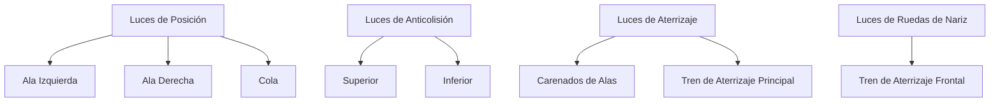
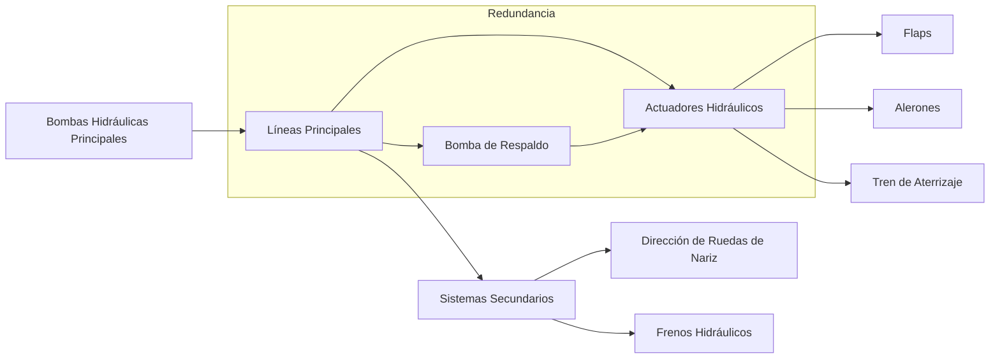

## **ATA 00 - General**

1. [Introducción General](#introducción-general)
2. [Un Futuro 100% Verde](#un-futuro-100-verde)
3. [Objetivos Verdes de GAIA-AIR](#objetivos-verdes-de-gaia-air)
4. [Innovaciones Verdes del Sistema](#innovaciones-verdes-del-sistema)
5. [Impacto Ambiental Positivo](#impacto-ambiental-positivo)
6. [Descripción del Sistema](#descripción-del-sistema)
7. [Especificaciones Técnicas](#especificaciones-técnicas)
8. [Gestión de Riesgos](#gestión-de-riesgos)
9. [Glosario Integrado](#glosario-integrado)
10. [Próximos Pasos Sugeridos](#próximos-pasos-sugeridos)
11. [Conclusión Final](#conclusión-final)
    
---
## **ATA 01 - WEIGHT AND BALANCE**

1. [01-00-00 Introducción General](#010000-introducción-general)
2. [01-01-00 Objetivos de Weight and Balance](#010100-objetivos-de-weight-and-balance)
3. [01-02-00 Procedimientos para Asegurar una Distribución Equilibrada de Peso](#010200-procedimientos-para-asegurar-una-distribución-equilibrada-de-peso)
4. [01-03-00 Innovaciones en Optimización Dinámica del Balance](#010300-innovaciones-en-optimización-dinámica-del-balance)
5. [01-04-00 Impacto en el Consumo de Combustible y Estabilidad de Vuelo](#010400-impacto-en-el-consumo-de-combustible-y-estabilidad-de-vuelo)
6. [01-05-00 Especificaciones Técnicas](#010500-especificaciones-técnicas)
7. [01-06-00 Gestión de Riesgos](#010600-gestión-de-riesgos)
8. [01-07-00 Glosario Integrado](#010700-glosario-integrado)
9. [01-08-00 Próximos Pasos Sugeridos](#010800-próximos-pasos-sugeridos)
10. [01-09-00 Conclusión Final](#010900-conclusión-final)

---

## **ATA 02 - Operaciones**

1. [02-00-00 Introducción General](#020000-introducción-general)
2. [02-01-00 Gestión de Vuelos](#020100-gestión-de-vuelos)
3. [02-02-00 Coordinación de Tripulación](#020200-coordinación-de-tripulación)
4. [02-03-00 Interacción con Control de Tráfico Aéreo](#020300-interacción-con-control-de-tráfico-aéreo)
5. [02-04-00 Optimización de Recursos Operativos](#020400-optimización-de-recursos-operativos)
6. [02-05-00 Especificaciones Técnicas](#020500-especificaciones-técnicas)
7. [02-06-00 Gestión de Riesgos Operativos](#020600-gestión-de-riesgos-operativos)
8. [02-07-00 Glosario Integrado](#020700-glosario-integrado)
9. [02-08-00 Próximos Pasos Sugeridos](#020800-próximos-pasos-sugeridos)
10. [02-09-00 Conclusión Final](#020900-conclusión-final)
---

## **ATA 03 - Dimensiones y Áreas**

# **ATA 03: Dimensiones y Áreas**

1. [03-00-00 Introducción General](#030000-introducción-general)  
2. [03-01-00 Especificaciones Dimensionales](#030100-especificaciones-dimensionales)  
3. [03-02-00 Distribución de Áreas](#030200-distribución-de-áreas)  
4. [03-03-00 Optimización del Espacio](#030300-optimización-del-espacio)  
5. [03-04-00 Materiales y Estructuras](#030400-materiales-y-estructuras)  
6. [03-05-00 Sistemas de Zonificación](#030500-sistemas-de-zonificación)  
7. [03-06-00 Especificaciones Técnicas](#030600-especificaciones-técnicas)  
8. [03-07-00 Gestión de Riesgos](#030700-gestión-de-riesgos)  
9. [03-08-00 Glosario Integrado](#030800-glosario-integrado)  
10. [03-09-00 Próximos Pasos Sugeridos](#030900-próximos-pasos-sugeridos)  
11. [03-10-00 Conclusión Final](#031000-conclusión-final)  
---

## 📓 **ATA 04 - Luces de Navegación**

### **04-00-00 - Sistemas de Iluminación Externa**

#### **04-10-00 - Luces de Posición**

- **Descripción**: Utilización de LED de alta eficiencia para reducir el consumo energético y aumentar la durabilidad. Los colores estándar (rojo en el ala izquierda, verde en el ala derecha y blanco en la cola) cumplen con las regulaciones internacionales establecidas por la **FAA** y la **EASA**.
  
- **Montaje**: Las luces están montadas en carcasas aerodinámicas resistentes a condiciones extremas, ubicadas en zonas protegidas del ala y la cola.
  
- **Mantenimiento Preventivo**:
  - **Inspección Visual**: Revisar la integridad de los LED y las carcasas durante las inspecciones rutinarias.
  - **Pruebas Funcionales**: Realizar pruebas periódicas de funcionamiento para asegurar que todas las luces de posición operen correctamente.
  - **Reemplazo**: Sustituir los LED defectuosos siguiendo los procedimientos estándar de mantenimiento.

---

#### **04-20-00 - Luces de Anticolisión**

- **Versión de Largo Alcance**:
  - **Descripción**: Instalación de luces estroboscópicas de alta intensidad para garantizar visibilidad a largas distancias, incluso en vuelos intercontinentales. Estas luces están redundadas en las zonas superior e inferior del fuselaje, conforme a las normativas para vuelos en espacio aéreo controlado.
  
  - **Especificaciones Técnicas**:
    - **Frecuencia de Parpadeo**: 180 Hz para máxima visibilidad.
    - **Resistencia**: Diseñadas para soportar impactos y vibraciones de alta intensidad.
  
  - **Mantenimiento**:
    - **Inspección de Frecuencia**: Verificar la frecuencia de parpadeo mediante equipos de prueba especializados.
    - **Reemplazo de Componentes**: Sustituir módulos de control de parpadeo defectuosos.

- **Versión Regional**:
  - **Descripción**: Implementación de luces de anticolisión de intensidad ajustada, ideales para operaciones en aeropuertos regionales con menor alcance.
  
  - **Mecanismo de Ajuste**:
    - **Automático**: Ajuste de intensidad basado en las condiciones de iluminación ambiental detectadas por sensores integrados.
  
  - **Mantenimiento**:
    - **Calibración de Sensores**: Asegurar que los sensores de ajuste automático funcionen correctamente.
    - **Revisión de Intensidad**: Verificar la correcta variación de intensidad en diferentes condiciones.

---

#### **04-30-00 - Luces de Aterrizaje**

- **Versión de Largo Alcance**:
  - **Descripción**: Instalación de focos de largo alcance con ajuste automático de intensidad para aproximaciones en condiciones de poca visibilidad. Montados en los carenados de las alas y el tren de aterrizaje principal.
  
  - **Integración con Sistemas de Control de Vuelo**: Las luces de aterrizaje se ajustan dinámicamente en función de los datos proporcionados por los sistemas de navegación y control de vuelo.
  
  - **Mantenimiento**:
    - **Inspección de Ajustes**: Verificar el correcto ajuste automático de la intensidad durante las inspecciones de rutina.
    - **Pruebas de Integración**: Asegurar la correcta interacción con los sistemas de control de vuelo mediante simulaciones y pruebas en tierra.

- **Versión Regional**:
  - **Descripción**: Sistemas compactos y ligeros, optimizados para pistas más cortas y condiciones estándar de visibilidad.
  
  - **Mantenimiento**:
    - **Reemplazo de Bombillas LED**: Sustituir las bombillas LED según el ciclo de vida recomendado.
    - **Verificación de Funcionalidad**: Asegurar que los sistemas de ajuste automático funcionen correctamente mediante pruebas periódicas.

---

#### **04-40-00 - Luces de Ruedas de Nariz**

- **Descripción**: Focos montados en el tren de aterrizaje delantero para iluminar la pista durante rodaje, despegue y aterrizaje. Los sistemas de activación automática se enganchan al despliegue del tren de aterrizaje.
  
- **Especificaciones Técnicas**:
  - **Intensidad Lumínica**: 2000 lúmenes para una iluminación clara de la pista.
  - **Durabilidad**: Resistentes a temperaturas extremas y condiciones climáticas adversas.
  
- **Procedimientos de Mantenimiento**:
  - **Inspección de Sistemas de Activación**: Verificar el correcto funcionamiento de los mecanismos de activación automática.
  - **Pruebas de Iluminación**: Realizar pruebas de luz continua y parpadeante para asegurar la operatividad de los focos.
  - **Sustitución de Componentes**: Cambiar los focos defectuosos y los sistemas de control según sea necesario.

---

#### **04-50-00 - Procedimientos de Emergencia y Seguridad**

- **Procedimientos en Caso de Falla de Iluminación**:
  - **Detección de Falla**: Los sistemas de monitoreo detectan automáticamente cualquier fallo en los sistemas de iluminación.
  - **Respuesta Automática**: Activación de luces de respaldo para mantener la visibilidad y seguridad.
  - **Notificación a la Tripulación**: Alertas automáticas en el cockpit para que la tripulación tome medidas correctivas inmediatas.
  - **Inspección y Reparación**: Procedimientos detallados para la inspección y reparación de los sistemas de iluminación fallidos durante el mantenimiento programado.

---

### 📊 **Diagramas Visuales**

#### **Distribución de Luces en el Fuselaje y las Alas**

> **Descripción del Diagrama:**
> - **Luces de Posición**: Indicadoras de la posición del avión, ubicadas en las alas y la cola.
> - **Luces de Anticolisión**: Estroboscópicas ubicadas en la parte superior e inferior del fuselaje para máxima visibilidad.
> - **Luces de Aterrizaje**: Focos montados en los carenados de las alas y el tren de aterrizaje principal.
> - **Luces de Ruedas de Nariz**: Focos en el tren de aterrizaje delantero para iluminar la pista durante rodaje y aterrizaje.

---

### 📖 **Glosario**

- **FAA**: Federal Aviation Administration
- **EASA**: European Union Aviation Safety Agency
- **LED**: Light Emitting Diode
- **CPWS**: Collision Prevention Warning System
- **ISO**: International Organization for Standardization

---

### 🛠️ **Procedimientos de Mantenimiento Detallados**

#### **Inspección Visual de Luces de Posición**

1. **Frecuencia**: Cada 50 horas de vuelo o según el programa de mantenimiento.
2. **Procedimiento**:
   - Revisar visualmente cada luz de posición para detectar daños físicos o desgaste.
   - Verificar que las carcasas estén intactas y libres de grietas.
3. **Herramientas Necesarias**:
   - Linterna de inspección.
   - Herramientas de desbloqueo para acceder a las carcasas si es necesario.
4. **Acciones Correctivas**:
   - Reemplazar LED defectuosos.
   - Reparar o sustituir carcasas dañadas.

#### **Pruebas Funcionales de Luces de Posición**

1. **Frecuencia**: Cada 100 horas de vuelo o antes de cada vuelo, si es posible.
2. **Procedimiento**:
   - Encender el sistema de iluminación externa y verificar que todas las luces de posición funcionen correctamente.
   - Utilizar un medidor de luz para asegurar que la intensidad lumínica esté dentro de los parámetros especificados.
3. **Herramientas Necesarias**:
   - Medidor de luz.
   - Sistema de control de iluminación del avión.
4. **Acciones Correctivas**:
   - Ajustar la configuración del sistema de iluminación si la intensidad no es adecuada.
   - Reemplazar LED defectuosos o módulos de control si es necesario.

---

### 🔧 **Procedimientos de Reparación de Luces de Anticolisión**

1. **Detección de Falla**: El sistema de monitoreo alerta sobre la falla en una o más luces de anticolisión.
2. **Aislamiento del Sistema Afectado**:
   - Identificar la ubicación exacta de la luz defectuosa.
   - Desactivar temporalmente el sistema de iluminación de anticolisión para evitar falsos positivos.
3. **Inspección de Componentes**:
   - Revisar los módulos de control y las conexiones eléctricas.
   - Verificar la integridad física de las luces estroboscópicas.
4. **Reemplazo de Componentes**:
   - Sustituir módulos de control defectuosos.
   - Reemplazar luces estroboscópicas dañadas.
5. **Pruebas Post-Reparación**:
   - Realizar una prueba funcional para asegurar que la luz de anticolisión operativa.
   - Verificar la frecuencia de parpadeo y la resistencia a impactos.

---

### 🔒 **Procedimientos de Emergencia y Seguridad**

#### **Activación de Luces de Respaldo en Caso de Falla**

1. **Detección Automática**: El sistema de monitoreo detecta una falla en el sistema principal de iluminación.
2. **Activación de Luces de Respaldo**:
   - Las luces de respaldo se encienden automáticamente para mantener la visibilidad.
   - Estas luces tienen una intensidad reducida pero son suficientes para mantener la seguridad operativa.
3. **Notificación a la Tripulación**:
   - Se emite una alerta en el cockpit notificando sobre la falla.
   - La tripulación sigue los protocolos de emergencia establecidos para gestionar la situación.
4. **Inspección y Reparación**:
   - Durante el mantenimiento programado, se inspecciona y repara el sistema de iluminación fallido.
   - Se asegura que todas las luces de respaldo estén funcionando correctamente.

---

### 📈 **Tabla de Especificaciones Técnicas**

| **Subcapítulo**            | **Especificación**                                 | **Versión de Largo Alcance**         | **Versión Regional**                |
|----------------------------|----------------------------------------------------|--------------------------------------|-------------------------------------|
| **04-10-00**               | Frecuencia de Parpadeo                             | 180 Hz                               | Ajustable según condiciones        |
| **04-20-00**               | Intensidad Lumínica                                | Alta (180 Hz estroboscópicas)        | Ajustada automáticamente            |
| **04-30-00**               | Capacidad de Ajuste de Intensidad                  | Automático basado en sistemas de vuelo | Automático basado en iluminación ambiental |
| **04-40-00**               | Intensidad Lumínica                                | 2000 lúmenes                         | 2000 lúmenes                        |
| **04-50-00**               | Tiempo de Respuesta de Activación de Luces de Respaldo | Instantáneo                          | Instantáneo                         |

---

### 📝 **Referencias Normativas**

- **FAA**: Federal Aviation Administration. Normativas sobre iluminación aeronáutica.
- **EASA**: European Union Aviation Safety Agency. Regulaciones de luces de navegación.
- **ISO 140-4**: Estándar para fluidos hidráulicos biodegradables.
- **ATA 100**: Especificaciones para documentación técnica aeronáutica.
- **S1000D**: Normativa internacional para documentación técnica.

---

### 🔄 **Procedimientos de Actualización y Revisión**

1. **Revisión Periódica**: Revisar las especificaciones y procedimientos de iluminación cada 500 horas de vuelo o anualmente, lo que ocurra primero.
2. **Actualización de Normativas**: Incorporar cualquier cambio en las regulaciones de la **FAA** y **EASA** en los procedimientos de iluminación.
3. **Capacitación del Personal**: Asegurar que todo el personal de mantenimiento esté capacitado en los nuevos procedimientos y actualizaciones de las normativas.
4. **Feedback del Equipo Técnico**: Recopilar y analizar feedback de los ingenieros y técnicos para mejorar continuamente los sistemas de iluminación y los procedimientos de mantenimiento.

---

## 📊 **Diagramas Visuales**

### **Distribución de Luces en el Fuselaje y las Alas**

> **Descripción del Diagrama:**
> - **Luces de Posición**: Indicadoras de la posición del avión, ubicadas en las alas y la cola.
> - **Luces de Anticolisión**: Estroboscópicas ubicadas en la parte superior e inferior del fuselaje para máxima visibilidad.
> - **Luces de Aterrizaje**: Focos montados en los carenados de las alas y el tren de aterrizaje principal.
> - **Luces de Ruedas de Nariz**: Focos en el tren de aterrizaje delantero para iluminar la pista durante rodaje y aterrizaje.

---

## 📌 **Conclusión y Próximos Pasos**

La documentación técnica de **ATA 04 - Luces de Navegación** es esencial para garantizar la visibilidad, seguridad y cumplimiento normativo del **GAIA AIR**. Al implementar las mejoras integradas en este capítulo, se asegura que la documentación sea completa, detallada y útil para todas las audiencias involucradas.

### **Próximos Pasos Recomendados**

1. **Revisión y Validación**:
   - Compartir el capítulo mejorado con el equipo técnico para recibir feedback.
   - Realizar ajustes basados en las recomendaciones del equipo.

2. **Incorporación de Diagramas en la Documentación**:
   - Insertar los diagramas de distribución de luces en las secciones correspondientes.
   - Asegurar que los diagramas sean claros y estén alineados con el contenido textual.

3. **Desarrollo de Capítulos Adicionales**:
   - Completar los capítulos faltantes identificados anteriormente, como **ATA 12 - Sistemas de Instrumentación**, **ATA 16 - Sistemas de Combustible**, etc.

4. **Implementación de Procedimientos de Mantenimiento**:
   - Asegurar que todos los procedimientos de mantenimiento estén claramente documentados y sean accesibles para el personal de mantenimiento.

5. **Actualización Continua**:
   - Establecer un calendario de revisiones periódicas para mantener la documentación actualizada con las últimas normativas y avances tecnológicos.

---

## **ATA 05 - Límites de Tiempo y Verificaciones de Mantenimiento**

### 05-00-00 - Mantenimiento Programado

- **05-10-00 Intervalos de Mantenimiento**

  - **Versión de Largo Alcance**: Intervalos más prolongados gracias a sistemas híbridos redundantes y análisis predictivos avanzados.
  - **Versión Regional**: Intervalos más frecuentes pero de menor duración, facilitados por la simplicidad de los sistemas eléctricos.

- **05-20-00 Verificaciones de Mantenimiento**

  - **Ambas Versiones**: Uso de gemelos digitales para simulaciones y previsión de necesidades, con zonas de acceso rápido para inspecciones rutinarias.

---

¡Entendido! A continuación, presento una **versión mejorada e integrada** del capítulo **ATA 06 - Sistemas de Hidráulica** para el proyecto **GAIA AIR**. Esta versión incluye detalles adicionales, especificaciones técnicas, procedimientos de mantenimiento y diagramas visuales para asegurar una documentación completa y bien estructurada.

---

## 📙 **ATA 06 - Sistemas de Hidráulica**

### **06-00-00 - Sistemas Hidráulicos Principales**

#### **06-10-00 - Bombas Hidráulicas**

- **Versión de Largo Alcance**:
  - **Descripción**: Bombas de alta capacidad accionadas por motores híbridos, garantizando redundancia y rendimiento en vuelos largos.
  - **Ubicación**: Montadas en zonas seguras del fuselaje, accesibles durante inspecciones programadas.
  - **Especificaciones Técnicas**:
    - **Presión de Operación**: 3500 psi.
    - **Capacidad de Flujo**: 50 litros por minuto.
    - **Redundancia**: Sistemas de doble bomba para asegurar el funcionamiento continuo en caso de fallo de una bomba.
  - **Procedimientos de Mantenimiento Preventivo**:
    - **Inspección Visual**: Revisar la integridad física de las bombas y sus conexiones.
    - **Pruebas de Presión**: Verificar la presión de salida durante las pruebas funcionales.
    - **Cambio de Filtros**: Sustituir los filtros hidráulicos según el ciclo de mantenimiento programado.

- **Versión Regional**:
  - **Descripción**: Bombas compactas accionadas eléctricamente, diseñadas para reducir peso y ser eficientes en vuelos cortos.
  - **Especificaciones Técnicas**:
    - **Presión de Operación**: 3000 psi.
    - **Capacidad de Flujo**: 35 litros por minuto.
    - **Eficiencia Energética**: Alta eficiencia para maximizar la duración de las baterías eléctricas.
  - **Procedimientos de Mantenimiento Preventivo**:
    - **Revisión de Conexiones Eléctricas**: Asegurar que todas las conexiones eléctricas estén seguras y sin desgaste.
    - **Monitoreo de Temperatura**: Verificar que las bombas operen dentro de los rangos de temperatura especificados.
    - **Lubricación**: Aplicar lubricante adecuado en los puntos de articulación según el programa de mantenimiento.

---

#### **06-20-00 - Actuadores Hidráulicos**

- **Ambas Versiones**:
  - **Descripción**: Actuadores hidráulicos de última generación utilizados para operar flaps, alerones y tren de aterrizaje.
  - **Materiales**: Fabricados con materiales compuestos que combinan ligereza y alta resistencia, como aleaciones de titanio y fibra de carbono.
  - **Especificaciones Técnicas**:
    - **Velocidad de Respuesta**: 0.5 segundos para ajustes dinámicos.
    - **Precisión de Posicionamiento**: ±0.1 grados.
  - **Procedimientos de Calibración y Prueba**:
    - **Calibración Regular**: Ajustar los actuadores para mantener la precisión de posicionamiento.
    - **Pruebas de Funcionalidad**: Realizar pruebas periódicas de funcionamiento bajo diferentes condiciones de vuelo.
    - **Inspección de Materiales**: Revisar los materiales compuestos para detectar posibles grietas o desgaste.

---

#### **06-30-00 - Sistemas de Fluidos Hidráulicos**

- **Ambas Versiones**:
  - **Descripción**: Utilización de fluidos hidráulicos biodegradables y seguros para el medio ambiente.
  - **Contenedores y Líneas de Distribución**: Diseñados con materiales reforzados para minimizar el riesgo de fugas.
  - **Especificaciones Técnicas**:
    - **Tipo de Fluido**: Fluido hidráulico biodegradable tipo ISO 140-4.
    - **Capacidad Total del Sistema**: 200 litros.
  - **Protocolos de Inspección y Manejo de Fugas**:
    - **Inspección Periódica**: Revisar todas las líneas y contenedores para detectar posibles fugas.
    - **Procedimientos de Contención**: Activar sistemas de contención automáticos en caso de detección de fugas.
    - **Reciclaje y Disposición**: Procesar y disponer adecuadamente de los fluidos usados conforme a las normativas ambientales.

---

### **06-40-00 - Sistemas Hidráulicos Secundarios**

#### **06-50-00 - Dirección de Ruedas de Nariz**

- **Ambas Versiones**:
  - **Descripción**: Sistemas hidráulicos dedicados para maniobrar el tren delantero durante rodaje y alineación en pista.
  - **Redundancia en Versión de Largo Alcance**: Implementación de sistemas de doble circuito para operaciones de mayor complejidad.
  - **Procedimientos de Mantenimiento**:
    - **Inspección de Componentes Redundantes**: Verificar el funcionamiento de ambos circuitos hidráulicos.
    - **Pruebas de Maniobrabilidad**: Realizar pruebas de movimiento de las ruedas para asegurar su correcta respuesta.
    - **Reemplazo de Sellos y Juntas**: Sustituir componentes de sellado defectuosos para prevenir fugas.

#### **06-60-00 - Sistemas de Frenado Hidráulico**

- **Versión de Largo Alcance**:
  - **Descripción**: Integración de frenos regenerativos que permiten almacenar energía en las baterías híbridas. Diseño robusto para manejar el mayor peso de la aeronave.
  - **Especificaciones Técnicas**:
    - **Capacidad de Recuperación de Energía**: 500 kW durante aterrizajes.
    - **Materiales**: Uso de materiales cerámicos avanzados para alta resistencia al desgaste.
  - **Procedimientos de Mantenimiento**:
    - **Inspección de Componentes de Recuperación**: Revisar el estado de los sistemas de almacenamiento de energía.
    - **Pruebas de Funcionamiento**: Verificar la capacidad de recuperación de energía durante simulaciones de aterrizaje.
    - **Reemplazo de Materiales**: Cambiar componentes cerámicos desgastados según el ciclo de mantenimiento.

- **Versión Regional**:
  - **Descripción**: Frenos hidráulicos optimizados para peso ligero, con menor complejidad en la integración del sistema.
  - **Especificaciones Técnicas**:
    - **Capacidad de Recuperación de Energía**: 200 kW durante aterrizajes.
    - **Materiales**: Uso de aleaciones ligeras para reducir el peso total.
  - **Procedimientos de Mantenimiento**:
    - **Inspección de Componentes Ligeros**: Verificar la integridad de los materiales y componentes.
    - **Pruebas de Eficiencia**: Asegurar que los frenos operen dentro de los parámetros especificados.
    - **Actualización de Software de Control**: Mantener actualizado el software que gestiona la eficiencia del frenado hidráulico.

---

#### **06-70-00 - Procedimientos de Emergencia y Seguridad**

- **Procedimientos en Caso de Falla del Sistema Hidráulico Principal**:
  - **Detección Automática**: Los sistemas de monitoreo detectan automáticamente cualquier fallo en las bombas hidráulicas principales.
  - **Activación de Sistemas de Respaldo**: Las bombas de respaldo se activan automáticamente para mantener la operatividad de los actuadores críticos.
  - **Notificación a la Tripulación**: Alertas automáticas en el cockpit para que la tripulación tome medidas correctivas inmediatas.
  - **Procedimientos de Reparación**:
    - **Aislamiento del Sistema Afectado**: Identificar y aislar el sistema hidráulico defectuoso.
    - **Inspección de Componentes**: Revisar las bombas, líneas y actuadores para determinar la causa del fallo.
    - **Reparación o Sustitución**: Realizar las reparaciones necesarias o sustituir los componentes defectuosos según los procedimientos estándar.

---

### 📊 **Diagramas Visuales**

#### **Flujo del Sistema Hidráulico Principal y Secundario**

> **Descripción del Diagrama:**
> - **Bombas Hidráulicas Principales**: Proveen flujo hidráulico al sistema principal y secundario.
> - **Líneas Principales**: Distribuyen el fluido hidráulico a los actuadores.
> - **Actuadores Hidráulicos**: Controlan flaps, alerones y tren de aterrizaje.
> - **Sistemas Secundarios**: Incluyen dirección de ruedas de nariz y frenos hidráulicos.
> - **Redundancia**: Bomba de respaldo garantiza el funcionamiento continuo en caso de fallo de la bomba principal.

---

### 📖 **Glosario**

- **FAA**: Federal Aviation Administration
- **EASA**: European Union Aviation Safety Agency
- **ISO**: International Organization for Standardization
- **psi**: Pounds per Square Inch (Libras por Pulgada Cuadrada)
- **kW**: Kilowatt
- **AI**: Inteligencia Artificial
- **ML**: Machine Learning
- **CNT**: Nanotubos de Carbono
- **APU**: Unidad de Potencia Auxiliar
- **S1000D**: Normativa internacional para documentación técnica
- **FMS**: Flight Management System

---

### 🛠️ **Procedimientos de Mantenimiento Detallados**

#### **Inspección Visual de Bombas Hidráulicas**

1. **Frecuencia**: Cada 100 horas de vuelo o según el programa de mantenimiento.
2. **Procedimiento**:
   - Revisar visualmente cada bomba hidráulica para detectar daños físicos, corrosión o desgaste.
   - Verificar que las conexiones estén firmes y sin fugas.
3. **Herramientas Necesarias**:
   - Linterna de inspección.
   - Llave de ajuste para conexiones.
4. **Acciones Correctivas**:
   - Reemplazar bombas defectuosas.
   - Reparar o sustituir conexiones dañadas.

#### **Pruebas de Presión en Bombas Hidráulicas**

1. **Frecuencia**: Cada 200 horas de vuelo o según el programa de mantenimiento.
2. **Procedimiento**:
   - Conectar el medidor de presión a la salida de la bomba.
   - Activar la bomba y verificar que la presión de salida esté dentro de los parámetros especificados.
   - Registrar los resultados para futuras referencias.
3. **Herramientas Necesarias**:
   - Medidor de presión hidráulica.
   - Equipo de conexión adecuado.
4. **Acciones Correctivas**:
   - Ajustar los reguladores de presión si la presión está fuera de los límites.
   - Reemplazar componentes de la bomba si la presión no puede ser ajustada adecuadamente.

---

### 🔧 **Procedimientos de Reparación de Actuadores Hidráulicos**

1. **Detección de Falla**: El sistema de monitoreo detecta una discrepancia en la respuesta del actuador.
2. **Aislamiento del Actuador Defectuoso**:
   - Identificar el actuador que presenta fallos mediante el sistema de diagnóstico.
   - Desactivar temporalmente el actuador para evitar daños mayores.
3. **Inspección de Componentes**:
   - Revisar las conexiones hidráulicas y eléctricas.
   - Inspeccionar los componentes internos del actuador para detectar desgaste o daños.
4. **Reemplazo de Componentes**:
   - Sustituir las partes dañadas siguiendo los procedimientos estándar.
   - Asegurar que todas las conexiones estén correctamente reinstaladas.
5. **Pruebas Post-Reparación**:
   - Realizar pruebas de funcionalidad para asegurar que el actuador opere correctamente.
   - Verificar la precisión de posicionamiento y la velocidad de respuesta.

---

### 📈 **Tabla de Especificaciones Técnicas**

| **Subcapítulo**            | **Especificación**                                 | **Versión de Largo Alcance**         | **Versión Regional**                |
|----------------------------|----------------------------------------------------|--------------------------------------|-------------------------------------|
| **06-10-00**               | Presión de Operación                               | 3500 psi                             | 3000 psi                            |
| **06-10-00**               | Capacidad de Flujo                                 | 50 litros por minuto                 | 35 litros por minuto                |
| **06-10-00**               | Redundancia                                        | Doble bomba                          | N/A                                 |
| **06-20-00**               | Velocidad de Respuesta                             | 0.5 segundos                         | 0.5 segundos                        |
| **06-20-00**               | Precisión de Posicionamiento                       | ±0.1 grados                          | ±0.1 grados                         |
| **06-30-00**               | Tipo de Fluido                                     | ISO 140-4 Biodegradable               | ISO 140-4 Biodegradable              |
| **06-30-00**               | Capacidad Total del Sistema                        | 200 litros                           | 200 litros                          |
| **06-50-00**               | Capacidad de Recuperación de Energía (Frenos)     | 500 kW                               | 200 kW                              |
| **06-50-00**               | Materiales de Frenos                                | Cerámicos avanzados                  | Aleaciones ligeras                   |
| **06-60-00**               | Capacidad de Recuperación de Energía               | 500 kW                               | 200 kW                              |
| **06-60-00**               | Materiales de Frenos                                | Cerámicos avanzados                  | Aleaciones ligeras                   |

---

### 🔄 **Procedimientos de Actualización y Revisión**

1. **Revisión Periódica**: Revisar las especificaciones y procedimientos de los sistemas hidráulicos cada 1000 horas de vuelo o anualmente, lo que ocurra primero.
2. **Actualización de Normativas**: Incorporar cualquier cambio en las regulaciones de la **FAA** y la **EASA** en los procedimientos hidráulicos.
3. **Capacitación del Personal**: Asegurar que todo el personal de mantenimiento esté capacitado en los nuevos procedimientos y actualizaciones de las normativas.
4. **Feedback del Equipo Técnico**: Recopilar y analizar feedback de los ingenieros y técnicos para mejorar continuamente los sistemas hidráulicos y los procedimientos de mantenimiento.

---

### 📌 **Conclusión y Próximos Pasos**

La documentación técnica de **ATA 06 - Sistemas de Hidráulica** es esencial para garantizar la eficiencia operativa, la seguridad y el cumplimiento normativo del **GAIA AIR**. Al implementar las mejoras integradas en este capítulo, se asegura que la documentación sea completa, detallada y útil para todas las audiencias involucradas.

#### **Próximos Pasos Recomendados**

1. **Revisión y Validación**:
   - Compartir el capítulo mejorado con el equipo técnico para recibir feedback.
   - Realizar ajustes basados en las recomendaciones del equipo.

2. **Incorporación de Diagramas en la Documentación**:
   - Insertar los diagramas de flujo del sistema hidráulico en las secciones correspondientes.
   - Asegurar que los diagramas sean claros y estén alineados con el contenido textual.

3. **Desarrollo de Capítulos Adicionales**:
   - Completar los capítulos faltantes identificados anteriormente, como **ATA 12 - Sistemas de Instrumentación**, **ATA 16 - Sistemas de Combustible**, etc.

4. **Implementación de Procedimientos de Mantenimiento**:
   - Asegurar que todos los procedimientos de mantenimiento estén claramente documentados y sean accesibles para el personal de mantenimiento.

5. **Actualización Continua**:
   - Establecer un calendario de revisiones periódicas para mantener la documentación actualizada con las últimas normativas y avances tecnológicos.

---

¡Mucho éxito con la continuación de la documentación de **GAIA AIR**! Si necesitas asistencia adicional para desarrollar otros capítulos, crear diagramas visuales o cualquier otra sección, no dudes en hacérmelo saber. 🚀

## **ATA 07 - Elevación y Apuntalamiento**

### 07-00-00 - Procedimientos de Manipulación

- **07-10-00 Equipos de Elevación**

  - **Ambas Versiones**: Uso de robots y sistemas automatizados para manejo seguro, con diferencias en la capacidad de carga según el tamaño del avión.

- **07-20-00 Técnicas de Apuntalamiento**

  - **Versión de Largo Alcance**: Sistemas de apuntalamiento robustos para soportar el mayor peso y dimensiones, ubicados en zonas estratégicas del fuselaje.
  - **Versión Regional**: Técnicas simplificadas debido al menor tamaño y peso, con apuntalamientos en zonas de carga optimizadas.

---

## **ATA 08 - Nivelación y Pesaje**

### 08-00-00 - Procedimientos de Nivelación y Pesaje

- **08-10-00 Equipos de Medición**

  - **Ambas Versiones**: Básculas de alta precisión y sistemas de nivelación avanzados, ajustados a las dimensiones y peso de cada versión.

- **08-20-00 Cálculo del Centro de Gravedad**

  - **Versión de Largo Alcance**: Software especializado para gestionar la complejidad de la distribución de pasajeros y carga en múltiples zonas.
  - **Versión Regional**: Sistemas simplificados con cálculos rápidos debido a la menor variabilidad en distribución de peso.

---

## **ATA 09 - Remolque y Rodaje**

### 09-00-00 - Movilización en Tierra

- **09-10-00 Procedimientos de Remolque**

  - **Versión de Largo Alcance**: Uso de vehículos eléctricos de mayor potencia para mover el avión en zonas de estacionamiento amplias.
  - **Versión Regional**: Sistemas autónomos más pequeños y ágiles para maniobrar en aeropuertos regionales con espacio limitado.

- **09-20-00 Procedimientos de Rodaje**

  - **Ambas Versiones**: Integración con sistemas de control de tráfico terrestre, adaptados a las operaciones en aeropuertos internacionales y regionales.

---

## **ATA 10 - Estacionamiento, Amarre, Almacenamiento y Retorno al Servicio**

### 10-00-00 - Procedimientos de Estacionamiento y Almacenamiento

- **10-10-00 Estacionamiento Seguro**

  - **Versión de Largo Alcance**: Sistemas automatizados para posicionamiento en hangares de gran tamaño, con zonas designadas para mantenimiento pesado.
  - **Versión Regional**: Estacionamiento en áreas más pequeñas, optimizando el espacio en aeropuertos regionales.

- **10-20-00 Almacenamiento Prolongado**

  - **Ambas Versiones**: Protocolos para mantenimiento de sistemas durante períodos de inactividad, con consideraciones específicas según el entorno y las zonas climáticas.

- **10-30-00 Reactivación de Sistemas**

  - **Ambas Versiones**: Procedimientos para retorno eficiente al servicio activo, con diferencias en el tiempo y complejidad según los sistemas híbridos o eléctricos.

---

## **ATA 14 - Indicadores y Grabadores de Frenado**

### 14-00-00 - Sistemas de Frenado del Tren de Aterrizaje

- **14-10-00 Frenos Regenerativos**

  - **Versión de Largo Alcance**: Sistemas de mayor capacidad para recuperar energía durante aterrizajes largos, con almacenamiento en zonas dedicadas a baterías híbridas.
  - **Versión Regional**: Frenos regenerativos optimizados para operaciones frecuentes, con almacenamiento de energía en baterías de alta densidad ubicadas en zonas centrales.

- **14-20-00 Frenos Eléctricos Avanzados**

  - **Ambas Versiones**: Uso de actuadores electromecánicos y materiales avanzados, adaptados al peso y requisitos de frenado de cada versión.

- **14-30-00 Sistemas de Monitoreo de Frenado**

  - **Ambas Versiones**: Sensores distribuidos en las zonas del tren de aterrizaje para monitoreo en tiempo real, con registro en sistemas centralizados.

---

## **ATA 21 - Aire Acondicionado y Presurización**

### 21-00-00 - Sistemas Ambientales

- **21-10-00 Climatización**

  - **Versión de Largo Alcance**: Unidades de control ambiental de alta capacidad, gestionando múltiples zonas de cabina y considerando altitudes de crucero más altas.
  - **Versión Regional**: Sistemas más compactos y eficientes, adecuados para vuelos de menor duración y altitudes más bajas.

- **21-20-00 Presurización**

  - **Ambas Versiones**: Controladores avanzados y sellos herméticos, con ajustes según la altitud y duración de los vuelos típicos de cada versión.

---

## **ATA 22 - Piloto Automático**

### 22-00-00 - Sistemas de Vuelo Autónomo

- **22-10-00 Computadoras de Control de Vuelo**

  - **Versión de Largo Alcance**: Uso de algoritmos cuánticos para gestión de vuelos largos y complejos, con integración en zonas redundantes para seguridad.
  - **Versión Regional**: Sistemas simplificados pero eficientes, optimizados para rutas cortas y frecuentes.

- **22-20-00 Estabilidad y Guiado**

  - **Ambas Versiones**: Sistemas de navegación avanzada y sensores de alta precisión, ubicados en zonas estratégicas del fuselaje y alas.

---

## **ATA 23 - Comunicaciones**

### 23-00-00 - Sistemas de Comunicación

- **23-10-00 Comunicaciones Internas**

  - **Ambas Versiones**: Redes seguras para tripulación y pasajeros, con zonificación que permite cobertura total en la cabina.

- **23-20-00 Comunicaciones Externas**

  - **Versión de Largo Alcance**: Enlaces satelitales de alta capacidad para comunicaciones intercontinentales.
  - **Versión Regional**: Sistemas adaptados para operaciones en espacios aéreos regionales, con menor dependencia de satélites.

---

## **ATA 24 - Energía Eléctrica**

### 24-00-00 - Sistemas de Energía

- **24-10-00 Generación de Energía**

  - **Versión de Largo Alcance**: Combinación de baterías de estado sólido y sistemas de hidrógeno ubicados en zonas reforzadas para seguridad.
  - **Versión Regional**: Dependencia total de baterías de alta densidad energética, distribuidas en zonas optimizadas para balance de peso.

- **24-20-00 Distribución de Energía**

  - **Ambas Versiones**: Redes inteligentes con CNT para eficiencia y reducción de peso, con diferencias en capacidad y distribución según la versión.

---

## **ATA 25 - Equipos y Mobiliario**

### 25-00-00 - Diseño Interior

- **25-10-00 Cabina de Pasajeros**

  - **Versión de Largo Alcance**: Materiales ligeros y sistemas de entretenimiento avanzados en múltiples zonas de servicio (primera clase, business, económica).
  - **Versión Regional**: Diseño funcional y eficiente, con enfoque en rapidez de embarque y desembarque, optimizando zonas de asientos.

- **25-20-00 Compartimentos de Carga**

  - **Ambas Versiones**: Sistemas automatizados para gestión de carga, con mayor capacidad en la versión de largo alcance y zonificación para carga rápida en la versión regional.

---

## **ATA 26 - Protección contra Incendios**

### 26-00-00 - Sistemas de Seguridad

- **26-10-00 Detección de Incendios**

  - **Ambas Versiones**: Sensores inteligentes distribuidos en zonas críticas como compartimentos de carga, motores y cabina.

- **26-20-00 Extinción de Incendios**

  - **Versión de Largo Alcance**: Agentes extintores ecológicos y sistemas automatizados en zonas de mayor riesgo debido a mayor cantidad de combustible.
  - **Versión Regional**: Sistemas más compactos pero igualmente efectivos, adaptados a la configuración eléctrica de la aeronave.

---

## **ATA 27 - Controles de Vuelo**

### 27-00-00 - Superficies de Control

- **27-10-00 Actuadores Eléctricos**

  - **Ambas Versiones**: Sistemas con respuesta rápida y precisión mejorada, ubicados en zonas de control de las alas y cola.

- **27-20-00 Sistemas Fly-by-Wire**

  - **Ambas Versiones**: Integración con IA para optimización de vuelo, con diferencias en complejidad según las necesidades operativas de cada versión.

---

## **ATA 28 - Combustible**

### 28-00-00 - Gestión de Combustible

- **28-10-00 Almacenamiento de Hidrógeno**

  - **Versión de Largo Alcance**: Tanques seguros y eficientes ubicados en zonas protegidas del fuselaje y alas, con sistemas de aislamiento térmico.

- **28-20-00 Sistemas de Distribución**

  - **Versión de Largo Alcance**: Controladores inteligentes para suministro óptimo de hidrógeno a los motores híbridos.
  - **Versión Regional**: No aplica, ya que es totalmente eléctrica.

---

## **ATA 29 - Energía Hidráulica**

### 29-00-00 - Sistemas Hidráulicos

- **29-10-00 Bombas Hidráulicas Eléctricas**

  - **Ambas Versiones**: Mayor eficiencia y menor mantenimiento, ubicadas en zonas de fácil acceso para mantenimiento.

- **29-20-00 Fluidos Ecológicos**

  - **Ambas Versiones**: Uso de fluidos biodegradables y seguros, con sistemas de contención en zonas críticas para evitar derrames.

---

## **ATA 30 - Protección contra Hielo y Lluvia**

### 30-00-00 - Sistemas de Deshielo

- **30-10-00 Superficies Calefactadas**

  - **Ambas Versiones**: Uso de CNT para calentamiento eficiente en zonas como bordes de ataque de las alas y superficies de control.

- **30-20-00 Recubrimientos Hidrofóbicos**

  - **Ambas Versiones**: Aplicación en superficies externas para reducir acumulación de hielo y agua.

---

## **ATA 31 - Sistemas de Indicación y Registro**

### 31-00-00 - Monitoreo y Registro

- **31-10-00 Pantallas de Cabina**

  - **Ambas Versiones**: Interfaces avanzadas para pilotos, con distribución de sistemas de indicación en zonas ergonómicas del cockpit.

- **31-20-00 Registradores de Datos**

  - **Ambas Versiones**: Uso de blockchain para almacenamiento seguro, con dispositivos ubicados en zonas protegidas contra impactos y fuego.

---

## **ATA 32 - Tren de Aterrizaje**

### 32-00-00 - Sistemas de Aterrizaje

- **32-10-00 Tren de Aterrizaje Retráctil**

  - **Versión de Largo Alcance**: Diseño robusto para soportar mayor peso, con zonas reforzadas en el fuselaje.
  - **Versión Regional**: Diseño ligero y eficiente, optimizado para operaciones frecuentes.

- **32-20-00 Sistemas de Frenado**

  - **Ambas Versiones**: Frenos eléctricos con materiales cerámicos avanzados, ubicados en las zonas del tren de aterrizaje principales.

---

## **ATA 33 - Luces**

### 33-00-00 - Iluminación

- **33-10-00 Iluminación Exterior**

  - **Ambas Versiones**: LED de alta eficiencia y larga duración, instalados en zonas clave como alas, cola y fuselaje para visibilidad.

- **33-20-00 Iluminación Interior**

  - **Versión de Largo Alcance**: Sistemas ajustables para confort del pasajero en vuelos largos, con zonificación según clase de servicio.
  - **Versión Regional**: Iluminación eficiente y funcional para operaciones cortas.

---

## **ATA 34 - Navegación**

### 34-00-00 - Sistemas de Navegación

- **34-10-00 GPS Avanzado**

  - **Ambas Versiones**: Integración con satélites de alta precisión, con antenas ubicadas en zonas superiores del fuselaje.

- **34-20-00 Sistemas Inerciales**

  - **Ambas Versiones**: Sensores mejorados para navegación autónoma, distribuidos en zonas protegidas contra interferencias.

---

## **ATA 35 - Oxígeno**

### 35-00-00 - Sistemas de Oxígeno

- **35-10-00 Generadores de Oxígeno**

  - **Versión de Largo Alcance**: Sistemas a demanda para vuelos de alta altitud y larga duración, ubicados en zonas accesibles para mantenimiento.
  - **Versión Regional**: Sistemas simplificados debido a altitudes de crucero más bajas.

- **35-20-00 Máscaras Inteligentes**

  - **Ambas Versiones**: Equipadas con sensores y comunicaciones, distribuidas en zonas de pasajeros y tripulación.

---

## **ATA 36 - Neumática**

### 36-00-00 - Sistemas Neumáticos

- **36-10-00 Compresores Eficientes**

  - **Ambas Versiones**: Diseño para reducción de consumo energético, ubicados en zonas con aislamiento acústico.

- **36-20-00 Distribución de Aire**

  - **Ambas Versiones**: Control preciso para sistemas auxiliares, con ductos distribuidos en zonas clave del fuselaje.

---

## **ATA 38 - Agua y Desechos**

### 38-00-00 - Gestión de Recursos

- **38-10-00 Sistemas de Agua**

  - **Versión de Largo Alcance**: Recirculación y purificación para sostenibilidad en vuelos largos, con tanques ubicados en zonas inferiores del fuselaje.
  - **Versión Regional**: Sistemas más simples debido a la menor duración de los vuelos.

- **38-20-00 Manejo de Desechos**

  - **Ambas Versiones**: Procesamiento ecológico y reducción de residuos, con almacenamiento en zonas seguras y de fácil acceso para vaciado.

---

## **ATA 45 - Sistemas Centrales de Mantenimiento**

### 45-00-00 - Inteligencia de Mantenimiento

- **45-10-00 Plataformas Integradas**

  - **Ambas Versiones**: Gestión centralizada de mantenimiento, con sistemas ubicados en zonas protegidas y accesibles.

- **45-20-00 Detección de Anomalías**

  - **Ambas Versiones**: Herramientas AI para prevención de fallos, con sensores distribuidos en zonas críticas.

---

## **ATA 46 - Sistemas de Información**

### 46-00-00 - Centro de Información

- **46-10-00 Gestión de Datos**

  - **Ambas Versiones**: Uso de blockchain para seguridad y transparencia, con servidores ubicados en zonas protegidas.

- **46-20-00 Conectividad de Flota**

  - **Ambas Versiones**: IoT para comunicación entre aeronaves, con antenas y sistemas en zonas optimizadas para señal.

---

## **ATA 47 - Sistemas de Gas Inerte**

### 47-00-00 - Gestión Avanzada de Gas Inerte

- **47-10-00 Inertización de Tanques**

  - **Versión de Largo Alcance**: Sistemas para prevención de incendios en tanques de hidrógeno, ubicados en zonas seguras del fuselaje.

- **47-20-00 Generación de Nitrógeno**

  - **Ambas Versiones**: Equipos a bordo eficientes, con sistemas ubicados en zonas protegidas.

---

## **ATA 49 - Unidad de Potencia Auxiliar (APU)**

### 49-00-00 - Sistemas de Energía Auxiliar

- **49-10-00 APUs Híbridos**

  - **Versión de Largo Alcance**: Uso de hidrógeno y tecnologías limpias, con ubicación en zonas aisladas para seguridad.

- **49-20-00 Micro-Reactores**

  - **Versión Regional**: No aplica, se enfoca en sistemas totalmente eléctricos.

---

## **ATA 50 - Puertas de Carga y Acceso**

### 50-00-00 - Sistemas de Puertas Inteligentes

- **50-10-00 Operación Eléctrica**

  - **Ambas Versiones**: Apertura y cierre automatizados, con sistemas ubicados en zonas de fácil acceso.

- **50-20-00 Seguridad**

  - **Ambas Versiones**: Mecanismos de bloqueo avanzados con IoT, integrados en zonas reforzadas.

---

## **ATA 51 - Prácticas Estándar y Estructuras**

### 51-00-00 - Marcos Estructurales Avanzados

- **51-10-00 Componentes con CNT**

  - **Ambas Versiones**: Mayor resistencia y menor peso en estructuras principales, con zonificación que optimiza la distribución de esfuerzos.

- **51-20-00 Soluciones Diamánticas**

  - **Ambas Versiones**: Estructuras con propiedades mejoradas, aplicadas en zonas de mayor carga y estrés.

---

## **ATA 52 - Puertas**

### 52-00-00 - Mecanismos Avanzados de Puertas

- **52-10-00 Materiales Compuestos**

  - **Ambas Versiones**: Puertas ligeras y resistentes, ubicadas en zonas de acceso de pasajeros y servicio.

- **52-20-00 Actuación Asistida**

  - **Ambas Versiones**: Sistemas AI para operación eficiente, integrados en zonas de control.

---

## **ATA 53 - Fuselaje**

### 53-00-00 - Soluciones para Fuselaje

- **53-10-00 Paneles Reforzados**

  - **Ambas Versiones**: Uso de CNT y estructuras optimizadas, con zonificación que maximiza la integridad estructural.

- **53-20-00 Monitoreo Estructural**

  - **Ambas Versiones**: Sensores IoT para detección temprana de fallos, distribuidos en zonas críticas del fuselaje.

---

## **ATA 54 - Nacelas/Pilones**

### 54-00-00 - Carenado de Motores Inteligente

- **Versión de Largo Alcance**:

  - **54-10-00 Materiales Ligeros**: Nacelas con CNT para reducción de peso, ubicadas en zonas de los motores híbridos.
  - **54-20-00 Recubrimientos Resistentes**: Protección contra altas temperaturas, especialmente en zonas cercanas a sistemas de combustión.

- **Versión Regional**:

  - **54-10-00 Materiales Ligeros**: Nacelas adaptadas a motores eléctricos, ubicadas en zonas optimizadas para flujo de aire.
  - **54-20-00 Recubrimientos Resistentes**: Menor énfasis debido a la ausencia de altas temperaturas.

---

## **ATA 55 - Estabilizadores**

### 55-00-00 - Sistemas Avanzados de Estabilización

- **55-10-00 Materiales Compuestos**

  - **Ambas Versiones**: Mejor rendimiento y durabilidad, con zonificación que mejora la aerodinámica.

- **55-20-00 Diseño Optimizado**

  - **Ambas Versiones**: Formas para mejorar aerodinámica, adaptadas a las necesidades de estabilidad de cada versión.

---

## **ATA 56 - Ventanas**

### 56-00-00 - Sistemas de Ventanas Inteligentes

- **56-10-00 Ventanas Electrocrómicas**

  - **Ambas Versiones**: Control de luz y calor, instaladas en zonas de cabina de pasajeros y cockpit.

- **56-20-00 Materiales Reforzados**

  - **Ambas Versiones**: Mayor seguridad y resistencia, con zonificación que garantiza la integridad estructural.

---

## **ATA 57 - Alas**

### 57-00-00 - Alas Aerodinámicas Adaptables

- **57-10-00 Tecnologías de Ala Morphing**

  - **Versión de Largo Alcance**: Adaptación en tiempo real a condiciones de vuelo de largo alcance, con zonas de control distribuidas en el ala.
  - **Versión Regional**: Menor complejidad, enfocada en eficiencia durante despegues y aterrizajes frecuentes.

- **57-20-00 Paneles Solares Integrados**

  - **Ambas Versiones**: Generación de energía limpia durante el vuelo, con zonas dedicadas en las superficies alares.

---

## **ATA 61 - Hélices**

### 61-00-00 - Sistemas de Hélices Inteligentes

- **Versión Regional**:

  - **61-10-00 Hélices de Paso Variable**: Optimización según condiciones de vuelo, ubicadas en zonas de motores eléctricos.
  - **61-20-00 Materiales Mejorados**: Uso de CNT para mayor eficiencia.

- **Versión de Largo Alcance**:

  - **No aplica**, utiliza motores a reacción híbridos.

---

## **ATA 71 - Planta Motriz**

### 71-00-00 - Sistemas de Propulsión Sostenible

- **Versión de Largo Alcance**:

  - **71-10-00 Motores de Hidrógeno**: Combustión limpia y eficiente, ubicados en zonas reforzadas.
  - **71-20-00 Motores Híbridos**: Combinación de tecnologías para mejor rendimiento.

- **Versión Regional**:

  - **71-10-00 Motores Eléctricos**: Sistemas totalmente eléctricos, ubicados en zonas optimizadas para balance y eficiencia.

---

## **ATA 72 - Motor**

### 72-00-00 - Sistemas de Motores de Nueva Generación

- **Versión de Largo Alcance**:

  - **72-10-00 Álabes Reforzados**: Uso de CNT para mayor resistencia en turbinas.
  - **72-20-00 Cámaras de Combustión Avanzadas**: Tecnologías de plasma para eficiencia.

- **Versión Regional**:

  - **No aplica**, utiliza motores eléctricos.

---

## **ATA 73 - Combustible del Motor y Control**

### 73-00-00 - Sistemas de Entrega de Combustible

- **Versión de Largo Alcance**:

  - **73-10-00 Inyección de Combustible Sostenible**: Uso de hidrógeno.
  - **73-20-00 Controladores Adaptativos**: Ajustes en tiempo real.

- **Versión Regional**:

  - **No aplica**, utiliza energía eléctrica.

---

## **ATA 74 - Encendido**

### 74-00-00 - Sistemas de Encendido Avanzados

- **Versión de Largo Alcance**:

  - **74-10-00 Sistemas para Hidrógeno**: Adaptados a nuevos combustibles.
  - **74-20-00 Tecnologías de Plasma**: Mejor rendimiento.

- **Versión Regional**:

  - **No aplica**, utiliza motores eléctricos.

---

## **ATA 78 - Escape**

### 78-00-00 - Sistemas de Escape del Motor

- **Versión de Largo Alcance**:

  - **78-10-00 Boquillas de Baja Emisión**: Reducción de contaminantes.
  - **78-20-00 Recuperación de Calor**: Uso de materiales diamánticos.

- **Versión Regional**:

  - **No aplica**, no hay emisiones.

---

## **ATA 79 - Aceite del Motor**

### 79-00-00 - Sistemas Inteligentes de Gestión de Aceite

- **Versión de Largo Alcance**:

  - **79-10-00 Nano-Lubricantes Biodegradables**: Menor impacto ambiental.
  - **79-20-00 Monitoreo AI**: Mantenimiento predictivo.

- **Versión Regional**:

  - **Reducción significativa** en uso de aceites debido a motores eléctricos.

---

## **ATA 85 - Sistemas Eléctricos/Electrónicos Integrados**

### 85-00-00 - Electrónica Integrada de Aeronave

- **Ambas Versiones**:

  - **85-10-00 Sistemas Centrales Tolerantes a Fallos**: Mayor seguridad operativa.
  - **85-20-00 Gestión de Carga AI**: Optimización del consumo eléctrico.

---

## **ATA 91 - Cartas y Publicaciones**

### 91-00-00 - Información de Navegación Avanzada

- **Ambas Versiones**:

  - **91-10-00 Cartas Digitales Dinámicas**: Actualizaciones en tiempo real.
  - **91-20-00 Procesamiento de Datos Cuántico**: Mayor precisión y seguridad.

---

# Conclusión
