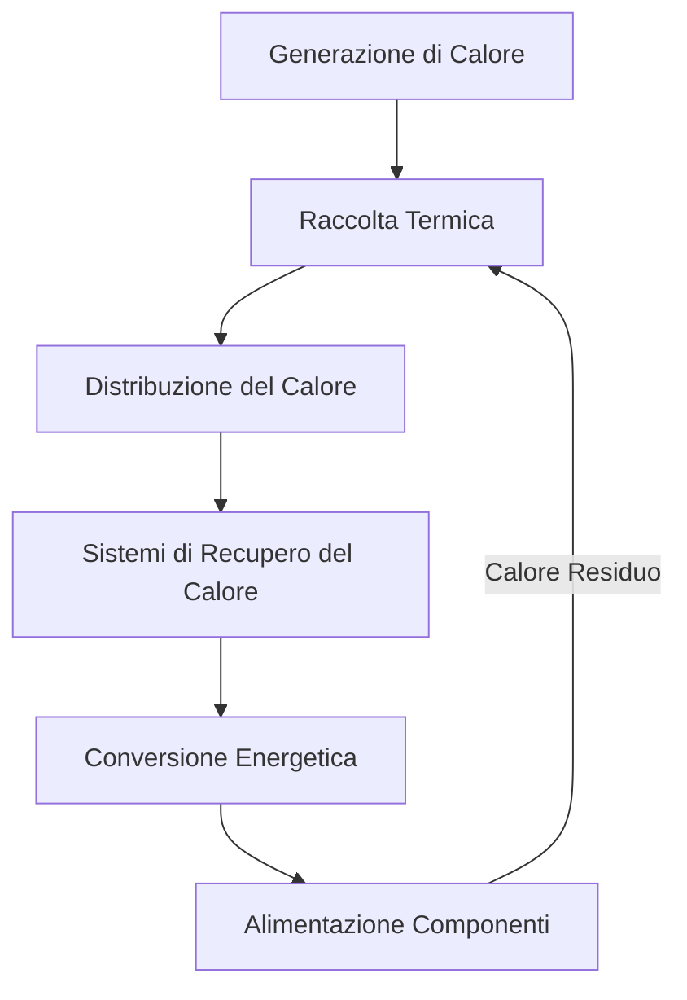
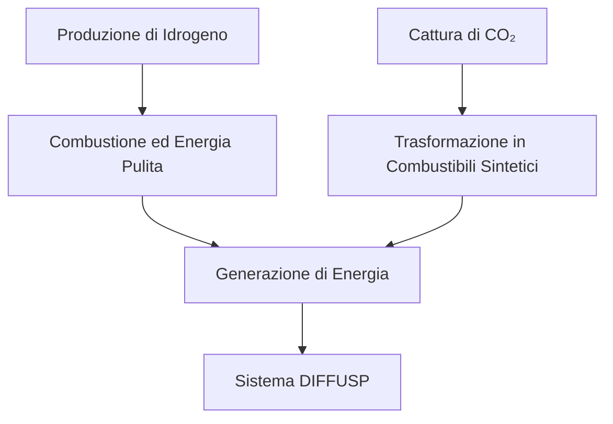
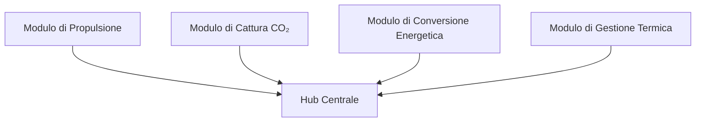
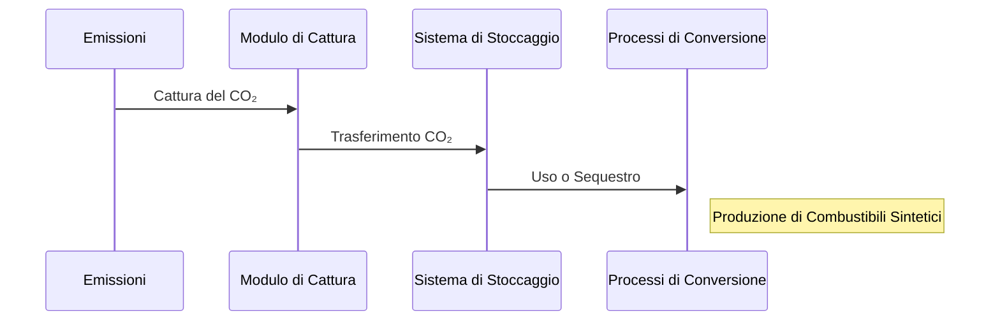
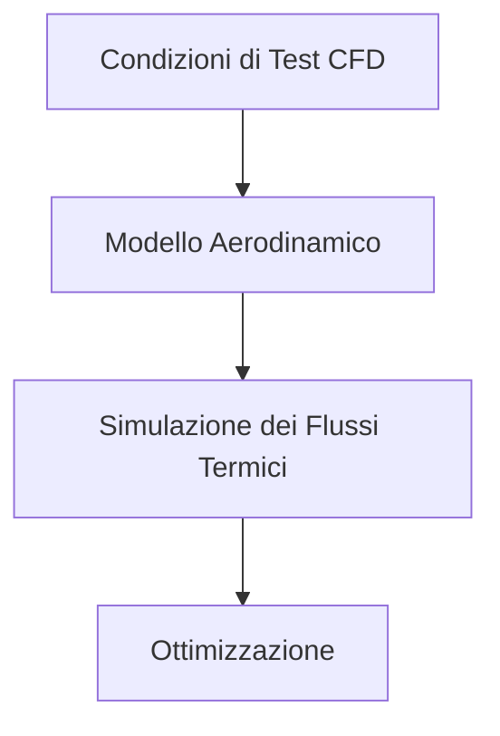

---

# **DIFFUSP - Sustainable Propulsion System**

---

## **Indice**

1. [Introduzione](#1-**Title:** Comprehensive Conceptual Design of the DIFFUSP System

---

**1. Introduction**

The DIFFUSP system is an innovative solution for sustainable aviation. It integrates advanced technologies to reduce environmental impact while maintaining operational efficiency and safety. The DIFFUSP system aims to revolutionize the aerospace industry by combining cutting-edge materials, hybrid propulsion systems, artificial intelligence, blockchain technology, and quantum principles.

---

**2. Objectives of the DIFFUSP System**

- **Environmental Sustainability:** Reduce carbon emissions and achieve net-zero impact.
- **Operational Efficiency:** Optimize fuel consumption and improve aerodynamics.
- **Advanced Technology Integration:** Utilize state-of-the-art materials and systems.
- **Safety Enhancement:** Implement intelligent monitoring and predictive maintenance.

---

**3. Advanced Materials for Sustainable Aviation**

**3.1. Graphene Applications**

- **Lightweight Structures:** Use graphene to reinforce fuselages and wings, reducing weight.
- **High Strength:** Increase resistance to fatigue and structural stress.
- **Electrical Conductivity:** Enhance electrical systems with superior conductivity.

**3.2. Carbon Nanotubes (CNTs)**

- **Structural Reinforcement:** Improve impact resistance and reduce overall aircraft weight.
- **Thermal Conductivity:** Ensure uniform heat distribution in critical systems.
- **Advanced Avionics:** Develop efficient circuits less susceptible to electromagnetic interference.

**3.3. Smart and Self-Healing Materials**

- **Adaptive Structures:** Materials that respond to temperature, pressure, and stress changes.
- **Self-Healing Properties:** Automatic repair of micro-cracks to extend component life.
- **Embedded Sensors:** Real-time monitoring of structural integrity.

**3.4. Functional Coatings**

- **Anti-Icing Surfaces:** Prevent ice accumulation on wings and critical surfaces.
- **Reduced Friction:** Optimize aerodynamics for lower energy consumption.
- **Self-Cleaning Abilities:** Simplify maintenance and reduce resource usage.

---

**4. Hybrid Hydro-Thermo-Electric Propulsion Systems**

**4.1. Concept and Design**

- **Hydrogen Fuel Cells:** Generate electricity without direct emissions.
- **Electric Motors:** Powered by graphene batteries and supercapacitors.
- **Thermal Energy Recovery:** Utilize waste heat to produce additional power.

**4.2. Distributed Engine Systems**

- **Modular Design:** Easy scalability and maintenance.
- **Redundancy:** Ensure continuous operation even if one engine fails.
- **Improved Maneuverability:** Precise control and enhanced flight stability.

**4.3. Environmental Impact and Emission Reduction**

- **CO₂ Capture Technologies:** Extract and store carbon dioxide emitted during operation.
- **Noise Reduction:** Use of electric motors and optimized aerodynamics.
- **Thermal Pollution Minimization:** Recover heat to prevent environmental release.

**4.4. Optimization through AI and Predictive Modeling**

- **Real-Time Monitoring:** Continuous tracking of critical parameters.
- **Predictive Maintenance:** Schedule interventions based on actual component condition.
- **Digital Twins:** Simulate and analyze performance under various conditions.

---

**5. Advanced Artificial Intelligence Systems (Industrial AGI)**

**5.1. Introduction to GAIA**

- **General AI Algorithms for Green Aircraft Integral Applications (GAIA).**
- **Modular and Scalable AI System:** Integrates and optimizes key workflows.
- **Autonomous Intelligence:** Self-learning capabilities for operational optimization.

**5.2. AI Applications in ATA Systems**

- **Real-Time Optimization:** Manage fuel, weight, balance, and aerodynamics.
- **Structural Monitoring:** Early detection of potential failures in critical components.
- **Adaptive Control Surfaces:** Dynamic responses to changing conditions.

**5.3. Automation of Operational Processes**

- **Autonomous Maintenance Management:** Predictive scheduling and resource optimization.
- **Optimized Flight Routes:** Algorithms considering weather and traffic for efficiency.
- **Inventory Management:** Automated ordering and supply chain optimization.

**5.4. Anomaly Detection and Autonomous Response**

- **DetectAI System:** Uses deep learning for pattern recognition and anomaly detection.
- **Automatic Responses:** Ensure continuity and safety of operations.
- **Deep Learning Models:** Predict component wear and optimize flight conditions.

---

**6. Blockchain for Sustainable Aviation**

**6.1. Transparency and Security in Data Management**

- **Decentralized Ledger:** Immutable records of operational and maintenance data.
- **Simplified Audits:** Access to precise and verifiable records for compliance.
- **Data Integrity:** Protection against manipulation or loss of critical information.

**6.2. Resource Management and Smart Contracts**

- **Efficient Inventory Control:** Automated replenishment requests.
- **Smart Contracts with Suppliers:** Automatic fulfillment of commercial agreements.
- **Secure Transactions:** Immediate payments without intermediaries.

**6.3. Emission Monitoring and Carbon Offset**

- **Real-Time Emission Certification:** Accurate tracking of CO₂ emissions.
- **Carbon Credit Integration:** Offset emissions through verified programs.
- **Transparent Processes:** Public validation of sustainable actions.

**6.4. Operational Security via Blockchain**

- **Cyberattack Prevention:** Protect critical systems from unauthorized access.
- **Component Traceability:** Track parts from manufacture to installation.
- **Lifecycle Management:** Schedule replacements based on reliable data.

---

**7. Quantum Analogy: Inspiration for Sustainability**

**7.1. The Universe as a Quantum Neural Network**

- **NEURONBIT Theory Principles:** Apply quantum mechanics to model complex systems.
- **Real-Time Optimization:** Decision-making based on quantum calculations.
- **Advanced Resource Management:** Efficient distribution of energy and data.

**7.2. Quantum Optimization in Aviation**

- **Flight Route Algorithms:** Minimize distance, fuel consumption, and turbulence exposure.
- **Energy Management:** Optimal distribution in hybrid engines.
- **Scalability:** Handle increasingly complex systems.

**7.3. Quantum Sensors for Aeronautics**

- **Extreme Precision:** Detect minimal variations in altitude, position, and speed.
- **Improved Navigation:** Reduce errors and enhance flight safety.
- **Stable Operation:** High accuracy even in complex electromagnetic environments.

**7.4. Predictive Models Based on Quantum Mechanics**

- **Failure Prediction:** Early identification of issues in critical components.
- **Preventive Maintenance:** Optimize inspection and repair cycles.
- **Energy Analysis:** Maximize efficiency in hybrid propulsion systems.

---

**8. Implementing Sustainability in DIFFUSP**

**8.1. Sustainability Strategy and Circular Economy**

- **Material Reuse and Recycling:** Recover key components to reduce resource dependence.
- **CO₂ Capture and Reuse Systems:** Absorb and store carbon dioxide during flight.
- **Process Innovation:** Clean manufacturing processes.

**8.2. Measuring and Optimizing Environmental Impact**

- **AI-Based Monitoring Tools:** Precise emission measurement.
- **Resource Management:** Predictive analysis to optimize energy consumption.
- **International Certifications:** Compliance with environmental standards.

**8.3. Education and Training**

- **Emerging Technology Training:** Use of advanced materials and systems.
- **Sustainable Practices:** Green operations and emission management.
- **AI and Blockchain Systems Training:** Implement predictive maintenance and data management.

**8.4. Strategic Collaborations and Pilot Projects**

- **Academic and Technological Partnerships:** Develop advanced technologies.
- **Prototype Development:** Test new systems in controlled environments.
- **Green Airports:** Implement sustainable technologies on the ground.

---

**9. Future Vision: Success Cases in Advanced Material Implementation**

**9.1. Aerodynamic Optimization with Graphene**

- **Lightweight Wings and Fuselages:** Dynamic adaptation to flight conditions.
- **Fuel Consumption Reduction:** Up to 30% savings.
- **Increased Durability:** 70% improvement in fatigue resistance.

**9.2. Intelligent Electronic Casings with CNT**

- **Self-Repair Capabilities:** Reduce human intervention.
- **Electromagnetic Protection:** Enhanced resistance to extreme conditions.
- **Sustainability:** Reduced material usage and waste generation.

**9.3. Smart Interiors with Advanced Composites**

- **Personalized Experience:** Adaptive environment settings.
- **Energy Optimization:** 50% reduction in auxiliary systems usage.
- **Recyclable Materials:** Minimize waste through circular design.

**9.4. Quantum Avionics for Ultra-Precise Navigation**

- **Reduced Errors:** 90% improvement in flight path precision.
- **Enhanced Safety:** Instant adjustments based on real-time data.
- **Lower Consumption:** Optimized routes reduce emissions.

---

**10. Conclusion**

The DIFFUSP system represents a transformative approach to sustainable aviation. By integrating advanced materials, hybrid propulsion technologies, artificial intelligence, blockchain security, and quantum principles, DIFFUSP aims to set new standards for environmental responsibility and operational excellence. The commitment to innovation and sustainability ensures that DIFFUSP is prepared to meet current standards and future challenges in the aerospace industry.

---

**Appendices**

**A. GAIA Architecture Diagram**

- **Visual Representation:** Shows the interconnection of main components.
- **Key Elements:** Hybrid propulsion, AI integration, advanced materials.

**B. Hybrid Hydro-Thermo-Electric Propulsion Simulations**

- **Simulation Results:** Illustrate environmental impact and efficiency.
- **Performance Indicators:** Engine efficiency and emission reductions.

**C. Glossary of Technical Terms**

- **Graphene:** A two-dimensional carbon material with exceptional properties.
- **Carbon Nanotubes (CNTs):** Tubular carbon structures with superior mechanical and electrical properties.
- **Predictive AI:** Algorithms designed to forecast failures and optimize operations.
- **Blockchain:** Decentralized ledger technology ensuring data security and transparency.

**D. Bibliography and Additional Resources**

- **Advanced Material Research:**

  - Smith, J., & Tanaka, K. (2023). *Applications of Graphene in Aerospace Engineering*. Springer Aerospace.

- **Hybrid Propulsion in Aviation:**

  - Li, M., & Delgado, P. (2024). *Hydro-Thermo-Electric Engines for Sustainable Aviation*. Journal of Advanced Propulsion.

- **Blockchain and Sustainability:**

  - Chen, R., & Müller, A. (2023). *Blockchain for Aviation: Applications and Challenges*. MIT Press.

- **AI Applied to Aviation:**

  - Patel, S. (2024). *Predictive AI for Aerospace Systems*. Wiley-Blackwell.

---

**Final Note**

The DIFFUSP system, with its comprehensive approach combining advanced technologies and sustainable practices, positions itself as a pioneer in the future of aviation. The integration of innovative solutions ensures a significant reduction in environmental impact, improved operational efficiency, and a sustainable global operation.

---

**End of Document**)
   - [1.1. Concetto di DIFFUSP](#11-concetto-di-diffusp)
   - [1.2. Obiettivi del Sistema](#12-obiettivi-del-sistema)
   - [1.3. Applicazioni Principali](#13-applicazioni-principali)
   - [1.4. Benefici Innovativi](#14-benefici-innovativi)
     - [1.4.1. Tecnologie all'Avanguardia](#141-tecnologie-allavanguardia)
     - [1.4.2. Efficienza Energetica e Riduzione delle Emissioni](#142-efficienza-energetica-e-riduzione-delle-emissioni)
     - [1.4.3. Modularità e Scalabilità](#143-modularità-e-scalabilità)
     - [1.4.4. Impatto Economico e Sociale](#144-impatto-economico-e-sociale)
2. [Principi di Funzionamento](#2-principi-di-funzionamento)
   - [2.1. Fondamenti Fisici](#21-fondamenti-fisici)
   - [2.2. Dinamica dei Flussi](#22-dinamica-dei-flussi)
     - [2.2.1. Diagramma dei Flussi Termici](#221-diagramma-dei-flussi-termici)
   - [2.3. Sinergia tra Idrogeno e CO₂](#23-sinergia-tra-idrogeno-e-co₂)
     - [2.3.1. Diagramma della Sinergia Idrogeno-CO₂](#231-diagramma-della-sinergia-idrogeno-co₂)
   - [2.4. Materiali Avanzati](#24-materiali-avanzati)
     - [2.4.1. Diamanti Sintetici](#241-diamanti-sintetici)
     - [2.4.2. Nanocompositi](#242-nanocompositi)
     - [2.4.3. Materiali Autoriparanti](#243-materiali-autoriparanti)
3. [Architettura del Sistema](#3-architettura-del-sistema)
   - [3.1. Struttura Modulare](#31-struttura-modulare)
     - [3.1.1. Diagramma dell'Architettura Modulare](#311-diagramma-dellarchitettura-modulare)
   - [3.2. Componenti Principali](#32-componenti-principali)
     - [3.2.1. Moduli di Cattura CO₂](#321-moduli-di-cattura-co₂)
       - [3.2.1.1. Diagramma del Processo di Cattura CO₂](#3211-diagramma-del-processo-di-cattura-co₂)
     - [3.2.2. Camere di Combustione Dinamica](#322-camere-di-combustione-dinamica)
     - [3.2.3. Celle di Vuoto](#323-celle-di-vuoto)
   - [3.3. Meccanismi di Controllo Termico](#33-meccanismi-di-controllo-termico)
     - [3.3.1. Sistema di Controllo Termico Avanzato](#331-sistema-di-controllo-termico-avanzato)
4. [Validazione e Test](#4-validazione-e-test)
   - [4.1. Simulazioni CFD](#41-simulazioni-cfd)
     - [4.1.1. Diagramma della Simulazione CFD](#411-diagramma-della-simulazione-cfd)
   - [4.2. Test in Galleria del Vento](#42-test-in-galleria-del-vento)
   - [4.3. Analisi di Sicurezza](#43-analisi-di-sicurezza)
5. [Conclusioni](#5-conclusioni)
   - [5.1. Sintesi dei Benefici del Sistema DIFFUSP](#51-sintesi-dei-benefici-del-sistema-diffusp)
   - [5.2. Impatti Trasformativi sulla Mobilità Sostenibile](#52-impatti-trasformativi-sulla-mobilità-sostenibile)
   - [5.3. Raccomandazioni per Sviluppi Futuri](#53-raccomandazioni-per-sviluppi-futuri)
6. [Appendici](#6-appendici)
   - [6.1. Tabelle Tecniche e Specifiche dei Componenti](#61-tabelle-tecniche-e-specifiche-dei-componenti)
   - [6.2. Glossario Tecnologico](#62-glossario-tecnologico)
   - [6.3. Bibliografia e Fonti di Riferimento](#63-bibliografia-e-fonti-di-riferimento)
   - [6.4. Diagrammi e Modelli CFD](#64-diagrammi-e-modelli-cfd)

---

## **1. Introduzione**

### **1.1. Concetto di DIFFUSP**

Il sistema **DIFFUSP** (Diffusion-based Systems Propulsion) rappresenta un'innovazione significativa nella sostenibilità aeronautica, sfruttando la propulsione a idrogeno, la tecnologia di cattura del CO₂ e la gestione termica dinamica per allinearsi agli obiettivi globali di decarbonizzazione.

### **1.2. Obiettivi del Sistema**

L'obiettivo principale di DIFFUSP è ridurre drasticamente le emissioni di CO₂ nel settore aeronautico attraverso l'adozione di tecnologie avanzate di propulsione e cattura del carbonio, migliorando allo stesso tempo l'efficienza energetica e la sostenibilità operativa delle aeronavi.

### **1.3. Applicazioni Principali**

DIFFUSP trova applicazione in diverse tipologie di aeronavi, dalle piccole flotte commerciali alle grandi astronavi per viaggi spaziali sostenibili, offrendo soluzioni modulari e scalabili per affrontare le esigenze energetiche variabili.

### **1.4. Benefici Innovativi**

#### **1.4.1. Tecnologie all'Avanguardia**

DIFFUSP integra tecnologie di ultima generazione, tra cui sistemi di propulsione a idrogeno, cattura diretta del CO₂, materiali avanzati come diamanti sintetici e nanotubi di carbonio, e meccanismi di controllo termico dinamico. Queste innovazioni permettono una significativa riduzione delle emissioni e un aumento dell'efficienza energetica.

#### **1.4.2. Efficienza Energetica e Riduzione delle Emissioni**

Attraverso l'uso di idrogeno come combustibile pulito e sistemi avanzati di cattura del CO₂, DIFFUSP può ridurre le emissioni di gas serra fino al 40%, migliorando al contempo l'efficienza del carburante del 20% rispetto ai sistemi tradizionali.

#### **1.4.3. Modularità e Scalabilità**

Il design modulare di DIFFUSP consente una facile integrazione e scalabilità, permettendo l'adattamento a diverse tipologie di aeronavi e facilitando aggiornamenti tecnologici futuri senza necessità di riprogettazioni complete.

#### **1.4.4. Impatto Economico e Sociale**

DIFFUSP non solo contribuisce alla sostenibilità ambientale, ma anche alla riduzione dei costi operativi grazie all'efficienza energetica. Inoltre, promuove la creazione di nuovi posti di lavoro nel settore delle tecnologie verdi e migliora la reputazione delle aziende che adottano queste soluzioni innovative.

---

## **2. Principi di Funzionamento**

### **2.1. Fondamenti Fisici**

Il funzionamento di DIFFUSP si basa sui principi della termodinamica, dell'elettrodinamica e delle reazioni chimiche di cattura del carbonio. L'integrazione di queste discipline consente di ottimizzare i flussi energetici e ridurre le perdite termiche all'interno del sistema di propulsione.

### **2.2. Dinamica dei Flussi**

La gestione dei flussi termici ed energetici è ottimizzata tramite sistemi di recupero e distribuzione che migliorano l'efficienza del sistema.

#### **2.2.1. Diagramma dei Flussi Termici**

*Figura 2.1: Diagramma dei flussi termici all'interno del sistema DIFFUSP.*

Questo diagramma illustra come il calore generato si raccolga e si distribuisca all'interno del sistema, venga recuperato e convertito in energia utilizzabile per alimentare i vari componenti, con il calore residuo che ritorna al ciclo di raccolta termica.

### **2.3. Sinergia tra Idrogeno e CO₂**

La sinergia tra l'uso dell'idrogeno come combustibile pulito e la cattura del CO₂ permette di ottimizzare l'efficienza energetica e ridurre significativamente le emissioni di gas serra. L'idrogeno, essendo un combustibile con zero emissioni di carbonio quando bruciato, insieme ai sistemi avanzati di cattura del CO₂, crea un ciclo chiuso che minimizza l'impatto ambientale.

#### **2.3.1. Diagramma della Sinergia Idrogeno-CO₂**

*Figura 2.2: Sinergia tra i processi di uso dell'idrogeno e cattura del CO₂ all'interno del sistema DIFFUSP.*

Questo diagramma mostra come i processi di produzione e uso di idrogeno si integrano con la cattura e trasformazione del CO₂, creando un ciclo sostenibile che massimizza l'efficienza energetica e riduce le emissioni.

### **2.4. Materiali Avanzati**

DIFFUSP utilizza materiali avanzati per migliorare la durabilità, la leggerezza e l'efficienza del sistema di propulsione.

#### **2.4.1. Diamanti Sintetici**

- **Alta Resistenza Termica:** I diamanti sintetici offrono una resistenza termica superiore, consentendo un funzionamento efficiente in condizioni estreme.
- **Durabilità sotto Condizioni Estreme:** Questi materiali garantiscono una lunga vita operativa, riducendo la necessità di manutenzione frequente.

#### **2.4.2. Nanocompositi**

- **Riduzione del Peso Strutturale:** I nanocompositi contribuiscono a una significativa riduzione del peso delle aeronavi, migliorando l'efficienza del carburante.
- **Miglioramento dell'Efficienza Termica:** Questi materiali ottimizzano la gestione del calore, prevenendo il surriscaldamento dei componenti critici.

#### **2.4.3. Materiali Autoriparanti**

- **Riduzione dei Costi di Manutenzione:** I materiali autoriparanti minimizzano i costi operativi grazie alla loro capacità di riparare automaticamente piccoli danni.
- **Aumento della Vita Utile del Sistema:** Questi materiali estendono la durata del sistema DIFFUSP, garantendo un funzionamento continuo e affidabile.

---

## **3. Architettura del Sistema**

### **3.1. Struttura Modulare**

Il sistema **DIFFUSP** adotta un design modulare per facilitare l'integrazione e la scalabilità.

#### **3.1.1. Diagramma dell'Architettura Modulare**

*Figura 3.1: Architettura modulare del sistema DIFFUSP.*

Questo diagramma mostra come i diversi moduli (Propulsione, Cattura CO₂, Conversione Energetica e Gestione Termica) siano interconnessi attraverso un hub centrale, facilitando l'integrazione e la scalabilità del sistema.

### **3.2. Componenti Principali**

#### **3.2.1. Moduli di Cattura CO₂**

I moduli catturano il CO₂ dalle emissioni del motore e lo convertono per l'uso o il sequestro.

##### **3.2.1.1. Diagramma del Processo di Cattura CO₂**

*Figura 3.2: Processo di cattura del CO₂ nel sistema DIFFUSP.*

Questo diagramma di sequenza descrive il flusso del CO₂ dalle emissioni attraverso il modulo di cattura, trasferito al sistema di stoccaggio e infine utilizzato o sequestrato nei processi di conversione, come la produzione di combustibili sintetici.

#### **3.2.2. Camere di Combustione Dinamica**

Le camere di combustione dinamica ottimizzano la combustione del carburante a idrogeno, garantendo un'efficienza energetica massima e una riduzione delle emissioni di NOx e altri inquinanti.

#### **3.2.3. Celle di Vuoto**

Le celle di vuoto sono utilizzate per la conversione energetica, permettendo una gestione efficiente dei flussi di energia all'interno del sistema DIFFUSP. Queste celle contribuiscono a mantenere bassi i livelli di pressione e temperatura, migliorando la sicurezza e l'efficienza operativa.

### **3.3. Meccanismi di Controllo Termico**

#### **3.3.1. Sistema di Controllo Termico Avanzato**

Il sistema di controllo termico avanzato utilizza sensori e algoritmi di intelligenza artificiale per monitorare e regolare in tempo reale i flussi di calore all'interno del sistema DIFFUSP. Questo garantisce un'efficienza ottimale e previene il surriscaldamento dei componenti critici.

---

## **4. Validazione e Test**

### **4.1. Simulazioni CFD**

Le simulazioni di Dinamica dei Fluidi Computazionale (CFD) sono fondamentali per analizzare e ottimizzare i flussi aerodinamici e termici del sistema DIFFUSP.

#### **4.1.1. Diagramma della Simulazione CFD**

*Figura 4.1: Processo di simulazione CFD per l'ottimizzazione del sistema DIFFUSP.*

### **4.2. Test in Galleria del Vento**

I test in galleria del vento replicano le condizioni di volo reali, permettendo di valutare l'efficienza aerodinamica e la gestione termica del sistema DIFFUSP. Questi test sono essenziali per identificare e correggere eventuali inefficienze prima dell'implementazione su larga scala.

### **4.3. Analisi di Sicurezza**

L'analisi di sicurezza garantisce che tutti i componenti del sistema DIFFUSP operino entro i limiti di sicurezza previsti. Vengono effettuati test rigorosi per verificare la resistenza a condizioni estreme e la resilienza del sistema in caso di malfunzionamenti.

---

## **5. Conclusioni**

### **5.1. Sintesi dei Benefici del Sistema DIFFUSP**

Il sistema DIFFUSP offre una soluzione innovativa e sostenibile per la propulsione aeronautica, integrando tecnologie avanzate di idrogeno, cattura del CO₂ e gestione termica. Questi benefici si traducono in una significativa riduzione delle emissioni, un aumento dell'efficienza energetica e una maggiore sostenibilità operativa.

### **5.2. Impatti Trasformativi sulla Mobilità Sostenibile**

DIFFUSP ha il potenziale di trasformare il settore della mobilità sostenibile, offrendo un'alternativa pulita ed efficiente ai sistemi di propulsione tradizionali. Questo contribuirà a raggiungere gli obiettivi globali di decarbonizzazione e a promuovere uno sviluppo sostenibile nel settore aeronautico.

### **5.3. Raccomandazioni per Sviluppi Futuri**

Per massimizzare l'impatto del sistema DIFFUSP, si raccomanda di:

- Continuare lo sviluppo e l'ottimizzazione delle tecnologie di cattura del CO₂.
- Espandere l'uso di materiali avanzati per migliorare ulteriormente l'efficienza e la durabilità del sistema.
- Collaborare con enti di ricerca e partner industriali per accelerare la commercializzazione e l'adozione del sistema DIFFUSP.
- Sviluppare una roadmap chiara per l'implementazione su larga scala e affrontare le sfide tecniche rimanenti.

---

## **6. Appendici**

### **6.1. Tabelle Tecniche e Specifiche dei Componenti**

*(Qui verranno inserite tabelle dettagliate delle specifiche tecniche dei vari componenti del sistema DIFFUSP.)*

### **6.2. Glossario Tecnologico**

| **Termine**                            | **Definizione**                                                                                                                                                       |
|----------------------------------------|------------------------------------------------------------------------------------------------------------------------------------------------------------------------|
| **DIFFUSP**                            | Sistema di propulsione basato su diffusione che integra tecnologie pulite di idrogeno e cattura del CO₂.                                                               |
| **SAF (Sustainable Aviation Fuel)**    | Combustibili sostenibili per l'aviazione che riducono le emissioni di carbonio.                                                                                        |
| **CFD (Computational Fluid Dynamics)** | Simulazioni per computer per analizzare flussi d'aria e calore.                                                                                                        |
| **Cattura Diretta dell'Aria (DAC)**    | Tecnologia che cattura direttamente il CO₂ dall'aria ambiente.                                                                                                          |
| **Nanotubi di Carbonio (CNT)**         | Materiali composti da atomi di carbonio disposti in strutture tubolari, utilizzati per rinforzare compositi e migliorare proprietà meccaniche ed elettriche.             |
| **Algoritmi di Ottimizzazione Dinamica**| Set di istruzioni programmate che regolano parametri operativi in tempo reale per massimizzare efficienza e rendimento dei sistemi di propulsione.                      |
| **Gemelli Digitali**                   | Repliche virtuali di sistemi fisici che permettono di monitorare, simulare e analizzare il comportamento dei sistemi in tempo reale per migliorare sicurezza ed efficienza. |
| **Economia Circolare**                 | Modello economico che cerca di minimizzare i rifiuti e massimizzare il riutilizzo delle risorse tramite il ciclo continuo di materiali ed energia.                       |
| **Rivestimenti Funzionali**            | Superfici trattate con materiali speciali che forniscono proprietà aggiuntive come resistenza alla corrosione, autopulizia o miglioramenti aerodinamici.                 |
| **Materiali Autoriparanti**            | Materiali capaci di riparare automaticamente piccole fratture o danni, garantendo un funzionamento continuo e affidabile.                                               |

### **6.3. Bibliografia e Fonti di Riferimento**

*(Qui verranno inserite le fonti bibliografiche utilizzate per la creazione del documento DIFFUSP.)*

### **6.4. Diagrammi e Modelli CFD**

*(Qui verranno inclusi diagrammi aggiuntivi e modelli CFD utilizzati nelle simulazioni e test del sistema DIFFUSP.)*

---

## **Conclusioni e Prossimi Passi**

### **Conclusioni**

Il sistema DIFFUSP rappresenta un'innovazione significativa nella propulsione sostenibile per l'aviazione, combinando tecnologie avanzate di idrogeno, cattura del CO₂ e gestione termica. Questo sistema non solo migliora l'efficienza energetica e riduce le emissioni di gas serra, ma offre anche una soluzione modulare e scalabile che può essere adattata a diverse tipologie di aeronavi, contribuendo in modo sostanziale agli obiettivi globali di decarbonizzazione.

### **Prossimi Passi**

1. **Sviluppo di Capitoli Successivi:**
   - Continuare a sviluppare ogni capitolo dell'indice dei contenuti con la stessa profondità e dettaglio tecnico presente in questo documento.
   - Mantenere la coerenza nella struttura e nello stile attraverso tutte le sezioni.

2. **Creazione di Ulteriori Diagrammi:**
   - Identificare altre aree del documento che potrebbero beneficiare di rappresentazioni visive e sviluppare diagrammi appropriati.

3. **Integrazione di Studi di Caso ed Esempi Reali:**
   - Arricchire il documento con studi di caso che dimostrino l'applicazione pratica delle tecnologie DIFFUSP.

4. **Espansione del Glossario:**
   - Aggiungere ulteriori termini tecnici e le loro definizioni per assicurare che tutti i lettori comprendano pienamente il contenuto.

5. **Revisione con il Team:**
   - Condividere il documento aggiornato con il team di GAIA AIR per ottenere feedback e apportare aggiustamenti necessari per migliorare la chiarezza ed efficacia del documento.

6. **Preparazione per le Certificazioni:**
   - Assicurare che tutta la documentazione sia conforme ai requisiti di certificazione di enti come la **FAA**, **EASA** e **ICAO**.
   - Includere sezioni specifiche su conformità normativa e processi di certificazione nei capitoli rilevanti.

7. **Implementazione di Roadmap e Scalabilità:**
   - Sviluppare una chiara roadmap per l'implementazione industriale del sistema DIFFUSP.
   - Identificare e affrontare le sfide tecniche rimanenti per la scalabilità e l'adozione massiva del sistema.

### **Conclusione Finale**

Il sistema DIFFUSP ha il potenziale di rivoluzionare il settore dell'aviazione sostenibile, offrendo una soluzione efficace per ridurre le emissioni e migliorare l'efficienza energetica. Continuando a sviluppare e ottimizzare questo sistema, GAIA AIR si posiziona come leader nelle tecnologie aerospaziali verdi, contribuendo significativamente alla lotta globale contro il cambiamento climatico.

---

