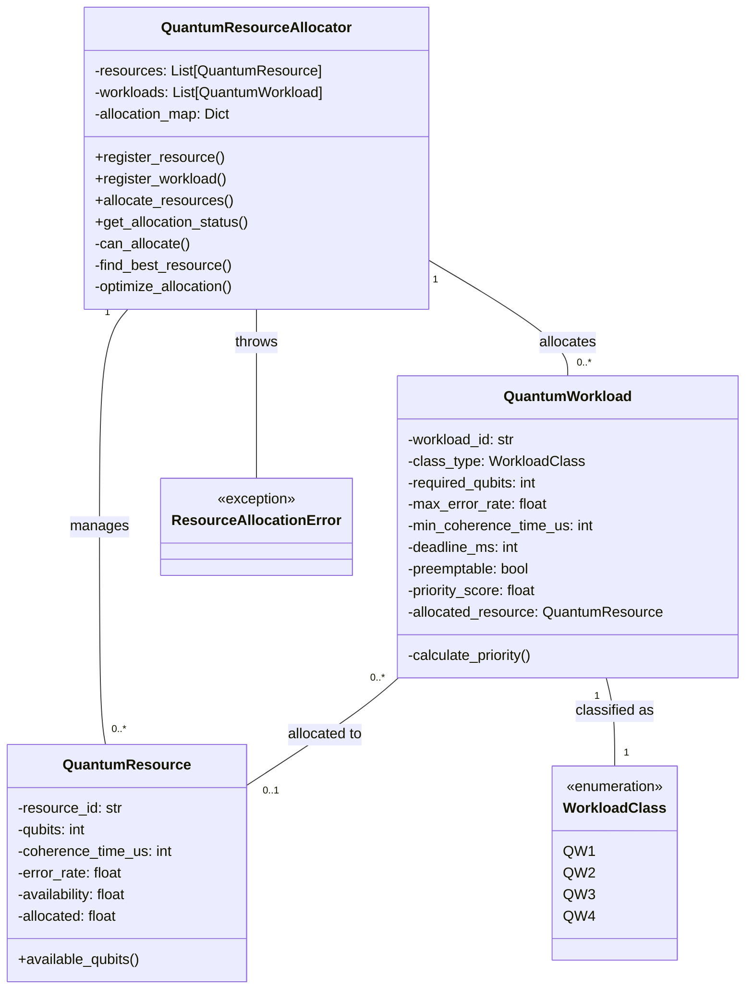
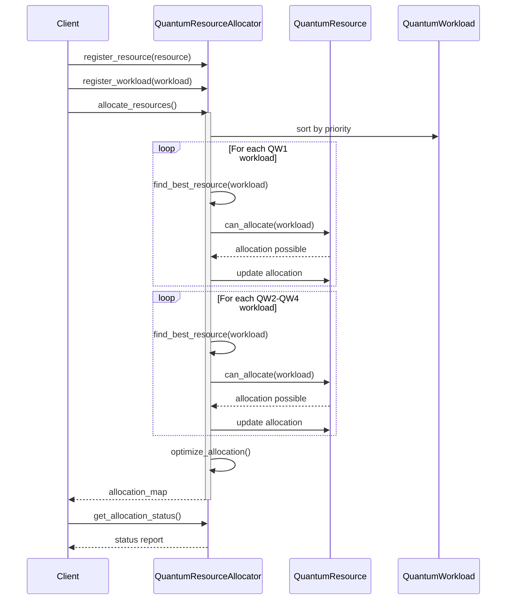
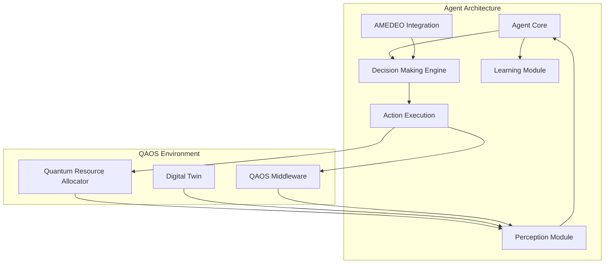
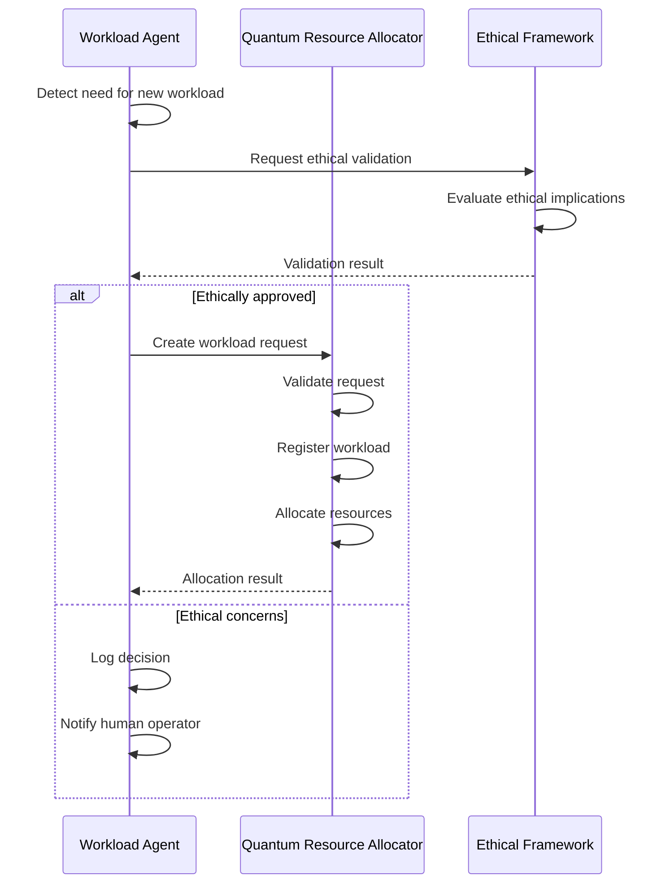

### AMPEL360-BWB-Q100 QAOS Module Documentation

## GenAI Proposal Status Disclaimer

*This document is generated by AI and represents a conceptual specification for the AMPEL360-BWB-Q100 Quantum Aerospace Operating System documentation. It should be reviewed by aerospace engineers, quantum computing specialists, and avionics experts before implementation.*

## Technical Documentation: Quantum Resource Allocator

### 1. Module Overview

# QAOS Quantum Resource Allocator
## Module Specification Document

| Document Information | Details |
|---------------------|---------|
| **Document ID**     | AMPEL360-BWB-Q100-QAOS-SRS-001 |
| **Version**         | 0.9.5 |
| **Status**          | Pre-certification |
| **Classification**  | Internal - Engineering |
| **Author**          | Robbbo-T / GAIA-AIR Team |
| **Approval Date**   | Pending |
| **Review Cycle**    | 3 months |

## 1. Introduction

### 1.1 Purpose
This document specifies the requirements, architecture, and interfaces for the Quantum Resource Allocator (QRA) component of the Quantum Aerospace Operating System (QAOS) for the AMPEL360-BWB-Q100 aircraft.

### 1.2 Scope
The QRA is responsible for efficiently allocating quantum computing resources across all aircraft systems based on workload classification, criticality, and resource availability. This document covers the functional and performance requirements, software architecture, interfaces, and certification considerations.

### 1.3 System Context
The QRA operates within the Middleware Layer of the QAOS architecture, interfacing with:
- Quantum Processing Units (QPUs)
- Flight Control Systems
- Energy Distribution Systems
- Navigation Systems
- Environmental Control Systems
- Maintenance Systems

### 1.4 References
- DO-178C Level A Software Considerations in Airborne Systems
- AMPEL360-BWB-Q100 System Requirements Specification
- QAOS Architecture Document (AMPEL360-SYS-ARCH-002)
- Quantum Computing for Aerospace Applications (QCAA-STD-2025)


### 2. Functional Requirements

## 2. Functional Requirements

### 2.1 Workload Classification
| Requirement ID | Description | Priority | Verification Method |
|----------------|-------------|----------|---------------------|
| QRA-FR-001 | The system shall classify quantum workloads into four categories: QW1 (Critical), QW2 (Essential), QW3 (Standard), and QW4 (Background). | High | Inspection |
| QRA-FR-002 | The system shall assign priority scores to workloads based on classification and deadline. | High | Test |
| QRA-FR-003 | The system shall prioritize QW1 workloads above all others. | Critical | Test |
| QRA-FR-004 | The system shall support preemptable workloads that can be interrupted. | Medium | Test |

### 2.2 Resource Management
| Requirement ID | Description | Priority | Verification Method |
|----------------|-------------|----------|---------------------|
| QRA-FR-005 | The system shall maintain a registry of available quantum resources. | High | Inspection |
| QRA-FR-006 | The system shall track resource attributes including qubits, coherence time, and error rate. | High | Test |
| QRA-FR-007 | The system shall track resource allocation status in real-time. | High | Test |
| QRA-FR-008 | The system shall support dynamic addition and removal of quantum resources. | Medium | Test |

### 2.3 Allocation Algorithm
| Requirement ID | Description | Priority | Verification Method |
|----------------|-------------|----------|---------------------|
| QRA-FR-009 | The system shall allocate resources in order of workload priority. | Critical | Test |
| QRA-FR-010 | The system shall match workload requirements with resource capabilities. | High | Test |
| QRA-FR-011 | The system shall optimize resource utilization after initial allocation. | Medium | Analysis |
| QRA-FR-012 | The system shall reallocate resources when workload priorities change. | Medium | Test |

### 2.4 Error Handling
| Requirement ID | Description | Priority | Verification Method |
|----------------|-------------|----------|---------------------|
| QRA-FR-013 | The system shall raise an exception when critical workloads cannot be allocated. | Critical | Test |
| QRA-FR-014 | The system shall log all allocation decisions with appropriate severity levels. | High | Inspection |
| QRA-FR-015 | The system shall provide detailed allocation status reports. | Medium | Inspection |


### 3. Performance Requirements

## 3. Performance Requirements

### 3.1 Timing Requirements
| Requirement ID | Description | Target Value | Verification Method |
|----------------|-------------|--------------|---------------------|
| QRA-PR-001 | The system shall complete allocation of all QW1 workloads within 10ms. | 10ms | Test |
| QRA-PR-002 | The system shall complete a full allocation cycle within 50ms. | 50ms | Test |
| QRA-PR-003 | The system shall respond to priority changes within 5ms. | 5ms | Test |

### 3.2 Resource Utilization
| Requirement ID | Description | Target Value | Verification Method |
|----------------|-------------|--------------|---------------------|
| QRA-PR-004 | The system shall achieve at least 85% utilization of quantum resources under normal load. | 85% | Analysis |
| QRA-PR-005 | The system shall maintain a memory footprint below 50MB. | 50MB | Test |
| QRA-PR-006 | The system shall use less than 5% of CPU resources during normal operation. | 5% | Test |

### 3.3 Scalability
| Requirement ID | Description | Target Value | Verification Method |
|----------------|-------------|--------------|---------------------|
| QRA-PR-007 | The system shall support up to 20 quantum resources. | 20 resources | Test |
| QRA-PR-008 | The system shall support up to 100 concurrent workloads. | 100 workloads | Test |
| QRA-PR-009 | The system shall maintain performance with maximum resource and workload counts. | Within 2x baseline | Test |


### 4. Software Architecture


## 4. Software Architecture

### 4.1 Component Diagram



### 4.2 Class Descriptions

#### 4.2.1 QuantumResourceAllocator

The main component responsible for managing quantum resources and workloads, and allocating resources based on workload priorities.

**Key Methods:**

- `register_resource()`: Adds a quantum resource to the allocation pool
- `register_workload()`: Adds a quantum workload to be allocated
- `allocate_resources()`: Performs the allocation algorithm
- `get_allocation_status()`: Returns current allocation statistics


#### 4.2.2 QuantumResource

Represents a quantum computing resource with specific capabilities.

**Key Attributes:**

- `resource_id`: Unique identifier
- `qubits`: Number of logical qubits
- `coherence_time_us`: Coherence time in microseconds
- `error_rate`: Error rate of the quantum processor
- `allocated`: Percentage of resource currently allocated


#### 4.2.3 QuantumWorkload

Represents a quantum computing task with specific requirements.

**Key Attributes:**

- `workload_id`: Unique identifier
- `class_type`: Criticality classification (QW1-QW4)
- `required_qubits`: Minimum qubits needed
- `deadline_ms`: Time constraint for completion
- `priority_score`: Calculated priority value


#### 4.2.4 WorkloadClass

Enumeration of workload criticality levels.

#### 4.2.5 ResourceAllocationError

Exception raised when critical resource allocation fails.

### 4.3 Sequence Diagrams

#### 4.3.1 Resource Allocation Sequence




### 5. Interface Specifications


## 5. Interface Specifications

### 5.1 External Interfaces

#### 5.1.1 QAOS Middleware Interface
| Interface ID | Description | Direction | Data Format |
|--------------|-------------|-----------|-------------|
| QRA-IF-001 | Resource registration interface | Input | QuantumResource object |
| QRA-IF-002 | Workload registration interface | Input | QuantumWorkload object |
| QRA-IF-003 | Allocation result interface | Output | Dictionary mapping workload IDs to resource IDs |
| QRA-IF-004 | Status reporting interface | Output | Dictionary with allocation statistics |

#### 5.1.2 Logging Interface
| Interface ID | Description | Direction | Data Format |
|--------------|-------------|-----------|-------------|
| QRA-IF-005 | System logging interface | Output | Log messages with severity levels |

### 5.2 Internal Interfaces

#### 5.2.1 Resource Management Interface
| Method | Parameters | Return Value | Description |
|--------|------------|--------------|-------------|
| register_resource | resource: QuantumResource | None | Adds a resource to the allocation pool |
| can_allocate | workload: QuantumWorkload, resource: QuantumResource | bool | Checks if a resource can satisfy a workload |
| find_best_resource | workload: QuantumWorkload | QuantumResource or None | Finds the most suitable resource for a workload |

#### 5.2.2 Workload Management Interface
| Method | Parameters | Return Value | Description |
|--------|------------|--------------|-------------|
| register_workload | workload: QuantumWorkload | None | Adds a workload to be allocated |
| _calculate_priority | None | float | Calculates workload priority score |

#### 5.2.3 Allocation Interface
| Method | Parameters | Return Value | Description |
|--------|------------|--------------|-------------|
| allocate_resources | None | Dict[str, str] | Performs resource allocation |
| _optimize_allocation | None | None | Optimizes resource utilization |
| get_allocation_status | None | Dict | Returns allocation statistics |


### 6. Testing and Verification


## 6. Testing and Verification

### 6.1 Test Strategy
The QRA module will be tested using a combination of unit tests, integration tests, and system tests. Testing will focus on verifying functional requirements, performance requirements, and error handling capabilities.

### 6.2 Unit Tests
| Test ID | Description | Requirements Covered | Test Method |
|---------|-------------|----------------------|-------------|
| QRA-UT-001 | Test workload priority calculation | QRA-FR-002 | Automated |
| QRA-UT-002 | Test resource availability calculation | QRA-FR-006, QRA-FR-007 | Automated |
| QRA-UT-003 | Test resource-workload compatibility check | QRA-FR-010 | Automated |
| QRA-UT-004 | Test best resource selection algorithm | QRA-FR-010, QRA-FR-011 | Automated |
| QRA-UT-005 | Test allocation map generation | QRA-FR-009 | Automated |

### 6.3 Integration Tests
| Test ID | Description | Requirements Covered | Test Method |
|---------|-------------|----------------------|-------------|
| QRA-IT-001 | Test resource registration and tracking | QRA-FR-005, QRA-FR-006 | Automated |
| QRA-IT-002 | Test workload registration and prioritization | QRA-FR-001, QRA-FR-002 | Automated |
| QRA-IT-003 | Test full allocation cycle | QRA-FR-009, QRA-FR-010, QRA-FR-011 | Automated |
| QRA-IT-004 | Test error handling for resource shortages | QRA-FR-013 | Automated |
| QRA-IT-005 | Test logging functionality | QRA-FR-014, QRA-FR-015 | Automated |

### 6.4 Performance Tests
| Test ID | Description | Requirements Covered | Test Method |
|---------|-------------|----------------------|-------------|
| QRA-PT-001 | Measure allocation time for QW1 workloads | QRA-PR-001 | Automated |
| QRA-PT-002 | Measure full allocation cycle time | QRA-PR-002 | Automated |
| QRA-PT-003 | Measure response time to priority changes | QRA-PR-003 | Automated |
| QRA-PT-004 | Measure resource utilization efficiency | QRA-PR-004 | Automated |
| QRA-PT-005 | Measure memory usage | QRA-PR-005 | Automated |
| QRA-PT-006 | Measure CPU usage | QRA-PR-006 | Automated |
| QRA-PT-007 | Test scalability with maximum resources | QRA-PR-007, QRA-PR-009 | Automated |
| QRA-PT-008 | Test scalability with maximum workloads | QRA-PR-008, QRA-PR-009 | Automated |

### 6.5 Test Environment
Tests will be conducted in the following environments:
1. Development environment (unit tests)
2. Integration test environment (integration tests)
3. Hardware-in-the-loop simulator (performance tests)
4. Aircraft systems integration lab (system tests)

### 6.6 Test Data
Test data will include:
1. Predefined sets of quantum resources with varying capabilities
2. Predefined sets of workloads with varying requirements and priorities
3. Edge case scenarios (resource shortages, conflicting requirements)
4. Stress test scenarios (maximum load, rapid priority changes)


### 7. Certification Considerations

## 7. Certification Considerations

### 7.1 DO-178C Compliance
The QRA module is classified as Level A software according to DO-178C, as it directly affects critical flight functions. The following aspects are addressed to ensure compliance:

#### 7.1.1 Requirements Traceability
All requirements are uniquely identified and traceable to test cases and code implementation.

#### 7.1.2 Structural Coverage
The code will be tested to achieve 100% Modified Condition/Decision Coverage (MC/DC) as required for Level A software.

#### 7.1.3 Deterministic Execution
The allocation algorithm is designed to be deterministic, with predictable execution times and resource usage.

#### 7.1.4 Error Handling
Comprehensive error detection and handling mechanisms are implemented to ensure safe operation under all conditions.

### 7.2 Safety Analysis

#### 7.2.1 Failure Modes and Effects Analysis (FMEA)
| Failure Mode | Effect | Severity | Mitigation |
|--------------|--------|----------|------------|
| Unable to allocate QW1 workload | Critical function unavailable | Catastrophic | Exception raised, fallback to classical processing |
| Incorrect resource allocation | Suboptimal performance | Major | Validation checks, monitoring |
| Resource overallocation | System instability | Major | Resource usage limits, monitoring |
| Algorithm timeout | Delayed allocation | Minor | Timeout handling, partial allocation |

#### 7.2.2 Fault Tree Analysis
A fault tree analysis has been conducted to identify combinations of events that could lead to system failure.

### 7.3 Verification and Validation

#### 7.3.1 Verification Methods
- Requirements review
- Design review
- Code review
- Unit testing
- Integration testing
- System testing
- Formal methods for critical algorithms

#### 7.3.2 Validation Methods
- Hardware-in-the-loop testing
- Aircraft systems integration lab testing
- Flight test validation

### 7.4 Configuration Management
All software artifacts are under configuration management control, including:
- Requirements documents
- Design documents
- Source code
- Test cases and results
- Build scripts and configuration files


### 8. YAML Configuration


## 8. YAML Configuration

The QRA module can be configured using YAML configuration files. Below is the reference configuration:

```yaml
# QAOS Quantum Resource Allocator Configuration
qaos:
  resource_allocator:
    version: "0.9.5"
    logging:
      level: "INFO"
      file: "/var/log/qaos/resource_allocator.log"
      format: "%(asctime)s - %(name)s - %(levelname)s - %(message)s"
    
    performance:
      allocation_timeout_ms: 50
      optimization_enabled: true
      optimization_strategy: "best_fit"
      
    resources:
      - id: "QPU-1"
        qubits: 32
        coherence_time_us: 100
        error_rate: 0.001
        availability: 1.0
        
      - id: "QPU-2"
        qubits: 24
        coherence_time_us: 150
        error_rate: 0.0008
        availability: 1.0
        
      - id: "QPU-3"
        qubits: 16
        coherence_time_us: 200
        error_rate: 0.0005
        availability: 1.0
    
    workload_classes:
      QW1:
        description: "Critical: Real-time safety-critical functions"
        base_priority: 1000
        max_allocation_time_ms: 10
        
      QW2:
        description: "Essential: Core aircraft operations"
        base_priority: 100
        max_allocation_time_ms: 20
        
      QW3:
        description: "Standard: Regular operational functions"
        base_priority: 10
        max_allocation_time_ms: 30
        
      QW4:
        description: "Background: Non-time-critical functions"
        base_priority: 1
        max_allocation_time_ms: 50
    
    error_handling:
      critical_shortage_action: "raise_exception"
      non_critical_shortage_action: "log_warning"
      
    monitoring:
      status_update_interval_ms: 1000
      metrics_enabled: true
      alert_thresholds:
        high_utilization: 90
        low_utilization: 20
```


### 9. Usage Examples


## 9. Usage Examples

### 9.1 Basic Usage

```python
# Initialize the allocator
allocator = QuantumResourceAllocator()

# Register quantum resources
allocator.register_resource(QuantumResource(
    "QPU-1", 
    qubits=32, 
    coherence_time_us=100, 
    error_rate=0.001
))

# Register quantum workloads
allocator.register_workload(QuantumWorkload(
    "flight-control-optimization", 
    WorkloadClass.QW1, 
    required_qubits=8,
    max_error_rate=0.001,
    min_coherence_time_us=100,
    deadline_ms=10
))

# Perform allocation
try:
    allocation = allocator.allocate_resources()
    print(f"Allocation successful: {allocation}")
    
    # Get allocation status
    status = allocator.get_allocation_status()
    print(f"Resource utilization: {status['resource_utilization']}")
    
except ResourceAllocationError as e:
    print(f"Allocation failed: {e}")
```

### 9.2 Dynamic Workload Management

```python
# Initialize with existing resources
allocator = QuantumResourceAllocator()
# ... register resources ...

# Function to handle new workloads
def handle_new_workload(workload_data):
    # Create workload object from data
    workload = QuantumWorkload(
        workload_data["id"],
        WorkloadClass[workload_data["class"]],
        workload_data["required_qubits"],
        workload_data["max_error_rate"],
        workload_data["min_coherence_time_us"],
        workload_data.get("deadline_ms"),
        workload_data.get("preemptable", False)
    )
    
    # Register the workload
    allocator.register_workload(workload)
    
    # Reallocate resources
    try:
        allocation = allocator.allocate_resources()
        return {"success": True, "allocation": allocation}
    except ResourceAllocationError as e:
        return {"success": False, "error": str(e)}

# Example usage
result = handle_new_workload({
    "id": "emergency-landing-calculation",
    "class": "QW1",
    "required_qubits": 16,
    "max_error_rate": 0.0005,
    "min_coherence_time_us": 200,
    "deadline_ms": 5,
    "preemptable": False
})
```

### 9.3 Integration with QAOS

```python
# Import QAOS components
from qaos.core import QAOSCore
from qaos.middleware import MiddlewareManager

# Initialize QAOS components
qaos_core = QAOSCore()
middleware_manager = MiddlewareManager(qaos_core)

# Initialize the resource allocator
allocator = QuantumResourceAllocator()

# Register with middleware manager
middleware_manager.register_service("quantum_resource_allocator", allocator)

# Set up resource discovery callback
def on_resource_discovered(resource_data):
    resource = QuantumResource(
        resource_data["id"],
        resource_data["qubits"],
        resource_data["coherence_time_us"],
        resource_data["error_rate"],
        resource_data.get("availability", 1.0)
    )
    allocator.register_resource(resource)
    print(f"Registered new quantum resource: {resource}")

# Set up workload request callback
def on_workload_request(workload_data):
    # Similar to handle_new_workload example
    # ...
    
# Register callbacks
middleware_manager.on("resource_discovered", on_resource_discovered)
middleware_manager.on("workload_request", on_workload_request)

# Start the service
middleware_manager.start_service("quantum_resource_allocator")
```


### 10. Appendices


## 10. Appendices

### 10.1 Glossary

| Term | Definition |
|------|------------|
| **QAOS** | Quantum Aerospace Operating System - The operating system for the AMPEL360-BWB-Q100 aircraft |
| **QRA** | Quantum Resource Allocator - The component responsible for allocating quantum computing resources |
| **QPU** | Quantum Processing Unit - A hardware component that performs quantum computation |
| **QW1** | Workload Class 1 (Critical) - Real-time safety-critical functions |
| **QW2** | Workload Class 2 (Essential) - Core aircraft operations |
| **QW3** | Workload Class 3 (Standard) - Regular operational functions |
| **QW4** | Workload Class 4 (Background) - Non-time-critical functions |
| **Coherence Time** | The time during which a quantum system maintains its quantum state |
| **Qubit** | Quantum bit - The basic unit of quantum information |
| **DO-178C** | Software Considerations in Airborne Systems and Equipment Certification |

### 10.2 References

1. RTCA DO-178C, "Software Considerations in Airborne Systems and Equipment Certification"
2. RTCA DO-254, "Design Assurance Guidance for Airborne Electronic Hardware"
3. RTCA DO-326A, "Airworthiness Security Process Specification"
4. AMPEL360-BWB-Q100 System Requirements Specification, Doc. No. AMPEL360-SYS-REQ-001
5. QAOS Architecture Document, Doc. No. AMPEL360-SYS-ARCH-002
6. Quantum Computing for Aerospace Applications Standard, QCAA-STD-2025

### 10.3 Revision History

| Version | Date | Author | Description |
|---------|------|--------|-------------|
| 0.9.0 | 2025-01-15 | GAIA-AIR Team | Initial draft |
| 0.9.1 | 2025-02-01 | GAIA-AIR Team | Updated requirements based on review feedback |
| 0.9.2 | 2025-02-15 | GAIA-AIR Team | Added performance requirements |
| 0.9.3 | 2025-03-01 | GAIA-AIR Team | Updated architecture diagrams |
| 0.9.4 | 2025-03-15 | GAIA-AIR Team | Added certification considerations |
| 0.9.5 | 2025-04-01 | GAIA-AIR Team | Pre-certification release |

1. Agent architecture and design patterns
2. Communication protocols for agents
3. Decision-making frameworks
4. Integration with the AMEDEO ethical framework
5. Agent monitoring and oversight
6. Implementation examples


# 11. Agentic Implementation Guidelines

## 11.1 Agent Architecture Overview

The Quantum Resource Allocator (QRA) supports integration with autonomous agents that can dynamically request, monitor, and optimize quantum resource allocation. This section provides guidelines for implementing such agents within the AMPEL360-BWB-Q100 ecosystem.



### 11.1.1 Agent Types

The QRA supports three types of agents:

| Agent Type | Purpose | Autonomy Level | Example Use Cases
|-----|-----|-----|-----
| **Resource Optimization Agent** | Dynamically adjusts resource allocation | Medium | Workload balancing, efficiency optimization
| **Workload Management Agent** | Creates and prioritizes workloads | Medium-High | Flight phase adaptation, mission replanning
| **Monitoring Agent** | Observes system performance | Low | Resource utilization tracking, anomaly detection


### 11.1.2 Agent Capabilities Matrix

| Capability | Resource Agent | Workload Agent | Monitoring Agent
|-----|-----|-----|-----
| Create workloads | ❌ | ✅ | ❌
| Modify workload priority | ✅ | ✅ | ❌
| Allocate resources | ✅ | ❌ | ❌
| Monitor allocation | ✅ | ✅ | ✅
| Trigger reallocation | ✅ | ✅ | ✅
| Predict future needs | ✅ | ✅ | ✅
| Ethical decision-making | ✅ | ✅ | ❌


## 11.2 Agent Implementation Requirements

### 11.2.1 Core Requirements

| Requirement ID | Description | Priority | Verification Method
|-----|-----|-----|-----
| QRA-AG-001 | Agents shall authenticate with the QRA using quantum-resistant cryptography. | Critical | Test
| QRA-AG-002 | Agents shall operate within predefined authority boundaries. | Critical | Inspection
| QRA-AG-003 | Agents shall integrate with the AMEDEO ethical framework. | Critical | Test
| QRA-AG-004 | Agents shall maintain an audit trail of all decisions and actions. | High | Inspection
| QRA-AG-005 | Agents shall degrade gracefully upon failure. | High | Test
| QRA-AG-006 | Agents shall support human override of decisions. | Critical | Test


### 11.2.2 Performance Requirements

| Requirement ID | Description | Target Value | Verification Method
|-----|-----|-----|-----
| QRA-AG-007 | Agent decision cycles shall complete within 20ms. | 20ms | Test
| QRA-AG-008 | Agents shall consume less than 10MB of memory each. | 10MB | Test
| QRA-AG-009 | Agents shall process at least 100 events per second. | 100 events/s | Test


## 11.3 Agent Communication Protocol

Agents communicate with the QRA and other QAOS components using a standardized protocol:

### 11.3.1 Message Format

```json
{
  "message_id": "uuid-string",
  "timestamp": "iso-8601-timestamp",
  "sender": {
    "id": "agent-id",
    "type": "agent-type"
  },
  "recipient": {
    "id": "qra",
    "component": "component-name"
  },
  "message_type": "request|response|notification",
  "content": {
    // Message-specific content
  },
  "security": {
    "signature": "digital-signature",
    "certificate": "certificate-reference"
  }
}
```

### 11.3.2 Communication Channels

| Channel | Purpose | Protocol | QoS Level
|-----|-----|-----|-----
| Command | Agent instructions to QRA | Q-MCP | High
| Event | System notifications to agents | Q-DDS | Medium
| Query | Information requests | Q-REST | Medium
| Telemetry | Performance metrics | Q-MQTT | Low


### 11.3.3 Sequence Diagram: Workload Creation



## 11.4 Decision-Making Framework

### 11.4.1 Decision Process

Agents follow a structured decision-making process:

1. **Perception**: Gather relevant data from QRA and other sources
2. **Situation Assessment**: Analyze current state and identify needs
3. **Option Generation**: Develop possible actions
4. **Ethical Evaluation**: Check options against AMEDEO framework
5. **Decision Selection**: Choose optimal action based on utility function
6. **Execution**: Implement the selected action
7. **Monitoring**: Track outcomes and update knowledge


### 11.4.2 Decision Models

| Model | Description | Best For | Implementation
|-----|-----|-----|-----
| Rule-Based | Predefined if-then rules | Simple, deterministic scenarios | Decision trees
| Utility-Based | Maximize utility function | Multi-objective optimization | Weighted scoring
| Learning-Based | Adapt from experience | Complex, changing environments | Reinforcement learning
| Hybrid | Combination of approaches | Mission-critical systems | Layered architecture


### 11.4.3 Ethical Integration

All agent decisions must pass through the AMEDEO ethical framework:

```python
def make_decision(agent, options, context):
    # Evaluate each option
    evaluated_options = []
    for option in options:
        # Calculate utility
        utility = agent.calculate_utility(option, context)
        
        # Ethical evaluation
        ethical_result = AMEDEO.evaluate(option, context)
        
        if ethical_result.approved:
            evaluated_options.append({
                'option': option,
                'utility': utility,
                'ethical_score': ethical_result.score,
                'justification': ethical_result.justification
            })
    
    # If no options are ethically acceptable
    if not evaluated_options:
        return agent.fallback_action(context)
    
    # Select best option (highest utility among ethically approved)
    best_option = max(evaluated_options, key=lambda x: x['utility'])
    
    # Log decision with justification
    agent.log_decision(best_option)
    
    return best_option['option']
```

## 11.5 AMEDEO Integration

### 11.5.1 Ethical Principles for Agents

Agents must adhere to these principles from the AMEDEO framework:

1. **Safety First**: Prioritize human safety above all other considerations
2. **Human Autonomy**: Respect human authority and decision-making
3. **Transparency**: Ensure decisions are explainable and auditable
4. **Environmental Responsibility**: Minimize environmental impact
5. **Fairness**: Avoid bias and discrimination in all operations
6. **Privacy**: Protect sensitive data and personal information
7. **Reliability**: Maintain consistent and dependable operation


### 11.5.2 Ethical API

```python
# Example AMEDEO API for agent integration
class AMEDEOIntegration:
    def evaluate(self, action, context):
        """
        Evaluate an action against ethical principles
        
        Args:
            action: Proposed action
            context: Current situation context
            
        Returns:
            EthicalResult object with approval status and justification
        """
        # Implementation details
        
    def explain_decision(self, decision_id):
        """
        Retrieve explanation for a previously evaluated decision
        
        Args:
            decision_id: Unique identifier for the decision
            
        Returns:
            Detailed explanation of ethical reasoning
        """
        # Implementation details
        
    def register_ethical_constraint(self, constraint):
        """
        Add a new ethical constraint to the framework
        
        Args:
            constraint: Ethical constraint definition
            
        Returns:
            Success status
        """
        # Implementation details
```

## 11.6 Agent Monitoring and Oversight

### 11.6.1 Monitoring Framework

| Monitoring Aspect | Metrics | Thresholds | Actions
|-----|-----|-----|-----
| Performance | Decision time, resource usage | >20ms, >10MB | Throttle, restart
| Decision Quality | Utility achieved, optimality | <85% optimal | Retrain, adjust
| Ethical Compliance | AMEDEO compliance rate | <100% | Suspend, review
| Autonomy Boundaries | Authority level violations | Any violation | Suspend, alert


### 11.6.2 Human Oversight

Agents operate under human oversight with these mechanisms:

- **Real-time Monitoring**: Dashboard showing agent activities and decisions
- **Approval Workflows**: Human approval required for high-impact decisions
- **Override Capability**: Immediate human override of any agent action
- **Audit Trails**: Complete logs of all agent decisions and reasoning
- **Simulation Mode**: Test agent decisions in digital twin before execution


## 11.7 Implementation Examples

### 11.7.1 Resource Optimization Agent

```python
class ResourceOptimizationAgent:
    def __init__(self, agent_id, qra_client, amedeo_client):
        self.agent_id = agent_id
        self.qra_client = qra_client
        self.amedeo_client = amedeo_client
        self.decision_log = []
        
    def monitor_resources(self):
        """Monitor resource utilization and identify optimization opportunities"""
        status = self.qra_client.get_allocation_status()
        
        # Analyze for optimization opportunities
        opportunities = self._identify_optimization_opportunities(status)
        
        for opportunity in opportunities:
            # Generate optimization options
            options = self._generate_optimization_options(opportunity)
            
            # Make decision through AMEDEO
            selected_option = self._make_ethical_decision(options, status)
            
            if selected_option:
                # Execute the selected optimization
                self._execute_optimization(selected_option)
    
    def _identify_optimization_opportunities(self, status):
        """Identify opportunities for resource optimization"""
        opportunities = []
        
        # Check for underutilized resources
        for resource_id, utilization in status['resource_utilization'].items():
            if utilization &lt; 50:  # Less than 50% utilized
                opportunities.append({
                    'type': 'underutilization',
                    'resource_id': resource_id,
                    'current_utilization': utilization
                })
        
        # Check for overutilized resources
        for resource_id, utilization in status['resource_utilization'].items():
            if utilization > 90:  # More than 90% utilized
                opportunities.append({
                    'type': 'overutilization',
                    'resource_id': resource_id,
                    'current_utilization': utilization
                })
        
        return opportunities
    
    def _generate_optimization_options(self, opportunity):
        """Generate possible optimization actions"""
        options = []
        
        if opportunity['type'] == 'underutilization':
            # Option 1: Consolidate workloads
            options.append({
                'action': 'consolidate',
                'resource_id': opportunity['resource_id'],
                'target_resources': self._find_consolidation_targets()
            })
            
            # Option 2: Power-save mode
            options.append({
                'action': 'power_save',
                'resource_id': opportunity['resource_id'],
                'level': 'moderate'
            })
        
        elif opportunity['type'] == 'overutilization':
            # Option 1: Redistribute workloads
            options.append({
                'action': 'redistribute',
                'resource_id': opportunity['resource_id'],
                'target_resources': self._find_available_resources()
            })
            
            # Option 2: Prioritize workloads
            options.append({
                'action': 'prioritize',
                'resource_id': opportunity['resource_id'],
                'workload_adjustments': self._identify_adjustable_workloads(opportunity['resource_id'])
            })
        
        return options
    
    def _make_ethical_decision(self, options, context):
        """Make decision with ethical evaluation"""
        if not options:
            return None
        
        evaluated_options = []
        for option in options:
            # Calculate utility
            utility = self._calculate_utility(option, context)
            
            # Ethical evaluation
            ethical_result = self.amedeo_client.evaluate(option, context)
            
            if ethical_result.approved:
                evaluated_options.append({
                    'option': option,
                    'utility': utility,
                    'ethical_score': ethical_result.score,
                    'justification': ethical_result.justification
                })
        
        if not evaluated_options:
            return None
        
        # Select best option (highest utility among ethically approved)
        best_option = max(evaluated_options, key=lambda x: x['utility'])
        
        # Log decision with justification
        self.decision_log.append({
            'timestamp': time.time(),
            'context': context,
            'options': options,
            'selected': best_option,
            'justification': best_option['justification']
        })
        
        return best_option['option']
    
    def _execute_optimization(self, optimization):
        """Execute the optimization action"""
        if optimization['action'] == 'consolidate':
            # Implementation for consolidation
            pass
        
        elif optimization['action'] == 'power_save':
            # Implementation for power saving
            pass
        
        elif optimization['action'] == 'redistribute':
            # Implementation for redistribution
            workloads = self.qra_client.get_workloads_on_resource(optimization['resource_id'])
            target_resources = optimization['target_resources']
            
            for workload in workloads:
                if workload.priority_score &lt; 100:  # Only move lower priority workloads
                    for target in target_resources:
                        if self.qra_client.can_allocate(workload, target):
                            self.qra_client.reallocate_workload(workload.id, target.id)
                            break
        
        elif optimization['action'] == 'prioritize':
            # Implementation for prioritization
            for adjustment in optimization['workload_adjustments']:
                self.qra_client.update_workload_priority(
                    adjustment['workload_id'], 
                    adjustment['new_priority']
                )
```

### 11.7.2 Workload Management Agent

```python
class WorkloadManagementAgent:
    def __init__(self, agent_id, qra_client, amedeo_client, digital_twin_client):
        self.agent_id = agent_id
        self.qra_client = qra_client
        self.amedeo_client = amedeo_client
        self.digital_twin_client = digital_twin_client
        self.decision_log = []
        
    def monitor_flight_phase(self):
        """Monitor flight phase and adjust workloads accordingly"""
        # Get current flight phase
        flight_state = self.digital_twin_client.get_flight_state()
        current_phase = flight_state['phase']
        
        # Check if phase has changed
        if self._has_phase_changed(current_phase):
            # Generate workload adjustments for new phase
            adjustments = self._generate_phase_workloads(current_phase, flight_state)
            
            # Validate adjustments with AMEDEO
            approved_adjustments = self._validate_adjustments(adjustments, flight_state)
            
            # Apply approved adjustments
            self._apply_workload_adjustments(approved_adjustments)
    
    def _has_phase_changed(self, current_phase):
        """Check if flight phase has changed since last check"""
        # Implementation details
        return True  # Simplified for example
    
    def _generate_phase_workloads(self, phase, flight_state):
        """Generate appropriate workloads for the current flight phase"""
        workload_adjustments = []
        
        if phase == 'takeoff':
            # Workloads for takeoff phase
            workload_adjustments.extend([
                {
                    'action': 'create',
                    'workload': {
                        'id': f'takeoff-optimization-{int(time.time())}',
                        'class_type': 'QW1',
                        'required_qubits': 12,
                        'max_error_rate': 0.0005,
                        'min_coherence_time_us': 150,
                        'deadline_ms': 10,
                        'preemptable': False
                    }
                },
                {
                    'action': 'create',
                    'workload': {
                        'id': f'obstacle-detection-{int(time.time())}',
                        'class_type': 'QW1',
                        'required_qubits': 8,
                        'max_error_rate': 0.001,
                        'min_coherence_time_us': 100,
                        'deadline_ms': 5,
                        'preemptable': False
                    }
                }
            ])
            
            # Deprioritize cruise-specific workloads
            current_workloads = self.qra_client.get_all_workloads()
            for workload in current_workloads:
                if 'cruise' in workload.id and workload.class_type != 'QW1':
                    workload_adjustments.append({
                        'action': 'deprioritize',
                        'workload_id': workload.id
                    })
        
        elif phase == 'cruise':
            # Workloads for cruise phase
            # Similar implementation
            pass
        
        elif phase == 'landing':
            # Workloads for landing phase
            # Similar implementation
            pass
        
        return workload_adjustments
    
    def _validate_adjustments(self, adjustments, context):
        """Validate workload adjustments with AMEDEO"""
        approved_adjustments = []
        
        for adjustment in adjustments:
            ethical_result = self.amedeo_client.evaluate(adjustment, context)
            
            if ethical_result.approved:
                approved_adjustments.append({
                    'adjustment': adjustment,
                    'justification': ethical_result.justification
                })
            else:
                # Log rejected adjustment
                self.decision_log.append({
                    'timestamp': time.time(),
                    'adjustment': adjustment,
                    'approved': False,
                    'reason': ethical_result.justification
                })
        
        return approved_adjustments
    
    def _apply_workload_adjustments(self, approved_adjustments):
        """Apply the approved workload adjustments"""
        for item in approved_adjustments:
            adjustment = item['adjustment']
            
            if adjustment['action'] == 'create':
                # Create new workload
                workload_data = adjustment['workload']
                self.qra_client.create_workload(
                    workload_data['id'],
                    workload_data['class_type'],
                    workload_data['required_qubits'],
                    workload_data['max_error_rate'],
                    workload_data['min_coherence_time_us'],
                    workload_data.get('deadline_ms'),
                    workload_data.get('preemptable', False)
                )
                
            elif adjustment['action'] == 'deprioritize':
                # Deprioritize existing workload
                self.qra_client.update_workload_priority(
                    adjustment['workload_id'],
                    priority_factor=0.5  # Reduce priority by half
                )
            
            # Log applied adjustment
            self.decision_log.append({
                'timestamp': time.time(),
                'adjustment': adjustment,
                'approved': True,
                'justification': item['justification']
            })
```

## 11.8 Testing Agent Implementations

### 11.8.1 Agent Test Strategy

| Test Type | Description | Tools | Focus Areas
|-----|-----|-----|-----
| Unit Tests | Test individual agent components | pytest, unittest | Decision logic, utility calculations
| Integration Tests | Test agent interaction with QRA | pytest, mock | API usage, message handling
| Simulation Tests | Test in simulated environment | Digital twin | End-to-end behavior
| Ethical Tests | Test ethical decision-making | AMEDEO test suite | Compliance with ethical principles
| Stress Tests | Test under high load | Load generators | Performance, resource usage


### 11.8.2 Test Scenarios

1. **Normal Operation**: Verify agent behavior during routine operations
2. **Resource Shortage**: Test agent response to resource constraints
3. **Conflicting Goals**: Test resolution of competing objectives
4. **Ethical Dilemmas**: Test handling of ethically challenging situations
5. **System Failures**: Test graceful degradation during component failures
6. **Human Override**: Test response to human intervention


### 11.8.3 Example Test Case

```python
def test_resource_optimization_agent_overutilization():
    """Test agent response to resource overutilization"""
    # Setup
    qra_client = MockQRAClient()
    amedeo_client = MockAMEDEOClient()
    agent = ResourceOptimizationAgent("test-agent", qra_client, amedeo_client)
    
    # Create overutilization scenario
    qra_client.set_resource_utilization("QPU-1", 95)
    qra_client.add_workloads_to_resource("QPU-1", [
        MockWorkload("high-priority", "QW1", 10),
        MockWorkload("medium-priority", "QW2", 8),
        MockWorkload("low-priority", "QW3", 6)
    ])
    
    # Add available target resource
    qra_client.set_resource_utilization("QPU-2", 30)
    
    # Run agent
    agent.monitor_resources()
    
    # Verify results
    assert qra_client.get_resource_utilization("QPU-1") &lt; 95, "Utilization should be reduced"
    assert qra_client.get_workloads_on_resource("QPU-2"), "Some workloads should be moved"
    assert "high-priority" in [w.id for w in qra_client.get_workloads_on_resource("QPU-1")], \
        "High priority workload should remain on original resource"
```

## 11.9 Deployment Guidelines

### 11.9.1 Agent Lifecycle Management

| Phase | Activities | Responsible Parties
|-----|-----|-----|-----
| Development | Implementation, unit testing | Development team
| Verification | Integration testing, ethical validation | QA team, Ethics board
| Deployment | Installation, configuration | Operations team
| Monitoring | Performance tracking, anomaly detection | Operations team
| Maintenance | Updates, bug fixes | Development team
| Retirement | Graceful shutdown, replacement | Operations team


### 11.9.2 Configuration Management

Agents are configured using YAML files:

```yaml
# Agent Configuration Example
agent:
  id: "resource-optimization-agent-1"
  type: "ResourceOptimizationAgent"
  version: "1.0.0"
  
  connections:
    qra_client:
      endpoint: "qaos://qra/api"
      authentication: "certificate"
      cert_path: "/etc/qaos/certs/agent.cert"
    amedeo_client:
      endpoint: "qaos://amedeo/api"
      authentication: "certificate"
      cert_path: "/etc/qaos/certs/agent.cert"
  
  parameters:
    monitoring_interval_ms: 1000
    optimization_threshold: 20
    consolidation_threshold: 50
    max_concurrent_actions: 5
  
  authority_boundaries:
    can_create_workloads: false
    can_delete_workloads: false
    can_modify_priorities: true
    can_reallocate_resources: true
    max_priority_adjustment: 0.5
    
  logging:
    level: "INFO"
    file: "/var/log/qaos/agents/resource-optimization-agent-1.log"
```

### 11.9.3 Security Considerations

| Security Aspect | Implementation | Verification
|-----|-----|-----|-----
| Authentication | Certificate-based | Certificate validation
| Authorization | Role-based access control | Permission checks
| Communication | Encrypted channels | TLS validation
| Integrity | Digital signatures | Signature verification
| Audit | Comprehensive logging | Log analysis
| Isolation | Containerization | Container security scanning


## 11.10 Best Practices

1. **Start Simple**: Begin with rule-based agents before implementing learning-based approaches
2. **Ethical First**: Design ethical constraints before optimization objectives
3. **Human Oversight**: Always maintain meaningful human oversight capabilities
4. **Graceful Degradation**: Design agents to fail safely and predictably
5. **Comprehensive Logging**: Log all decisions with justifications for auditability
6. **Simulation Testing**: Test extensively in the digital twin before deployment
7. **Incremental Authority**: Gradually increase agent authority as confidence grows
8. **Regular Audits**: Periodically review agent decisions and performance
9. **Clear Boundaries**: Define explicit boundaries for agent authority
10. **Continuous Improvement**: Regularly update agents based on operational experience


```plaintext

This comprehensive section on agentic implementation provides detailed guidelines for developing autonomous agents that can work with the Quantum Resource Allocator. It covers architecture, communication protocols, decision-making frameworks, ethical integration, monitoring, implementation examples, testing strategies, and deployment guidelines.

The section is designed to be practical and actionable, with concrete examples and code snippets that demonstrate how to implement different types of agents. It also emphasizes the importance of ethical considerations and human oversight in autonomous systems, particularly in the aerospace domain where safety is paramount.

<Actions>
  <Action name="Implement resource optimization agent" description="Create a prototype of the resource optimization agent" />
  <Action name="Develop agent testing framework" description="Build a testing framework for agent validation" />
  <Action name="Create agent monitoring dashboard" description="Design a dashboard for real-time agent oversight" />
  <Action name="Define ethical constraints" description="Specify AMEDEO ethical constraints for agents" />
  <Action name="Document agent API" description="Generate API documentation for agent interfaces" />
</Actions>


```
## Export Format

The documentation can be exported in the following formats:

1. **Markdown Files**: Individual .md files for each section
2. **Single HTML Document**: Complete documentation in a single HTML file
3. **PDF Document**: Printable PDF version with proper formatting
4. **YAML Configuration**: Separate YAML file for configuration reference


## Next Steps

After documentation is complete, the recommended sequence is:

1. **Review**: Technical review by quantum computing and aerospace specialists
2. **Testing**: Implement test cases defined in Section 6
3. **Integration**: Connect with UPAC decision flow or GEN-QAO energy module
4. **Certification**: Begin DO-178C certification process
