# Quantum Resource Allocator

## Table of Contents

1. [System Overview](#1-system-overview)
2. [Package Structure](#2-package-structure)
3. [Core Components](#3-core-components)

1. [QuantumResourceAllocator](#31-quantumresourceallocator)
2. [QuantumResource](#32-quantumresource)
3. [QuantumWorkload](#33-quantumworkload)

4. [Agent Framework](#4-agent-framework)

1. [BaseAgent](#41-baseagent)
2. [ResourceOptimizationAgent](#42-resourceoptimizationagent)
3. [WorkloadManagementAgent](#43-workloadmanagementagent)
4. [MonitoringAgent](#44-monitoringagent)

5. [Ethical Framework](#5-ethical-framework)

1. [AMEDEOClient](#51-amedeoclient)
2. [EthicalResult](#52-ethicalresult)

6. [Integration Components](#6-integration-components)

1. [DigitalTwinClient](#61-digitaltwinClient)
2. [FlightSystemsClient](#62-flightsystemsclient)

7. [Key Processes](#7-key-processes)

1. [Resource Allocation](#71-resource-allocation)
2. [Workload Lifecycle](#72-workload-lifecycle)
3. [Agent Decision-Making](#73-agent-decision-making)
4. [System Initialization](#74-system-initialization)

8. [Deployment Architecture](#8-deployment-architecture)

## 1. System Overview

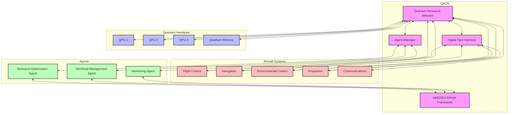
```mermaid
graph TB
    subgraph "QAOS"
        QRA["Quantum Resource Allocator"]
        AM["Agent Manager"]
        AMEDEO["AMEDEO Ethical Framework"]
        DT["Digital Twin Interface"]
    end
    
    subgraph "Aircraft Systems"
        FC["Flight Control"]
        NAV["Navigation"]
        ENV["Environmental Control"]
        PROP["Propulsion"]
        COMM["Communications"]
    end
    
    subgraph "Quantum Hardware"
        QPU1["QPU-1"]
        QPU2["QPU-2"]
        QPU3["QPU-3"]
        QMEM["Quantum Memory"]
    end
    
    subgraph "Agents"
        ROA["Resource Optimization Agent"]
        WMA["Workload Management Agent"]
        MON["Monitoring Agent"]
    end
    
    QRA <--> QPU1
    QRA <--> QPU2
    QRA <--> QPU3
    QRA <--> QMEM
    
    QRA <--> FC
    QRA <--> NAV
    QRA <--> ENV
    QRA <--> PROP
    QRA <--> COMM
    
    QRA <--> AM
    AM <--> ROA
    AM <--> WMA
    AM <--> MON
    
    ROA <--> AMEDEO
    WMA <--> AMEDEO
    MON <--> AMEDEO
    
    QRA <--> DT
    DT <--> FC
    DT <--> NAV
    DT <--> ENV
    DT <--> PROP
    
    classDef qaos fill:#f9f,stroke:#333,stroke-width:2px;
    classDef hardware fill:#bbf,stroke:#333,stroke-width:2px;
    classDef agents fill:#bfb,stroke:#333,stroke-width:2px;
    classDef systems fill:#fbb,stroke:#333,stroke-width:2px;
    
    class QRA,AM,AMEDEO,DT qaos;
    class QPU1,QPU2,QPU3,QMEM hardware;
    class ROA,WMA,MON agents;
    class FC,NAV,ENV,PROP,COMM systems;
```

## 2. Package Structure

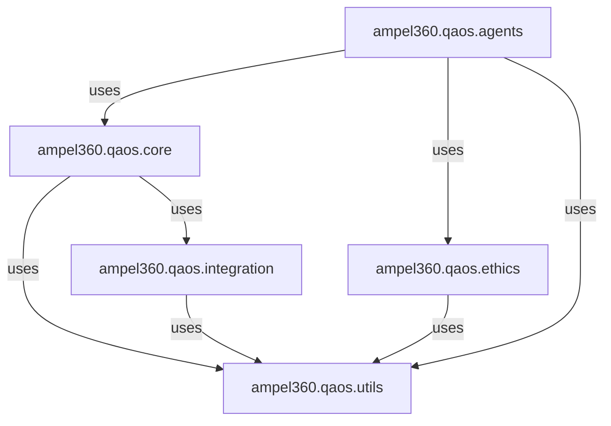
```mermaid
graph TD
    Core["ampel360.qaos.core"]
    Agents["ampel360.qaos.agents"]
    Ethics["ampel360.qaos.ethics"]
    Integration["ampel360.qaos.integration"]
    Utils["ampel360.qaos.utils"]
    
    Core -->|uses| Utils
    Core -->|uses| Integration
    Agents -->|uses| Core
    Agents -->|uses| Ethics
    Agents -->|uses| Utils
    Ethics -->|uses| Utils
    Integration -->|uses| Utils
```

## 3. Core Components

### 3.1 QuantumResourceAllocator

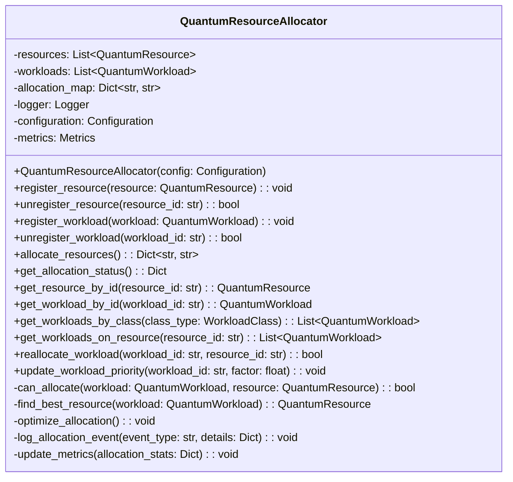
```mermaid
classDiagram
    class QuantumResourceAllocator {
        -resources: List~QuantumResource~
        -workloads: List~QuantumWorkload~
        -allocation_map: Dict~str, str~
        -logger: Logger
        -configuration: Configuration
        -metrics: Metrics
        +QuantumResourceAllocator(config: Configuration)
        +register_resource(resource: QuantumResource): void
        +unregister_resource(resource_id: str): bool
        +register_workload(workload: QuantumWorkload): void
        +unregister_workload(workload_id: str): bool
        +allocate_resources(): Dict~str, str~
        +get_allocation_status(): Dict
        +get_resource_by_id(resource_id: str): QuantumResource
        +get_workload_by_id(workload_id: str): QuantumWorkload
        +get_workloads_by_class(class_type: WorkloadClass): List~QuantumWorkload~
        +get_workloads_on_resource(resource_id: str): List~QuantumWorkload~
        +reallocate_workload(workload_id: str, resource_id: str): bool
        +update_workload_priority(workload_id: str, factor: float): void
        -can_allocate(workload: QuantumWorkload, resource: QuantumResource): bool
        -find_best_resource(workload: QuantumWorkload): QuantumResource
        -optimize_allocation(): void
        -log_allocation_event(event_type: str, details: Dict): void
        -update_metrics(allocation_stats: Dict): void
    }
```

**Description:**
The `QuantumResourceAllocator` is the central component responsible for managing quantum resources and workloads, and allocating resources based on workload priorities. It maintains a registry of available quantum resources and workloads, and provides methods for resource allocation, reallocation, and status reporting.

**Responsibilities:**

- Register and manage quantum resources
- Register and manage quantum workloads
- Allocate resources based on workload priorities and requirements
- Provide status information about current allocations
- Support dynamic reallocation of resources
- Track metrics for resource utilization and allocation efficiency

**Relationships:**

- Manages multiple `QuantumResource` instances
- Manages multiple `QuantumWorkload` instances
- Uses `Logger` for logging allocation events
- Uses `Configuration` for configurable parameters
- Uses `Metrics` for tracking performance metrics

### 3.2 QuantumResource

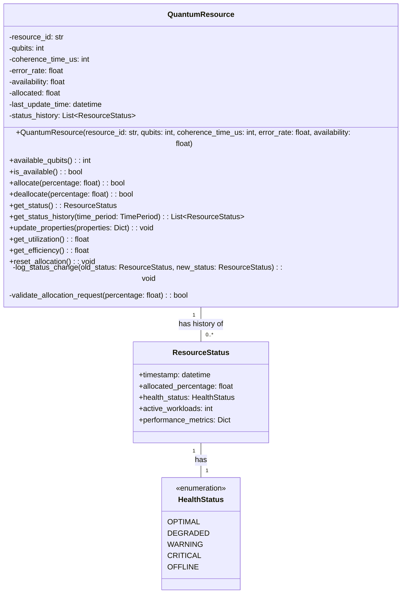
```mermaid
classDiagram
    class QuantumResource {
        -resource_id: str
        -qubits: int
        -coherence_time_us: int
        -error_rate: float
        -availability: float
        -allocated: float
        -last_update_time: datetime
        -status_history: List~ResourceStatus~
        +QuantumResource(resource_id: str, qubits: int, coherence_time_us: int, error_rate: float, availability: float)
        +available_qubits(): int
        +is_available(): bool
        +allocate(percentage: float): bool
        +deallocate(percentage: float): bool
        +get_status(): ResourceStatus
        +get_status_history(time_period: TimePeriod): List~ResourceStatus~
        +update_properties(properties: Dict): void
        +get_utilization(): float
        +get_efficiency(): float
        +reset_allocation(): void
        -log_status_change(old_status: ResourceStatus, new_status: ResourceStatus): void
        -validate_allocation_request(percentage: float): bool
    }
    
    class ResourceStatus {
        +timestamp: datetime
        +allocated_percentage: float
        +health_status: HealthStatus
        +active_workloads: int
        +performance_metrics: Dict
    }
    
    class HealthStatus {
        <<enumeration>>
        OPTIMAL
        DEGRADED
        WARNING
        CRITICAL
        OFFLINE
    }
    
    QuantumResource "1" -- "0..*" ResourceStatus : has history of
    ResourceStatus "1" -- "1" HealthStatus : has
```

**Description:**
The `QuantumResource` class represents a quantum computing resource with specific capabilities and properties. It tracks its allocation status and provides methods for allocating and deallocating portions of the resource.

**Responsibilities:**

- Store and provide information about resource capabilities
- Track allocation status and history
- Provide methods for allocation and deallocation
- Report on resource utilization and efficiency
- Maintain health status information

**Relationships:**

- Has history of `ResourceStatus` records
- Each `ResourceStatus` has a `HealthStatus`

### 3.3 QuantumWorkload

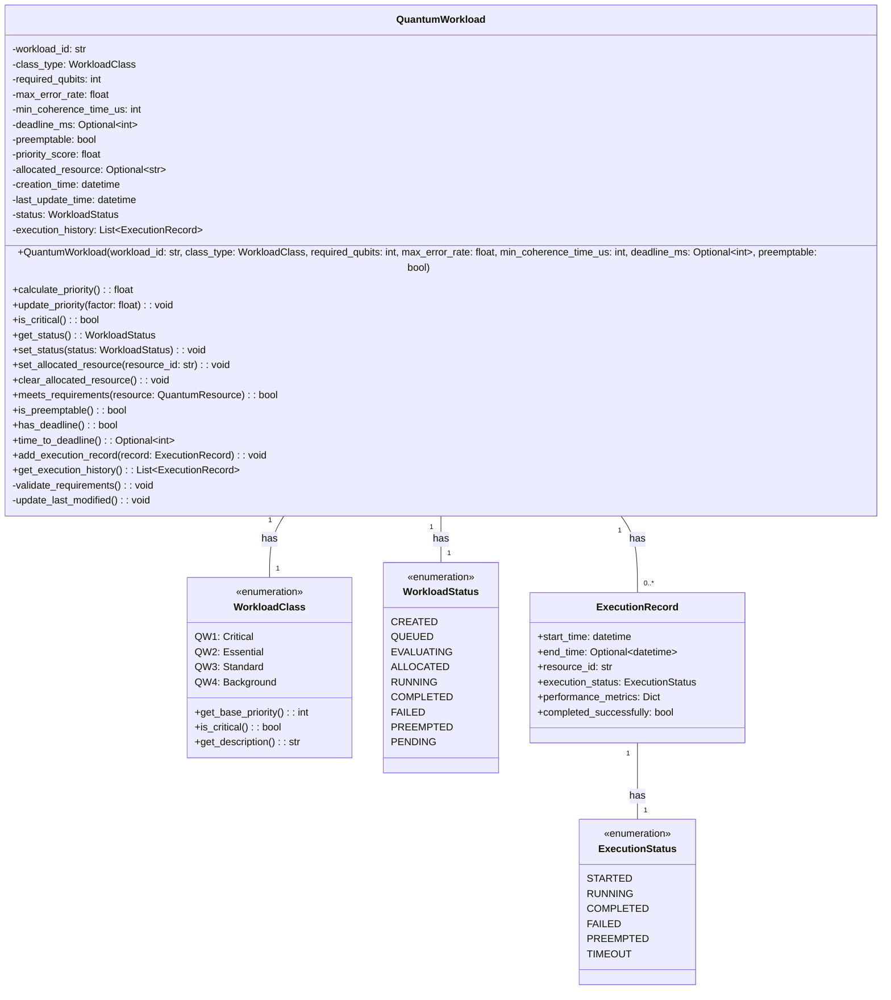
```mermaid
classDiagram
    class QuantumWorkload {
        -workload_id: str
        -class_type: WorkloadClass
        -required_qubits: int
        -max_error_rate: float
        -min_coherence_time_us: int
        -deadline_ms: Optional~int~
        -preemptable: bool
        -priority_score: float
        -allocated_resource: Optional~str~
        -creation_time: datetime
        -last_update_time: datetime
        -status: WorkloadStatus
        -execution_history: List~ExecutionRecord~
        +QuantumWorkload(workload_id: str, class_type: WorkloadClass, required_qubits: int, max_error_rate: float, min_coherence_time_us: int, deadline_ms: Optional~int~, preemptable: bool)
        +calculate_priority(): float
        +update_priority(factor: float): void
        +is_critical(): bool
        +get_status(): WorkloadStatus
        +set_status(status: WorkloadStatus): void
        +set_allocated_resource(resource_id: str): void
        +clear_allocated_resource(): void
        +meets_requirements(resource: QuantumResource): bool
        +is_preemptable(): bool
        +has_deadline(): bool
        +time_to_deadline(): Optional~int~
        +add_execution_record(record: ExecutionRecord): void
        +get_execution_history(): List~ExecutionRecord~
        -validate_requirements(): void
        -update_last_modified(): void
    }
    
    class WorkloadClass {
        <<enumeration>>
        QW1: Critical
        QW2: Essential
        QW3: Standard
        QW4: Background
        +get_base_priority(): int
        +is_critical(): bool
        +get_description(): str
    }
    
    class WorkloadStatus {
        <<enumeration>>
        CREATED
        QUEUED
        EVALUATING
        ALLOCATED
        RUNNING
        COMPLETED
        FAILED
        PREEMPTED
        PENDING
    }
    
    class ExecutionRecord {
        +start_time: datetime
        +end_time: Optional~datetime~
        +resource_id: str
        +execution_status: ExecutionStatus
        +performance_metrics: Dict
        +completed_successfully: bool
    }
    
    class ExecutionStatus {
        <<enumeration>>
        STARTED
        RUNNING
        COMPLETED
        FAILED
        PREEMPTED
        TIMEOUT
    }
    
    QuantumWorkload "1" -- "1" WorkloadClass : has
    QuantumWorkload "1" -- "1" WorkloadStatus : has
    QuantumWorkload "1" -- "0..*" ExecutionRecord : has
    ExecutionRecord "1" -- "1" ExecutionStatus : has
```

**Description:**
The `QuantumWorkload` class represents a quantum computing task with specific requirements and priorities. It tracks its status throughout its lifecycle and maintains execution history.

**Responsibilities:**

- Store and provide information about workload requirements
- Calculate and update priority scores
- Track allocation status and execution history
- Provide methods for checking if requirements are met
- Support preemption and deadline management

**Relationships:**

- Has a `WorkloadClass` that determines its criticality
- Has a current `WorkloadStatus`
- Has history of `ExecutionRecord` instances
- Each `ExecutionRecord` has an `ExecutionStatus`

## 4. Agent Framework

### 4.1 BaseAgent

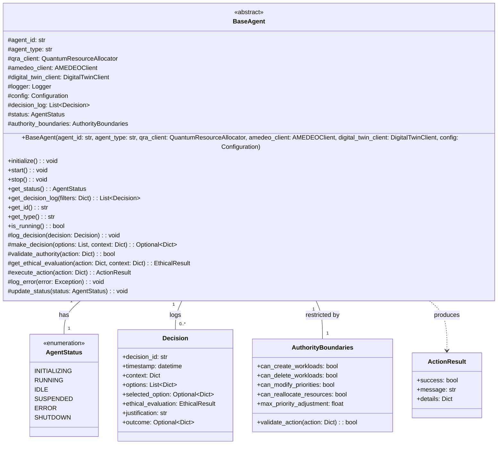
```mermaid
classDiagram
    class BaseAgent {
        <<abstract>>
        #agent_id: str
        #agent_type: str
        #qra_client: QuantumResourceAllocator
        #amedeo_client: AMEDEOClient
        #digital_twin_client: DigitalTwinClient
        #logger: Logger
        #config: Configuration
        #decision_log: List~Decision~
        #status: AgentStatus
        #authority_boundaries: AuthorityBoundaries
        +BaseAgent(agent_id: str, agent_type: str, qra_client: QuantumResourceAllocator, amedeo_client: AMEDEOClient, digital_twin_client: DigitalTwinClient, config: Configuration)
        +initialize(): void
        +start(): void
        +stop(): void
        +get_status(): AgentStatus
        +get_decision_log(filters: Dict): List~Decision~
        +get_id(): str
        +get_type(): str
        +is_running(): bool
        #log_decision(decision: Decision): void
        #make_decision(options: List, context: Dict): Optional~Dict~
        #validate_authority(action: Dict): bool
        #get_ethical_evaluation(action: Dict, context: Dict): EthicalResult
        #execute_action(action: Dict): ActionResult
        #log_error(error: Exception): void
        #update_status(status: AgentStatus): void
    }
    
    class AgentStatus {
        <<enumeration>>
        INITIALIZING
        RUNNING
        IDLE
        SUSPENDED
        ERROR
        SHUTDOWN
    }
    
    class Decision {
        +decision_id: str
        +timestamp: datetime
        +context: Dict
        +options: List~Dict~
        +selected_option: Optional~Dict~
        +ethical_evaluation: EthicalResult
        +justification: str
        +outcome: Optional~Dict~
    }
    
    class AuthorityBoundaries {
        +can_create_workloads: bool
        +can_delete_workloads: bool
        +can_modify_priorities: bool
        +can_reallocate_resources: bool
        +max_priority_adjustment: float
        +validate_action(action: Dict): bool
    }
    
    class ActionResult {
        +success: bool
        +message: str
        +details: Dict
    }
    
    BaseAgent "1" -- "1" AgentStatus : has
    BaseAgent "1" -- "0..*" Decision : logs
    BaseAgent "1" -- "1" AuthorityBoundaries : restricted by
    BaseAgent ..> ActionResult : produces
```

**Description:**
The `BaseAgent` is an abstract class that provides the foundation for all agent implementations in the system. It defines common functionality and interfaces for agent initialization, operation, and decision-making.

**Responsibilities:**

- Maintain agent identity and status
- Interact with the Quantum Resource Allocator
- Consult the AMEDEO ethical framework for decisions
- Log decisions and actions
- Validate actions against authority boundaries
- Provide structured decision-making process

**Relationships:**

- Has an `AgentStatus` indicating its current state
- Logs multiple `Decision` records
- Is restricted by `AuthorityBoundaries`
- Produces `ActionResult` when executing actions

### 4.2 ResourceOptimizationAgent

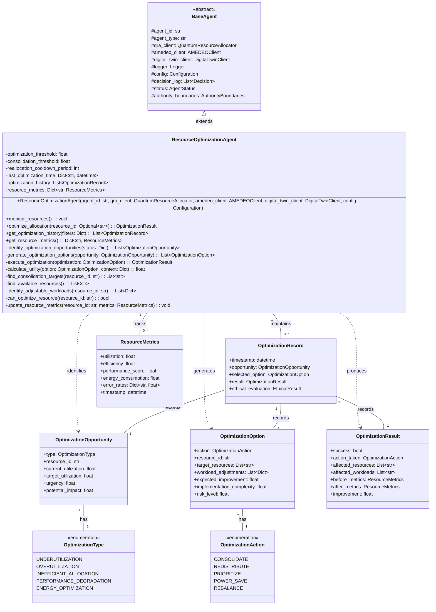
```mermaid
classDiagram
    class BaseAgent {
        <<abstract>>
        #agent_id: str
        #agent_type: str
        #qra_client: QuantumResourceAllocator
        #amedeo_client: AMEDEOClient
        #digital_twin_client: DigitalTwinClient
        #logger: Logger
        #config: Configuration
        #decision_log: List~Decision~
        #status: AgentStatus
        #authority_boundaries: AuthorityBoundaries
    }
    
    class ResourceOptimizationAgent {
        -optimization_threshold: float
        -consolidation_threshold: float
        -reallocation_cooldown_period: int
        -last_optimization_time: Dict~str, datetime~
        -optimization_history: List~OptimizationRecord~
        -resource_metrics: Dict~str, ResourceMetrics~
        +ResourceOptimizationAgent(agent_id: str, qra_client: QuantumResourceAllocator, amedeo_client: AMEDEOClient, digital_twin_client: DigitalTwinClient, config: Configuration)
        +monitor_resources(): void
        +optimize_allocation(resource_id: Optional~str~): OptimizationResult
        +get_optimization_history(filters: Dict): List~OptimizationRecord~
        +get_resource_metrics(): Dict~str, ResourceMetrics~
        -identify_optimization_opportunities(status: Dict): List~OptimizationOpportunity~
        -generate_optimization_options(opportunity: OptimizationOpportunity): List~OptimizationOption~
        -execute_optimization(optimization: OptimizationOption): OptimizationResult
        -calculate_utility(option: OptimizationOption, context: Dict): float
        -find_consolidation_targets(resource_id: str): List~str~
        -find_available_resources(): List~str~
        -identify_adjustable_workloads(resource_id: str): List~Dict~
        -can_optimize_resource(resource_id: str): bool
        -update_resource_metrics(resource_id: str, metrics: ResourceMetrics): void
    }
    
    class OptimizationOpportunity {
        +type: OptimizationType
        +resource_id: str
        +current_utilization: float
        +target_utilization: float
        +urgency: float
        +potential_impact: float
    }
    
    class OptimizationType {
        <<enumeration>>
        UNDERUTILIZATION
        OVERUTILIZATION
        INEFFICIENT_ALLOCATION
        PERFORMANCE_DEGRADATION
        ENERGY_OPTIMIZATION
    }
    
    class OptimizationOption {
        +action: OptimizationAction
        +resource_id: str
        +target_resources: List~str~
        +workload_adjustments: List~Dict~
        +expected_improvement: float
        +implementation_complexity: float
        +risk_level: float
    }
    
    class OptimizationAction {
        <<enumeration>>
        CONSOLIDATE
        REDISTRIBUTE
        PRIORITIZE
        POWER_SAVE
        REBALANCE
    }
    
    class OptimizationResult {
        +success: bool
        +action_taken: OptimizationAction
        +affected_resources: List~str~
        +affected_workloads: List~str~
        +before_metrics: ResourceMetrics
        +after_metrics: ResourceMetrics
        +improvement: float
    }
    
    class OptimizationRecord {
        +timestamp: datetime
        +opportunity: OptimizationOpportunity
        +selected_option: OptimizationOption
        +result: OptimizationResult
        +ethical_evaluation: EthicalResult
    }
    
    class ResourceMetrics {
        +utilization: float
        +efficiency: float
        +performance_score: float
        +energy_consumption: float
        +error_rates: Dict~str, float~
        +timestamp: datetime
    }
    
    BaseAgent <|-- ResourceOptimizationAgent : extends
    
    ResourceOptimizationAgent "1" -- "0..*" OptimizationRecord : maintains
    ResourceOptimizationAgent "1" -- "0..*" ResourceMetrics : tracks
    ResourceOptimizationAgent ..> OptimizationOpportunity : identifies
    ResourceOptimizationAgent ..> OptimizationOption : generates
    ResourceOptimizationAgent ..> OptimizationResult : produces
    
    OptimizationOpportunity "1" -- "1" OptimizationType : has
    OptimizationOption "1" -- "1" OptimizationAction : has
    OptimizationRecord "1" -- "1" OptimizationOpportunity : records
    OptimizationRecord "1" -- "1" OptimizationOption : records
    OptimizationRecord "1" -- "1" OptimizationResult : records
```

**Description:**
The `ResourceOptimizationAgent` is responsible for monitoring and optimizing quantum resource allocation. It identifies opportunities for optimization, generates possible optimization actions, and executes the most beneficial optimizations.

**Responsibilities:**

- Monitor resource utilization and performance
- Identify optimization opportunities
- Generate and evaluate optimization options
- Execute optimizations with ethical consideration
- Track optimization history and effectiveness
- Maintain resource performance metrics

**Relationships:**

- Extends `BaseAgent`
- Maintains history of `OptimizationRecord` instances
- Tracks `ResourceMetrics` for resources
- Identifies `OptimizationOpportunity` instances
- Generates `OptimizationOption` instances
- Produces `OptimizationResult` when executing optimizations

### 4.3 WorkloadManagementAgent

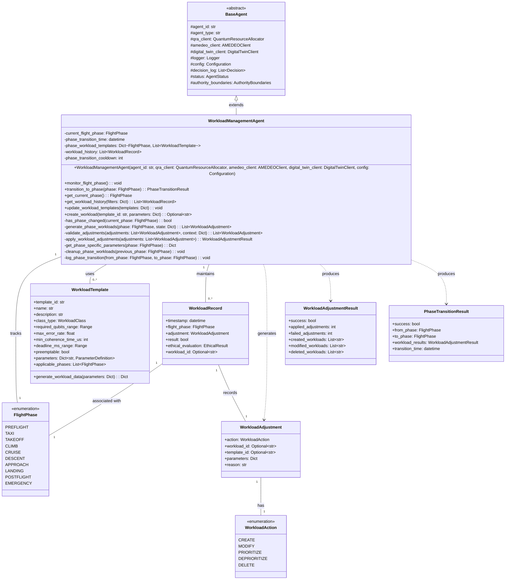
```mermaid
classDiagram
    class BaseAgent {
        <<abstract>>
        #agent_id: str
        #agent_type: str
        #qra_client: QuantumResourceAllocator
        #amedeo_client: AMEDEOClient
        #digital_twin_client: DigitalTwinClient
        #logger: Logger
        #config: Configuration
        #decision_log: List~Decision~
        #status: AgentStatus
        #authority_boundaries: AuthorityBoundaries
    }
    
    class WorkloadManagementAgent {
        -current_flight_phase: FlightPhase
        -phase_transition_time: datetime
        -phase_workload_templates: Dict~FlightPhase, List~WorkloadTemplate~~
        -workload_history: List~WorkloadRecord~
        -phase_transition_cooldown: int
        +WorkloadManagementAgent(agent_id: str, qra_client: QuantumResourceAllocator, amedeo_client: AMEDEOClient, digital_twin_client: DigitalTwinClient, config: Configuration)
        +monitor_flight_phase(): void
        +transition_to_phase(phase: FlightPhase): PhaseTransitionResult
        +get_current_phase(): FlightPhase
        +get_workload_history(filters: Dict): List~WorkloadRecord~
        +update_workload_templates(templates: Dict): void
        +create_workload(template_id: str, parameters: Dict): Optional~str~
        -has_phase_changed(current_phase: FlightPhase): bool
        -generate_phase_workloads(phase: FlightPhase, state: Dict): List~WorkloadAdjustment~
        -validate_adjustments(adjustments: List~WorkloadAdjustment~, context: Dict): List~WorkloadAdjustment~
        -apply_workload_adjustments(adjustments: List~WorkloadAdjustment~): WorkloadAdjustmentResult
        -get_phase_specific_parameters(phase: FlightPhase): Dict
        -cleanup_phase_workloads(previous_phase: FlightPhase): void
        -log_phase_transition(from_phase: FlightPhase, to_phase: FlightPhase): void
    }
    
    class FlightPhase {
        <<enumeration>>
        PREFLIGHT
        TAXI
        TAKEOFF
        CLIMB
        CRUISE
        DESCENT
        APPROACH
        LANDING
        POSTFLIGHT
        EMERGENCY
    }
    
    class WorkloadTemplate {
        +template_id: str
        +name: str
        +description: str
        +class_type: WorkloadClass
        +required_qubits_range: Range
        +max_error_rate: float
        +min_coherence_time_us: int
        +deadline_ms_range: Range
        +preemptable: bool
        +parameters: Dict~str, ParameterDefinition~
        +applicable_phases: List~FlightPhase~
        +generate_workload_data(parameters: Dict): Dict
    }
    
    class WorkloadAdjustment {
        +action: WorkloadAction
        +workload_id: Optional~str~
        +template_id: Optional~str~
        +parameters: Dict
        +reason: str
    }
    
    class WorkloadAction {
        <<enumeration>>
        CREATE
        MODIFY
        PRIORITIZE
        DEPRIORITIZE
        DELETE
    }
    
    class WorkloadAdjustmentResult {
        +success: bool
        +applied_adjustments: int
        +failed_adjustments: int
        +created_workloads: List~str~
        +modified_workloads: List~str~
        +deleted_workloads: List~str~
    }
    
    class PhaseTransitionResult {
        +success: bool
        +from_phase: FlightPhase
        +to_phase: FlightPhase
        +workload_results: WorkloadAdjustmentResult
        +transition_time: datetime
    }
    
    class WorkloadRecord {
        +timestamp: datetime
        +flight_phase: FlightPhase
        +adjustment: WorkloadAdjustment
        +result: bool
        +ethical_evaluation: EthicalResult
        +workload_id: Optional~str~
    }
    
    BaseAgent <|-- WorkloadManagementAgent : extends
    
    WorkloadManagementAgent "1" -- "1" FlightPhase : tracks
    WorkloadManagementAgent "1" -- "0..*" WorkloadTemplate : uses
    WorkloadManagementAgent "1" -- "0..*" WorkloadRecord : maintains
    WorkloadManagementAgent ..> WorkloadAdjustment : generates
    WorkloadManagementAgent ..> WorkloadAdjustmentResult : produces
    WorkloadManagementAgent ..> PhaseTransitionResult : produces
    
    WorkloadAdjustment "1" -- "1" WorkloadAction : has
    WorkloadRecord "1" -- "1" FlightPhase : associated with
    WorkloadRecord "1" -- "1" WorkloadAdjustment : records
```

**Description:**
The `WorkloadManagementAgent` is responsible for managing quantum workloads based on the current flight phase and aircraft state. It creates, modifies, and deletes workloads as needed to support the aircraft's operations during different flight phases.

**Responsibilities:**

- Monitor aircraft flight phase
- Generate appropriate workloads for each phase
- Adjust workload priorities based on flight conditions
- Validate workload adjustments with ethical framework
- Maintain history of workload management actions
- Handle transitions between flight phases

**Relationships:**

- Extends `BaseAgent`
- Tracks current `FlightPhase`
- Uses multiple `WorkloadTemplate` instances
- Maintains history of `WorkloadRecord` instances
- Generates `WorkloadAdjustment` instances
- Produces `WorkloadAdjustmentResult` when applying adjustments
- Produces `PhaseTransitionResult` when transitioning phases

### 4.4 MonitoringAgent

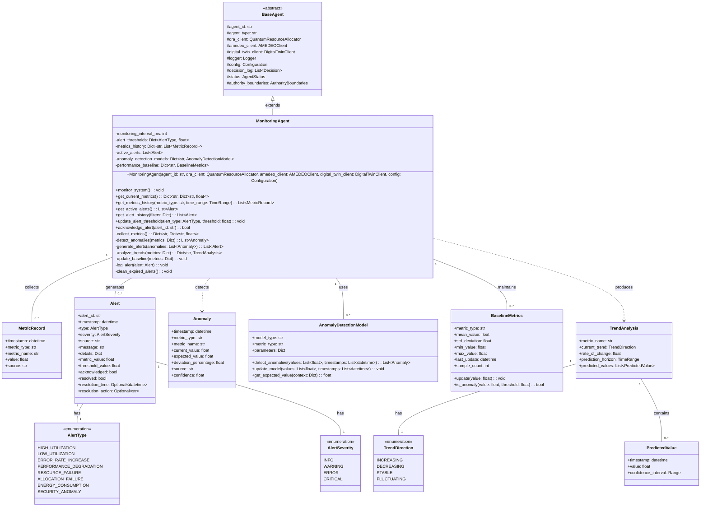
```mermaid
classDiagram
    class BaseAgent {
        <<abstract>>
        #agent_id: str
        #agent_type: str
        #qra_client: QuantumResourceAllocator
        #amedeo_client: AMEDEOClient
        #digital_twin_client: DigitalTwinClient
        #logger: Logger
        #config: Configuration
        #decision_log: List~Decision~
        #status: AgentStatus
        #authority_boundaries: AuthorityBoundaries
    }
    
    class MonitoringAgent {
        -monitoring_interval_ms: int
        -alert_thresholds: Dict~AlertType, float~
        -metrics_history: Dict~str, List~MetricRecord~~
        -active_alerts: List~Alert~
        -anomaly_detection_models: Dict~str, AnomalyDetectionModel~
        -performance_baseline: Dict~str, BaselineMetrics~
        +MonitoringAgent(agent_id: str, qra_client: QuantumResourceAllocator, amedeo_client: AMEDEOClient, digital_twin_client: DigitalTwinClient, config: Configuration)
        +monitor_system(): void
        +get_current_metrics(): Dict~str, Dict~str, float~~
        +get_metrics_history(metric_type: str, time_range: TimeRange): List~MetricRecord~
        +get_active_alerts(): List~Alert~
        +get_alert_history(filters: Dict): List~Alert~
        +update_alert_threshold(alert_type: AlertType, threshold: float): void
        +acknowledge_alert(alert_id: str): bool
        -collect_metrics(): Dict~str, Dict~str, float~~
        -detect_anomalies(metrics: Dict): List~Anomaly~
        -generate_alerts(anomalies: List~Anomaly~): List~Alert~
        -analyze_trends(metrics: Dict): Dict~str, TrendAnalysis~
        -update_baseline(metrics: Dict): void
        -log_alert(alert: Alert): void
        -clean_expired_alerts(): void
    }
    
    class MetricRecord {
        +timestamp: datetime
        +metric_type: str
        +metric_name: str
        +value: float
        +source: str
    }
    
    class AlertType {
        <<enumeration>>
        HIGH_UTILIZATION
        LOW_UTILIZATION
        ERROR_RATE_INCREASE
        PERFORMANCE_DEGRADATION
        RESOURCE_FAILURE
        ALLOCATION_FAILURE
        ENERGY_CONSUMPTION
        SECURITY_ANOMALY
    }
    
    class AlertSeverity {
        <<enumeration>>
        INFO
        WARNING
        ERROR
        CRITICAL
    }
    
    class Alert {
        +alert_id: str
        +timestamp: datetime
        +type: AlertType
        +severity: AlertSeverity
        +source: str
        +message: str
        +details: Dict
        +metric_value: float
        +threshold_value: float
        +acknowledged: bool
        +resolved: bool
        +resolution_time: Optional~datetime~
        +resolution_action: Optional~str~
    }
    
    class Anomaly {
        +timestamp: datetime
        +metric_type: str
        +metric_name: str
        +current_value: float
        +expected_value: float
        +deviation_percentage: float
        +source: str
        +confidence: float
    }
    
    class AnomalyDetectionModel {
        +model_type: str
        +metric_type: str
        +parameters: Dict
        +detect_anomalies(values: List~float~, timestamps: List~datetime~): List~Anomaly~
        +update_model(values: List~float~, timestamps: List~datetime~): void
        +get_expected_value(context: Dict): float
    }
    
    class BaselineMetrics {
        +metric_type: str
        +mean_value: float
        +std_deviation: float
        +min_value: float
        +max_value: float
        +last_update: datetime
        +sample_count: int
        +update(value: float): void
        +is_anomaly(value: float, threshold: float): bool
    }
    
    class TrendAnalysis {
        +metric_name: str
        +current_trend: TrendDirection
        +rate_of_change: float
        +prediction_horizon: TimeRange
        +predicted_values: List~PredictedValue~
    }
    
    class TrendDirection {
        <<enumeration>>
        INCREASING
        DECREASING
        STABLE
        FLUCTUATING
    }
    
    class PredictedValue {
        +timestamp: datetime
        +value: float
        +confidence_interval: Range
    }
    
    BaseAgent <|-- MonitoringAgent : extends
    
    MonitoringAgent "1" -- "0..*" MetricRecord : collects
    MonitoringAgent "1" -- "0..*" Alert : generates
    MonitoringAgent "1" -- "0..*" AnomalyDetectionModel : uses
    MonitoringAgent "1" -- "0..*" BaselineMetrics : maintains
    MonitoringAgent ..> Anomaly : detects
    MonitoringAgent ..> TrendAnalysis : produces
    
    Alert "1" -- "1" AlertType : has
    Alert "1" -- "1" AlertSeverity : has
    TrendAnalysis "1" -- "1" TrendDirection : has
    TrendAnalysis "1" -- "0..*" PredictedValue : contains
```

**Description:**
The `MonitoringAgent` is responsible for monitoring the quantum resource allocation system, detecting anomalies, and generating alerts. It collects metrics, analyzes trends, and maintains historical data for performance analysis.

**Responsibilities:**

- Collect and store system metrics
- Detect anomalies using statistical models
- Generate alerts for abnormal conditions
- Analyze trends and predict future values
- Maintain performance baselines
- Provide historical data for analysis

**Relationships:**

- Extends `BaseAgent`
- Collects multiple `MetricRecord` instances
- Generates `Alert` instances
- Uses `AnomalyDetectionModel` instances
- Maintains `BaselineMetrics` for different metrics
- Detects `Anomaly` instances
- Produces `TrendAnalysis` with predictions

## 5. Ethical Framework

### 5.1 AMEDEOClient

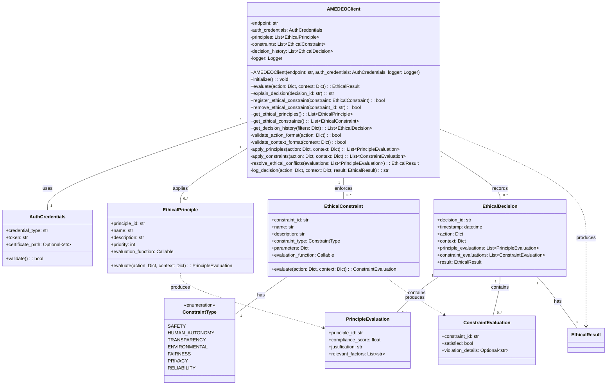
```mermaid
classDiagram
    class AMEDEOClient {
        -endpoint: str
        -auth_credentials: AuthCredentials
        -principles: List~EthicalPrinciple~
        -constraints: List~EthicalConstraint~
        -decision_history: List~EthicalDecision~
        -logger: Logger
        +AMEDEOClient(endpoint: str, auth_credentials: AuthCredentials, logger: Logger)
        +initialize(): void
        +evaluate(action: Dict, context: Dict): EthicalResult
        +explain_decision(decision_id: str): str
        +register_ethical_constraint(constraint: EthicalConstraint): bool
        +remove_ethical_constraint(constraint_id: str): bool
        +get_ethical_principles(): List~EthicalPrinciple~
        +get_ethical_constraints(): List~EthicalConstraint~
        +get_decision_history(filters: Dict): List~EthicalDecision~
        -validate_action_format(action: Dict): bool
        -validate_context_format(context: Dict): bool
        -apply_principles(action: Dict, context: Dict): List~PrincipleEvaluation~
        -apply_constraints(action: Dict, context: Dict): List~ConstraintEvaluation~
        -resolve_ethical_conflicts(evaluations: List~PrincipleEvaluation~): EthicalResult
        -log_decision(action: Dict, context: Dict, result: EthicalResult): str
    }
    
    class AuthCredentials {
        +credential_type: str
        +token: str
        +certificate_path: Optional~str~
        +validate(): bool
    }
    
    class EthicalPrinciple {
        +principle_id: str
        +name: str
        +description: str
        +priority: int
        +evaluation_function: Callable
        +evaluate(action: Dict, context: Dict): PrincipleEvaluation
    }
    
    class EthicalConstraint {
        +constraint_id: str
        +name: str
        +description: str
        +constraint_type: ConstraintType
        +parameters: Dict
        +evaluation_function: Callable
        +evaluate(action: Dict, context: Dict): ConstraintEvaluation
    }
    
    class PrincipleEvaluation {
        +principle_id: str
        +compliance_score: float
        +justification: str
        +relevant_factors: List~str~
    }
    
    class ConstraintEvaluation {
        +constraint_id: str
        +satisfied: bool
        +violation_details: Optional~str~
    }
    
    class EthicalDecision {
        +decision_id: str
        +timestamp: datetime
        +action: Dict
        +context: Dict
        +principle_evaluations: List~PrincipleEvaluation~
        +constraint_evaluations: List~ConstraintEvaluation~
        +result: EthicalResult
    }
    
    class ConstraintType {
        <<enumeration>>
        SAFETY
        HUMAN_AUTONOMY
        TRANSPARENCY
        ENVIRONMENTAL
        FAIRNESS
        PRIVACY
        RELIABILITY
    }
    
    AMEDEOClient "1" -- "1" AuthCredentials : uses
    AMEDEOClient "1" -- "0..*" EthicalPrinciple : applies
    AMEDEOClient "1" -- "0..*" EthicalConstraint : enforces
    AMEDEOClient "1" -- "0..*" EthicalDecision : records
    AMEDEOClient ..> EthicalResult : produces
    
    EthicalPrinciple ..> PrincipleEvaluation : produces
    EthicalConstraint "1" -- "1" ConstraintType : has
    EthicalConstraint ..> ConstraintEvaluation : produces
    
    EthicalDecision "1" -- "0..*" PrincipleEvaluation : contains
    EthicalDecision "1" -- "0..*" ConstraintEvaluation : contains
    EthicalDecision "1" -- "1" EthicalResult : has
```

**Description:**
The `AMEDEOClient` provides an interface to the AMEDEO (Aerospace Moral and Ethical Decision Engine Orchestrator) ethical framework. It evaluates actions against ethical principles and constraints, and provides ethical guidance for agent decisions.

**Responsibilities:**

- Evaluate actions against ethical principles and constraints
- Provide explanations for ethical decisions
- Manage ethical constraints
- Record decision history for audit purposes
- Resolve conflicts between competing ethical principles

**Relationships:**

- Uses `AuthCredentials` for secure access
- Applies multiple `EthicalPrinciple` instances
- Enforces multiple `EthicalConstraint` instances
- Records `EthicalDecision` history
- Produces `EthicalResult` evaluations

### 5.2 EthicalResult

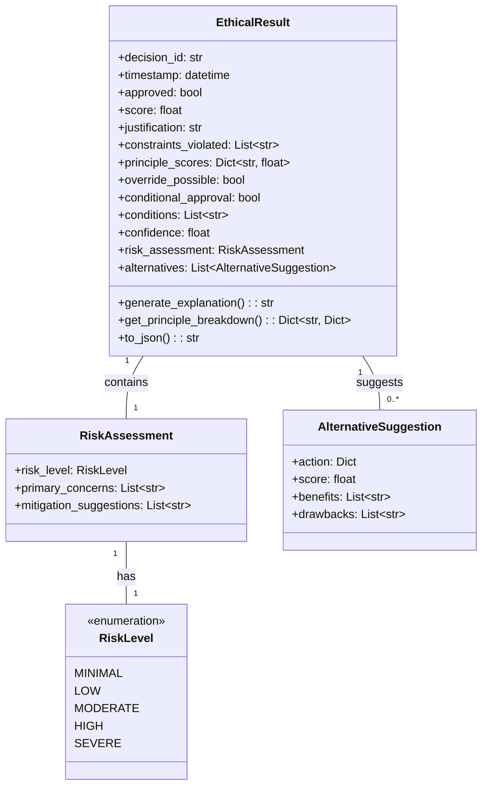
```mermaid
classDiagram
    class EthicalResult {
        +decision_id: str
        +timestamp: datetime
        +approved: bool
        +score: float
        +justification: str
        +constraints_violated: List~str~
        +principle_scores: Dict~str, float~
        +override_possible: bool
        +conditional_approval: bool
        +conditions: List~str~
        +confidence: float
        +risk_assessment: RiskAssessment
        +alternatives: List~AlternativeSuggestion~
        +generate_explanation(): str
        +get_principle_breakdown(): Dict~str, Dict~
        +to_json(): str
    }
    
    class RiskAssessment {
        +risk_level: RiskLevel
        +primary_concerns: List~str~
        +mitigation_suggestions: List~str~
    }
    
    class RiskLevel {
        <<enumeration>>
        MINIMAL
        LOW
        MODERATE
        HIGH
        SEVERE
    }
    
    class AlternativeSuggestion {
        +action: Dict
        +score: float
        +benefits: List~str~
        +drawbacks: List~str~
    }
    
    EthicalResult "1" -- "1" RiskAssessment : contains
    RiskAssessment "1" -- "1" RiskLevel : has
    EthicalResult "1" -- "0..*" AlternativeSuggestion : suggests
```

**Description:**
The `EthicalResult` class represents the outcome of an ethical evaluation by the AMEDEO framework. It provides detailed information about the ethical implications of an action, including approval status, justification, and risk assessment.

**Responsibilities:**

- Indicate whether an action is ethically approved
- Provide justification for the ethical decision
- Identify violated constraints
- Show scores for different ethical principles
- Assess risks associated with the action
- Suggest alternative actions when appropriate

**Relationships:**

- Contains a `RiskAssessment` for the action
- Each `RiskAssessment` has a `RiskLevel`
- Suggests multiple `AlternativeSuggestion` instances

## 6. Integration Components

### 6.1 DigitalTwinClient

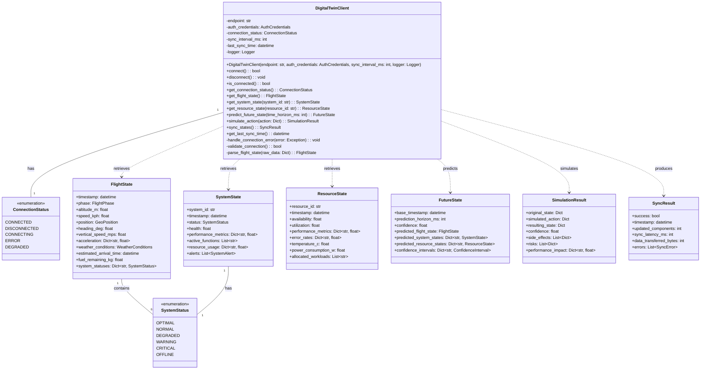
```mermaid
classDiagram
    class DigitalTwinClient {
        -endpoint: str
        -auth_credentials: AuthCredentials
        -connection_status: ConnectionStatus
        -sync_interval_ms: int
        -last_sync_time: datetime
        -logger: Logger
        +DigitalTwinClient(endpoint: str, auth_credentials: AuthCredentials, sync_interval_ms: int, logger: Logger)
        +connect(): bool
        +disconnect(): void
        +is_connected(): bool
        +get_connection_status(): ConnectionStatus
        +get_flight_state(): FlightState
        +get_system_state(system_id: str): SystemState
        +get_resource_state(resource_id: str): ResourceState
        +predict_future_state(time_horizon_ms: int): FutureState
        +simulate_action(action: Dict): SimulationResult
        +sync_states(): SyncResult
        +get_last_sync_time(): datetime
        -handle_connection_error(error: Exception): void
        -validate_connection(): bool
        -parse_flight_state(raw_data: Dict): FlightState
    }
    
    class ConnectionStatus {
        <<enumeration>>
        CONNECTED
        DISCONNECTED
        CONNECTING
        ERROR
        DEGRADED
    }
    
    class FlightState {
        +timestamp: datetime
        +phase: FlightPhase
        +altitude_m: float
        +speed_kph: float
        +position: GeoPosition
        +heading_deg: float
        +vertical_speed_mps: float
        +acceleration: Dict~str, float~
        +weather_conditions: WeatherConditions
        +estimated_arrival_time: datetime
        +fuel_remaining_kg: float
        +system_statuses: Dict~str, SystemStatus~
    }
    
    class SystemState {
        +system_id: str
        +timestamp: datetime
        +status: SystemStatus
        +health: float
        +performance_metrics: Dict~str, float~
        +active_functions: List~str~
        +resource_usage: Dict~str, float~
        +alerts: List~SystemAlert~
    }
    
    class ResourceState {
        +resource_id: str
        +timestamp: datetime
        +availability: float
        +utilization: float
        +performance_metrics: Dict~str, float~
        +error_rates: Dict~str, float~
        +temperature_c: float
        +power_consumption_w: float
        +allocated_workloads: List~str~
    }
    
    class FutureState {
        +base_timestamp: datetime
        +prediction_horizon_ms: int
        +confidence: float
        +predicted_flight_state: FlightState
        +predicted_system_states: Dict~str, SystemState~
        +predicted_resource_states: Dict~str, ResourceState~
        +confidence_intervals: Dict~str, ConfidenceInterval~
    }
    
    class SimulationResult {
        +original_state: Dict
        +simulated_action: Dict
        +resulting_state: Dict
        +confidence: float
        +side_effects: List~Dict~
        +risks: List~Dict~
        +performance_impact: Dict~str, float~
    }
    
    class SyncResult {
        +success: bool
        +timestamp: datetime
        +updated_components: int
        +sync_latency_ms: int
        +data_transferred_bytes: int
        +errors: List~SyncError~
    }
    
    class SystemStatus {
        <<enumeration>>
        OPTIMAL
        NORMAL
        DEGRADED
        WARNING
        CRITICAL
        OFFLINE
    }
    
    DigitalTwinClient "1" -- "1" ConnectionStatus : has
    DigitalTwinClient ..> FlightState : retrieves
    DigitalTwinClient ..> SystemState : retrieves
    DigitalTwinClient ..> ResourceState : retrieves
    DigitalTwinClient ..> FutureState : predicts
    DigitalTwinClient ..> SimulationResult : simulates
    DigitalTwinClient ..> SyncResult : produces
    
    FlightState "1" -- "0..*" SystemStatus : contains
    SystemState "1" -- "1" SystemStatus : has
```

**Description:**
The `DigitalTwinClient` provides an interface to the aircraft's digital twin, enabling agents to access current state information, predict future states, and simulate actions before execution.

**Responsibilities:**

- Connect to the digital twin system
- Retrieve current flight, system, and resource states
- Predict future states based on current conditions
- Simulate actions to evaluate potential outcomes
- Synchronize state information
- Monitor connection status

**Relationships:**

- Has a `ConnectionStatus` indicating connection state
- Retrieves `FlightState` information
- Retrieves `SystemState` for aircraft systems
- Retrieves `ResourceState` for resources
- Predicts `FutureState` for future conditions
- Simulates actions and produces `SimulationResult`
- Produces `SyncResult` when synchronizing states

### 6.2 FlightSystemsClient

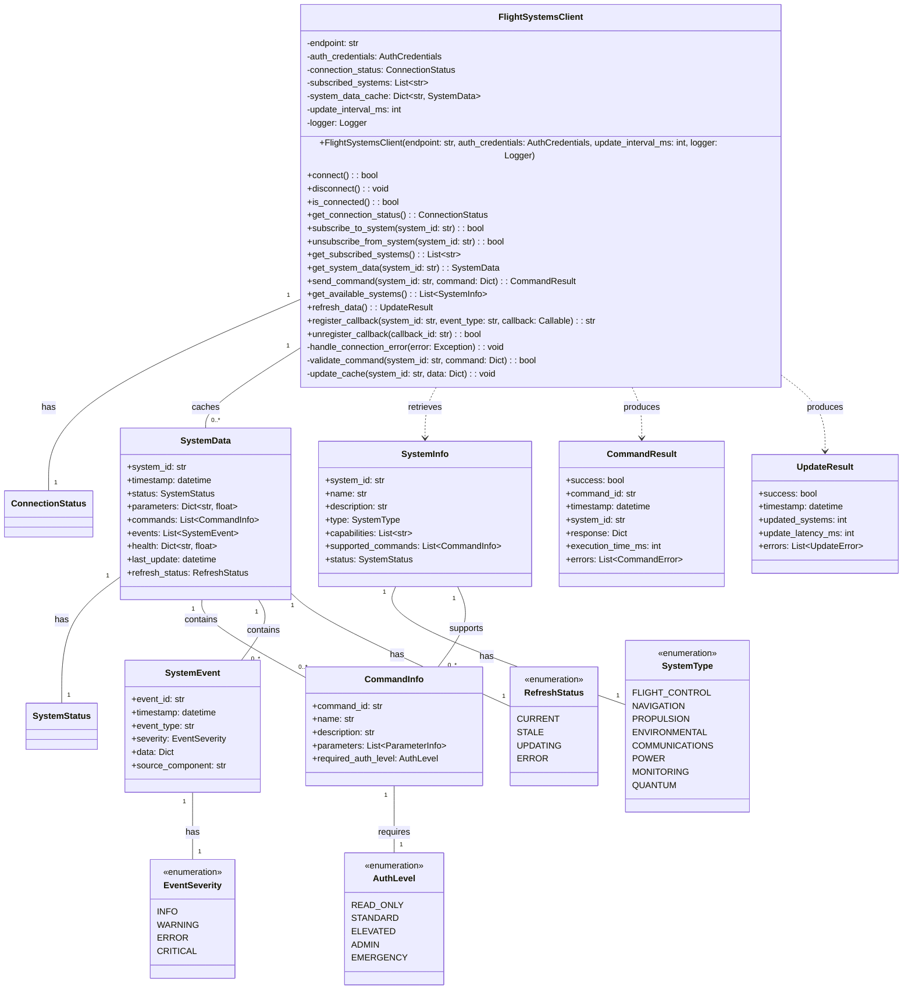
```mermaid
classDiagram
    class FlightSystemsClient {
        -endpoint: str
        -auth_credentials: AuthCredentials
        -connection_status: ConnectionStatus
        -subscribed_systems: List~str~
        -system_data_cache: Dict~str, SystemData~
        -update_interval_ms: int
        -logger: Logger
        +FlightSystemsClient(endpoint: str, auth_credentials: AuthCredentials, update_interval_ms: int, logger: Logger)
        +connect(): bool
        +disconnect(): void
        +is_connected(): bool
        +get_connection_status(): ConnectionStatus
        +subscribe_to_system(system_id: str): bool
        +unsubscribe_from_system(system_id: str): bool
        +get_subscribed_systems(): List~str~
        +get_system_data(system_id: str): SystemData
        +send_command(system_id: str, command: Dict): CommandResult
        +get_available_systems(): List~SystemInfo~
        +refresh_data(): UpdateResult
        +register_callback(system_id: str, event_type: str, callback: Callable): str
        +unregister_callback(callback_id: str): bool
        -handle_connection_error(error: Exception): void
        -validate_command(system_id: str, command: Dict): bool
        -update_cache(system_id: str, data: Dict): void
    }
    
    class SystemData {
        +system_id: str
        +timestamp: datetime
        +status: SystemStatus
        +parameters: Dict~str, float~
        +commands: List~CommandInfo~
        +events: List~SystemEvent~
        +health: Dict~str, float~
        +last_update: datetime
        +refresh_status: RefreshStatus
    }
    
    class SystemInfo {
        +system_id: str
        +name: str
        +description: str
        +type: SystemType
        +capabilities: List~str~
        +supported_commands: List~CommandInfo~
        +status: SystemStatus
    }
    
    class CommandInfo {
        +command_id: str
        +name: str
        +description: str
        +parameters: List~ParameterInfo~
        +required_auth_level: AuthLevel
    }
    
    class CommandResult {
        +success: bool
        +command_id: str
        +timestamp: datetime
        +system_id: str
        +response: Dict
        +execution_time_ms: int
        +errors: List~CommandError~
    }
    
    class SystemEvent {
        +event_id: str
        +timestamp: datetime
        +event_type: str
        +severity: EventSeverity
        +data: Dict
        +source_component: str
    }
    
    class UpdateResult {
        +success: bool
        +timestamp: datetime
        +updated_systems: int
        +update_latency_ms: int
        +errors: List~UpdateError~
    }
    
    class RefreshStatus {
        <<enumeration>>
        CURRENT
        STALE
        UPDATING
        ERROR
    }
    
    class SystemType {
        <<enumeration>>
        FLIGHT_CONTROL
        NAVIGATION
        PROPULSION
        ENVIRONMENTAL
        COMMUNICATIONS
        POWER
        MONITORING
        QUANTUM
    }
    
    class EventSeverity {
        <<enumeration>>
        INFO
        WARNING
        ERROR
        CRITICAL
    }
    
    class AuthLevel {
        <<enumeration>>
        READ_ONLY
        STANDARD
        ELEVATED
        ADMIN
        EMERGENCY
    }
    
    FlightSystemsClient "1" -- "1" ConnectionStatus : has
    FlightSystemsClient "1" -- "0..*" SystemData : caches
    FlightSystemsClient ..> SystemInfo : retrieves
    FlightSystemsClient ..> CommandResult : produces
    FlightSystemsClient ..> UpdateResult : produces
    
    SystemData "1" -- "1" SystemStatus : has
    SystemData "1" -- "0..*" CommandInfo : contains
    SystemData "1" -- "0..*" SystemEvent : contains
    SystemData "1" -- "1" RefreshStatus : has
    
    SystemInfo "1" -- "1" SystemType : has
    SystemInfo "1" -- "0..*" CommandInfo : supports
    
    CommandInfo "1" -- "1" AuthLevel : requires
    SystemEvent "1" -- "1" EventSeverity : has
```

**Description:**
The `FlightSystemsClient` provides an interface to the aircraft's flight systems, enabling agents to retrieve system data, send commands, and subscribe to system events.

**Responsibilities:**

- Connect to flight systems
- Subscribe to system data updates
- Retrieve current system data
- Send commands to flight systems
- Receive system events
- Maintain data cache for subscribed systems

**Relationships:**

- Has a `ConnectionStatus` indicating connection state
- Caches multiple `SystemData` instances
- Retrieves `SystemInfo` for available systems
- Produces `CommandResult` when sending commands
- Produces `UpdateResult` when refreshing data

## 7. Key Processes

### 7.1 Resource Allocation

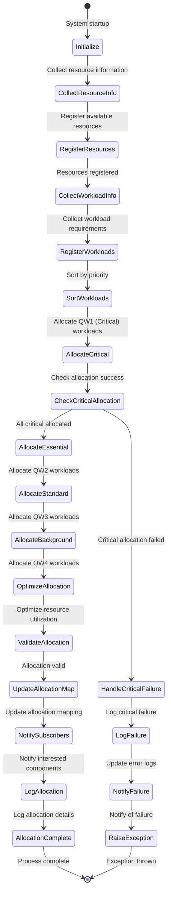
```mermaid
stateDiagram-v2
    [*] --> Initialize: System startup
    
    Initialize --> CollectResourceInfo: Collect resource information
    CollectResourceInfo --> RegisterResources: Register available resources
    
    RegisterResources --> CollectWorkloadInfo: Resources registered
    CollectWorkloadInfo --> RegisterWorkloads: Collect workload requirements
    
    RegisterWorkloads --> SortWorkloads: Sort by priority
    SortWorkloads --> AllocateCritical: Allocate QW1 (Critical) workloads
    
    AllocateCritical --> CheckCriticalAllocation: Check allocation success
    CheckCriticalAllocation --> AllocateEssential: All critical allocated
    CheckCriticalAllocation --> HandleCriticalFailure: Critical allocation failed
    
    AllocateEssential --> AllocateStandard: Allocate QW2 workloads
    AllocateStandard --> AllocateBackground: Allocate QW3 workloads
    AllocateBackground --> OptimizeAllocation: Allocate QW4 workloads
    
    OptimizeAllocation --> ValidateAllocation: Optimize resource utilization
    ValidateAllocation --> UpdateAllocationMap: Allocation valid
    
    UpdateAllocationMap --> NotifySubscribers: Update allocation mapping
    NotifySubscribers --> LogAllocation: Notify interested components
    LogAllocation --> AllocationComplete: Log allocation details
    
    HandleCriticalFailure --> LogFailure: Log critical failure
    LogFailure --> NotifyFailure: Update error logs
    NotifyFailure --> RaiseException: Notify of failure
    
    AllocationComplete --> [*]: Process complete
    RaiseException --> [*]: Exception thrown
```

**Description:**
This state diagram shows the process of resource allocation in the Quantum Resource Allocator. It begins with initialization and registration of resources and workloads, followed by allocation of workloads in order of priority (critical, essential, standard, background). The process includes optimization of allocation, validation, and notification of results.

### 7.2 Workload Lifecycle

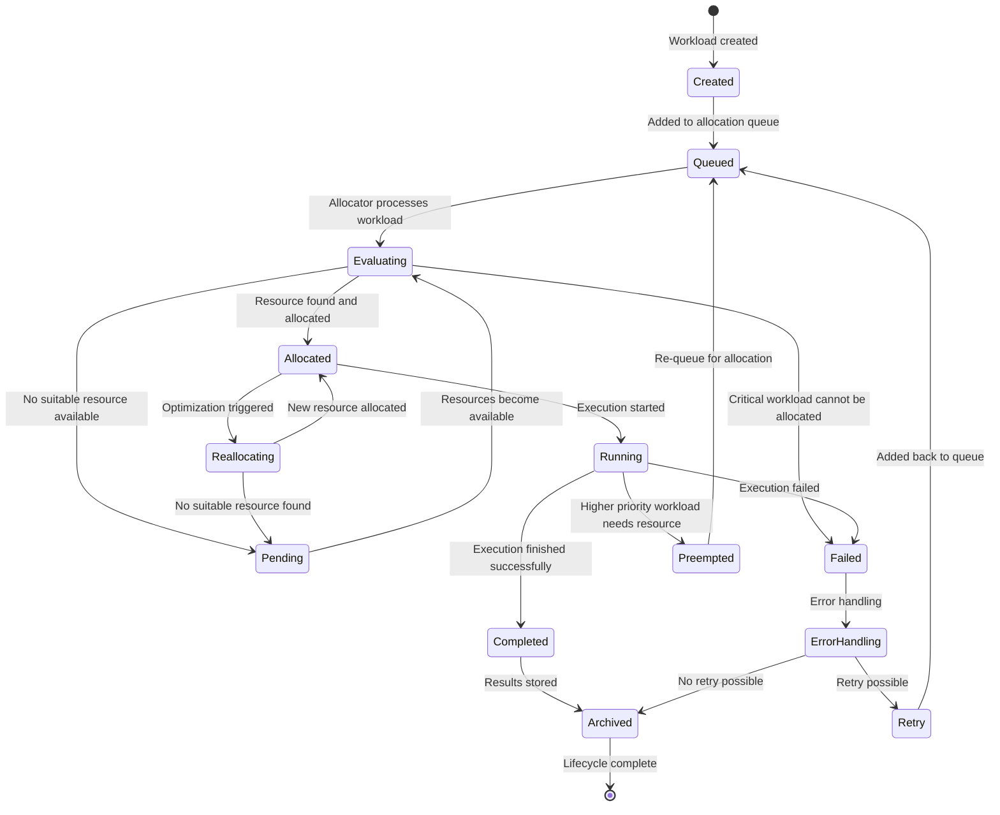
```mermaid
stateDiagram-v2
    [*] --> Created: Workload created
    
    Created --> Queued: Added to allocation queue
    Queued --> Evaluating: Allocator processes workload
    
    Evaluating --> Allocated: Resource found and allocated
    Evaluating --> Pending: No suitable resource available
    Evaluating --> Failed: Critical workload cannot be allocated
    
    Allocated --> Running: Execution started
    Running --> Completed: Execution finished successfully
    Running --> Failed: Execution failed
    Running --> Preempted: Higher priority workload needs resource
    
    Preempted --> Queued: Re-queue for allocation
    Pending --> Evaluating: Resources become available
    
    Allocated --> Reallocating: Optimization triggered
    Reallocating --> Allocated: New resource allocated
    Reallocating --> Pending: No suitable resource found
    
    Completed --> Archived: Results stored
    Failed --> ErrorHandling: Error handling
    ErrorHandling --> Retry: Retry possible
    ErrorHandling --> Archived: No retry possible
    
    Retry --> Queued: Added back to queue
    
    Archived --> [*]: Lifecycle complete
```

**Description:**
This state diagram illustrates the lifecycle of a quantum workload, from creation through allocation, execution, and completion. It shows various states a workload can be in, including queued, evaluating, allocated, running, completed, failed, preempted, and archived. The diagram includes transitions between states and conditions that trigger those transitions.

### 7.3 Agent Decision-Making

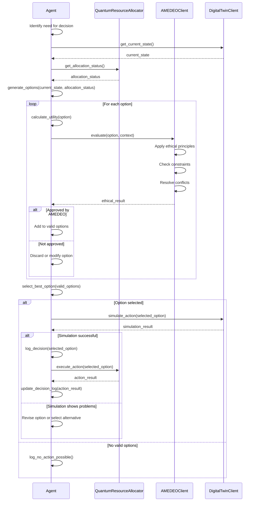
```mermaid
sequenceDiagram
    participant Agent as Agent
    participant QRA as QuantumResourceAllocator
    participant AMEDEO as AMEDEOClient
    participant DT as DigitalTwinClient
    
    Agent->>Agent: Identify need for decision
    Agent->>DT: get_current_state()
    DT-->>Agent: current_state
    
    Agent->>QRA: get_allocation_status()
    QRA-->>Agent: allocation_status
    
    Agent->>Agent: generate_options(current_state, allocation_status)
    
    loop For each option
        Agent->>Agent: calculate_utility(option)
        Agent->>AMEDEO: evaluate(option, context)
        AMEDEO->>AMEDEO: Apply ethical principles
        AMEDEO->>AMEDEO: Check constraints
        AMEDEO->>AMEDEO: Resolve conflicts
        AMEDEO-->>Agent: ethical_result
        
        alt Approved by AMEDEO
            Agent->>Agent: Add to valid options
        else Not approved
            Agent->>Agent: Discard or modify option
        end
    end
    
    Agent->>Agent: select_best_option(valid_options)
    
    alt Option selected
        Agent->>DT: simulate_action(selected_option)
        DT-->>Agent: simulation_result
        
        alt Simulation successful
            Agent->>Agent: log_decision(selected_option)
            Agent->>QRA: execute_action(selected_option)
            QRA-->>Agent: action_result
            
            Agent->>Agent: update_decision_log(action_result)
        else Simulation shows problems
            Agent->>Agent: Revise option or select alternative
        end
    else No valid options
        Agent->>Agent: log_no_action_possible()
    end
```

**Description:**
This sequence diagram illustrates the decision-making process for agents in the system. It shows how an agent identifies the need for a decision, gathers information from the Quantum Resource Allocator and Digital Twin, generates options, evaluates them ethically using the AMEDEO framework, selects the best option, simulates it, and executes it if appropriate. The diagram highlights the ethical evaluation step and simulation before execution.

### 7.4 System Initialization

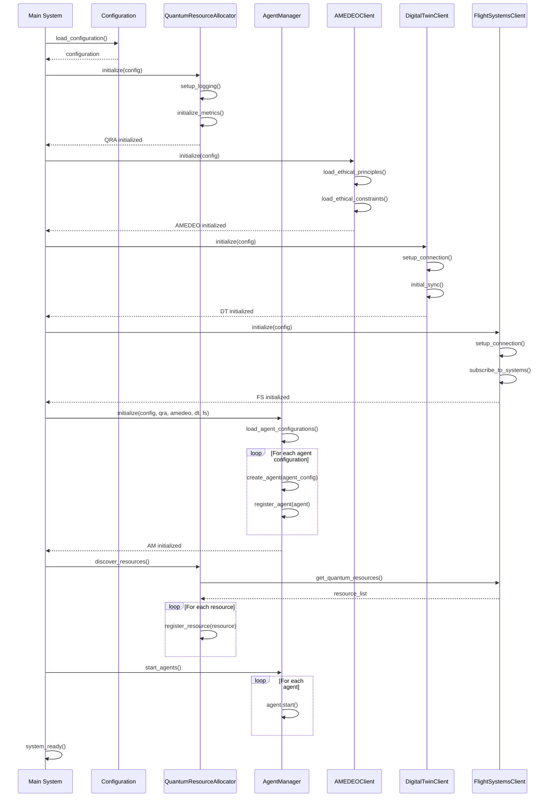
```mermaid
sequenceDiagram
    participant Main as Main System
    participant Config as Configuration
    participant QRA as QuantumResourceAllocator
    participant AM as AgentManager
    participant AMEDEO as AMEDEOClient
    participant DT as DigitalTwinClient
    participant FS as FlightSystemsClient
    
    Main->>Config: load_configuration()
    Config-->>Main: configuration
    
    Main->>QRA: initialize(config)
    QRA->>QRA: setup_logging()
    QRA->>QRA: initialize_metrics()
    QRA-->>Main: QRA initialized
    
    Main->>AMEDEO: initialize(config)
    AMEDEO->>AMEDEO: load_ethical_principles()
    AMEDEO->>AMEDEO: load_ethical_constraints()
    AMEDEO-->>Main: AMEDEO initialized
    
    Main->>DT: initialize(config)
    DT->>DT: setup_connection()
    DT->>DT: initial_sync()
    DT-->>Main: DT initialized
    
    Main->>FS: initialize(config)
    FS->>FS: setup_connection()
    FS->>FS: subscribe_to_systems()
    FS-->>Main: FS initialized
    
    Main->>AM: initialize(config, qra, amedeo, dt, fs)
    AM->>AM: load_agent_configurations()
    
    loop For each agent configuration
        AM->>AM: create_agent(agent_config)
        AM->>AM: register_agent(agent)
    end
    
    AM-->>Main: AM initialized
    
    Main->>QRA: discover_resources()
    QRA->>FS: get_quantum_resources()
    FS-->>QRA: resource_list
    
    loop For each resource
        QRA->>QRA: register_resource(resource)
    end
    
    Main->>AM: start_agents()
    
    loop For each agent
        AM->>AM: agent.start()
    end
    
    Main->>Main: system_ready()
```

**Description:**
This sequence diagram shows the initialization process for the Quantum Resource Allocator system. It illustrates the steps of loading configuration, initializing the Quantum Resource Allocator, AMEDEO ethical framework, Digital Twin Client, and Flight Systems Client, and then creating and starting the agents. The diagram shows the dependencies between components and the sequence of initialization steps.

## 8. Deployment Architecture

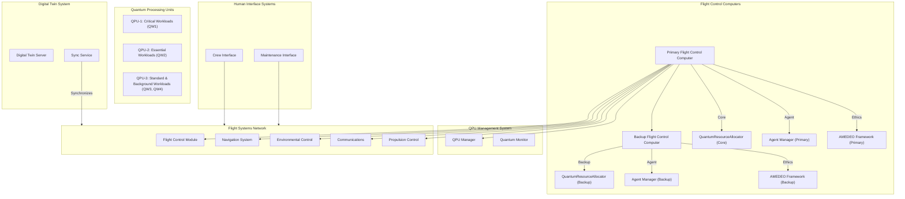
```mermaid
graph TD;
    %% Flight Control Computers %%
    subgraph FCS ["Flight Control Computers"]
        F1["Primary Flight Control Computer"]
        F2["Backup Flight Control Computer"]
        
        F1 -- Core --> QRA1["QuantumResourceAllocator (Core)"]
        F1 -- Agent --> Agent1["Agent Manager (Primary)"]
        F1 -- Ethics --> Ethics1["AMEDEO Framework (Primary)"]
        
        F2 -- Backup --> QRA2["QuantumResourceAllocator (Backup)"]
        F2 -- Agent --> Agent2["Agent Manager (Backup)"]
        F2 -- Ethics --> Ethics2["AMEDEO Framework (Backup)"]
    end
    
    %% QPU Management System %%
    subgraph QPU_System ["QPU Management System"]
        QMgr["QPU Manager"]
        QMon["Quantum Monitor"]
    end
    
    %% Quantum Processing Units %%
    subgraph QPUs ["Quantum Processing Units"]
        QPU1["QPU-1: Critical Workloads (QW1)"]
        QPU2["QPU-2: Essential Workloads (QW2)"]
        QPU3["QPU-3: Standard & Background Workloads (QW3, QW4)"]
    end
    
    %% Digital Twin System %%
    subgraph DTS ["Digital Twin System"]
        DServer["Digital Twin Server"]
        Sync["Sync Service"]
    end
    
    %% Flight Systems Network %%
    subgraph FSN ["Flight Systems Network"]
        FC["Flight Control Module"]
        Nav["Navigation System"]
        EC["Environmental Control"]
        Comm["Communications"]
        PC["Propulsion Control"]
    end

    %% Human Interface Systems %%
    subgraph HIS ["Human Interface Systems"]
        Crew["Crew Interface"]
        Maint["Maintenance Interface"]
    end
    
    %% Connections %%
    F1 --> F2
    F1 --> QMgr
    F1 --> FC
    F1 --> Nav
    F1 --> EC
    F1 --> Comm
    F1 --> PC
    Sync -- Synchronizes --> FSN
    Crew --> FSN
    Maint --> FSN
```

**Description:**
This deployment diagram shows the physical architecture of the Quantum Resource Allocator system, including the distribution of components across different hardware systems. It illustrates the primary and backup instances of the QRA, Agent Manager, and AMEDEO framework,

It illustrates the primary and backup instances of the QRA, Agent Manager, and AMEDEO framework, as well as their connections to the QPU Management System, Quantum Processing Units, Digital Twin System, Flight Systems Network, and Human Interface Systems. The diagram shows data flows between components and emphasizes the redundant architecture for critical systems.

This deployment architecture is designed to provide:

1. **High Availability**: Redundant components ensure continued operation if a primary component fails
2. **Fault Tolerance**: Backup systems can take over seamlessly
3. **Performance Isolation**: Critical processing is isolated from standard operations
4. **Secure Boundaries**: Clear security domains for different components
5. **Scalability**: Components can be scaled independently as needed

# Conclusion

This comprehensive UML documentation provides a detailed view of the AMPEL360-BWB-Q100 Quantum Resource Allocator system architecture. The documentation covers:

1. **System Overview**: High-level view of the system and its key components
2. **Package Structure**: Logical organization of code components
3. **Core Components**: Detailed design of the Quantum Resource Allocator, resources, and workloads
4. **Agent Framework**: Architecture for autonomous agents that interact with the system
5. **Ethical Framework**: Integration with the AMEDEO ethical decision framework
6. **Integration Components**: Interfaces to aircraft systems and the digital twin
7. **Key Processes**: Workflows for resource allocation, workload lifecycle, and agent decision-making
8. **Deployment Architecture**: Physical distribution of components across hardware systems

This documentation serves as a foundation for implementation, testing, and certification of the Quantum Resource Allocator system. It provides a clear blueprint for developers, testers, and certification specialists, ensuring that the system meets the strict requirements of aerospace applications while leveraging the power of quantum computing resources.
