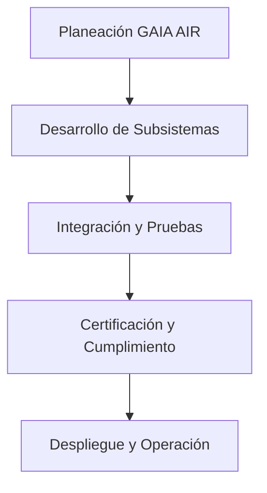

---

# **README — GAIA AIR**

> Versión: 1.0.0  
> Autor: Equipo GAIA AIR  
> Fecha: *(fecha de publicación)*  

---

## **Índice**

1. [Introducción General (ATA 00)](#introducción-general-ata-00)
   - [Contexto y Objetivos](#contexto-y-objetivos)
   - [Arquitectura General de GAIA AIR](#arquitectura-general-de-gaia-air)
   - [Principales Tecnologías](#principales-tecnologías)
   - [Referencias Clave y Cumplimiento Normativo](#referencias-clave-y-cumplimiento-normativo)

2. [Organización del Proyecto y Estructura de Documentación](#organización-del-proyecto-y-estructura-de-documentación)
   - [Desglose WBS / PBS / CBS](#desglose-wbs--pbs--cbs)
   - [Convenciones de Numeración (S1000D y ATA Spec 100)](#convenciones-de-numeración-s1000d-y-ata-spec-100)
   - [Mapa de Procesos Generales (Mermaid)](#mapa-de-procesos-generales-mermaid)

3. [Capítulos Clave según ATA Spec 100](#capítulos-clave-según-ata-spec-100)
   - [DMC-GAIA-00-10-00-A: Descripción General del Sistema (ATA 00)](#dmc-gaia-00-10-00-a-descripción-general-del-sistema-ata-00)
   - [DMC-GAIA-00-20-00-A: Gestión de Riesgos y Cumplimiento Normativo (ATA 00)](#dmc-gaia-00-20-00-a-gestión-de-riesgos-y-cumplimiento-normativo-ata-00)
   - [DMC-GAIA-00-30-00-A: Glosario y Definiciones (ATA 00)](#dmc-gaia-00-30-00-a-glosario-y-definiciones-ata-00)
   - [DMC-GAIA-00-40-00-A: Próximos Pasos y Conclusiones (ATA 00)](#dmc-gaia-00-40-00-a-próximos-pasos-y-conclusiones-ata-00)
   - [DMC-GAIA-00-50-00-A: Sistemas de Captura de CO₂ (ATA 00)](#dmc-gaia-00-50-00-a-sistemas-de-captura-de-co₂-ata-00)
   - [DMC-GAIA-00-60-00-A: Introducción a Propulsores Verdes (ATA 00)](#dmc-gaia-00-60-00-a-introducción-a-propulsores-verdes-ata-00)
   - [DMC-GAIA-00-70-00-A: Superficies Adaptativas y Diseño (ATA 00)](#dmc-gaia-00-70-00-a-superficies-adaptativas-y-diseño-ata-00)
   - [DMC-GAIA-00-80-00-A: Materiales y Nanotecnología (ATA 00)](#dmc-gaia-00-80-00-a-materiales-y-nanotecnología-ata-00)
   - [DMC-GAIA-00-90-00-A: Optimización de Rutas (ATA 00)](#dmc-gaia-00-90-00-a-optimización-de-rutas-ata-00)
   - [DMC-GAIA-00-91-00-A: Mantenimiento Predictivo Avanzado (ATA 00)](#dmc-gaia-00-91-00-a-mantenimiento-predictivo-avanzado-ata-00)
   - [DMC-GAIA-00-92-00-A: Guiado Autónomo (ATA 00)](#dmc-gaia-00-92-00-a-guiado-autónomo-ata-00)
   - [DMC-GAIA-00-93-00-A: Blockchain en la Cadena de Suministros (ATA 00)](#dmc-gaia-00-93-00-a-blockchain-en-la-cadena-de-suministros-ata-00)
   - [DMC-GAIA-00-94-00-A: Estrategias de Influencia y Liderazgo (ATA 00)](#dmc-gaia-00-94-00-a-estrategias-de-influencia-y-liderazgo-ata-00)
   - [DMC-GAIA-00-95-00-A: Formación con VR/AR/XR (ATA 00)](#dmc-gaia-00-95-00-a-formación-con-vrarxr-ata-00)
   - [DMC-GAIA-00-97-00-A: Modelado Matemático del Sistema de Propulsión (ATA 00)](#dmc-gaia-00-97-00-a-modelado-matemático-del-sistema-de-propulsión-ata-00)

4. [Ejemplos de Endpoints API y Visualizaciones](#ejemplos-de-endpoints-api-y-visualizaciones)
   - [Documentación Interactiva con Swagger](#documentación-interactiva-con-swagger)
   - [Ejemplo de Endpoint: /routes/optimize](#ejemplo-de-endpoint-routesoptimize)
   - [Visualización de Datos (Chart.js)](#visualización-de-datos-chartjs)

5. [Cómo Contribuir](#cómo-contribuir)
6. [Preguntas Frecuentes (FAQ)](#preguntas-frecuentes-faq)
7. [Enlaces Rápidos](#enlaces-rápidos)
8. [Licencia](#licencia)
9. [Contacto](#contacto)

---

## **Introducción General (ATA 00)**

### **Contexto y Objetivos**
GAIA AIR es una plataforma que integra **Inteligencia Artificial (IA)**, **computación cuántica (Quantum)**, **blockchain**, **nanotecnología** y **propulsores verdes** para revolucionar la aviación moderna. Sus objetivos:

- **Optimizar** rutas de vuelo para reducir combustible, emisiones y tiempos de viaje.
- **Implementar** sistemas de mantenimiento predictivo que previenen fallos.
- **Fomentar** la sostenibilidad ambiental y la eficiencia operativa.

Referencia: Para más detalles sobre la visión del proyecto, vea [DMC-GAIA-00-10-00-A](#dmc-gaia-00-10-00-a-descripción-general-del-sistema-ata-00).

### **Arquitectura General de GAIA AIR**
El sistema se compone de varios módulos, incluyendo:
- **Optimización Cuántica** (QAOA)  
- **Gestión de Datos Blockchain**  
- **Redes Neuronales para Mantenimiento Predictivo**  
- **Sistemas de Propulsión Verde**  
- **Superficies Adaptativas**  

### **Principales Tecnologías**
- **Computación Cuántica:** Resuelve problemas combinatorios complejos en menor tiempo.
- **Blockchain:** Garantiza inmutabilidad y trazabilidad de datos.
- **IA/AGI:** Emula y supera capacidades humanas para análisis y toma de decisiones.
- **Nanotecnología:** Materiales ligeros y resistentes para estructuras y recubrimientos.
- **AR/VR/XR:** Capacitación inmersiva para personal de vuelo y mantenimiento.

### **Referencias Clave y Cumplimiento Normativo**
- **OACI, FAA, EASA:** Normativas aeronáuticas globales.
- **ISO 9001, ISO 14001:** Gestión de calidad y medio ambiente.
- **DO-178C, DO-160G, DO-254:** Estándares de software y hardware aeronáutico.

---

## **Organización del Proyecto y Estructura de Documentación**

### **Desglose WBS / PBS / CBS**
- **WBS (Work Breakdown Structure):** Estructura jerárquica de tareas y entregables.
- **PBS (Product Breakdown Structure):** Desglose de los componentes y subsistemas (ej. motores, alas, aviónica).
- **CBS (Cost Breakdown Structure):** Desglose de costos asociados a cada actividad y subcomponente.

### **Convenciones de Numeración (S1000D y ATA Spec 100)**
- **S1000D:** Uso de Data Modules Code (DMC), p. ej., DMC-GAIA-05-00-00-A.
- **ATA Spec 100:** Organización de capítulos y secciones con referencia a la industria aeronáutica, p. ej., ATA 05 para mantenimiento, ATA 34 para navegación.

### **Mapa de Procesos Generales (Mermaid)**



---

## **Capítulos Clave según ATA Spec 100**

### **DMC-GAIA-00-10-00-A: Descripción General del Sistema (ATA 00)**
Proporciona una descripción de la arquitectura y los componentes principales de GAIA AIR.  
- **Módulo de Optimización Cuántica**  
- **Sistema de Gestión de Datos Blockchain**  
- **Red Neuronal para Mantenimiento Predictivo**  
- **Sistemas de Propulsión Verde**  
- **Superficies Adaptativas**  

### **DMC-GAIA-00-20-00-A: Gestión de Riesgos y Cumplimiento Normativo (ATA 00)**
- **DMC-GAIA-00-20-01-A: Identificación de Riesgos**  
- **DMC-GAIA-00-20-02-A: Estrategias de Mitigación**  
- **DMC-GAIA-00-20-03-A: Cumplimiento con Normativas Aeronáuticas**  
- **DMC-GAIA-00-20-04-A: Estándares de Documentación Técnica (S1000D / ATA Spec 100)**  

### **DMC-GAIA-00-30-00-A: Glosario y Definiciones (ATA 00)**
- **DMC-GAIA-00-30-01-A: Términos Técnicos Clave**  
- **DMC-GAIA-00-30-02-A: Abreviaturas y Acrónimos**  

### **DMC-GAIA-00-40-00-A: Próximos Pasos y Conclusiones (ATA 00)**
- **DMC-GAIA-00-40-01-A: Recomendaciones Futuras**  
- **DMC-GAIA-00-40-02-A: Conclusión Final**  

### **DMC-GAIA-00-50-00-A: Sistemas de Captura de CO₂ (ATA 00)**
Sistemas integrados en la aeronave para capturar y almacenar CO₂, reduciendo emisiones.

### **DMC-GAIA-00-60-00-A: Introducción a Propulsores Verdes (ATA 00)**
Uso de propulsores híbridos, eléctricos, hidrógeno y biocombustibles.

### **DMC-GAIA-00-70-00-A: Superficies Adaptativas y Diseño (ATA 00)**
Tecnologías aerodinámicas que ajustan superficies en vuelo para optimizar rendimiento.

### **DMC-GAIA-00-80-00-A: Materiales y Nanotecnología (ATA 00)**
Uso de nanotubos de carbono, recubrimientos autolimpiantes y sensores NEMS.

### **DMC-GAIA-00-90-00-A: Optimización de Rutas (ATA 00)**
Algoritmos avanzados (QAOA, ML) para elegir trayectorias óptimas en tiempo real.

### **DMC-GAIA-00-91-00-A: Mantenimiento Predictivo Avanzado (ATA 00)**
Redes neuronales y big data para anticipar fallos y reducir inactividad no planificada.

### **DMC-GAIA-00-92-00-A: Guiado Autónomo (ATA 00)**
Sistemas autónomos para despegue, navegación y aterrizaje, reduciendo errores humanos.

### **DMC-GAIA-00-93-00-A: Blockchain en la Cadena de Suministros (ATA 00)**
Trazabilidad de componentes, smart contracts y autenticidad de piezas.

### **DMC-GAIA-00-94-00-A: Estrategias de Influencia y Liderazgo (ATA 00)**
Impulso de políticas y prácticas sostenibles en la industria aeronáutica.

### **DMC-GAIA-00-95-00-A: Formación con VR/AR/XR (ATA 00)**
Capacitación inmersiva y simulaciones de mantenimiento y vuelo.

### **DMC-GAIA-00-97-00-A: Modelado Matemático del Sistema de Propulsión (ATA 00)**
Explicación detallada de ecuaciones, simulaciones y validaciones.  
*(Ver [DMC-GAIA-00-97-00-A](#dmc-gaia-00-97-00-a-modelado-matemático-del-sistema-de-propulsión-ata-00) para el contenido extendido.)*

---

## **Ejemplos de Endpoints API y Visualizaciones**

### **Documentación Interactiva con Swagger**
Visita la [Documentación Interactiva de Swagger](https://api.gaiaair.com/api-docs) para explorar y probar nuestros endpoints de forma rápida e intuitiva.

### **Ejemplo de Endpoint: /routes/optimize**

**GET** `/routes/optimize?departure={departure}&arrival={arrival}`  

- **Parámetros:**
  - `departure` (string, requerido): Código IATA del aeropuerto de salida.
  - `arrival` (string, requerido): Código IATA del aeropuerto de llegada.

**Ejemplo de cURL:**
```bash
curl -X GET "https://api.gaiaair.com/routes/optimize?departure=JFK&arrival=LHR" \
     -H "Authorization: Bearer <API_KEY>"
```

**Respuesta:**
```json
{
  "optimized_route": {
    "departure": "JFK",
    "arrival": "LHR",
    "fuel_savings": "18%",
    "estimated_time": "6h 45m"
  }
}
```

### **Visualización de Datos (Chart.js)**
Para ver un ejemplo de gráfico interactivo sobre **Ahorro de Combustible**, visita:  
[Visualización de Datos en GAIA AIR](https://amedeo-pelliccia.github.io/gaia-air/visualizacion.html)

---

## **Cómo Contribuir**
1. Haz un **Fork** del repositorio.  
2. Crea una rama:  
   ```bash
   git checkout -b feature/nueva-funcionalidad
   ```
3. Realiza cambios y respeta las guías de estilo del proyecto.
4. Envía un **Pull Request**, indicando cómo beneficia tu contribución.

Para más detalles, consulta el archivo [CONTRIBUTING.md](./CONTRIBUTING.md).

---

## **Preguntas Frecuentes (FAQ)**

1. **¿Cómo garantiza GAIA AIR la seguridad en operaciones autónomas?**  
   Empleamos IA con sistemas redundantes y algoritmos avanzados que cumplen con las normativas más exigentes (FAA, EASA).  
   Referencia: [DMC-GAIA-22-00-00-A (ATA 22 - Vuelo Automático)](#).

2. **¿Qué tipo de mantenimiento requiere una aeronave de GAIA AIR?**  
   Nuestros modelos predictivos programan mantenimientos de manera proactiva.  
   Referencia: [DMC-GAIA-05-00-00-A (ATA 05 - Límites de Tiempo / Verificaciones de Mantenimiento)](#).

3. **¿Cómo contribuye GAIA AIR a la sostenibilidad ambiental?**  
   Integramos propulsores verdes, captura de CO₂, materiales sostenibles, y promovemos prácticas eco-amigables en toda la cadena de valor.  
   Referencia: [DMC-GAIA-39-00-00-A (ATA 39 - Sostenibilidad Avanzada)](#).

4. **¿En qué consisten los propulsores verdes?**  
   Motores eléctricos, hidrógeno, biocombustibles e híbridos.  
   Referencia: [DMC-GAIA-28-00-00-A (ATA 28 - Combustible), DMC-GAIA-70-00-00-A (ATA 70 - Motor)](#).

---

## **Enlaces Rápidos**
- **Repositorio**: [GitHub - GAIA AIR](https://github.com/amedeo-pelliccia/gaia-air)
- **Documentación API**: [Swagger UI](https://api.gaiaair.com/api-docs)
- **Documentación Técnica**: [MkDocs - GAIA AIR](https://amedeo-pelliccia.github.io/gaia-air/)
- **Instalación y Configuración**: [INSTALL.md](./INSTALL.md)

---

## **Licencia**
Este proyecto está bajo la [Licencia MIT](./LICENSE). Consulte el archivo LICENSE para más detalles.

---

## **Contacto**
**Amedeo Pelliccia**  
Email: [contacto@gaiaair.com](mailto:contacto@gaiaair.com)  
LinkedIn: [Amedeo Pelliccia](https://www.linkedin.com/)  
GitHub: [GAIA AIR](https://github.com/amedeo-pelliccia)  

---

### **Fin del Documento**

> **Nota**: Se recomienda seguir actualizando este README y la documentación técnica (S1000D, ATA Spec 100) conforme el proyecto GAIA AIR evolucione. Agregar nuevos endpoints, diagramas, simulaciones y revisiones normativas de manera iterativa para mantener la coherencia y la calidad de la información. 

¡Gracias por consultar la documentación de GAIA AIR! 
