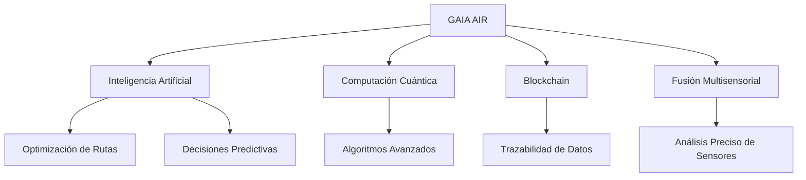
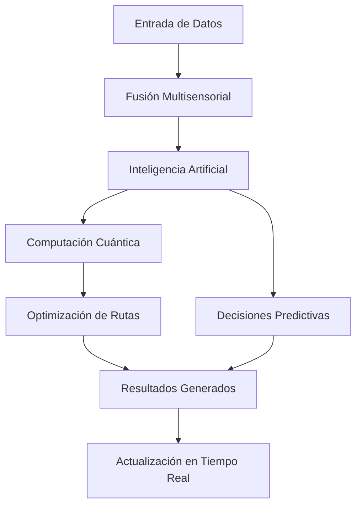
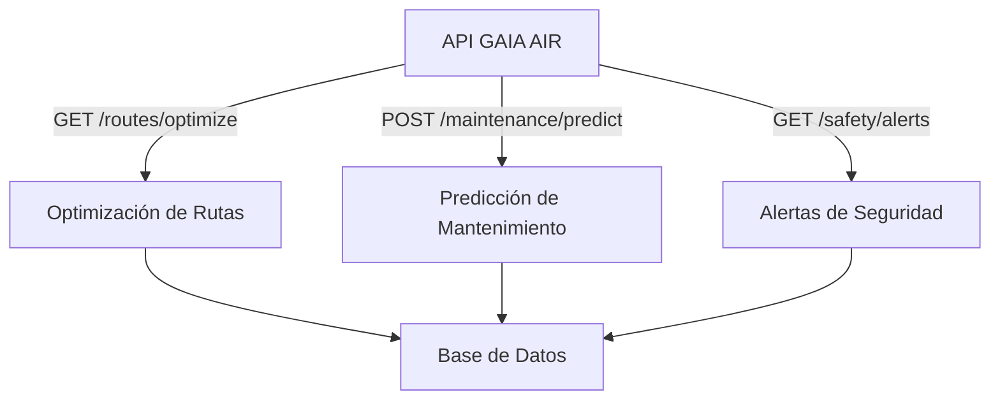

# GAIA AIR: Revolucionando la Aviación con Inteligencia Verde 🚀🌍

  
  
  


## 🌍 Descripción General

**GAIA AIR (Green AI-powered Autonomous Robotics Aircraft)** es una plataforma de vanguardia que combina tecnologías como la **Inteligencia Artificial**, **Computación Cuántica**, **Blockchain** y **Fusión Multisensorial** para transformar la aviación. Nuestra misión es lograr vuelos más seguros, eficientes y sostenibles.

### 🗺️ Esquema General de GAIA AIR



> **Descripción:**  
> - **Inteligencia Artificial:** Procesa datos en tiempo real para tomar decisiones óptimas.  
> - **Computación Cuántica:** Resuelve problemas complejos de optimización.  
> - **Blockchain:** Garantiza la integridad y trazabilidad de los datos.  
> - **Fusión Multisensorial:** Combina datos de radares, satélites y sensores para análisis precisos.

---

## 📋 Tabla de Contenidos

1. [🎯 Objetivos del Proyecto](#-objetivos-del-proyecto)
2. [💡 Tecnologías Implementadas](#-tecnologías-implementadas)
3. [🗺️ Esquema General de GAIA AIR](#-esquema-general-de-gaia-air)
4. [🔄 Mapa de Procesos](#-mapa-de-procesos)
5. [🔗 Flujo de API](#-flujo-de-api)
6. [📚 API Interactiva](#-api-interactiva)
7. [📊 Visualización de Datos](#-visualización-de-datos)
8. [🌟 Impacto y Beneficios](#-impacto-y-beneficios)
9. [🔜 Próximos Pasos](#-próximos-pasos)
10. [🤝 Cómo Contribuir](#-cómo-contribuir)
11. [📖 Documentación Técnica](#-documentación-técnica)
12. [📜 Licencia](#-licencia)
13. [📞 Contacto](#-contacto)
14. [❓ Preguntas Frecuentes (FAQ)](#-preguntas-frecuentes-faq)
15. [🔗 Enlaces Rápidos](#-enlaces-rápidos)
16. [✨ Características Destacadas](#-características-destacadas)
17. [🚀 Conclusión](#-conclusión)
18. [📖 Documentación Detallada](#-documentación-detalada)

---

## 🎯 Objetivos del Proyecto

1. 🌱 **Sostenibilidad:** Reducir la huella de carbono mediante optimización de trayectorias.
2. 🚀 **Innovación Tecnológica:** Aplicar computación cuántica para escenarios complejos.
3. 🔒 **Seguridad Predictiva:** Usar blockchain para garantizar la integridad de datos.
4. ⚙️ **Eficiencia Operativa:** Automatizar decisiones mediante redes neuronales avanzadas.

---

## 💡 Tecnologías Implementadas

| Tecnología                     | Uso en GAIA AIR                                  |
|--------------------------------|--------------------------------------------------|
| 🧠 **Inteligencia Artificial** | Optimización y predicción operativa.               |
| 💻 **Computación Cuántica**     | Algoritmos como QAOA para optimización avanzada.   |
| 🔗 **Blockchain**               | Trazabilidad de datos y contratos inteligentes.    |
| 📡 **Fusión Multisensorial**     | Datos de sensores para análisis en tiempo real.    |

---

## 🔄 Mapa de Procesos



> **Descripción del Flujo:**  
> 1. **Entrada de Datos (Multisensorial):**  
>    - Información de vuelos (trayectorias, clima, tráfico aéreo).  
>    - Datos de sensores (radares, satélites, sensores internos de aeronaves).  
>
> 2. **Procesamiento (IA y Computación Cuántica):**  
>    - Los algoritmos cuánticos optimizan rutas aéreas y reducen consumo de combustible.  
>    - Redes neuronales analizan patrones y predicen fallas.  
>
> 3. **Resultados Generados:**  
>    - **Rutas optimizadas** que minimizan tiempo y emisiones.  
>    - **Alertas predictivas** para mantenimiento proactivo.  
>    - Informes detallados para las aerolíneas y controladores.  
>
> 4. **Actualización en Tiempo Real:**  
>    - Monitoreo continuo y ajustes dinámicos a las condiciones cambiantes.

---

## 🔗 Flujo de API



> **Descripción:**  
> - **GET /routes/optimize:** Optimiza rutas aéreas en tiempo real.  
> - **POST /maintenance/predict:** Predice fallos en sistemas críticos.  
> - **GET /safety/alerts:** Recupera alertas de seguridad en tiempo real.

---

## 📚 API Interactiva

La API de GAIA AIR está diseñada para facilitar la integración con otros sistemas. Accede a la documentación completa aquí: [API Interactiva](https://api.gaiaair.com/api-docs).

### Endpoints Principales

| Método | Endpoint               | Descripción                                   |
|--------|------------------------|-----------------------------------------------|
| GET    | `/routes/optimize`     | Optimiza rutas aéreas en tiempo real.         |
| POST   | `/maintenance/predict` | Predice fallos en sistemas críticos.          |
| GET    | `/safety/alerts`       | Recupera alertas de seguridad en tiempo real. |

### Ejemplo de Uso

#### Solicitud con cURL

```bash
curl -X GET "https://api.gaiaair.com/routes/optimize?departure=JFK&arrival=LHR" \
     -H "Authorization: Bearer <API_KEY>"
```

#### Ejemplo de Respuesta

```json
{
  "optimized_route": {
    "departure": "JFK",
    "arrival": "LHR",
    "fuel_savings": "18%",
    "estimated_time": "6h 45m"
  }
}
```

#### Código en Otros Lenguajes

**Python**

```python
import requests

url = "https://api.gaiaair.com/routes/optimize"
params = {
    "departure": "JFK",
    "arrival": "LHR"
}
headers = {
    "Authorization": "Bearer <API_KEY>"
}

response = requests.get(url, params=params, headers=headers)
print(response.json())
```

**JavaScript (Fetch)**

```javascript
const url = "https://api.gaiaair.com/routes/optimize?departure=JFK&arrival=LHR";

fetch(url, {
  method: "GET",
  headers: {
    "Authorization": "Bearer <API_KEY>"
  }
})
  .then(response => response.json())
  .then(data => console.log(data))
  .catch(error => console.error('Error:', error));
```

### Integración con Swagger/OpenAPI

#### Ejemplo de `swagger.yaml` para Documentar el Endpoint

```yaml
openapi: 3.0.0
info:
  title: GAIA AIR API
  description: API para optimizar rutas aéreas.
  version: 1.0.0
servers:
  - url: https://api.gaiaair.com
paths:
  /routes/optimize:
    get:
      summary: Optimización de rutas aéreas
      description: Optimiza rutas entre dos aeropuertos para reducir combustible y tiempo de vuelo.
      parameters:
        - in: query
          name: departure
          required: true
          schema:
            type: string
          description: Código IATA del aeropuerto de salida.
        - in: query
          name: arrival
          required: true
          schema:
            type: string
          description: Código IATA del aeropuerto de llegada.
      responses:
        '200':
          description: Respuesta exitosa con detalles de la ruta optimizada.
          content:
            application/json:
              schema:
                type: object
                properties:
                  optimized_route:
                    type: object
                    properties:
                      departure:
                        type: string
                      arrival:
                        type: string
                      fuel_savings:
                        type: string
                      estimated_time:
                        type: string
```

### Visualización Interactiva con Swagger UI

1. **Instalar Swagger UI Express**

   Si usas Node.js con Express.js, instala `swagger-ui-express` y `yamljs`:

   ```bash
   npm install swagger-ui-express yamljs
   ```

2. **Configurar el Servidor para Servir Swagger UI**

   Ejemplo en `server.js` o `app.js`:

   ```javascript
   const express = require('express');
   const swaggerUi = require('swagger-ui-express');
   const YAML = require('yamljs');
   const path = require('path');

   const swaggerDocument = YAML.load(path.join(__dirname, 'docs/api/swagger.yaml'));
   const app = express();

   // Servir Swagger UI en /api-docs
   app.use('/api-docs', swaggerUi.serve, swaggerUi.setup(swaggerDocument));

   // Otros endpoints...
   app.get('/routes/optimize', (req, res) => {
     const { departure, arrival } = req.query;
     // Lógica de optimización...
     res.json({
       optimized_route: {
         departure,
         arrival,
         fuel_savings: "18%",
         estimated_time: "6h 45m"
       }
     });
   });

   const PORT = process.env.PORT || 3000;
   app.listen(PORT, () => {
     console.log(`Server running on port ${PORT}`);
   });
   ```

3. **Acceder a la Documentación**

   Una vez configurado, podrás acceder a la documentación interactiva de tu API en [https://api.gaiaair.com/api-docs](https://api.gaiaair.com/api-docs).

---

## 📊 Visualización de Datos

GAIA AIR utiliza gráficos avanzados para representar datos críticos en tiempo real.

### Ejemplo con Chart.js

```html
<!DOCTYPE html>
<html lang="es">
<head>
  <meta charset="UTF-8">
  <title>GAIA AIR - Optimización de Rutas</title>
  <script src="https://cdn.jsdelivr.net/npm/chart.js"></script>
</head>
<body>
  <h1>Optimización de Rutas</h1>
  
  <canvas id="fuelSavingsChart" width="400" height="200"></canvas>

  <script>
    // Función para obtener datos de la API
    async function fetchOptimizedRoute(departure, arrival) {
      const response = await fetch(`https://api.gaiaair.com/routes/optimize?departure=${departure}&arrival=${arrival}`, {
        method: 'GET',
        headers: {
          'Authorization': 'Bearer <API_KEY>'
        }
      });
      const data = await response.json();
      return data.optimized_route;
    }

    // Función para renderizar el gráfico
    async function renderChart() {
      const optimizedRoute = await fetchOptimizedRoute('JFK', 'LHR');
      
      const ctx = document.getElementById('fuelSavingsChart').getContext('2d');
      const chart = new Chart(ctx, {
        type: 'bar',
        data: {
          labels: [`${optimizedRoute.departure}-${optimizedRoute.arrival}`],
          datasets: [{
            label: 'Ahorro de Combustible (%)',
            data: [parseFloat(optimizedRoute.fuel_savings)],
            backgroundColor: 'rgba(75, 192, 192, 0.2)',
            borderColor: 'rgba(75, 192, 192, 1)',
            borderWidth: 1
          }]
        },
        options: {
          scales: {
            y: {
              beginAtZero: true,
              max: 100
            }
          }
        }
      });
    }

    // Renderizar el gráfico al cargar la página
    window.onload = renderChart;
  </script>
</body>
</html>
```

### Cómo Integrar Gráficos en el README.md

Los gráficos interactivos como los de Chart.js no pueden ser directamente incrustados en el **README.md**, pero puedes incluir capturas de pantalla o enlaces a páginas donde los gráficos estén implementados.

**Ejemplo:**

```markdown
## 📊 Visualización de Datos

GAIA AIR utiliza gráficos avanzados para representar datos críticos en tiempo real.

### Ejemplo de Ahorro de Combustible


Para ver gráficos interactivos, visita nuestra [Visualización de Datos](https://amedeo-pelliccia.github.io/gaia-air/visualizacion.html).
```

> **Nota:** Asegúrate de alojar tus imágenes en la carpeta `images/` dentro del repositorio y reemplazar `./images/fuel_savings_chart.png` con la ruta correcta de tus imágenes.

---

## 🌟 Impacto y Beneficios

- **Sostenibilidad:** Disminución de la huella de carbono.
- **Seguridad:** Predicciones precisas que previenen fallos.
- **Eficiencia Operativa:** Ahorro de costos y mayor puntualidad en vuelos.

---

## 🔜 Próximos Pasos

1. ⚙️ **Validación Cuántica:** Simulaciones de optimización.
2. 🛫 **Pruebas Piloto:** Implementación inicial en aeropuertos.
3. 📡 **Escalabilidad:** Expansión global.

---

## 🤝 Cómo Contribuir

¡Tu participación es clave! Sigue estos pasos:

1. **Haz un Fork del repositorio**.
2. **Crea una Rama para tu contribución**:

   ```bash
   git checkout -b feature/nueva-funcionalidad
   ```

3. **Realiza tus Cambios** y asegúrate de seguir las guías de estilo del proyecto.
4. **Envía un Pull Request**, describiendo cómo benefician tus cambios al proyecto.

Consulta el archivo [CONTRIBUTING.md](./CONTRIBUTING.md) para más detalles.

---

## 📖 Documentación Técnica

Consulta recursos adicionales:

- 📘 [Perceptron Cuántico](./docs/perceptron.md)
- 📗 [Filtro de Kalman](./docs/kalman_filter.md)
- 📊 [Visualización de Datos](./docs/visualizacion.md)

---

## 📜 Licencia

Este proyecto está bajo la Licencia MIT. Consulta el archivo [LICENSE](./LICENSE) para más información.

---

## 📞 Contacto

Para consultas o sugerencias:

- **Amedeo Pelliccia**
  - **Email:** [contacto@gaiaair.com](mailto:contacto@gaiaair.com)
  - **LinkedIn:** [Amedeo Pelliccia](https://www.linkedin.com/in/amedeo-pelliccia)
  - **GitHub:** [GAIA AIR](https://github.com/amedeo-pelliccia/gaia-air)

---

## ❓ Preguntas Frecuentes (FAQ)

1. **¿Qué es GAIA AIR?**
   
   GAIA AIR es una plataforma que integra IA, computación cuántica, blockchain y tecnologías sostenibles para revolucionar la aviación moderna.

2. **¿Cómo puedo contribuir al proyecto?**
   
   Consulta la sección [Cómo Contribuir](#-cómo-contribuir) para obtener detalles sobre cómo puedes participar.

3. **¿Dónde está la documentación API?**
   
   Revisa la [API Interactiva](https://api.gaiaair.com/api-docs).

4. **¿Cómo configuro el entorno?**
   
   Consulta el archivo [INSTALL.md](./INSTALL.md).

5. **¿Qué beneficios ofrece GAIA AIR a las aerolíneas?**
   
   GAIA AIR optimiza las rutas en tiempo real, reduce el consumo de combustible y las emisiones de carbono, y mejora la seguridad mediante decisiones predictivas basadas en IA.

6. **¿Qué tecnologías se utilizan para la optimización de rutas?**
   
   Utilizamos **Computación Cuántica** con algoritmos como QAOA y **Inteligencia Artificial** para optimizar rutas aéreas de manera eficiente.

---

## 🔗 Enlaces Rápidos

- [Repositorio](https://github.com/amedeo-pelliccia/gaia-air)
- [Documentación API](https://api.gaiaair.com/api-docs)
- [Documentación Técnica](https://amedeo-pelliccia.github.io/gaia-air/)

---

## ✨ Características Destacadas

1. **Multi-formato:**
   - Combina texto, tablas, bloques de código y gráficos.
2. **API Interactiva:**
   - Ejemplos de uso y enlaces a documentación generada automáticamente.
3. **Autogenerado:**
   - Integración con Swagger para la documentación de la API y MkDocs para la documentación técnica.
4. **Visual:**
   - Uso de gráficos y diagramas para ilustrar conceptos clave.
5. **Optimizado para GitHub:**
   - Badges relevantes, enlaces directos y estructura clara para navegabilidad.

---

## 📚 Implementación de Swagger y MkDocs en GAIA AIR

Para complementar el README.md optimizado, a continuación se detallan los pasos para integrar Swagger y MkDocs en tu proyecto.

### 📚 1. Integración de Swagger para la Documentación de la API

Swagger proporciona una interfaz interactiva que facilita a los desarrolladores explorar y probar los endpoints de tu API directamente desde la documentación.

#### Paso 1: Crear el Archivo `swagger.yaml`

Crea un archivo `swagger.yaml` en la raíz de tu proyecto o en una carpeta dedicada dentro de `docs/api/`. Este archivo describirá tu API siguiendo la especificación OpenAPI.

**Ejemplo de `swagger.yaml`:**

```yaml
openapi: 3.0.0
info:
  title: GAIA AIR API
  description: API para optimizar rutas aéreas.
  version: 1.0.0
servers:
  - url: https://api.gaiaair.com
paths:
  /routes/optimize:
    get:
      summary: Optimización de rutas aéreas
      description: Optimiza rutas entre dos aeropuertos para reducir combustible y tiempo de vuelo.
      parameters:
        - in: query
          name: departure
          required: true
          schema:
            type: string
          description: Código IATA del aeropuerto de salida.
        - in: query
          name: arrival
          required: true
          schema:
            type: string
          description: Código IATA del aeropuerto de llegada.
      responses:
        '200':
          description: Respuesta exitosa con detalles de la ruta optimizada.
          content:
            application/json:
              schema:
                type: object
                properties:
                  optimized_route:
                    type: object
                    properties:
                      departure:
                        type: string
                      arrival:
                        type: string
                      fuel_savings:
                        type: string
                      estimated_time:
                        type: string
```

#### Paso 2: Instalar y Configurar Swagger UI

Integrar Swagger UI en tu proyecto permitirá servir la documentación de manera interactiva.

1. **Instalar Swagger UI Express**

   Si usas Node.js con Express.js, instala `swagger-ui-express` y `yamljs`:

   ```bash
   npm install swagger-ui-express yamljs
   ```

2. **Configurar el Servidor para Servir Swagger UI**

   Ejemplo en `server.js` o `app.js`:

   ```javascript
   const express = require('express');
   const swaggerUi = require('swagger-ui-express');
   const YAML = require('yamljs');
   const path = require('path');

   const swaggerDocument = YAML.load(path.join(__dirname, 'docs/api/swagger.yaml'));
   const app = express();

   // Servir Swagger UI en /api-docs
   app.use('/api-docs', swaggerUi.serve, swaggerUi.setup(swaggerDocument));

   // Otros endpoints...
   app.get('/routes/optimize', (req, res) => {
     const { departure, arrival } = req.query;
     // Lógica de optimización...
     res.json({
       optimized_route: {
         departure,
         arrival,
         fuel_savings: "18%",
         estimated_time: "6h 45m"
       }
     });
   });

   const PORT = process.env.PORT || 3000;
   app.listen(PORT, () => {
     console.log(`Server running on port ${PORT}`);
   });
   ```

3. **Acceder a la Documentación**

   Una vez configurado, podrás acceder a la documentación interactiva de tu API en [https://api.gaiaair.com/api-docs](https://api.gaiaair.com/api-docs).

#### Paso 3: Actualizar el README.md

Añade una sección en el README que enlace a la documentación interactiva de la API.

```markdown
## 📚 Documentación de la API

Explora y prueba los endpoints de la API de GAIA AIR utilizando la [Documentación Interactiva de Swagger](https://api.gaiaair.com/api-docs).
```

### 📘 2. Integración de MkDocs para la Documentación Técnica

MkDocs es una herramienta estática que facilita la creación de sitios web de documentación usando Markdown. Usar MkDocs junto con el tema **Material for MkDocs** proporcionará una experiencia de documentación moderna y profesional.

#### Paso 1: Instalar MkDocs y el Tema Material

1. **Instalar MkDocs y Material for MkDocs:**

   ```bash
   pip install mkdocs mkdocs-material
   ```

2. **Inicializar MkDocs en tu Proyecto:**

   Si aún no lo has hecho, inicializa MkDocs en la carpeta `docs/`:

   ```bash
   mkdocs new docs
   ```

#### Paso 2: Configurar MkDocs

1. **Modificar `mkdocs.yml`:**

   Abre el archivo `mkdocs.yml` y configúralo según tus necesidades.

   **Ejemplo de `mkdocs.yml`:**

   ```yaml
   site_name: GAIA AIR Documentation
   site_url: https://amedeo-pelliccia.github.io/gaia-air/
   repo_url: https://github.com/amedeo-pelliccia/gaia-air
   theme:
     name: material
     palette:
       primary: 'indigo'
       accent: 'pink'
   nav:
     - Home: index.md
     - Introducción:
         - Descripción General: index.md
         - Arquitectura: arquitectura.md
         - Tecnologías Implementadas: tecnologias.md
     - API:
         - Introducción: api/introduction.md
         - Endpoints: api/endpoints.md
     - Casos de Uso: casos_de_uso.md
     - Contribuir: contribuciones.md
     - FAQ: faq.md
     - Visualización de Datos: visualizacion.md
   markdown_extensions:
     - admonition
     - codehilite
     - toc:
         permalink: true
   plugins:
     - search
   ```

2. **Estructurar la Documentación:**

   Crea los archivos Markdown necesarios dentro de `docs/`. Por ejemplo:

   - `docs/index.md`: Página de inicio.
   - `docs/arquitectura.md`: Detalles sobre la arquitectura de GAIA AIR.
   - `docs/tecnologias.md`: Descripción de las tecnologías implementadas.
   - `docs/api/introduction.md`: Introducción a la API.
   - `docs/api/endpoints.md`: Detalles de los endpoints de la API.
   - `docs/casos_de_uso.md`: Casos de uso detallados.
   - `docs/contribuciones.md`: Guía para contribuir.
   - `docs/faq.md`: Preguntas frecuentes.
   - `docs/visualizacion.md`: Visualización de datos.

3. **Agregar Contenido a los Archivos:**

   **Ejemplo de `docs/api/endpoints.md`:**

   ```markdown
   # Endpoints de la API

   ## Optimización de Rutas

   **Endpoint:**

   GET `/routes/optimize?departure={departure}&arrival={arrival}`

   **Parámetros:**

   | Parámetro  | Tipo    | Requerido | Descripción                             |
   |------------|---------|-----------|-----------------------------------------|
   | `departure`| `string`| Sí        | Código IATA del aeropuerto de salida (e.g., JFK). |
   | `arrival`  | `string`| Sí        | Código IATA del aeropuerto de llegada (e.g., LHR). |

   **Ejemplo de Solicitud:**

   ```bash
   curl -X GET "https://api.gaiaair.com/routes/optimize?departure=JFK&arrival=LHR" \
        -H "Authorization: Bearer <API_KEY>"
   ```

   **Ejemplo de Respuesta:**

   ```json
   {
     "optimized_route": {
       "departure": "JFK",
       "arrival": "LHR",
       "fuel_savings": "18%",
       "estimated_time": "6h 45m"
     }
   }
   ```

   **Código en Otros Lenguajes:**

   **Python**

   ```python
   import requests

   url = "https://api.gaiaair.com/routes/optimize"
   params = {
       "departure": "JFK",
       "arrival": "LHR"
   }
   headers = {
       "Authorization": "Bearer <API_KEY>"
   }

   response = requests.get(url, params=params, headers=headers)
   print(response.json())
   ```

   **JavaScript (Fetch)**

   ```javascript
   const url = "https://api.gaiaair.com/routes/optimize?departure=JFK&arrival=LHR";

   fetch(url, {
     method: "GET",
     headers: {
       "Authorization": "Bearer <API_KEY>"
     }
   })
     .then(response => response.json())
     .then(data => console.log(data))
     .catch(error => console.error('Error:', error));
   ```

   **Integración con Swagger/OpenAPI**

   A continuación se detalla cómo documentar e integrar el endpoint utilizando Swagger/OpenAPI.
   - **Ejemplo de `swagger.yaml`**: Ya incluido arriba. [Ver `swagger.yaml`](./swagger.yaml)
   ```

#### Paso 3: Generar y Servir la Documentación

1. **Construir el Sitio de Documentación:**

   ```bash
   mkdocs build
   ```

   Esto generará un sitio estático en la carpeta `site/`.

2. **Servir la Documentación Localmente:**

   Para visualizar la documentación en tu navegador antes de desplegarla:

   ```bash
   mkdocs serve
   ```

   Abre [http://127.0.0.1:8000/](http://127.0.0.1:8000/) en tu navegador para ver la documentación.

#### Paso 4: Desplegar la Documentación

1. **Configurar el Despliegue en `mkdocs.yml`:**

   Asegúrate de que `mkdocs.yml` tenga la siguiente configuración si usas GitHub Pages:

   ```yaml
   site_url: https://amedeo-pelliccia.github.io/gaia-air/
   ```

2. **Configurar GitHub Actions para Despliegue Automático:**

   Ya has creado un workflow `deploy-docs.yml` en `.github/workflows/`. Asegúrate de que esté configurado correctamente.

   **Ejemplo de `deploy-docs.yml`:**

   ```yaml
   name: Deploy Documentation

   on:
     push:
       branches:
         - main
       paths:
         - 'docs/**'
         - 'mkdocs.yml'

   jobs:
     deploy:
       runs-on: ubuntu-latest

       steps:
         - name: Checkout Repository
           uses: actions/checkout@v2

         - name: Setup Python
           uses: actions/setup-python@v2
           with:
             python-version: '3.x'

         - name: Install MkDocs y Tema Material
           run: |
             pip install mkdocs mkdocs-material

         - name: Build Documentation
           run: mkdocs build

         - name: Deploy to GitHub Pages
           uses: peaceiris/actions-gh-pages@v3
           with:
             github_token: ${{ secrets.GITHUB_TOKEN }}
             publish_dir: ./site
   ```

3. **Verificar el Despliegue:**

   Una vez que el workflow se ejecute exitosamente, tu documentación estará disponible en [https://amedeo-pelliccia.github.io/gaia-air/](https://amedeo-pelliccia.github.io/gaia-air/).

#### Paso 5: Actualizar el README.md

Añade una sección en el README.md que enlace a la documentación técnica generada por MkDocs.

```markdown
## 📖 Documentación Técnica

Para información técnica detallada sobre GAIA AIR, consulta nuestra [Documentación Técnica](https://amedeo-pelliccia.github.io/gaia-air/).
```

---

## 📊 Visualización de Datos

GAIA AIR utiliza gráficos avanzados para representar datos críticos en tiempo real.

### Ejemplo con Chart.js

```html
<!DOCTYPE html>
<html lang="es">
<head>
  <meta charset="UTF-8">
  <title>GAIA AIR - Optimización de Rutas</title>
  <script src="https://cdn.jsdelivr.net/npm/chart.js"></script>
</head>
<body>
  <h1>Optimización de Rutas</h1>
  
  <canvas id="fuelSavingsChart" width="400" height="200"></canvas>

  <script>
    // Función para obtener datos de la API
    async function fetchOptimizedRoute(departure, arrival) {
      const response = await fetch(`https://api.gaiaair.com/routes/optimize?departure=${departure}&arrival=${arrival}`, {
        method: 'GET',
        headers: {
          'Authorization': 'Bearer <API_KEY>'
        }
      });
      const data = await response.json();
      return data.optimized_route;
    }

    // Función para renderizar el gráfico
    async function renderChart() {
      const optimizedRoute = await fetchOptimizedRoute('JFK', 'LHR');
      
      const ctx = document.getElementById('fuelSavingsChart').getContext('2d');
      const chart = new Chart(ctx, {
        type: 'bar',
        data: {
          labels: [`${optimizedRoute.departure}-${optimizedRoute.arrival}`],
          datasets: [{
            label: 'Ahorro de Combustible (%)',
            data: [parseFloat(optimizedRoute.fuel_savings)],
            backgroundColor: 'rgba(75, 192, 192, 0.2)',
            borderColor: 'rgba(75, 192, 192, 1)',
            borderWidth: 1
          }]
        },
        options: {
          scales: {
            y: {
              beginAtZero: true,
              max: 100
            }
          }
        }
      });
    }

    // Renderizar el gráfico al cargar la página
    window.onload = renderChart;
  </script>
</body>
</html>
```

### Cómo Integrar Gráficos en el README.md

Los gráficos interactivos como los de Chart.js no pueden ser directamente incrustados en el **README.md**, pero puedes incluir capturas de pantalla o enlaces a páginas donde los gráficos estén implementados.

**Ejemplo:**

```markdown
## 📊 Visualización de Datos

GAIA AIR utiliza gráficos avanzados para representar datos críticos en tiempo real.

### Ejemplo de Ahorro de Combustible


Para ver gráficos interactivos, visita nuestra [Visualización de Datos](https://amedeo-pelliccia.github.io/gaia-air/visualizacion.html).
```

> **Nota:** Asegúrate de alojar tus imágenes en la carpeta `images/` dentro del repositorio y reemplazar `./images/fuel_savings_chart.png` con la ruta correcta de tus imágenes.

---

## 🌟 Impacto y Beneficios

- **Sostenibilidad:** Disminución de la huella de carbono.
- **Seguridad:** Predicciones precisas que previenen fallos.
- **Eficiencia Operativa:** Ahorro de costos y mayor puntualidad en vuelos.

---

## 🔜 Próximos Pasos

1. ⚙️ **Validación Cuántica:** Simulaciones de optimización.
2. 🛫 **Pruebas Piloto:** Implementación inicial en aeropuertos.
3. 📡 **Escalabilidad:** Expansión global.

---

## 🤝 Cómo Contribuir

¡Tu participación es clave! Sigue estos pasos:

1. **Haz un Fork del repositorio**.
2. **Crea una Rama para tu contribución**:

   ```bash
   git checkout -b feature/nueva-funcionalidad
   ```

3. **Realiza tus Cambios** y asegúrate de seguir las guías de estilo del proyecto.
4. **Envía un Pull Request**, describiendo cómo benefician tus cambios al proyecto.

Consulta el archivo [CONTRIBUTING.md](./CONTRIBUTING.md) para más detalles.

---

## 📖 Documentación Técnica

Consulta recursos adicionales:

- 📘 [Perceptron Cuántico](./docs/perceptron.md)
- 📗 [Filtro de Kalman](./docs/kalman_filter.md)
- 📊 [Visualización de Datos](./docs/visualizacion.md)

## 📜 Licencia

Este proyecto está bajo la Licencia MIT. Consulta el archivo [LICENSE](./LICENSE) para más información.

## 📞 Contacto

Para consultas o sugerencias:

- **Amedeo Pelliccia**
  - **Email:** [contacto@gaiaair.com](mailto:contacto@gaiaair.com)
  - **LinkedIn:** [Amedeo Pelliccia](https://www.linkedin.com/in/amedeo-pelliccia)
  - **GitHub:** [GAIA AIR](https://github.com/amedeo-pelliccia/gaia-air)

## ❓ Preguntas Frecuentes (FAQ)

1. **¿Qué es GAIA AIR?**
   
   GAIA AIR es una plataforma que integra IA, computación cuántica, blockchain y tecnologías sostenibles para revolucionar la aviación moderna.

2. **¿Cómo puedo contribuir al proyecto?**
   
   Consulta la sección [Cómo Contribuir](#-cómo-contribuir) para obtener detalles sobre cómo puedes participar.

3. **¿Dónde está la documentación API?**
   
   Revisa la [API Interactiva](https://api.gaiaair.com/api-docs).

4. **¿Cómo configuro el entorno?**
   
   Consulta el archivo [INSTALL.md](./INSTALL.md).

5. **¿Qué beneficios ofrece GAIA AIR a las aerolíneas?**
   
   GAIA AIR optimiza las rutas en tiempo real, reduce el consumo de combustible y las emisiones de carbono, y mejora la seguridad mediante decisiones predictivas basadas en IA.

6. **¿Qué tecnologías se utilizan para la optimización de rutas?**
   
   Utilizamos **Computación Cuántica** con algoritmos como QAOA y **Inteligencia Artificial** para optimizar rutas aéreas de manera eficiente.

---

## 🔗 Enlaces Rápidos

- [Repositorio](https://github.com/amedeo-pelliccia/gaia-air)
- [Documentación API](https://api.gaiaair.com/api-docs)
- [Documentación Técnica](https://amedeo-pelliccia.github.io/gaia-air/)

---

## ✨ Características Destacadas

1. **Multi-formato:**
   - Combina texto, tablas, bloques de código y gráficos.
2. **API Interactiva:**
   - Ejemplos de uso y enlaces a documentación generada automáticamente.
3. **Autogenerado:**
   - Integración con Swagger para la documentación de la API y MkDocs para la documentación técnica.
4. **Visual:**
   - Uso de gráficos y diagramas para ilustrar conceptos clave.
5. **Optimizado para GitHub:**
   - Badges relevantes, enlaces directos y estructura clara para navegabilidad.

---

## 🚀 Conclusión

Tu **README.md** para **GAIA AIR** ahora está optimizado para ser más claro, visualmente atractivo y organizado. Con la integración de **Mermaid** para los diagramas, **Swagger** para la documentación de la API y **MkDocs** para la documentación técnica, la documentación es más robusta y accesible para usuarios y colaboradores.

### Próximos Pasos Recomendados

1. **Verificar Rutas de Imágenes:** Asegúrate de que todas las imágenes referenciadas existan en la carpeta correcta (`images/`) y que las rutas sean consistentes.
2. **Mantener la Consistencia en el Formato:** Revisa que el uso de negritas, cursivas, listas y tablas sea uniforme en todo el documento.
3. **Actualizar Enlaces Regularmente:** Asegúrate de que todos los enlaces (a documentación, API, etc.) estén actualizados y funcionen correctamente.
4. **Agregar Más Endpoints a `swagger.yaml`:** A medida que añadas más endpoints a tu API, actualiza el archivo `swagger.yaml` para reflejarlos y mantener la documentación al día.
5. **Realizar Pruebas de Despliegue:** Después de implementar Swagger y MkDocs, realiza pruebas para asegurarte de que la documentación se despliega correctamente y es accesible.
6. **Solicitar Retroalimentación:** Pide a colaboradores y usuarios que revisen la documentación y proporcionen feedback para mejoras continuas.

---

# Desglose ATA del GAIA AIR con Consideraciones de Zonificación

*[Aquí incluirías todo el contenido detallado del Desglose ATA que proporcionaste, organizado por capítulos y secciones, como ATA 00 - General, ATA 01 - Políticas de Mantenimiento, etc.]*

---

## 📚 Guía Adicional para Mejorar la Documentación

### 🧮 Integración de Notación Matemática con LaTeX en Markdown

Markdown no soporta directamente la notación matemática, pero puedes integrarla utilizando sintaxis de LaTeX. A continuación, se detallan las formas de hacerlo:

#### 1. Matemáticas en Línea (Inline Math)

Utiliza signos de dólar simples `$...$` para incluir expresiones matemáticas dentro del texto.

**Ejemplo:**

```markdown
El ahorro de combustible es de $18\%$, lo que representa una mejora significativa en la eficiencia operativa.
```

**Resultado:**

El ahorro de combustible es de $18\%$, lo que representa una mejora significativa en la eficiencia operativa.

#### 2. Matemáticas en Bloque (Block Math)

Para expresiones matemáticas más complejas o destacadas, utiliza dobles signos de dólar `$$...$$` para centrar la fórmula en una nueva línea.

**Ejemplo:**

```markdown
La eficiencia de la ruta optimizada se puede calcular mediante la siguiente fórmula:

$$
\eta = \frac{\text{Combustible ahorrado}}{\text{Combustible total utilizado}} \times 100
$$
```

**Resultado:**

La eficiencia de la ruta optimizada se puede calcular mediante la siguiente fórmula:

$$
\eta = \frac{\text{Combustible ahorrado}}{\text{Combustible total utilizado}} \times 100
$$

#### 3. Ecuaciones Numeradas

Si necesitas referenciar ecuaciones específicas, puedes numerarlas utilizando `\begin{equation} ... \end{equation}`.

**Ejemplo:**

```markdown
La optimización de rutas se basa en la minimización de la función de costo:

\begin{equation}
    C(\mathbf{x}) = \sum_{i=1}^{n} c_i x_i
\end{equation}
```

**Resultado:**

La optimización de rutas se basa en la minimización de la función de costo:

\begin{equation}
    C(\mathbf{x}) = \sum_{i=1}^{n} c_i x_i
\end{equation}

#### 4. Matrices y Otros Elementos Avanzados

Para representar matrices, vectores u otros elementos avanzados, utiliza entornos específicos de LaTeX.

**Ejemplo de Matriz:**

```markdown
La matriz de covarianza se define como:

$$
\Sigma = \begin{bmatrix}
\sigma_{11} & \sigma_{12} \\
\sigma_{21} & \sigma_{22}
\end{bmatrix}
$$
```

**Resultado:**

La matriz de covarianza se define como:

$$
\Sigma = \begin{bmatrix}
\sigma_{11} & \sigma_{12} \\
\sigma_{21} & \sigma_{22}
\end{bmatrix}
$$

---

## 🛠 Aplicación en tu README.md

A continuación, se muestran áreas específicas de tu README donde podrías considerar agregar notación matemática para mejorar la claridad y profesionalismo:

### 1. Optimización de Rutas

Explicar brevemente el algoritmo de optimización utilizando fórmulas matemáticas.

**Ejemplo:**

```markdown
La optimización de rutas se realiza mediante el Algoritmo de Optimización Cuántica Aproximada (QAOA), el cual busca minimizar el consumo de combustible $F$ y el tiempo de vuelo $T$. La función de costo se define como:

$$
C(\mathbf{x}) = \alpha F(\mathbf{x}) + \beta T(\mathbf{x})
$$

donde $\alpha$ y $\beta$ son coeficientes de ponderación que equilibran la importancia del ahorro de combustible y la reducción del tiempo de vuelo.
```

### 2. Reducción de Emisiones de Carbono

Incluir una fórmula que muestre cómo la optimización contribuye a la reducción de emisiones.

**Ejemplo:**

```markdown
La reducción de emisiones de carbono $E$ se calcula como:

$$
E = F_{\text{sin optimizar}} - F_{\text{optimizado}}
$$

donde $F_{\text{sin optimizar}}$ es el combustible consumido sin optimización y $F_{\text{optimizado}}$ es el combustible consumido tras la optimización.
```

### 3. Predicciones de Seguridad Basadas en IA

Explicar el modelo de predicción utilizando una ecuación de probabilidad.

**Ejemplo:**

```markdown
La probabilidad de un fallo $P(F)$ se estima utilizando un modelo de regresión logística:

$$
P(F) = \frac{1}{1 + e^{-(\beta_0 + \beta_1 x_1 + \beta_2 x_2 + \dots + \beta_n x_n)}}
$$

donde $\beta_0, \beta_1, \dots, \beta_n$ son los coeficientes del modelo y $x_1, x_2, \dots, x_n$ son las variables independientes.
```

---

## 📌 Recomendaciones para Implementar Notación Matemática

1. **Consistencia en el Uso de LaTeX:**
   - Mantén una sintaxis consistente al usar símbolos matemáticos.
   - Asegúrate de cerrar correctamente los delimitadores `$` o `$$`.

2. **Claridad y Simplicidad:**
   - Evita fórmulas excesivamente complejas en el README principal.
   - Si una explicación detallada es necesaria, considera trasladarla a la documentación técnica en `docs/`.

3. **Referencias y Enlaces:**
   - Si utilizas símbolos o fórmulas estándar, proporciona enlaces a recursos externos para mayor claridad.
   - Ejemplo: Puedes enlazar a [Wikipedia](https://es.wikipedia.org/wiki/Algoritmo_de_optimización_cuántica) para explicar el QAOA.

4. **Pruebas de Renderizado:**
   - Verifica que las expresiones matemáticas se rendericen correctamente en GitHub.
   - Utiliza vistas previas o plataformas como [StackEdit](https://stackedit.io/) para comprobar el formato.

---

## 🚀 Conclusión Final

Al optimizar el `README.md` con diagramas interactivos, visualizaciones claras y una estructura bien organizada, **GAIA AIR** ofrece una presentación profesional y accesible para usuarios y colaboradores. La integración de herramientas como **Mermaid**, **Swagger** y **MkDocs** asegura que la documentación sea robusta, interactiva y fácil de mantener.

### Próximos Pasos Recomendados

1. **Verificar Rutas de Imágenes:** Asegúrate de que todas las imágenes referenciadas existan en la carpeta correcta (`images/`) y que las rutas sean consistentes.
2. **Mantener la Consistencia en el Formato:** Revisa que el uso de negritas, cursivas, listas y tablas sea uniforme en todo el documento.
3. **Actualizar Enlaces Regularmente:** Asegúrate de que todos los enlaces (a documentación, API, etc.) estén actualizados y funcionen correctamente.
4. **Agregar Más Endpoints a `swagger.yaml`:** A medida que añadas más endpoints a tu API, actualiza el archivo `swagger.yaml` para reflejarlos y mantener la documentación al día.
5. **Realizar Pruebas de Despliegue:** Después de implementar Swagger y MkDocs, realiza pruebas para asegurarte de que la documentación se despliega correctamente y es accesible.
6. **Solicitar Retroalimentación:** Pide a colaboradores y usuarios que revisen la documentación y proporcionen feedback para mejoras continuas.

---

¡Mucho éxito con **GAIA AIR**! Si necesitas ayuda adicional o ajustes específicos, no dudes en pedirlo. 🚀
