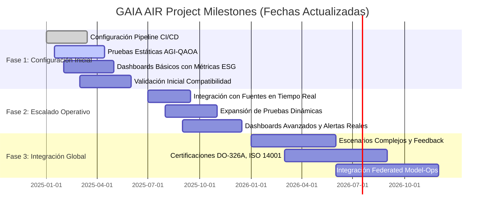
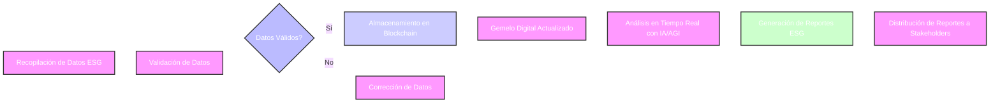

# GAIA AIR - Diagramas Mermaid

Este documento contiene ejemplos de diagramas Mermaid para el proyecto GAIA AIR, incluyendo un diagrama Gantt con milestones actualizados y un diagrama de flujo para la trazabilidad ESG.

## Diagrama Gantt - Milestones del Proyecto GAIA AIR (Fechas Actualizadas)

**Descripción:**  
Este diagrama Gantt muestra las fases del proyecto GAIA AIR con fechas actualizadas. Permite monitorear el progreso, las dependencias y la duración estimada de cada fase.

##  Diagrama de Flujo - Trazabilidad ESG
Descripción:
Este diagrama de flujo ilustra el manejo de datos ESG en GAIA AIR, desde la recolección y validación hasta el almacenamiento en blockchain y la generación de reportes.

### Notes:
Code Block Closure: Ensured each Mermaid diagram code block is closed with triple backticks.
Aspect Ratio and Resizing: Handle additional aspect ratio considerations within the rendering platform by adjusting the viewbox or container size.
Font Size: Increased to 16px for better readability.
Make sure you view these diagrams in an environment that fully supports Mermaid syntax to render them correctly. You may need to handle the aspect ratio adjustments within your output medium for optimal display based on the platform's capabilities.
