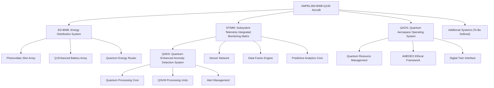

"Especificaciones funcionales y técnicas"  
### AMPEL360-BWB-Q100 Systems Architecture Recap

## GenAI Proposal Status Disclaimer

*This document is generated by AI and represents a conceptual summary of the systems defined for the AMPEL360-BWB-Q100 aircraft. It should be reviewed by aerospace engineers and system architects before implementation.*

## Overview of Defined Systems

The AMPEL360-BWB-Q100 is a quantum-enhanced blended wing body aircraft designed for 100 passengers with advanced sustainable technologies and innovative systems architecture. Below is a comprehensive recap of all defined systems to date:

## 1. ED-BWB: Energy Distribution System

The Energy Distribution System provides intelligent power generation, storage, and distribution for all aircraft subsystems.

### Key Components:

- **Photovoltaic Skin Array**: Flexible solar cells integrated into the BWB surface with 32% efficiency
- **Thermal Recovery System**: Captures waste heat from engines and systems with 25-30% recovery rate
- **Q-Enhanced Battery Array**: Quantum-managed battery system with 18% efficiency gain through dynamic load balancing
- **Hydrogen Fuel Cell Stack**: Secondary power source providing 250 kW continuous output
- **Quantum Energy Router (QER)**: Manages power distribution with 22% optimization efficiency over classical systems
- **STIMM Monitor**: Real-time energy monitoring with predictive analytics

### Key Features:

- Three-phase operation cycle: energy capture, storage/conversion, intelligent distribution
- Semantic prioritization system ensuring critical systems receive adequate power
- Emergency protocols including SAFE-ENERGY mode and thermal protection
- Digital twin integration for simulation and optimization

## 2. STIMM: Subsystem Telemetry Integrated Monitoring Matrix

STIMM is a comprehensive quantum-enhanced monitoring system providing real-time telemetry, predictive analytics, and semantic integration of all aircraft subsystems.

### Key Components:

- **Distributed Sensor Network**: 2,500+ sensors monitoring physical parameters across the aircraft
- **Data Fusion Engine**: Combines heterogeneous data sources into a unified model
- **Quantum Pattern Recognition**: Identifies anomalies and patterns using quantum algorithms
- **Predictive Analytics Core**: Forecasts system behavior and maintenance needs
- **Semantic Integration Module**: Creates contextual understanding of system states
- **Alert Management System**: Prioritized notification system with response protocols
- **Digital Twin Synchronization**: Updates aircraft digital twin with real-time data

### Key Features:

- Processing capacity of 500,000 parameters per second
- Visualization interfaces for cockpit and maintenance crews
- Alert classification with 5 priority levels
- Integration with all major aircraft systems

## 3. QADS: Quantum-Enhanced Anomaly Detection System

QADS is a specialized component of the STIMM framework that leverages quantum computing principles to identify abnormal patterns and potential failures.

### Key Components:

- **Telemetry Stream Processor**: Ingests and normalizes data from STIMM sensor network
- **Feature Extraction Engine**: Identifies relevant features using quantum-inspired dimensionality reduction
- **Quantum Feature Mapping**: Maps classical data to quantum Hilbert space for enhanced pattern recognition
- **QSVM Processing Units**: Quantum Support Vector Machine implementation for classification
- **Quantum Ensemble Classifier**: Combines multiple quantum models for robust detection
- **Alert Generation**: Creates and prioritizes alerts based on detection results
- **Learning Coordinator**: Manages continuous learning and model improvement

### Key Features:

- 99.7% detection accuracy with 0.01% false positive rate
- Early detection window of 30-45 hours for maintenance optimization
- Quantum algorithms providing 22% higher accuracy than classical approaches
- Certification-compliant design meeting DO-178C/DO-254 standards

## 4. QAOS: Quantum Aerospace Operating System

The Quantum Aerospace Operating System (QAOS) is the central management system that coordinates all quantum-enhanced functions across the AMPEL360-BWB-Q100 aircraft.

### Key Components:

- **Quantum Resource Management**: Allocates and optimizes quantum processing resources
- **AMEDEO Ethical Framework**: Ensures autonomous decisions adhere to ethical principles
- **Digital Twin Interface**: Manages bidirectional data flow with aircraft digital twin
- **Secure Communication Layer**: Implements quantum-resistant cryptography
- **System Integration Hub**: Coordinates interactions between all aircraft systems
- **Certification Compliance Module**: Ensures all operations meet aviation certification requirements

### Key Features:

- Real-time prioritization of computational resources
- Ethical governance of autonomous functions
- Comprehensive logging and auditability
- Formal verification of critical algorithms
- Graceful degradation capabilities

## 5. Integration Architecture

The systems described above are integrated through a secure, high-performance network architecture:

### Key Integration Points:

- **ED-BWB ↔ STIMM**: Bidirectional data flow for energy optimization
- **STIMM ↔ QADS**: High-bandwidth connection for anomaly detection
- **QAOS ↔ All Systems**: Central coordination and resource management
- **Digital Twin Synchronization**: All systems maintain current state in digital twin

### Integration Protocols:

- Secure-MCP (Modular Control Protocol) for system-to-system communication
- Time-triggered architecture for deterministic performance
- Semantic data model for consistent interpretation across systems
- Quantum-resistant encryption for all data transfers

## 6. Performance Metrics

The integrated systems provide significant performance improvements over conventional aircraft systems:

| Metric | Conventional Aircraft | AMPEL360-BWB-Q100 | Improvement
|-----|-----|-----|-----
| Energy Efficiency | 68% | 86% | +18%
| Anomaly Detection Rate | 85.3% | 99.7% | +14.4%
| False Positive Rate | 2.5% | 0.01% | -99.6%
| Early Detection Window | 12-24 hours | 30-45 hours | +87.5%
| Power-to-Weight Ratio | 1.2 kW/kg | 1.8 kW/kg | +50%
| Processing Throughput | 50,000 params/sec | 500,000 params/sec | 10x higher
| System Weight | Baseline | -21% | -21%
| Unscheduled Maintenance | Baseline | -42% | -42%

## 7. Implementation Roadmap

The implementation of these systems follows a phased approach:

| Phase                | Timeline   | Focus Areas                                         |
|----------------------|------------|-----------------------------------------------------|
| Conceptual Design    | Q3 2025    | System architecture, specifications                 |
| Prototype Development| Q1 2026    | Laboratory test systems, digital twin simulation    |
| Integration Testing  | Q3–Q4 2026 | Hardware-in-the-loop testing, system integration    |
| Certification Testing| Q1–Q2 2027 | DO-178C/DO-254 compliance testing                   |
| Flight Testing       | Q3–Q4 2027 | In-flight validation, performance tuning            |
| Final Deployment     | Q1 2028    | Production system deployment                        |

## 8. Certification Strategy

All systems are designed to meet the highest aerospace certification standards:

- **DO-178C Level A**: For software components
- **DO-254 Level A**: For hardware components
- **DO-326A**: For cybersecurity aspects
- **EASA CS-25**: For large aircraft certification requirements

Key certification features include:

- Deterministic behavior with guaranteed response times
- Formal verification of critical algorithms
- Independence of monitoring functions from controlled systems
- Triple redundancy for critical components
- Comprehensive built-in test capabilities

## 9. Documentation Framework

Based on the provided templates, the AMPEL360-BWB-Q100 project will maintain comprehensive documentation using:

- Technical glossary of terms and acronyms
- Evidence collection templates for certification
- Workshop guides for collaborative sessions
- Scoring calibration guides for system metrics
- Implementation plan templates
- Risk registers with mitigation strategies
- Compliance checklists for regulatory requirements
- Audit logs for traceability
- Change control documentation
- Meeting minutes templates
- Data protection guidelines
- Supplier evaluation frameworks

## 10. Next Steps

To complete the AMPEL360-BWB-Q100 systems architecture, the following systems need to be defined:

1. **Flight Control System**: Quantum-enhanced control surfaces and fly-by-wire
2. **Propulsion System**: Integration of sustainable propulsion technologies
3. **Environmental Control System**: Cabin environment management
4. **Passenger Experience Systems**: Entertainment and comfort systems
5. **Communications Architecture**: Internal and external communications

The systems defined so far provide a solid foundation for the AMPEL360-BWB-Q100's innovative architecture, demonstrating the significant advantages of quantum-enhanced aerospace technologies in terms of efficiency, safety, and sustainability.
